# AI Powered Analytics with Oracle Fusion AI Data Platform

## Introduction

Oracle Fusion AI Data Platform (FUSION AIDP) Platform is a suite of prebuilt, cloud-native analytics applications designed for Oracle Cloud Applications. It delivers ready-to-use insights that help line-of-business users make better decisions and drive business performance.
Built on Oracle Analytics Cloud and Oracle Autonomous Data Warehouse, the Fusion AIDP provides best-practice Key Performance Indicators (KPIs) and in-depth analyses that empower both decision-makers and individual contributors.

The service begins with Oracle Fusion Cloud Applications, which can be rapidly deployed, personalized, and extended. It automatically extracts data from these applications and loads it into an Oracle Autonomous Data Warehouse instance. Business users can then create and tailor dashboards in Oracle Analytics Cloud, leveraging AI-powered, self-service analytics for data preparation, visualization, reporting, augmented analysis, and natural language queries.

This lab enables business users to explore data, investigate trends, and uncover patterns or outliers, helping them turn insights into action.

### Objectives

Leveraging Gen-AI to build loan officer dashboard and forecasting to meet target

## Lab 1

1. Step 1 - Login to your Fusion AI Data Platform environment using the URL provided. Open a web browser and enter the URL provided, then on the login screen, type in the Username and Password. Click “Sign In”.

	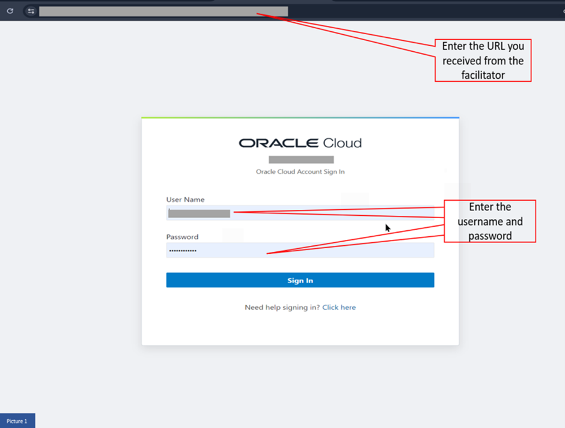

2. Step 2 - On the top right click the menu tile and then select data.

  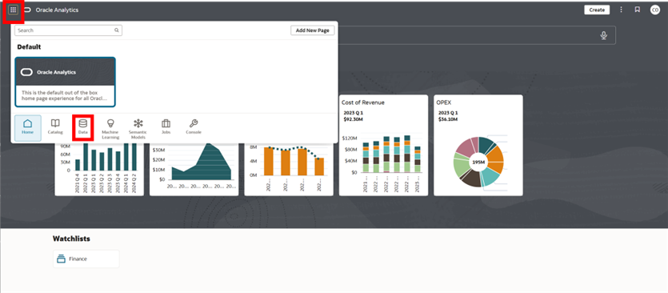

3. Step 3 - Click on Loan Master data set

  

4. Step 4 - Click on top gray bar on the right the Auto Insights Icon and then go to the “Assistant” tab

  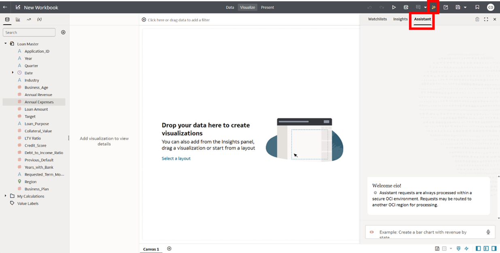

5. Step 5 - Type the question in the chat “What is my loan amount by month?” It will generate the following chart.

  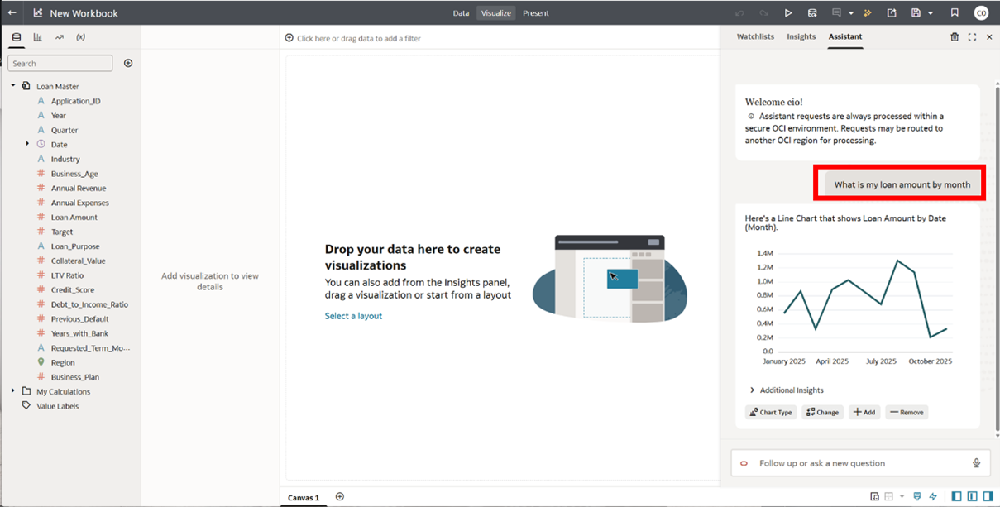

6. Step 6 - Let’s add our Target to the chart. Type in chat bar “add Target”.

  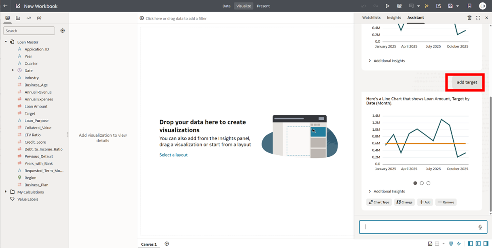

7. Step 7 - Hover over visualization and hit the “+” sign to add to canvas.

  

8. Step 8 - Next type in chat “loan amount by industry”. Hit enter, and a chart will generate.

  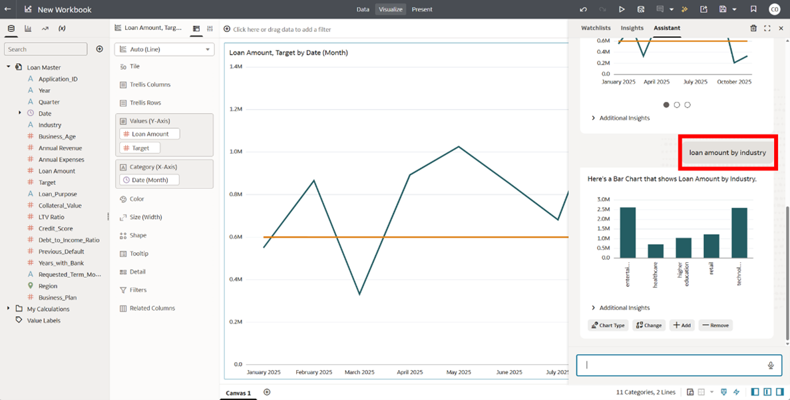

9. Step 9 - Let’s change the chart to a pie chart by typing “change to pie chart” in text box and hit enter.

  

10. Step 10 - Let’s add this pie chart to our canvas by hovering over visualization and click on “+” sign from menu popping up.

  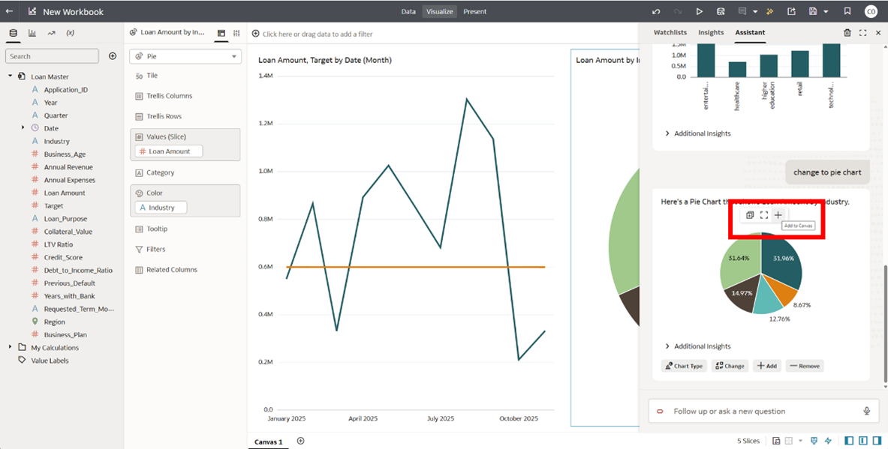

11. Step 11 - To add payment terms chart, lets type “loan amount by requested term months”. Hit enter.

  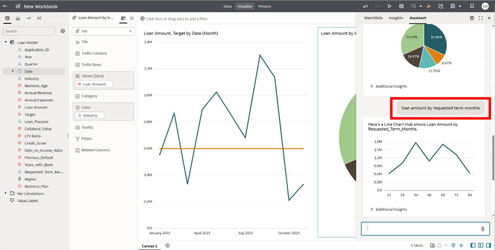

12. Step 12 - Let’s add more variables and change the chart type. Type “add industry and change to stacked bar chart”. Hit enter.

  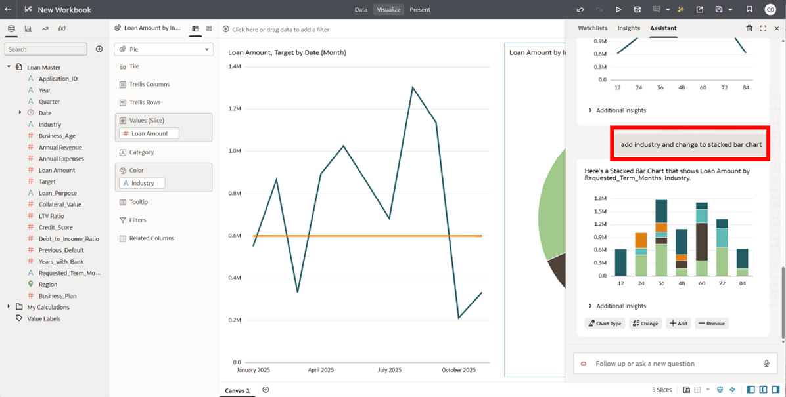

13. Step 13 - Add chart by hovering over visualization and click on the “+” sign.

  

14. Step 14 - Let’s add our final chart and type “show me LTV Ratio and Business Age by Application ID”. Hit enter.

  

15. Step 15 - Add chart by hovering over the visualization and clicking on the “+” sign

  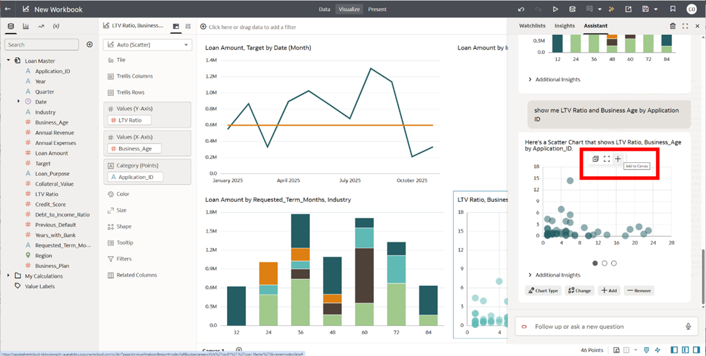

16. Step 16 - Close out the Auto Insights tab. From the data pane we will press the CTRL key button down (CMD on MacBook) along with clicking the following elements:  
•	Application ID
•	Loan Purpose
•	Collateral Value
•	Credit Score
•	Region
Drop those values into the dashboard and it will build a visualization for you. Then head to the middle pane and from the top drop-down list of visuals, select table

  

17. Step 17 - Click the Target line graph visualization and hover over it to select the three-dot menu and select “Add Statistics”.

  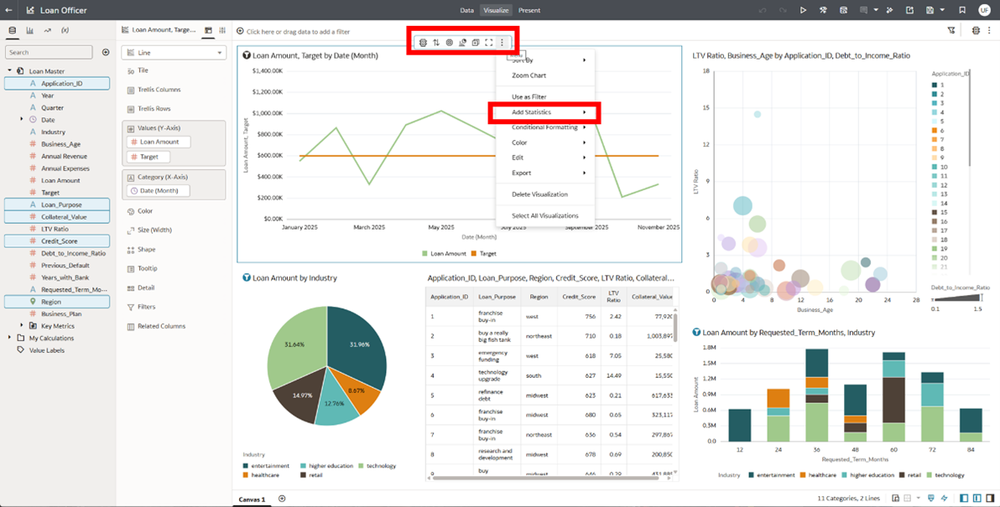

18. Step 18 - Click on forecast from Add Statistics drop down menu

  

19. Step 19 - Final Dashboard Analysis

  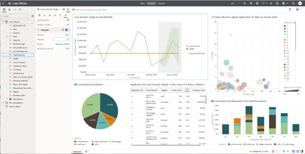

## Acknowledgements
* **Author** - <Xavier Ramirez, Anthony Lee>
* **Last Updated By/Date** - <Xavier Ramirez, Dec 2025>