# AI Powered Analytics with Oracle Fusion AI Data Platform

## Introduction

Oracle Fusion AI Data Platform (FUSION AIDP) Platform is a suite of prebuilt, cloud-native analytics applications designed for Oracle Cloud Applications. It delivers ready-to-use insights that help line-of-business users make better decisions and drive business performance.
Built on Oracle Analytics Cloud and Oracle Autonomous Data Warehouse, the Fusion AIDP provides best-practice Key Performance Indicators (KPIs) and in-depth analyses that empower both decision-makers and individual contributors.

The service begins with Oracle Fusion Cloud Applications, which can be rapidly deployed, personalized, and extended. It automatically extracts data from these applications and loads it into an Oracle Autonomous Data Warehouse instance. Business users can then create and tailor dashboards in Oracle Analytics Cloud, leveraging AI-powered, self-service analytics for data preparation, visualization, reporting, augmented analysis, and natural language queries.

This lab enables business users to explore data, investigate trends, and uncover patterns or outliers, helping them turn insights into action.

### Objectives

Insights from Loan Manager portfolio viewpoint based on Auto Insights and Classical ML

## Lab 2

1. Step 1 - On the top right click the menu tile and then select data.

  

2. Step 2 - Click on Loan Portfolio data set.

  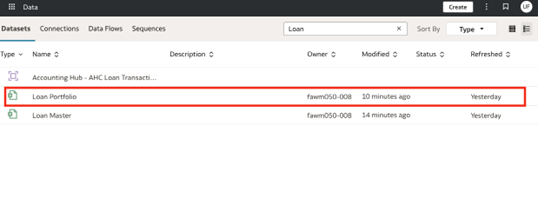

3. Step 3 - Click on top gray bar on the right the Auto Insights Icon and then go to the “Assistant” tab.

  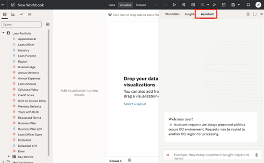

4. Step 4 - Type the question in the chat “How many defaulted loans?” It will generate the following chart.

  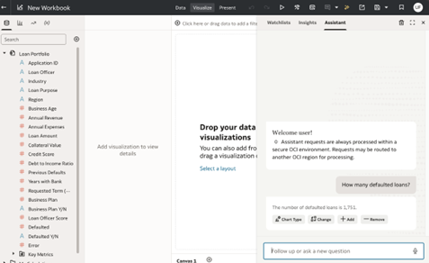

5. Step 5 - Enter into the chat bar “Change Chart Type to Tile.” Then, hover over the visualization and hit the “+” sign to add to canvas. Exit out of the assistant by clicking the “X” in the upper-right hand corner of the window.

  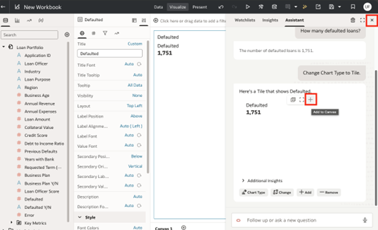

3. Step 6 - Right click “Defaulted Y/N” and select “Explain Defaulted Y/N”.

  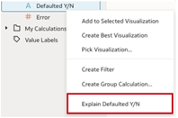

4. Step 7 - Click “Settings.”

  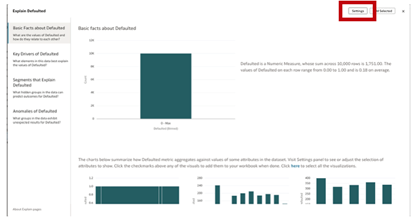

5. Step 8 - Change settings to the following and click “Apply”.

  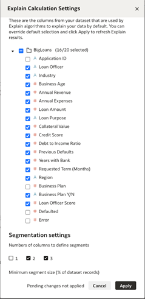

6. Step 9 - Explore “Basic Facts” and select the donut chart.

  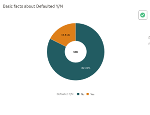

7. Step 10 - Explore “Key Drivers” and select two visualizations to add to your canvas.

  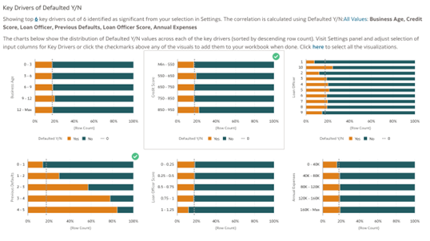

8. Step 11 - Explore Segments that Explain Defaulted Y/N.

  

9. Step 12 - Explore Anomalies and select one visualization.

  

10. Step 13 - Click “Add Selected”.

  

11. Step 14 - Based on the explain page answer the following questions. You may need to re-explain (step 3) to return.

•	What key driver has the most diverse split in defaults to non-defaults?
•	Describe how loan officer is driving defaults.
•	Describe 1 hidden group that predicts a default.
•	Describe 1 hidden group that predicts a non-default.
•	Name 1 fact you found interesting.

12. Step 12 - Click the Auto Insights icon in the upper right-hand corner of the screen..

  

13. Step 13 - Add an insight around the loan purpose to the workbook.

  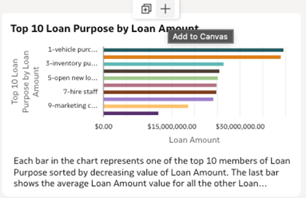

14. Step 14 - Click “Assistant” icon and ask the assistant the following questions in this order:
Is there a loan officer or industry that defaults a lot? Add loan amount.

  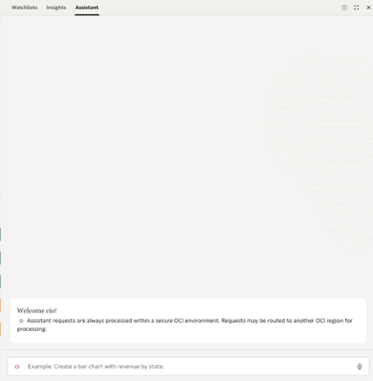

15. Step 15 - Drag this scatter plot onto the canvas.

  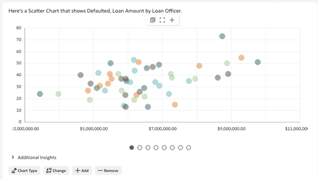

16. Step 16 - Duplicate this visualization.

  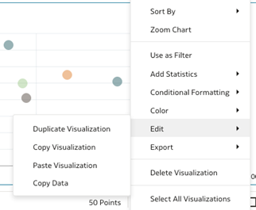

17. Step 17 - Change to “Language Narrative” visualization type.

  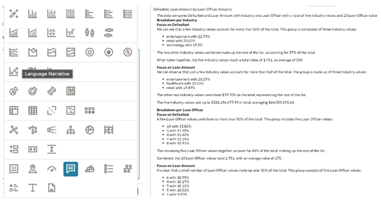

18. Step 18 - Go back to the data assistant and see if you can answer the following questions (Tip: just ask the bot).

•	What purpose for a loan default the most?
•	Is there a loan officer that has high error but low defaults?
•	What region has the highest value of defaulted loans?
•	What type of non-defaulted loan is biggest?
•	Who has the most loans for buying a fish tank? 

## Acknowledgements
* **Author** - <Xavier Ramirez, Anthony Lee>
* **Last Updated By/Date** - <Xavier Ramirez, Dec 2025>
