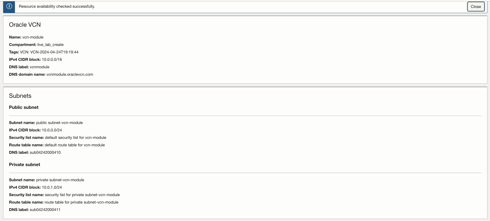
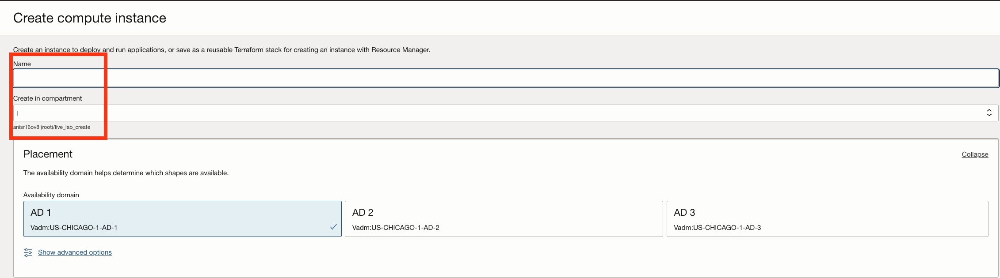
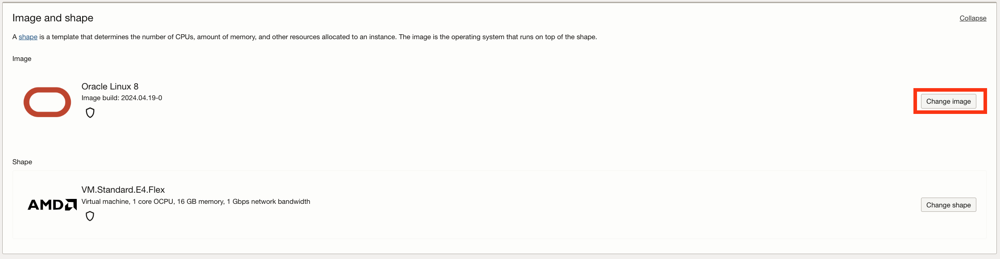
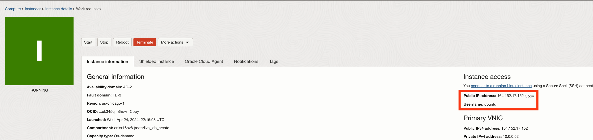

# Setup custom VCN and compute instance

## Introduction

Oracle Cloud Infrastructure (OCI) Compute lets you create multiple Virtual Cloud Networks (VCNs). These VCNs will contain security lists, compute instances, load balancers and many other types of network assets.

Be sure to review [Overview of Networking](https://docs.cloud.oracle.com/iaas/Content/Network/Concepts/overview.htm) to gain a full understanding of the network components.

Estimated Time: 30 minutes

### Objectives
In this lab, you will:
- Create a virtual cloud network 
- Open ingress ports on public subnet
- Create a compute instance inside that VCN

## Task 1: Sign in to OCI Console and create VCN

1. From the OCI Services menu, click **Networking** > **Virtual Cloud Networks**. 

    

2. Select the compartment assigned to you from the drop down menu on the left part of the screen and click **Start VCN Wizard**.

    

3. Click **Create VCN with Internet Connectivity** and click **Start VCN Wizard**.

    

4. Fill out the dialog box:

      - **VCN NAME**: Provide a name
      - **COMPARTMENT**: Ensure your compartment is selected
      - **VCN CIDR BLOCK**: Provide a CIDR block (10.0.0.0/16)
      - **PUBLIC SUBNET CIDR BLOCK**: Provide a CIDR block (10.0.0.0/24)
      - **PRIVATE SUBNET CIDR BLOCK**: Provide a CIDR block (10.0.1.0/24)
      - Click **Next**

    
    

5. Verify all the information and  Click **Create**.

    

    This will create a VCN with the following components.

    *VCN, Public subnet, Private subnet, Internet gateway (IG), NAT gateway (NAT), Service gateway (SG)*

6. Click **View Virtual Cloud Network** to display your VCN details.

    

7. Inside your VCN click **subnets** on the left panel under resources and select your **public subnet**.

    

8. Click **Default Security List** for your public subnet. The default Ingress Rules for your VCN are displayed.

    

9. Click **Add Ingress Rules**. An Add Ingress Rules dialog is displayed.

    

10. Fill in the ingress rule with the following information:
        
    - **Stateless**: Unchecked
    - **Source Type**: CIDR
    - **Source CIDR**: 0.0.0.0/0
    - **IP Protocol**: TCP
    - **Source port range**: (leave-blank)
    - **Destination Port Range**: 80,443,8008,5005
    - **Description**: (leave-blank)
    - Click **Add Ingress Rule**

    

    *Verify the ports added to the VCN. Now we have a VCN with required ingress ports.*  

    

## Task 2: Create a compute instance

1. Go to the OCI console. From the OCI services menu, click **Compute** > **Instances**.

    

2. Click **Create Instance**. 

    

3. Enter a name for your instance and select the compartment you used earlier to create your VCN. Select the **Edit** button in the Image and shape section.

      

4. Click **Change Image**.

    

5. Select **Ubuntu** and then select **Canonical Ubuntu 22.04** from the list below. Click **Select Image**.

           

6. Click **Change Shape**.

    

7. In the **Browse All Shapes** dialog:

      - **Instance Type**: Select Virtual Machine
      - **Shape Series**: Ampere
      - **Instance Shape**: Select VM.Standard.A1.Flex
      - **Number of OCPUS**: 64
      - **Amount of Memory(GB)**: 360

      Click **Select Shape**.

      

10. Scroll down to **Primary VNIC Information** section and edit the following:

      - **Virtual cloud network**: Choose the VCN you created in Task 1
      - **Subnet:** Choose the Public Subnet under **Public Subnets** (it should be named Public Subnet-NameOfVCN)
      - **Assign a public IPv4 address**: Check this option

       

      - **Add SSH Keys:** Choose **Generate a key pair for me** and save private and public keys. If you already have ssh keys, choose **Paste public keys** or upload public key saved.
      
      
      
         

11. In **Boot Volume:** section, select **Specify a custom boot volume size** and enter the following:
    - **Boot volume size (GB)**: 120
    - **Boot volume performance**: 10

    
        
12. Click **Create**.

   **NOTE:** If 'Service limit' error is displayed decrease **Number of OCPUS and Memory** in **select shape** OR choose a different AD

13.  Wait for the instance to have the **Running** status. Note down the Public IP of the instance. You will need this later.
    

## Task 3: Delete the resources(Optional)

1. Switch to  OCI console window

2. From OCI services menu Click **Virtual Cloud Networks** under Networking, list of all VCNs will
appear.

3. Locate your VCN , Click Action icon and then **Terminate**. Click **Terminate All** in the Confirmation window. Click **Close** once VCN is deleted

    

4. Locate the first compute instance, click the Action icon and then **Terminate**.

     

5. Make sure Permanently delete the attached Boot Volume is checked, Click **Terminate Instance**. Wait for instance to fully Terminate.

     

*Congratulations! You have successfully completed the lab.* 
You may now **proceed to the next lab**.

## Acknowledgements
* **Author** - Animesh Sahay and Francis Regalado, Enterprise Cloud Architect, OCI Cloud Venture
* **Contributors** -  Andrew Lynch, Director Cloud Engineering, OCI Cloud Venture
* **Last Updated By/Date** - Animesh Sahay, April 2024
