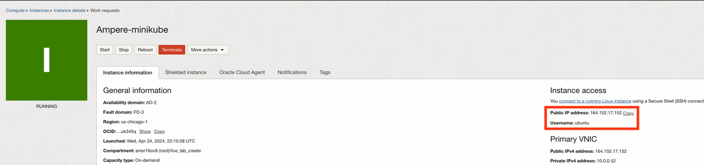
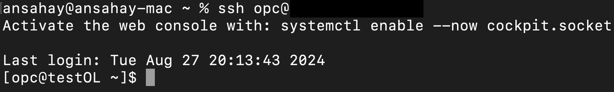
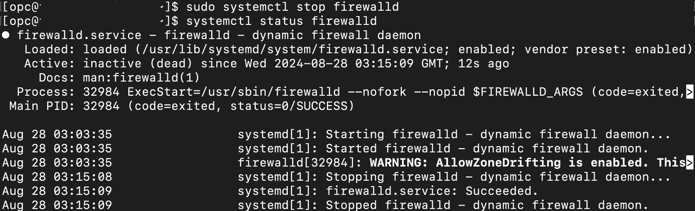
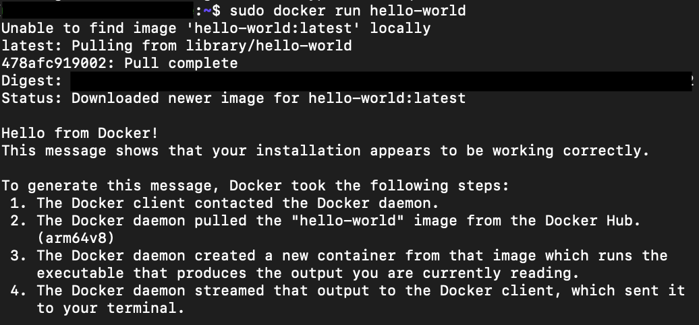
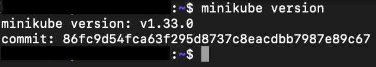
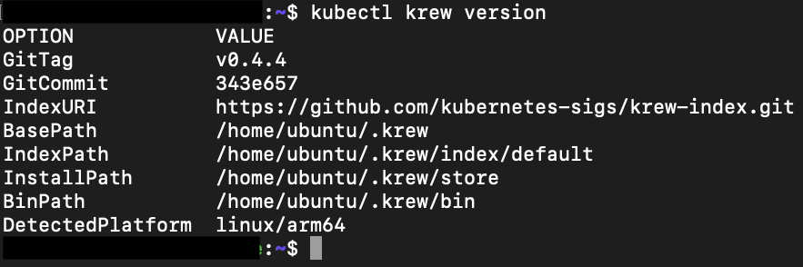
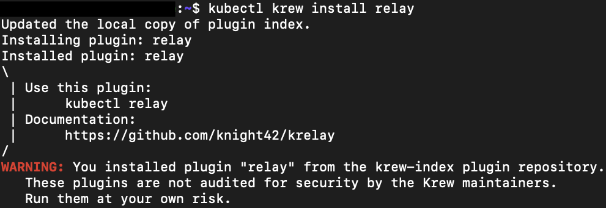

# Setting up compute instance and installing dependencies

## Introduction

In this lab we will use compute instance created in previous lab to install dependencies and software packages needed to deploy and run our application. 

Estimated Time: 20 minutes

## Task 1: SSH into compute instance
1. In cloud shell terminal or your machine's terminal, Enter command:

    ```
    <copy>cd ~/path_to_ssh_directory</copy>
    ```
2.  Enter **ls** and verify your SSH key file exists.

3. Change permission of private key file, enter command:
    ```
    <copy>
    chmod 400 <private_sshkeyname>
    </copy>
    ``` 

4.  SSH into your compute instance, enter command:
    ```
    <copy>ssh -i <private_sshkeyname> ubuntu@<PUBLIC_IP_OF_COMPUTE></copy>
    ``` 

    Check compute instance details in OCI web console to get **```PUBLIC_IP_OF_COMPUTE```**

    

    **HINT:** If 'Permission denied error' is seen, ensure you are using '-i' in the ssh command. You MUST type the command, do NOT copy and paste ssh command.

5.  Enter 'yes' when prompted for security message.

6.  Verify ubuntu@`<COMPUTE_INSTANCE_NAME>` appears on the prompt.
           

## Task 2: Configure networking and enable ports

1. Switch to SSH session. Update existing libraries Enter Command:
    ```
    <copy>
    sudo apt-get update
    </copy>
    ```
    The command prints done on terminal when finished.

2. Update iptables to allow traffic on deployment ports, Enter following commands:
    ```
    <copy>
    sudo iptables -A INPUT -p tcp -m state --state NEW -m tcp --dport 443 -j ACCEPT
    </copy>
    ```
    ```
    <copy>
    sudo iptables -A INPUT -p tcp -m state --state NEW -m tcp --dport 80 -j ACCEPT
    </copy>
    ```
    ```
    <copy>
    sudo iptables -A INPUT -p tcp -m state --state NEW -m tcp --dport 8008 -j ACCEPT
    </copy>
    ```
    ```
    <copy>
    sudo iptables -A INPUT -p tcp -m state --state NEW -m tcp --dport 5005 -j ACCEPT
    </copy>
    ```
    The above commands don't return any values. Save the iptable using the following command. Enter command: 
    ```
    <copy>
    sudo iptables-save | sudo tee /etc/iptables/rules.v4 > /dev/null 
    </copy>
    ```

3. Disable firewall to allow ICMP requests. Enter command:
    ```
    <copy>
    cd /etc/iptables
    </copy>
    ```

    ```
    <copy>
    sudo nano rules.v4
    </copy>
    ```
    Inside the **rules.v4** file comment out the following lines to block the firewall, add **```#```** at the start of lines:
    ```
    -A INPUT -j REJECT --reject-with icmp-host-prohibited
    ```
    ```
    -A FORWARD -j REJECT --reject-with icmp-host-prohibited
    ```
    Save the file by pressing **control + x** and then **y**. 
    
    Recheck the **rules.v4**, enter command:
    ```
    <copy>
    sudo nano rules.v4
    </copy>
    ```
    **iptable** should be looking similar to:

      

4. Enable port forwarding at the OS level. Enter command:
    ```
    <copy>
    sudo sysctl -w net.ipv4.ip_forward=1 
    </copy>
    ```

    **Note**: Due to inactivity the SSH connection may break and you might get an error **```ubuntu@a1-instance:/$ client_loop: send disconnect: Broken pipe```**, SSH back into the instance again in that case.

## Task 3: Install and configure Docker

1. Switch to SSH session and home directory, enter command:
    ```
    <copy>
    cd ~
    </copy>
    ```

2. Add Docker's official GPG key, Enter commands:
    ```
    <copy>
    sudo apt-get install ca-certificates curl
    sudo install -m 0755 -d /etc/apt/keyrings
    sudo curl -fsSL https://download.docker.com/linux/ubuntu/gpg -o /etc/apt/keyrings/docker.asc
    sudo chmod a+r /etc/apt/keyrings/docker.asc
    </copy>
    ```
    Add the repository to apt sources, Enter commands:
    ```
    <copy>
    echo   "deb [arch=$(dpkg --print-architecture) signed-by=/etc/apt/keyrings/docker.asc] https://download.docker.com/linux/ubuntu   $(. /etc/os-release && echo "$VERSION_CODENAME") stable" |   sudo tee /etc/apt/sources.list.d/docker.list > /dev/null
    </copy>
    ```
    Update the apt repositories. Enter command:
    ```
    <copy>
    sudo apt-get update
    </copy>
    ```
    **Hint**: Copy commands one after the other if something fails. For more information check [docker documentation](https://docs.docker.com/engine/install/ubuntu/).

3. To install the latest docker version, Enter command:
     ```
    <copy>
    sudo apt-get install docker-ce docker-ce-cli containerd.io docker-buildx-plugin docker-compose-plugin
    </copy>
    ```

4. Verify that the Docker Engine installation is successful by running the **hello-world** image.
     ```
    <copy>
    sudo docker run hello-world
    </copy>
    ```
    This command downloads a test image and runs it in a container. When the container runs, it prints a confirmation message and exits.

    

5. Add docker to the user group for ubuntu and restart, Enter command:
     ```
    <copy>
    sudo usermod -aG docker $USER && newgrp docker
    </copy>
    ```

    Restart docker. Enter command:
    ```
    <copy>
    sudo systemctl restart docker
    </copy>
    ```

    **Note**: Due to inactivity the SSH connection may break and you might get an error **```ubuntu@a1-instance:/$ client_loop: send disconnect: Broken pipe```**, SSH back into the instance again in that case.

## Task 4: Install and configure MiniKube

1.  To install the latest minikube stable release on ARM64 Linux using binary download, Enter command:
     ```
    <copy>
    curl -LO https://storage.googleapis.com/minikube/releases/latest/minikube-linux-arm64
    </copy>
    ```
    ```
    <copy>
    sudo install minikube-linux-arm64 /usr/local/bin/minikube && rm minikube-linux-arm64
    </copy>
    ```

2. Install kubectl classic to interact with the cluster.
    ```
    <copy>
    sudo snap install kubectl --classic
    </copy>
    ```

3. Verify minikube installation, Enter command:
    ```
    <copy>
    minikube version
    </copy>
    ``` 
    

    **Note**: For more information check [minikube documentation](https://minikube.sigs.k8s.io/docs/start/).

    **Note**: Due to inactivity the SSH connection may break and you might get an error **```ubuntu@a1-instance:/$ client_loop: send disconnect: Broken pipe```**, SSH back into the instance again in that case.

## Task 5: Install kubectl plugin relay using installer Krew

1. Krew itself is a kubectl plugin that is installed and updated via Krew. To install, enter command:
    ```
    <copy>
    (
        set -x; cd "$(mktemp -d)" &&
        OS="$(uname | tr '[:upper:]' '[:lower:]')" &&
        ARCH="$(uname -m | sed -e 's/x86_64/amd64/' -e 's/\(arm\)\(64\)\?.*/\1\2/' -e 's/aarch64$/arm64/')" &&
        KREW="krew-${OS}_${ARCH}" &&
        curl -fsSLO "https://github.com/kubernetes-sigs/krew/releases/latest/download/${KREW}.tar.gz" &&
        tar zxvf "${KREW}.tar.gz" &&
        ./"${KREW}" install krew
    )
    </copy>
    ``` 
2. Add the **$HOME/.krew/bin** directory to your PATH environment variable. To do this, update your **.bashrc** file and append the following line:
    ```
    <copy>
    nano ~/.bashrc
    </copy>
    ``` 
    ```
    <copy>
    export PATH="${KREW_ROOT:-$HOME/.krew}/bin:$PATH"
    </copy>
    ``` 
    Restart the **.bashrc** file to save, enter command:
    ```
    <copy>
    source ~/.bashrc
    </copy>
    ``` 
3. Check the installation, enter command:
    ```
    <copy>
    kubectl krew version
    </copy>
    ``` 
    

4. Install kubectl plugin **relay** using **krew**, enter command:
    ```
    <copy>
    kubectl krew install relay
    </copy>
    ``` 
    This returns with a warning which can be ignored.

    

     **Note**: For more information check [krew documentation](https://krew.sigs.k8s.io/docs/user-guide/setup/install/).

*Congratulations! You have successfully completed the lab.*<br/>
You may now **proceed to the next lab**.
## Acknowledgements
* **Author** - Animesh Sahay and Francis Regalado, Enterprise Cloud Architect, OCI Cloud Venture
* **Contributors** -  Andrew Lynch, Director Cloud Engineering, OCI Cloud Venture
* **Last Updated By/Date** - Animesh Sahay, April 2024
