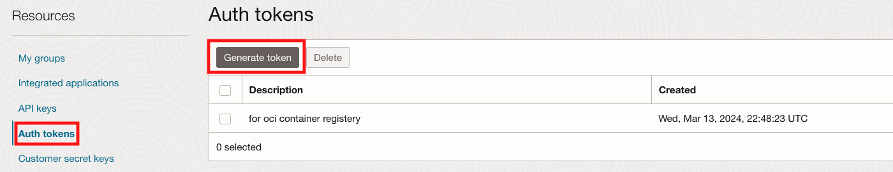

# Create OCIR repository with chat-bot image in OCI

## Introduction

Oracle Cloud Infrastructure Registry is an Oracle-managed registry that enables you to simplify your development to production workflow. Oracle Cloud Infrastructure Registry makes it easy for you as a developer to store, share, and manage development artifacts like Docker images. And the highly available and scalable architecture of Oracle Cloud Infrastructure ensures you can reliably deploy your applications.

Estimated Time: 10 minutes

## Task 1: Create Auth token and a OCIR repository

1. Sign into your OCI console and click the user icon (top right side) **My Profile**. Under Resources in the left side of the screen, click **Auth Token**, then **Generate Token**. 
    
     
     

2. In a pop up window, provide a description then click **Generate Token**

     

2.  Click **Copy** and save the token in Notepad. **Do not close the window without saving the token as it can not be retrieved later**

     

3. Click the **Navigation Menu** in the upper left, navigate to **Developer Services**, and select **Container Registry**.

	

4. Click **Create Repository**. Provide Repository name (all Lowercase), Check **Public** for **Access**, Click **Create Repository**

    

5. Once created, verify there are no existing images in the repository. Note down the **User** and **namespace**, we will use them in the next step.


*We now have a repository and Auth token (to validate login to the registry). Next we will use Cloud Shell to push and pull images from this registry.*

## Task 2: Push an open-source image to registry

1. SSH into your compute instance. 

2. We will now pull serge-ai opensource image from Docker registry to the compute instance. Enter the command:

    ```
    <copy>
    docker pull ghcr.io/amperecomputingai/ampere-ai-serge-chat:0.0.10-ol9
    </copy>
    ```
    Verify image pull was successful, enter the command:
    ```
    <copy>
    docker images
    </copy>
    ```
    and verify image is present with the tag

     

3. Push this image to repository created in OCI. First login to Registry in OCI. Enter the command::

    ```
    <copy>
    docker login <Region_Name_Code>.ocir.io
    </copy>
    ```

    **NOTE:** Region name code are, fra for Frankfurt, iad for Ashburn, lhr for London, phx for Phoenix.

    **HINT:** Your region is shown on top right corner of OCI console window

4. Provide the information:

    - Username:  Enter it in format Namespace/User (for example: TS-SPL-55/email_id@oracle.com)
    - Password: Paste the Auth key copied earlier (Characters wont be visible)

    **NOTE:** Namespace and User values are the same that we noted in **Task 1 - Step 5**.

5. Verify Login Succeeded message is displayed.
    
    

6. Next we will tag the image that we pulled from the web. Enter the command::

    ```
    <copy>
    docker images
    </copy>
    ```
    
    Take note of the image id of serge-ai-chat. We will need it for the following:

    ```
    <copy>
    docker tag <image_id>  <Region_Name_Code>.ocir.io/<namespace>/<repository_name>:latest
    </copy>
    ```

    an example would be : `docker tag sampleimageid iad.ocir.io/samplenamespace/samplereponame:latest`

    

    **Note**: Here **latest** is the tag for the image. Tagging an image with **latest** makes sure the latest version is pulled when there are multiple images present with different tags.

7. Verify the tag was created and that the new image is present with the **latest** tag:

    ```
    <copy>
    docker images
    </copy>
    ```

    **NOTE:** Tagging an image with **latest** makes sure the latest version is pulled when there are multiple images present with different tags.

     

8. We will now push the image to docker registry in OCI:

    ```
    <copy>
    docker push <Region_Name_Code>.ocir.io/<namespace>/<repository_name>:latest
    </copy>
    ```
    

9. Switch to OCI web console and navigate to your registry. The newly pushed image should be visible.

    **HINT:** Refresh the browser window if image is not displayed
    
    

10. Now return to your terminal window. We will do a docker pull to grab the latest repo found in the registry:

    ```
    <copy>
    docker pull <Region_Name_Code>.ocir.io/<Tenancy_Name>/<docker_registry_name>:latest
    </copy>  
    ```

11. Verify the pull command was successful

     

    **HINT:** We are pulling the same image that we just pushed.<br/>
    *We now have a working repository and can successfully push and pull images to/from it.*

## Task 3: Delete the resources(Optional)

1. Switch to  OCI console window

2. From OCI services menu Click **Virtual Cloud Networks** under Networking, list of all VCNs will
appear.

3. Locate your VCN , Click Action icon and then **Terminate**. Click **Terminate All** in the Confirmation window. Click **Close** once VCN is deleted

     

4. Navigate to your registry (**Container Registry** under **Developer Services**), Click Registry Name, Under **Actions** Click **Delete Repository**, Click **Delete** in confirmation window.

     

*Congratulations! You have successfully completed the lab.*
You may now **proceed to the next lab**.

## Acknowledgements
* **Author** - Animesh Sahay and Francis Regalado, Enterprise Cloud Architect, OCI Cloud Venture
* **Contributors** -  Andrew Lynch, Director Cloud Engineering, OCI Cloud Venture
* **Last Updated By/Date** - Animesh Sahay, August 2024

