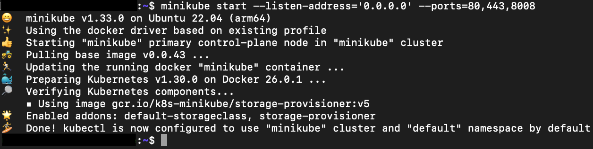
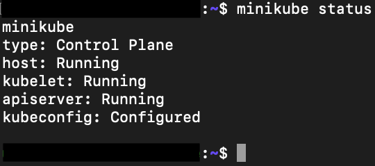
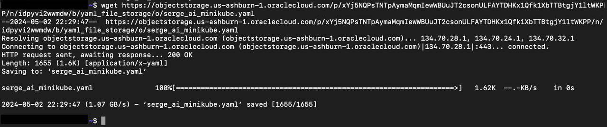
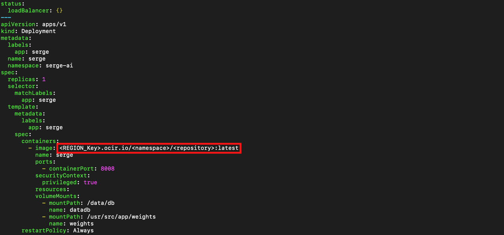
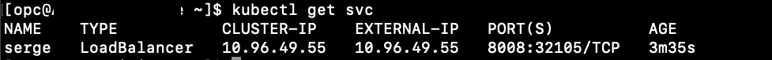
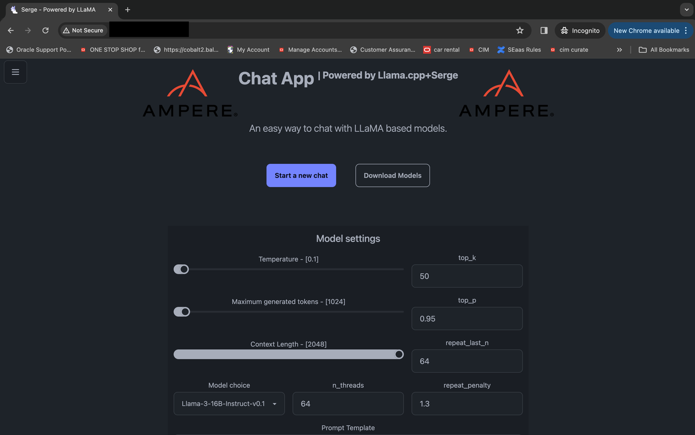
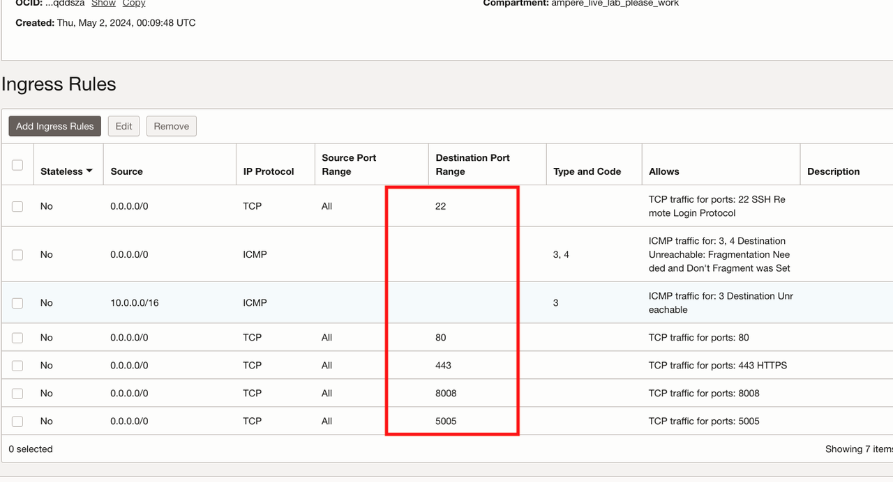

# Deploy and expose chatbot app

## Introduction

In this lab we deploy the opensource chat-bot image from OCIR and expose it on a public URL to use it via the internet.

Estimated Time: 30 minutes

## Task 1: Deploy chatbot app using minikube

1. SSH into your compute instance if not already in, Enter command:
    ```
    <copy>cd ~/path_to_saved_ssh_directory</copy>
    ```
    ```
    <copy>ssh -i <private_sshkeyname> ubuntu@<PUBLIC_IP_OF_COMPUTE></copy>
    ``` 

2.  Start minikube on ports opened earlier 80, 443, 8008. Enter command:
    ```
    <copy>
    minikube start --listen-address='0.0.0.0' --ports=80,443,8008
    </copy>
    ``` 
    

    Verify minikube is running, enter command:
    ```
    <copy>
    minikube status
    </copy>
    ``` 
    
     
3. Create a new namespace **serge-ai** for application deployment, enter command:
    ```
    <copy>
    kubectl create namespace serge-ai
    </copy>
    ``` 
    The command returns **namespace/serge-ai created**.

4. Set Kubernetes context to the new namespace created on above step, enter command:
    ```
    <copy>
    kubectl config set-context --current --namespace=serge-ai
    </copy>
    ```

5. Download the sample YAML file to the compute instance, enter command:
    ```
    <copy>
    wget https://objectstorage.us-ashburn-1.oraclecloud.com/p/xYj5NQPsTNTpAymaMqmIewWBUuJT2csonULFAYTDHKx1Qfk1XbTTBtgjY1ltWKPP/n/idpyvi2wwmdw/b/yaml_file_storage/o/serge_ai_minikube.yaml
    </copy>
    ```

    

    Update the image source in the YAML file, enter command:
    ```
    <copy>
    nano serge_ai_minikube.yaml
    </copy>
    ```
    Update the below shown line, add your **region key, namespace and OCIR repository name** created in **Lab 1**.

    

    Save the file by pressing **control + x and then y**.

6. Apply the Kubernetes YAML file saved in the step above, enter command:
    ```
    <copy>
    kubectl apply -f serge_ai_minikube.yaml
    </copy>
    ```
    Verify the running deployment, enter command:
    ```
    <copy>
    kubectl get svc
    </copy>
    ```
    Notice that there is no external IP exposed(status **Pending**) for accessing the application.

7. Run the minikube tunnel to create an external IP for this deployment, enter command:
     ```
    <copy>
    minikube tunnel > /dev/null &
    </copy>
    ```    
    Verify the external IP is exposed for the deployment, enter command:
    ```
    <copy>
    kubectl get svc
    </copy>
    ```
    

    **Note**: Here commands *```&```* and **> /dev/null** makes sure the output of **minikube** command is hidden and it runs in the background.

8. To expose this deployment to the external world, we need to forward it to the open ports on our VCN, enter command:
     ```
    <copy>
    kubectl relay --address 0.0.0.0 --server.namespace=serge-ai svc/serge 5005:8008 2>/dev/null &
    </copy>
    ```
    **Note**: Here commands *```&```* and **2>/dev/null** makes sure the output of **kubectl** command is hidden and it runs in the background.

9. Access the application on your browser, open a browser window and enter following URL:
    ```
    <copy>
    http://<compute_instance_public_ip>:5005
    </copy>
    ```
    Copy the **```compute_instance_public_ip```** from OCI web console. Open **instances** from the top left corner and click on instance created in **Lab 1** to copy the **public ip address**.

    **Note**: Using an incognito browser window helps not saving cache.

    

## Troubleshooting(Optional)
If the application is not up and running on the browser, it can be one of the following issues:
1. Subnet in VCN is not allowing ingress traffic - <br/>
    To check this, follow Lab 1 Steps 7 to 10 and verify following ports to be open:

    

2. Due to inactivity the SSH connection may break and you might get an error **```ubuntu@a1-instance:/$ client_loop: send disconnect: Broken pipe```**, SSH back into the instance again in that case. Enter command:
    ```
    <copy>
    minikube status
    </copy>
    ```
    If minikube has stopped then restart it using:
    ```
    <copy>
    minikube start --listen-address='0.0.0.0' --ports=80,443,8008
    </copy>
    ``` 
    Check your deployment again, enter command:
    ```
    <copy>
    kubectl get svc
    </copy>
    ```
    Enable port forwarding again, enter command:
    ```
    <copy>
    kubectl relay --address 0.0.0.0 --server.namespace=serge-ai svc/serge 5005:8008 2>/dev/null &
    </copy>
    ```
    Re-access the application on your browser, open a browser window and enter following URL:
    ```
    <copy>
    http://<compute_instance_public_ip>:5005
    </copy>
    ```
    Copy the **```compute_instance_public_ip```** from OCI web console. Open **instances** from the top left corner and click on instance created in **Lab 1** to copy the **public ip address**.

3. Ubuntu is blocking traffic, check iptable has correct ports allowed:
    ```
    <copy>
    cd /etc/iptables
    </copy>
    ```

    ```
    <copy>
    sudo nano rules.v4
    </copy>
    ```
    table should have following entries:

     

## Task 2: Automating the deployment
Now that all the steps have been completed and you application is running, we will be automating the process. We will be creating a script with all the steps used to deploy the application to that will run the app on reboot and exit. 

1. SSH into the compute instance and in main directory, create a file named `start-app.sh` 

    ```
    <copy>
    nano start-app.sh
    </copy>
    ```

    within this code, you'll paste the following commands created above:

    ```
    <copy>
    #!/bin/bash -x

    config_device()
    {
        BASE_DIR=/home/ubuntu
        KUBE_PORTS="80,443,8008"
        KUBE_ADDR="0.0.0.0"
        PORT_EXPOSED=5005
        LOGFILE=${BASE_DIR}/serge-ai.log
    }

    init_actions()
    {
        # Start Minikube
        minikube start --listen-address=${KUBE_ADDR} --ports=${KUBE_PORTS} 1>>$LOGFILE 2>&1
        # Create Kubernetes namespace
        kubectl create namespace serge-ai  1>>$LOGFILE 2>&1
        # Set Kubernetes context to the new namespace
        kubectl config set-context --current --namespace=serge-ai  1>>$LOGFILE 2>&1
        # Start Minikube tunnel in the background
        minikube tunnel 1>>$LOGFILE 2>&1 &
        kubectl apply -f $BASE_DIR/serge_ai_minikube.yaml  1>>$LOGFILE 2>&1
        # Forward port for the Serge deployment in the background
        kubectl relay --address ${KUBE_ADDR} --server.namespace=serge-ai svc/serge ${PORT_EXPOSED}:8008 1>>$LOGFILE 2>&1 &
    }
    config_device
    init_actions

    </copy>
    ```

    Save the script by pressing **control + x** and then **y**.
    
    Make the script executable, enter command:
    ```
    <copy>
    chmod +x start-app.sh
    </copy>
    ```
    Execute the script, enter command:
    ```
    <copy>
    ./start-app.sh
    </copy>
    ```
   
   **Note**: This script re-runs all the deployment commands listed above and is an convinent way to do a quick deployment.

2. In order to make our deployment reboot and crash proof run a cronjob which will run the above script on every reboot. Enter command:

    ```
    <copy>
    crontab -e
    </copy>
    ```
    Press **1** when prompted. Now inside the crontab, append the following code to the bottom:

    ```
    <copy>
    @reboot /home/ubuntu/start-app.sh
    </copy>
    ```
    Save and exit your code editor. Now the deployment script runs on each reboot and exit making sure our application doesn't crash.
    
    
    **Note**: Wait about 2 - 5 mins after running the script to make sure the application is up and running.

3. Re-access the application on your browser, open a browser windown and enter following URL:
    ```
    <copy>
    http://<compute_instance_public_ip>:5005
    </copy>
    ```
    Copy the **```compute_instance_public_ip```** from OCI web console. Open **instances** from the top left corner and click on instance created in Lab 1 to copy the **public ip address**.

    **Note**: Using an incognito browser window helps not saving cache.

    

## Task 3: Delete the resources(Optional)

1. To stop minikube and remove deployment, enter command:
    ```
    <copy>
    minikube stop --all
    </copy>
    ```

*Congratulations! You have successfully completed the lab.*<br/>
You may now **proceed to the next lab**.

## Acknowledgements
* **Author** - Animesh Sahay and Francis Regalado, Enterprise Cloud Architect, OCI Cloud Venture
* **Contributors** -  Andrew Lynch, Director Cloud Engineering, OCI Cloud Venture
* **Last Updated By/Date** - Animesh Sahay, April 2024