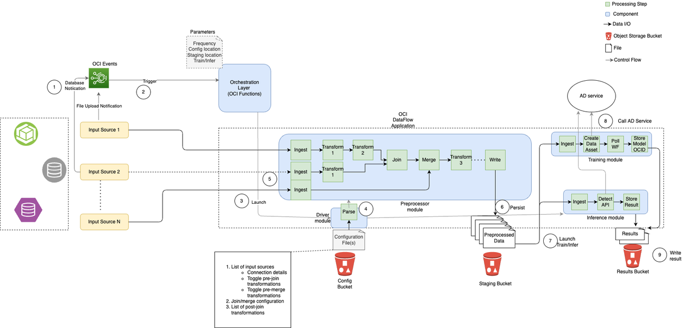

# Introduction

## About this Workshop

In this workshop, users will learn how to implement an end to end **Anomaly Detection** solution using a data pre-processing workflow engine.

**Estimated Time:** 1-2 hours

## Objectives
Users will learn
- How to use the **Data Processing Framework** (DPF) developed by the OCI AI Services team to pre-process data
- How to configure a training and inferencing pipeline to ingest and pre-process data, execute Anomaly Detection model training and run inferencing using trained models. Input data sizes could range from a few rows to several tens of millions of rows, and 1 column (~ metric/measure/variable) to several thousands of columns. 
- How to leverage OCI PaaS services to build the end to end Anomaly Detection Solution.

## Prerequisites

* An Oracle Free Tier, or Paid Cloud Account.
* Familiarity with Oracle Cloud Infrastructure (OCI) IaaS and PaaS Services such as Object Storage, Identity and Access Management, Virtual Cloud Network, Functions, Data Flow etc. 
* Familiarity with Python (or other programming language) is strongly recommended.
* Experience with data engineering, machine learning and statistics is preferred but not required. 
* Additional prerequisites (if any) are described in each lab.

## All Tasks
* Configure OCI Anomaly Detection (AD) Service
* Configure OCI IAM Policies
* Configure OCI Object Store Buckets and upload DPF Driver and Transforms Library
* Examine DPF Driver configuration file and configure it with correct values
* Configure OCI Data Flow
* Configure OCI Functions
* Configure OCI Events
* Run the Anomaly Detection Solution

## Functional Architecture

Brief description of the solution

1. User prepares the driver config and uploads it to the config OCI Storage Bucket. Also, user creates an **OCI Anomaly Detection** Project and Data Flow Application to be used later.
2. User uploads a training/inferencing dataset to the *Input/Source* OCI Storage Bucket.
3. User configures OCI Events Service as a listener on the source OCI Storage Bucket. Uploading a data file into this storage bucket will trigger an OCI Events *event*.
4. OCI event will trigger the downstream OCI Function, which will load the driver configuration file and start the workflow.
5. The workflow will run data transforms configured in the driver configuration file.
6. As soon as the data processing workflow completes successfully, the processed data with other information (for example, model\_info) will be written to the *Staging* OCI Storage Bucket.
7. AD training/inferencing workflow will run
8. As part of the workflow in Step 7, OCI Anomaly Detection Service will be invoked 
9. As soon as the steps in training/inferencing workflow is completed, the result will be written to the *Results* OCI Storage Bucket.

**NOTE**:

*   Pipelines are triggered whenever new files are added to the corresponding *Source* Storage Bucket. For example, uploading a new training dataset into the respective Source storage bucket will trigger the training pipeline.
*   The workflow engine will execute the pipeline based on the driver configuration file.
    *   Once the raw data is preprocessed, the transformed data will be saved in the configured *Staging* bucket.
    *   AD service will be triggered afterward to perform training or detection, and the results will be available in the configured *Results* bucket.
*   Users can utilize more computational power in order to run the pipelines faster. This is very easy to configure as well.

### Supported Input Sources and Formats

*   Tables stored in OCI ATP/ADW databases
*   CSV/Parquet file formats in Object Storage

**NOTE**:

While the pipelines are triggered by updates, they work on point-in-time snapshots of the data. Users are advised to update database sources (tables) in a single transaction to avoid processing data in a partial state.

### Supported Output Source and Formats

Output is always saved to OCI Object Storage Bucket as a CSV file.

## Learn More

* [Introduction to all transformers](../optional/Introduction-to-Transformers-for-Data-Preprocessing.md)

Users are advised to refer to the respective OCI PaaS Service documentation as needed.

## Acknowledgements
* **Author**
    * Shreyas Vinayakumar - Principal Member of Technical Staff - Oracle AI Services
    * Shujie Chen - Principal Member of Technical Staff - Oracle AI Services
    * Sudha Ravi Kumar Javvadi - Member of Technical Staff - Oracle AI Services

* **Reviewer**
    * Ganesh Radhakrishnan - Principal Product Manager - Oracle AI Services

* **Last Updated By/Date**
    * Shujie Chen - Principal Member of Technical Staff - Oracle AI Services
