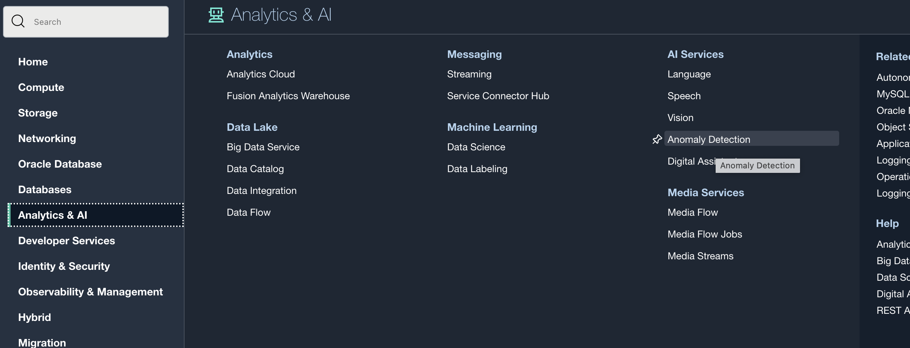
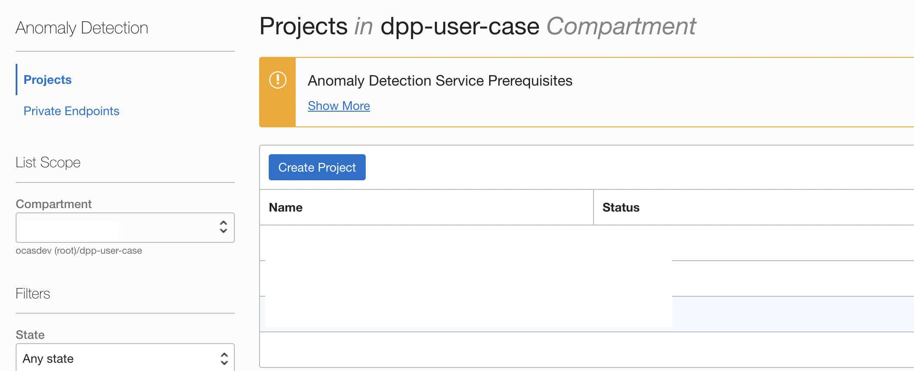

Lab 1: Configure OCI Anomaly Detection
=================

Login to [OCI Console](https://cloud.oracle.com). Then go to AI Services → Anomaly Detection. 

Next, create a *Project*. Use the recommended default values for *FAP* and *Training fraction*.

Note the **OCID** of the Project. This value will be used in a subsequent Lab.

## Useful Resources
Refer to OCI documentation (link below) to learn more about OCI Anomaly Detection Service

- [OCI Anomaly Detection Service](https://docs.oracle.com/en-us/iaas/Content/anomaly/using/home.htm)
