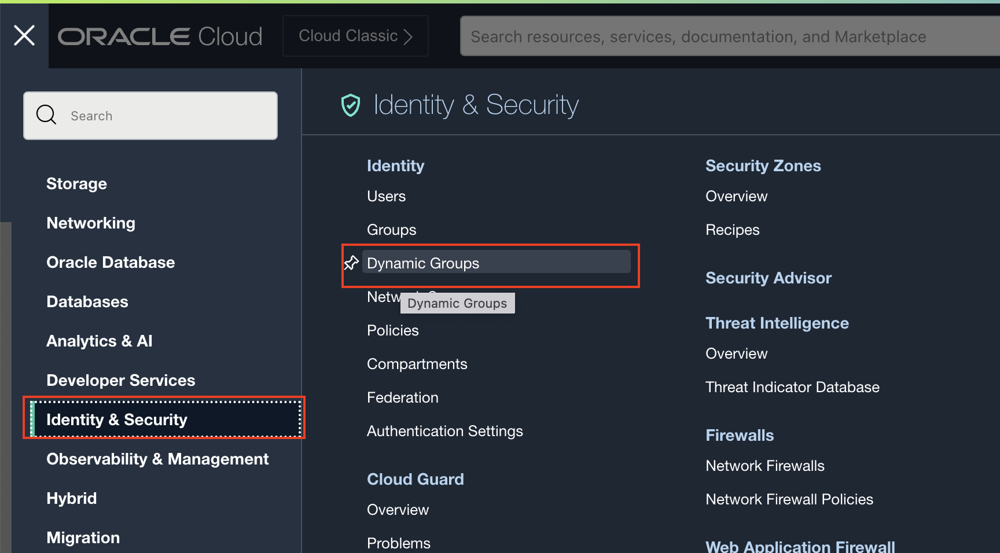
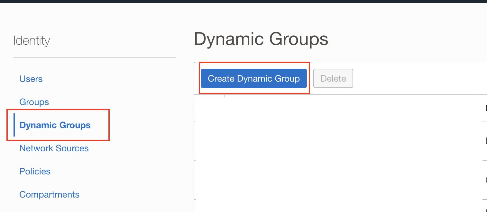
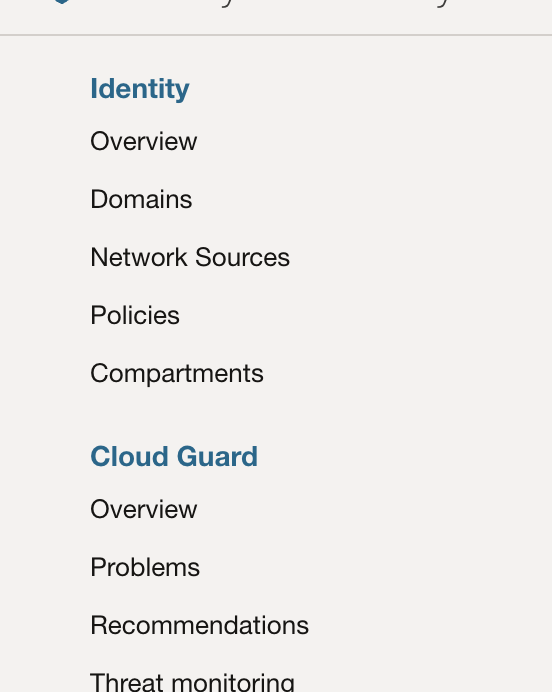
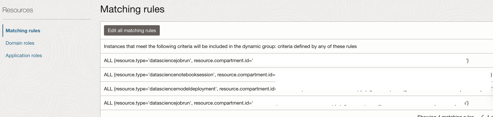
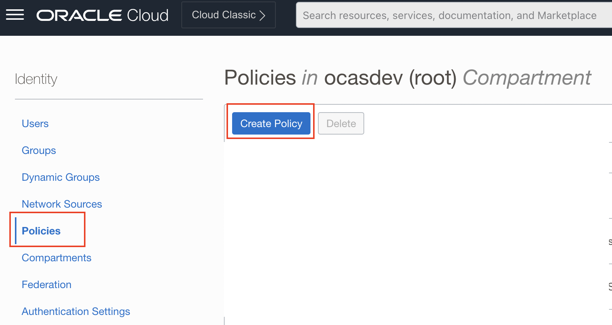

Lab 2: Configure OCI IAM Policies
===

## 1. Create a *Compartment*

   All OCI resources used to build the Anomaly Detection Solution in this workshop will be provisioned within the same OCI *Compartment*. Create an OCI Compartment (if needed).

   **IMPORTANT**: Note down the compartment *OCID* and compartment *Name* from the **Compartments** page in OCI Console. Substitute the value of compartment *Name* in the *Policies* in Steps [2] & [3] below (**compartment-name**).
    
## 2. Create a *Dynamic Group*

   Go to **Identity and Security** >> **Dynamic Groups** and create the following matching rule.
    
   ```
   ALL {resource.type = 'fnfunc', resource.compartment.id = '<compartment-ocid>'}
   ALL {resource.type='datasciencejobrun', resource.compartment.id='<compartment-ocid>'}	
   ALL {resource.type='datasciencenotebooksession', resource.compartment.id='<compartment-ocid>'}	
   ALL {resource.type='datasciencemodeldeployment', resource.compartment.id='<compartment-ocid>'}
   ALL {resource.type='datasciencejobrun', resource.compartment.id='<compartment-ocid>'}
   ```

   See screenshots below.

   
    
   

   **IMPORTANT**: Substitute the value of dynamic group *Name* in the respective policy in Step [3] below (**dynamic-name**).

   *If your **Identity and Security** portal looks like the following:

   

   Then you can click **Identity** >> **Domains** under the **root tenancy** and use the **Default** domain. Then create the following dynamic group:
   ```
   ALL {resource.type='datasciencejobrun', resource.compartment.id='<compartment-ocid>'}	
   ALL {resource.type='datasciencenotebooksession', resource.compartment.id='<compartment-ocid>'}	
   ALL {resource.type='datasciencemodeldeployment', resource.compartment.id='<compartment-ocid>'}
   ALL {resource.type='datasciencejobrun', resource.compartment.id='<compartment-ocid>'}
   ALL {resource.type = 'fnfunc', resource.compartment.id = '<compartment-ocid>'}
   ```

   


## 3. Create required *Policies*
    
   Within **Identity and Security**, click on **Policies**. Then click on **Create Policy**. See screenshot below.

   

   Configure all the necessary policies. For convenience, allow `any-user` to access the resources (see below). You can refine the scope by creating user groups.

   ```
   Allow any-user to manage objects in compartment <compartment-name>
   Allow service faas to manage objects in compartment <compartment-name>
   Allow any-user to use cloud-shell IN compartment <compartment-name>
   Allow any-user to manage repos IN compartment <compartment-name>
   Allow any-user to read objectstorage-namespaces IN compartment <compartment-name>
   Allow any-user to manage logging-family IN compartment <compartment-name>
   Allow any-user to read metrics IN compartment <compartment-name>
   Allow any-user to manage functions-family IN compartment <compartment-name>
   Allow any-user to use virtual-network-family IN compartment <compartment-name>
   Allow any-user to use apm-domains IN compartment <compartment-name>
   Allow any-user to read vaults IN compartment <compartment-name>
   Allow any-user to use keys IN compartment <compartment-name>
   Allow service faas to use dataflow-family in compartment <compartment-name>
   Allow service faas to use apm-domains IN compartment <compartment-name>
   Allow service faas to read repos IN compartment <compartment-name> where request.operation='ListContainerImageSignatures'
   Allow service faas to {KEY_READ} IN compartment <compartment-name> where request.operation='GetKeyVersion'
   Allow service faas to {KEY_VERIFY} IN compartment <compartment-name> where request.operation='Verify'
   Allow dynamic-group <dynamic-group-name> to manage all-resources in compartment <compartment-name>
   Allow any-user to inspect compartments in compartment <compartment-name>
   Allow any-user to inspect streams in compartment <compartment-name>
   Allow any-user to use stream-push in compartment <compartment-name>
   Allow any-user to use stream-pull in compartment <compartment-name>
   Allow  any-user to use virtual-network-family in compartment <compartment-name>
   Allow  any-user to manage function-family in compartment <compartment-name>
   Allow any-user to use ons-topic in compartment <compartment-name>
   Allow any-user to manage cloudevents-rules in compartment <compartment-name>
   Allow any-user to use cloud-shell in compartment <compartment-name>
   Allow service dataflow to read objects in compartment <compartment-name> where target.bucket.name='staging-bucket'
   Allow service dataflow to read objects in compartment <compartment-name> where target.bucket.name='inferencing-config-bucket'
   Allow service dataflow to read objects in compartment <compartment-name> where target.bucket.name='training-config-bucket'
   Allow service dataflow to read objects in compartment <compartment-name> where target.bucket.name='output-bucket'
   ```

## Useful Resources
Refer to OCI documentation (link below) to learn more about OCI IAM Policies.

- [OCI Policies](https://docs.oracle.com/en-us/iaas/Content/Identity/Concepts/policygetstarted.htm)

[Go to *Lab 1*](#prev) | [Go to *Lab 3*](#next)
