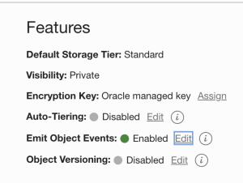

Lab 3: Configure OCI Object Storage Buckets and Upload Driver
===

## 1. Download DPF Engine Driver Code

   The Data Processing Framework (DPF) is an executable (~Driver) built by OCI AI Services team and provided to users. The latest driver code can be downloaded from [here](https://objectstorage.us-phoenix-1.oraclecloud.com/p/dgqPltNm4ldkw-6YJF2aa4Aj4UsKZZBaJ39aV-exMlDbhTwnNKZx7m9XPNB45AQI/n/axaspnesarzr/b/driver-code-archive-bucket/o/df_driver.py).

## 2. Download DPF Transforms Library

   A Library which includes multiple data transformers functions is provided to users as an [archive file](https://objectstorage.us-phoenix-1.oraclecloud.com/p/cvXUlN_fy9_D5yu4tzmvB0LgSYyrI1-UgY3qJuMlDxw1u-nxwFYv8KlULiqdf33U/n/axaspnesarzr/b/driver-code-archive-bucket/o/archive.zip) (archive.zip).  Download this zip file as it will be used later in this lab.

   Refer to the **Transformers** [documentation](../optional/introduction-to-transformers-for-data-preprocessing.md) for a description of all available transformers.

   For users interested in building their own data transformers (preprocessors) and building the archive from sources, this [document](https://github.com/bug-catcher/oci-data-science-ai-samples/blob/master/ai_services/anomaly_detection/data_preprocessing_examples/oci_data_flow_based_examples/prepackaged_dataflow_applications.md) describes how to generate an archive in the required format.

## 3. Set up OCI Object Storage Buckets

   Create the following OCI Object Storage Buckets using OCI Console or OCI CLI.

   **IMPORTANT:** Labs in this workshop use the following names for OCI Object Storage Buckets. Users wanting to use different names for the buckets, can choose to do so.  However, the correct names will need to be specified in subsequent Labs. Users going thru this workshop for the first time are strongly advised to use the suggested bucket names.

   | OCI Storage Bucket Name | Description |
   | ----------------------- | ----------- |
   | driver-code-archive-bucket | The bucket to store driver code and archive.zip consuming by Data Flow. |
   | training-config-bucket | The bucket to store training process configuration. |
   | training-data-bucket | The bucket to store training data. Need to enable **Emit Object Events**. |
   inferencing-config-bucket | The bucket to store inferencing process configuration.
   | inferencing-data-bucket | The bucket to store training data. Need to enable **Emit Object Events**. |
   | staging-bucket | The bucket to store processed interim data, i.e. the data passed through processing, waiting for being fed to training or inferencing. |
   | output-bucket | The bucket to store the finalized output from inferencing, the list of trained models and data dependent information |
   | logs-bucket | The bucket to store data flow logs. |

## 4. Enable OCI Object Store Events

   Update the following OCI Object Store Buckets to emit events whenever new files are saved/uploaded to these buckets.

   | Object Store Bucket Name |
   | ------------------------ |
   | training-data-bucket |
   | inferencing-data-bucket |

   Enable OCI Object Store events to be emitted by going to the respective Bucket's detail page as shown in the screenshot below.

   

## 5. Upload Driver and Library

   Upload the DPF Driver and Transforms Library (archive.zip) which you downloaded in Steps [1] and [2] into the respective OCI Object Storage Buckets. See below.

   *   Upload driver code (**df_driver.py**) into **driver-code-archive-bucket**
   *   Upload archive.zip into **driver-code-archive-bucket**

## Useful Resources
Refer to OCI documentation (link below) to learn more about OCI Object Storage.

- [OCI Object Storage](https://docs.oracle.com/en-us/iaas/Content/Object/Concepts/objectstorageoverview.htm)

[Go to *Lab 2*](#prev) | [Go to *Lab 4*](#next)
