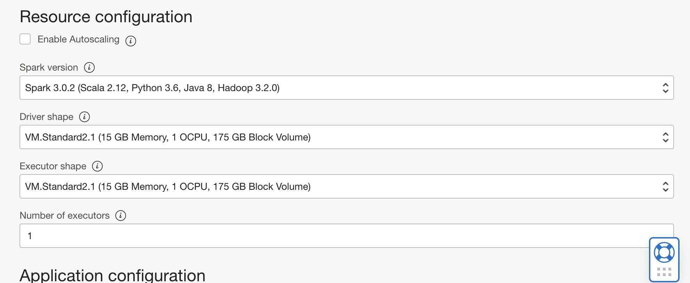
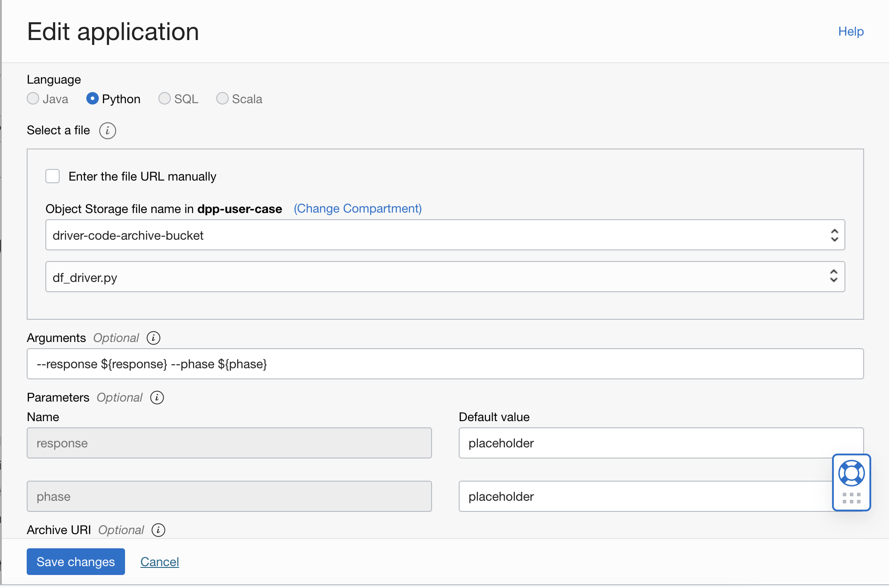

Lab 5: Configure OCI DataFlow Application
===

OCI Data Flow is a cloud based serverless Apache Spark Service (PaaS). This workshop will mainly rely on Data Flow to pre-process data and execute post processing steps.

The DPF Driver is essentially an Apache Spark *Application* which runs the data transformations on individual OCI Data Flow *Executor* nodes. Users can choose the appropriate shape (VM) for the driver and executor nodes based on data size. Increasing the number of *Executors* will speed up the processing for large data sets. For small data sets such as the ones used in this workshop, most of the options can be left at their default values.

## 1. Create a OCI Data Flow Application

In OCI Console, click on the hamburger menu (top left), select **Analytics & AI**, then select *Data Flow* under **Data Lake**. Next, click on *Create application* to create a new Data Flow Application.

Update/Specify field values as described below.

*   For the **Spark Version** section, choose **Spark 3.0.2**.
*   For the **Language** section, choose **Python**.
*   Select df_driver.py from the driver bucket.
*   For **Arguments**, simply input `--response ${response} --phase ${phase}`.
*   For **Parameters**, enter **placeholder** as the default value for both input parametersi (*response* & *phase*). This values will be overriden by the DPF driver.
*   For **Archive URI**, enter the fully qualified path to archive.zip in Object Storage. The structure of path is `oci://<bucket-name>@<namespace>/<path-to-archive.zip>`. Same below.
*   For **Application log location**, enter the path to logs-bucket. This is very useful for debugging failed application runs.

Refer to the screenshots below.

**IMPORTANT**: Note down the Data Flow *Application* OCID as it will be required in **Lab 6**

## Useful Resources
Refer to the documentation (links below) to learn more about OCI Data Flow and Apache Spark

- [Apache Spark 3.3.0](https://spark.apache.org/docs/latest/)
- [OCI Data Flow](https://docs.oracle.com/en-us/iaas/data-flow/using/dfs_getting_started.htm)

[Go to *Lab 4*](#prev) | [Go to *Lab 6*](#next)
