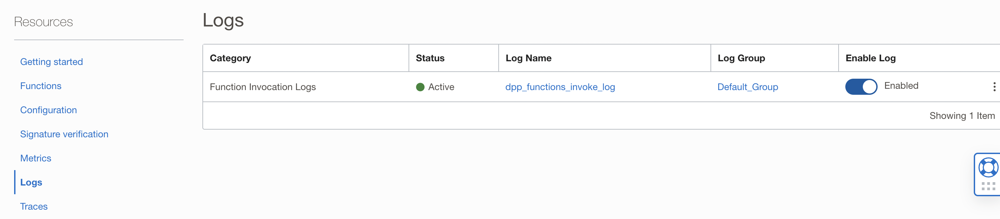

Lab 6: Configure OCI Functions
=== 

## 1. Configure Virtual Cloud Network

- Go to Virtual Cloud Network and create a **VCN**. For IPv4 CIDR Blocks, the recommended one **10.0.0.0/16** can be used:  

  

- Inside the generated VCN, create a **subnet**. For IPv4 CIDR Block, the recommended one **10.0.0.0/24** can be used. For Subnet Access, choose Private Subnet.  
  

- Under the VCN, create a **Service Gateway**. Remember to choose **ALL <Region> Services In Oracle Service Network** under Services:  

  

- Under the VCN, go to **Route Tables** and click on **Default Route Table for <vcn-name>**. Choose **Add Route Rules**. Choose **Service Gateway** as the Target Type, **ALL <Region> Services In Oracle Service Network** as Destination Service, and choose the Service Gateway created in the previous step as Target Service Gateway.  

  
    

## 2. Create an OCI Functions Application

Go to **Functions** → **Applications**, and Create an *Application*. See screenshots below. Then go to **Getting Started** and use **Cloud Shell setup**. Follow the instructions on the pad and deploy the demo function. Verify that it can be invoked successfully.


```
$ fn invoke <func-name> <app-name>
Hello, World!
```

## 3. Configure OCI Function to invoke the Data Flow

- Update the Function body (func.py)

  Replace the Function body (func.py) with the content from [here](https://github.com/bug-catcher/oci-data-science-ai-samples/blob/415e072962940f51dd811875386ddb2c728a3af8/ai_services/anomaly_detection/data_preprocessing_examples/oci_data_flow_based_examples/example_code/end_to_end_example/func.py).

- Configure Function parameters with correct values

  In the code snippet below, replace <training_bucket_name> with **training-data-bucket**, <training_config_bucket_name> with **training-config-bucket**,<driver_config>.json with **training-config.json**. These are the values used in **Lab 4** and **Lab 5**.

  ```
  if bucketName == "<training_bucket_name>":
        config_bucket_name = "<training_config_bucket_name>"
        object_name = "<driver_config>.json"
        resp = get_object(namespace, config_bucket_name, object_name)
  ```

  In the code snippet below, replace <inferencing_bucket_name> with **inferencinging-data-bucket**, <inferencing_config_bucket_name> with **inferencinging-config-bucket**,<driver_config>.json with **inferencing-config.json**. These are the values used in **Lab 4** and **Lab 5**.

  ```
  elif bucketName == "<inferencing_bucket_name>":
        config_bucket_name = "<inferencing_config_bucket_name>"
        object_name = "<driver_config>.json"
        resp = get_object(namespace, config_bucket_name, object_name)
  ```

  In the code snippet below, replace <compartment-ocid> with the compartment of the DataFlow Application, <application-ocid> with the Application OCID and the logging bucket and namespace configured in **Lab 4**.

  ```
  create_run_details=oci.data_flow.models.CreateRunDetails(
            compartment_id="<compartment-ocid>",
            application_id="<application-ocid>",
            arguments=[ "--response", response, "--phase", phase],
            display_name="complete-dpp-test",
            logs_bucket_uri="oci://<bucket-name>@<namespace>/")
  ```

- Update `requirements.txt` file

  Expand source

  ```
  fdk>=0.1.46
  oci>=2.2.18
  ```

- Invoke the OCI Functions Application

  Run the Function to make sure the options were configured correctly, publish it to an Application. A run should succesfully get created for the Data Flow if everything was set up correctly.

  Enable logs under the function for troubleshooting purposes. See screenshot below.

  

## Useful Resources
Refer to the OCI documentation (link below) to learn more about OCI Functions.

- [OCI Functions](https://docs.oracle.com/en-us/iaas/Content/Functions/Concepts/functionsoverview.htm)
