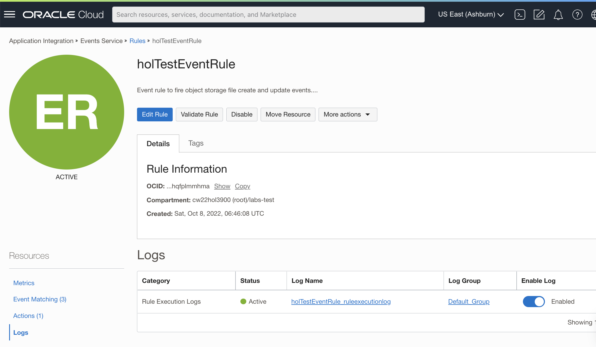

Lab 7: Configure OCI Events
===

OCI Events tracks resource changes with events which comply with CNCF CloudEvents Standard. 

## 1. Create an *Event* Rule

Go to Events Service → Rules → Create Rule, and create a rule as shown in the screenshot below. 


   * For Event Type, select **Object Storage**, then select  **Object - Create** and **Object - Update**.
   * For Attribute, select **bucketName**. Attribute Values should be **training-data-bucket** and **inferencing-data-bucket**, which were the values set up in **Lab 3** earlier.
   * Under Actions, select **Functions** for Action Type, and select the right *Function Compartment*, *Function Application* and *Function Name* provisioned in **Lab 6**.

   The finalized Rule Logic is shown below:

   ```java
   MATCH event WHERE (
     eventType EQUALS ANY OF (
       com.oraclecloud.objectstorage.updateobject,
       com.oraclecloud.objectstorage.createobject
     )
     AND (
       bucketName MATCHES ANY OF (
         training-data-bucket,
         inferencing-data-bucket
       )
     )
   )
   ```

   For reference, a sample event generated by object upload is shown below.

   ```java
   {
     "eventType" : "com.oraclecloud.objectstorage.updateobject",
     "cloudEventsVersion" : "0.1",
     "eventTypeVersion" : "2.0",
     "source" : "ObjectStorage",
     "eventTime" : "2022-08-24T18:45:39Z",
     "contentType" : "application/json",
     "data" : {
       "compartmentId" : "<compartment_ocid>",
       "compartmentName" : "<compartment_name>",
       "resourceName" : "<dataset_name>",
       "resourceId" : "<resource_id>",
       "availabilityDomain" : "PHX-AD-1",
       "additionalDetails" : {
         "bucketName" : "<bucket_name>",
         "versionId" : "<version_id>",
         "archivalState" : "Available",
         "namespace" : "<namespace>",
         "bucketId" : "<bucket_ocid>",
         "eTag" : "<etag>"
       }
     },
     "eventID" : "<event_id>",
     "extensions" : {
       "compartmentId" : "<compartment_id>"
     }
   }
   ```

## 2. Enable OCI Event Logs

Enable Event Logs for troubleshooting purposes as shown in the screenshot below.



## Useful Resources
Refer to the OCI documentation (links below) to learn more about how OCI Events Service can be used to monitor events emitted by OCI Autonomous Database and OCI Object Storage.

- [OCI Events](https://docs.oracle.com/en-us/iaas/Content/Events/Concepts/eventsoverview.htm)
- [OCI Autonomous Database](https://docs.oracle.com/en-us/iaas/Content/Events/Reference/eventsproducers.htm#dbaasevents__AutoDB)
- [OCI Object Storage](https://docs.oracle.com/en-us/iaas/Content/Events/Reference/eventsproducers.htm#ObjectStor__bucket)
