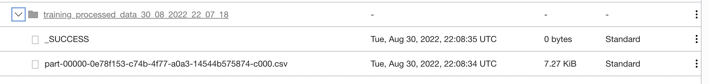
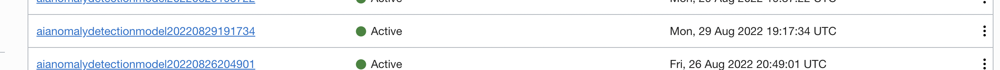
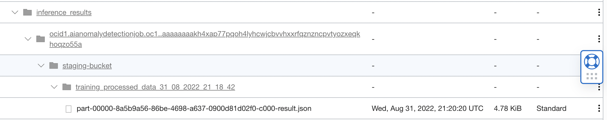

Lab 8: Run the Anomaly Detection Solution
===

## 1. Download Model Training and Inferencing Datasets

Download the training and testing (/inference) data files. A sample training data set in Parquet format is also included for interested users, although this workshop will use data files provided in CSV format only.

[TestData.csv](./files/TestData.csv) | [TrainData.csv](./files/TrainData.csv) | [TrainData.parquet](./files/TrainData.parquet)

## 2. Run Model Training Pipeline

Upload the training data to **training-data-bucket**. If a Data Flow run is triggered successfully, and an Anomaly Detection model is trained successfully, then the training path is working.

The following steps can be used to verify the workflow or troubleshoot issues (if any)
- Look for a new Data Flow Run created under the application under **Analytics & AI** -> **Runs**.
- Wait for the Run status to change from *Accepted* to *In Progress* and then *Successful*. **NOTE**: The transition may sometimes happen before you navigate and check.
- If the Run moves to Failed status, check the stdout and stderr logs under the Logs tab. **NOTE**: the log may need a couple minutes to show up after the Run fails. Logs can also be downloaded from the log bucket in zip format.
- During the Run, Processed data will be saved in CSV format in **staging-bucket** under the folder specified in the driver configuration file, in a subdirectory named **training_processed_data_\<current datetime\>**. See sample screenshot below.



- Once the Run succeeds, a new AD model should get trained successfully. 
  
  * If the logs contain an error indicating that model training has failed, search for the model OCID from the search box or by navigating to the Anomaly Detection project, and check the reason for failure.

- Model information will be written to a file named **model_info.** in **output-bucket**. A sample is shown below for your reference:

```
{
  "model_ids": [
      {
	  "model_id": "ocid1.aianomalydetectionmodel.oc1.phx.amaaaaaaor7l3jiavbwqxnwiqvikmrdjyeaq7e2bvrpbh3y5apq4iv4xmfga",
	  "columns": [
	      "timestamp",
	      "sensor_01",
	      "sensor_02",
	      "sensor_03",
	      "sensor_04",
	      "sensor_05",
	      "sensor_06",
	      "sensor_07",
	      "sensor_08",
	      "sensor_09",
	      "sensor_10",
	      "sensor_11",
	      "sensor_12",
	      "sensor_13"
	  ]
      }
  ]
}
```

Details of the trained model such as FAP(False Alarm Probability) can be checked under **Anomaly Detection** or from the search panel.



## 3. Run Inferencing Pipeline

The application assumes the user has succesfully performed model training using the pipeline prior to inference.

Similar to the previous section, upload the inferencing data file in the bucket specified by **inferencing-data-bucket**. If the Data Flow run is triggered and is successful, and the result of Anomaly Detection shows up in the results bucket, then the inferencing path is working. 

Follow the instructions described in Step [2] (above) to monitor the pipeline and/or troubleshoot problems. In the last step, check the results folder for the inference results.

After a successful run, the results should be populated as shown in the screenshot below in the **output-bucket** under **infernce_results**:



Download the CSV file to view and verify the anomaly detection results. When the sample test data set provided in section/lab is used for inference, AD Service response/output will be as shown below.

```
[
  {
    "timestamp": 1577836805000,
    "anomalies": [
      {
        "signalName": "sensor_13",
        "actualValue": 15.0,
        "estimatedValue": 550.0,
        "anomalyScore": 0.7300000000000001
      }
    ]
  },
  {
    "timestamp": 1577836807000,
    "anomalies": [
      {
        "signalName": "sensor_13",
        "actualValue": 1757.0,
        "estimatedValue": 966.9999999999999,
        "anomalyScore": 0.12617436404050383
      }
    ]
  },
  {
    "timestamp": 1577836808000,
    "anomalies": [
      {
        "signalName": "sensor_13",
        "actualValue": 12454.0,
        "estimatedValue": 662.9999999999999,
        "anomalyScore": 0.9287404297357372
      }
    ]
  },
  {
    "timestamp": 1577836810000,
    "anomalies": [
      {
        "signalName": "sensor_13",
        "actualValue": 4102.0,
        "estimatedValue": 766.6666666666666,
        "anomalyScore": 0.3199209681402816
      }
    ]
  },
  {
    "timestamp": 1577836811000,
    "anomalies": [
      {
        "signalName": "sensor_13",
        "actualValue": 2126.0,
        "estimatedValue": 1174.3333333333333,
        "anomalyScore": 0.1835144480118548
      }
    ]
  },
  {
    "timestamp": 1577836813000,
    "anomalies": [
      {
        "signalName": "sensor_13",
        "actualValue": 79.0,
        "estimatedValue": 1033.5,
        "anomalyScore": 0.78
      }
    ]
  },
  {
    "timestamp": 1577836816000,
    "anomalies": [
      {
        "signalName": "sensor_13",
        "actualValue": 7497.0,
        "estimatedValue": 157.33333333333334,
        "anomalyScore": 0.5914645591504075
      }
    ]
  },
  {
    "timestamp": 1577836817000,
    "anomalies": [
      {
        "signalName": "sensor_13",
        "actualValue": 6307.0,
        "estimatedValue": 253.66666666666666,
        "anomalyScore": 0.5032946406520129
      }
    ]
  },
  {
    "timestamp": 1577836822000,
    "anomalies": [
      {
        "signalName": "sensor_07",
        "actualValue": 3.0405425439999996,
        "estimatedValue": 1.0795829345000008,
        "anomalyScore": 0.7300000000000001
      }
    ]
  },
  {
    "timestamp": 1577836823000,
    "anomalies": [
      {
        "signalName": "sensor_02",
        "actualValue": 7.348946879,
        "estimatedValue": 1.9880675230000016,
        "anomalyScore": 0.7300000000000001
      },
      {
        "signalName": "sensor_09",
        "actualValue": 2.698232702,
        "estimatedValue": 7.447266599000002,
        "anomalyScore": 0.7300000000000001
      },
      {
        "signalName": "sensor_13",
        "actualValue": 4321.0,
        "estimatedValue": 500.50000000000006,
        "anomalyScore": 0.3261471968387256
      }
    ]
  },
  {
    "timestamp": 1577836826000,
    "anomalies": [
      {
        "signalName": "sensor_06",
        "actualValue": 17.90199971,
        "estimatedValue": -10.268006879000001,
        "anomalyScore": 0.7300000000000001
      }
    ]
  },
  {
    "timestamp": 1577836827000,
    "anomalies": [
      {
        "signalName": "sensor_06",
        "actualValue": -1.064510503,
        "estimatedValue": -6.930495428,
        "anomalyScore": 0.7400000000000001
      },
      {
        "signalName": "sensor_13",
        "actualValue": 10.0,
        "estimatedValue": 1234.0,
        "anomalyScore": 0.7400000000000001
      }
    ]
  },
  {
    "timestamp": 1577836829000,
    "anomalies": [
      {
        "signalName": "sensor_06",
        "actualValue": 2.7871318539999996,
        "estimatedValue": -9.8814320785,
        "anomalyScore": 0.7500000000000001
      },
      {
        "signalName": "sensor_13",
        "actualValue": 12471.0,
        "estimatedValue": 820.5,
        "anomalyScore": 0.93
      }
    ]
  },
  {
    "timestamp": 1577836830000,
    "anomalies": [
      {
        "signalName": "sensor_13",
        "actualValue": 11757.0,
        "estimatedValue": 860.9999999999999,
        "anomalyScore": 0.8870980489009633
      }
    ]
  },
  {
    "timestamp": 1577836831000,
    "anomalies": [
      {
        "signalName": "sensor_13",
        "actualValue": 12454.0,
        "estimatedValue": 901.5,
        "anomalyScore": 0.9487404297357372
      }
    ]
  },
  {
    "timestamp": 1577836832000,
    "anomalies": [
      {
        "signalName": "sensor_13",
        "actualValue": 11053.0,
        "estimatedValue": 942.0000000000001,
        "anomalyScore": 0.8549370214867869
      }
    ]
  },
  {
    "timestamp": 1577836833000,
    "anomalies": [
      {
        "signalName": "sensor_13",
        "actualValue": 11234.0,
        "estimatedValue": 982.5,
        "anomalyScore": 0.8683477401827613
      }
    ]
  },
  {
    "timestamp": 1577836836000,
    "anomalies": [
      {
        "signalName": "sensor_10",
        "actualValue": -1.854022846,
        "estimatedValue": -0.24834785949999993,
        "anomalyScore": 0.7300000000000001
      }
    ]
  }
]
```

**Congratulations!**  You have successfully completed all labs in this workshop.

