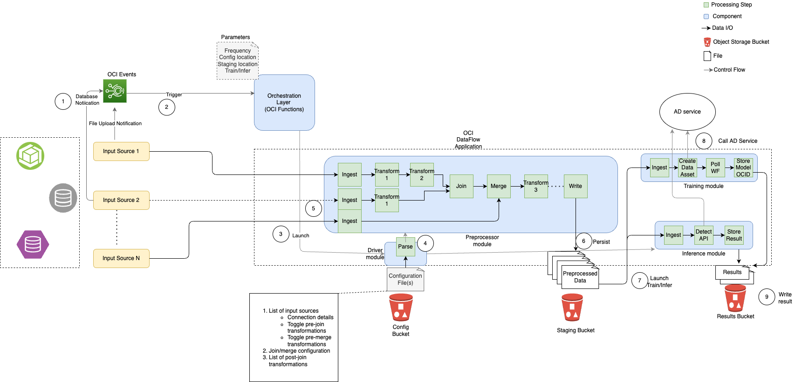

# Introduction

## About this Workshop

In this workshop, users will learn how to implement an end to end **Anomaly Detection** solution using a data pre-processing workflow engine.

Estimated Time: 1-2 hours

## Objectives
This solution will allow users to configure a training pipeline and an inference pipeline in their tenancy, along with ingestion and preprocessing of their data. Input sizes could range from a few rows to several tens of millions of rows, and 1 column to several thousands of columns.

## Prerequisites

* An Oracle Free Tier, or Paid Cloud Account.
* Familiarity with services on Oracle Cloud Infrastructure (OCI) IaaS and PaaS Services such as Object Storage, Identity, Virtual Cloud Network, Functions etc. 
* Familiarity with Python (or other programming language) is strongly recommended.
* Experience with data engineering, machine learning and statistics is preferred but not required. 
* Additional prerequisites (if any) are described in each lab.

## All Tasks
* Pre-requisites
* Configure OCI Anomaly Detection (AD) Service
* Configure Policies
* Prepare Code, Configuration, Library and Datasets
* Configure OCI Data Flow
* Configure OCI Function 
* Configure OCI Events
* Running the Solution end to end

## Solution Workflow

A brief description of the workflow

1.  User prepares the driver config and uploads it to the config OCI Storage Bucket. Also, user creates an **OCI Anomaly Detection** Project and Data Flow Application to be used later.
2.  User uploads a training/inferencing dataset to the *Input/Source* OCI Storage Bucket.
3.  User configures OCI Events Service as a listener on the source OCI Storage Bucket. Uploading a data file into this storage bucket will trigger an OCI Events *event*.
4.  OCI event will trigger the downstream OCI Function, which will load the driver configuration file and start the workflow.
5.  The workflow will run data transforms configured in the driver configuration file.
6.  As soon as the data processing workflow completes successfully, the processed data with other information (for example, model\_info) will be written to the *Staging* OCI Storage Bucket.
7.  AD training/inferencing will begin to run. 
8.  Once training/inferencing is complete the result will be written to the *Result* OCI Storage Bucket.

**NOTE**:

*   Pipelines are triggered whenever new files are added to the corresponding *Source* Storage Bucket. For example, uploading a new training dataset into the respective Source storage bucket will trigger the training pipeline.
*   The workflow engine will execute the pipeline based on the driver configuration file.
    *   Once the raw data is preprocessed, the transformed data will be saved in the configured *Staging* bucket.
    *   AD service will be triggered afterward to perform training or detection, and the results will be available in the configured *Result* bucket.
*   Users can utilize more computational power in order to run the pipelines faster. This is very easy to configure as well.

### Supported Input Sources and Formats

*   Tables stored in OCI ATP/ADW databases
*   CSV/Parquet file formats in Object Storage

**NOTE**:

While the pipelines are triggered by updates, they work on point-in-time snapshots of the data. Users are advised to update database sources (tables) in a single transaction to avoid processing data in a partial state.

### Supported Output Source and Formats

Output is always saved to OCI Object Storage Bucket as a CSV file.

## Learn More

* [Introduction to all transformers](../optional/Introduction-to-Transformers-for-Data-Preprocessing.md)

## Acknowledgements
* **Author**
    * Shreyas Vinayakumar - Principal Member of Technical Staff - Oracle AI Services
    * Shujie Chen - Principal Member of Technical Staff - Oracle AI Services
    * Sudha Ravi Kumar Javvadi - Member of Technical Staff - Oracle AI Services

* **Reviewer**
    * Ganesh Radhakrishnan - Principal Product Manager - Oracle AI Services

* **Last Updated By/Date**
    * Shujie Chen - Principal Member of Technical Staff - Oracle AI Services
