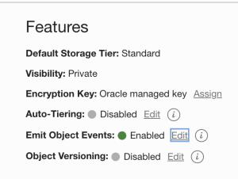

Lab 4: Prepare code and create Object Storage buckets
===

This lab will help users set up the following resources before proceeding to configure infrastructure resources

*   Driver code
*   Library (Archive.zip)

 ## Step 1: Download driver code

This is an executable built by OCI AI Services team and provided to users. The latest driver code can be downloaded from here: [link](https://github.com/bug-catcher/oci-data-science-ai-samples/blob/master/ai_services/anomaly_detection/data_preprocessing_examples/oci_data_flow_based_examples/example_code/df_driver.py).

## Step 3: Library

Library is an archive.zip incorporating transformers and user defined functions. Here is the link of an introduction to the [transformers](../optional/Introduction-to-Transformers-for-Data-Preprocessing.md) included currently. 
For this lab, use the archive below.
[Archive link](https://objectstorage.us-phoenix-1.oraclecloud.com/p/kUGPXE9HB_BtgpCqe7jyOUUD_rorNiHD0HWsIR52r4KN4axrHpidLnBo4y1Nsnb-/n/ax3dvjxgkemg/b/archive-bucket/o/archive.zip)

For users interested in building their own preprocessing steps and building the archive from sources, this [doc](https://github.com/bug-catcher/oci-data-science-ai-samples/blob/master/ai_services/anomaly_detection/data_preprocessing_examples/oci_data_flow_based_examples/prepackaged_dataflow_applications.md) describes how to generate an archive in the required format.

## Step 4: Set up Object Storage Buckets

This guide uses the following buckets (any change to the names will have to be reflected in the subsequent setup steps):

*   **driver-code-archive-bucket**: the bucket to store driver code and archive.zip consuming by Data Flow.
*   **training-config-bucket**: the bucket to store training process configuration.
*   **training-data\-bucket**: the bucket to store training data. Need to enable **Emit Object Events**.
*   **inferencing-config-bucket**: the bucket to store inferencing process configuration.
*   **inferencing-data-bucket**: the bucket to store training data. Need to enable **Emit Object Events**.
*   **staging-bucket**: the bucket to store processed interim data, i.e. the data passed through processing, waiting for being fed to training or inferencing. 
*   **output-bucket**: the bucket to store the finalized output from inferencing, the list of trained models and data dependent information
*   **logs-bucket**: the bucket to store data flow logs.

To enabling object event emit, you can edit the bucket by going to the bucket's page:

## Step 5: Upload driver and library

Now you should place what you've prepared to the right buckets:

*   Put driver code into **driver-code-archive-bucket**
*   Put archive.zip into **driver-code-archive-bucket**