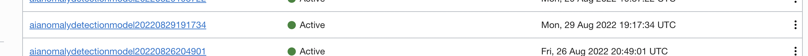
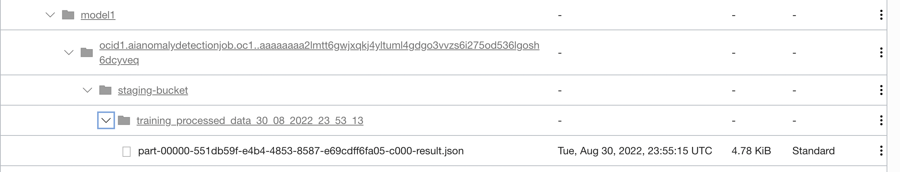

Lab 8: A simple data processing, training and inferencing example
===

## Training

To make sure you have everything setup well in training, you can upload the training data to the **training-data-bucket**. If you see a Data Flow run is triggered is successful, and under Anomaly Detection a model is trained successfully, then the training path is working.

An expected sequence of checking the workflow will be:
1. Look for a new Data Flow Run created under the application under **Analytics & AI** -> **Runs**.
2. Wait for the Run status to change from *Accepted* to *In Progress* and then *Successful*. Note: The transition may sometimes happen before you navigate and check.
3. If the Run moves to Failed, check the failure logs. Notice: the log may need couple minutes to show up. You can also find the log in your assigned log bucket.
4. Once the Run succeeds, a new AD model should get trained successfully. 
  
    * If the training has failed, search for the model OCID from the search box or by navigating to the Anomaly Detection project, and check the reason for failure.

Once training completes, you should see processed data in csv in your **staging-bucket** under the folder specified in the config, in a subdirectory named **training_processed_data_\<datetime\>**


And under your **results-bucket**, your model information will be written to a file named **model_info.** It should look like this:

```
{
    "model_ids": [
        {
            "model_id": "ocid1.aianomalydetectionmodel.oc1.phx.amaaaaaaor7l3jiavbwqxnwiqvikmrdjyeaq7e2bvrpbh3y5apq4iv4xmfga",
            "columns": [
                "timestamp",
                "sensor_01",
                "sensor_02",
                "sensor_03",
                "sensor_04",
                "sensor_05",
                "sensor_06",
                "sensor_07",
                "sensor_08",
                "sensor_09",
                "sensor_10",
                "sensor_11",
                "sensor_12",
                "sensor_13"
            ]
        }
    ]
}
```

Lastly, you should also see your model trained under **Anomaly Detection**. You can check the FAP and other details here.



## Inferencing

Similarly, pload the inferencing data file in the bucket specified by **inferencing-data-bucket**. If Data Flow run is triggered is successful, and in resulting bucket you see the result of anomaly detection, then the inferencing path is working. The application assumes user has performed training prior to inference. If this is not the case, ensure that the model\_info file mentioned previously exists in **results-bucket** in the same format.

After a successful run, the results-bucket should be populated as shown in the screenshot below in the **results-bucket**:



Download the CSV file to view and verify the anomaly detection results. When the sample test data set provided in section/lab is used for inference, AD Service response/output will be as shown below.


```
[
  {
    "timestamp": 1577836805000,
    "anomalies": [
      {
        "signalName": "sensor_13",
        "actualValue": 15.0,
        "estimatedValue": 550.0,
        "anomalyScore": 0.7300000000000001
      }
    ]
  },
  {
    "timestamp": 1577836807000,
    "anomalies": [
      {
        "signalName": "sensor_13",
        "actualValue": 1757.0,
        "estimatedValue": 966.9999999999999,
        "anomalyScore": 0.12617436404050383
      }
    ]
  },
  {
    "timestamp": 1577836808000,
    "anomalies": [
      {
        "signalName": "sensor_13",
        "actualValue": 12454.0,
        "estimatedValue": 662.9999999999999,
        "anomalyScore": 0.9287404297357372
      }
    ]
  },
  {
    "timestamp": 1577836810000,
    "anomalies": [
      {
        "signalName": "sensor_13",
        "actualValue": 4102.0,
        "estimatedValue": 766.6666666666666,
        "anomalyScore": 0.3199209681402816
      }
    ]
  },
  {
    "timestamp": 1577836811000,
    "anomalies": [
      {
        "signalName": "sensor_13",
        "actualValue": 2126.0,
        "estimatedValue": 1174.3333333333333,
        "anomalyScore": 0.1835144480118548
      }
    ]
  },
  {
    "timestamp": 1577836813000,
    "anomalies": [
      {
        "signalName": "sensor_13",
        "actualValue": 79.0,
        "estimatedValue": 1033.5,
        "anomalyScore": 0.78
      }
    ]
  },
  {
    "timestamp": 1577836816000,
    "anomalies": [
      {
        "signalName": "sensor_13",
        "actualValue": 7497.0,
        "estimatedValue": 157.33333333333334,
        "anomalyScore": 0.5914645591504075
      }
    ]
  },
  {
    "timestamp": 1577836817000,
    "anomalies": [
      {
        "signalName": "sensor_13",
        "actualValue": 6307.0,
        "estimatedValue": 253.66666666666666,
        "anomalyScore": 0.5032946406520129
      }
    ]
  },
  {
    "timestamp": 1577836822000,
    "anomalies": [
      {
        "signalName": "sensor_07",
        "actualValue": 3.0405425439999996,
        "estimatedValue": 1.0795829345000008,
        "anomalyScore": 0.7300000000000001
      }
    ]
  },
  {
    "timestamp": 1577836823000,
    "anomalies": [
      {
        "signalName": "sensor_02",
        "actualValue": 7.348946879,
        "estimatedValue": 1.9880675230000016,
        "anomalyScore": 0.7300000000000001
      },
      {
        "signalName": "sensor_09",
        "actualValue": 2.698232702,
        "estimatedValue": 7.447266599000002,
        "anomalyScore": 0.7300000000000001
      },
      {
        "signalName": "sensor_13",
        "actualValue": 4321.0,
        "estimatedValue": 500.50000000000006,
        "anomalyScore": 0.3261471968387256
      }
    ]
  },
  {
    "timestamp": 1577836826000,
    "anomalies": [
      {
        "signalName": "sensor_06",
        "actualValue": 17.90199971,
        "estimatedValue": -10.268006879000001,
        "anomalyScore": 0.7300000000000001
      }
    ]
  },
  {
    "timestamp": 1577836827000,
    "anomalies": [
      {
        "signalName": "sensor_06",
        "actualValue": -1.064510503,
        "estimatedValue": -6.930495428,
        "anomalyScore": 0.7400000000000001
      },
      {
        "signalName": "sensor_13",
        "actualValue": 10.0,
        "estimatedValue": 1234.0,
        "anomalyScore": 0.7400000000000001
      }
    ]
  },
  {
    "timestamp": 1577836829000,
    "anomalies": [
      {
        "signalName": "sensor_06",
        "actualValue": 2.7871318539999996,
        "estimatedValue": -9.8814320785,
        "anomalyScore": 0.7500000000000001
      },
      {
        "signalName": "sensor_13",
        "actualValue": 12471.0,
        "estimatedValue": 820.5,
        "anomalyScore": 0.93
      }
    ]
  },
  {
    "timestamp": 1577836830000,
    "anomalies": [
      {
        "signalName": "sensor_13",
        "actualValue": 11757.0,
        "estimatedValue": 860.9999999999999,
        "anomalyScore": 0.8870980489009633
      }
    ]
  },
  {
    "timestamp": 1577836831000,
    "anomalies": [
      {
        "signalName": "sensor_13",
        "actualValue": 12454.0,
        "estimatedValue": 901.5,
        "anomalyScore": 0.9487404297357372
      }
    ]
  },
  {
    "timestamp": 1577836832000,
    "anomalies": [
      {
        "signalName": "sensor_13",
        "actualValue": 11053.0,
        "estimatedValue": 942.0000000000001,
        "anomalyScore": 0.8549370214867869
      }
    ]
  },
  {
    "timestamp": 1577836833000,
    "anomalies": [
      {
        "signalName": "sensor_13",
        "actualValue": 11234.0,
        "estimatedValue": 982.5,
        "anomalyScore": 0.8683477401827613
      }
    ]
  },
  {
    "timestamp": 1577836836000,
    "anomalies": [
      {
        "signalName": "sensor_10",
        "actualValue": -1.854022846,
        "estimatedValue": -0.24834785949999993,
        "anomalyScore": 0.7300000000000001
      }
    ]
  }
]
```