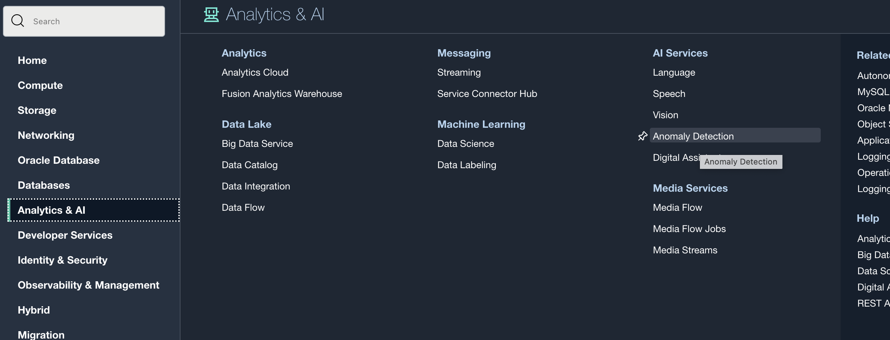
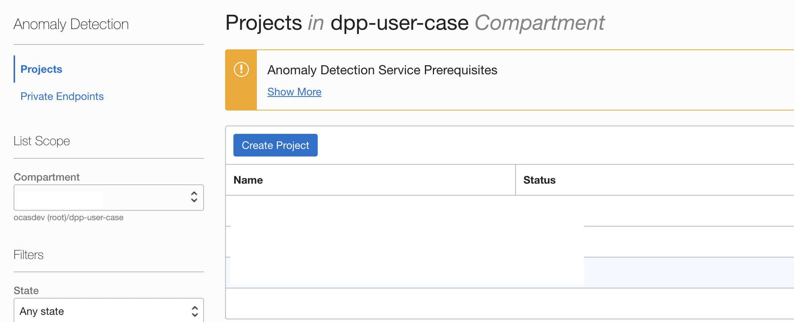

Lab 1: Configure Anomaly Detection
=================

On [OCI Conosole](https://cloud.oracle.com), go to AI Services → Anomaly Detection, 

and create a project there. Use the recommended default values for *FAP* and *Training fraction*.

Note the OCID of the project, which will be used in subsequent Labs.
