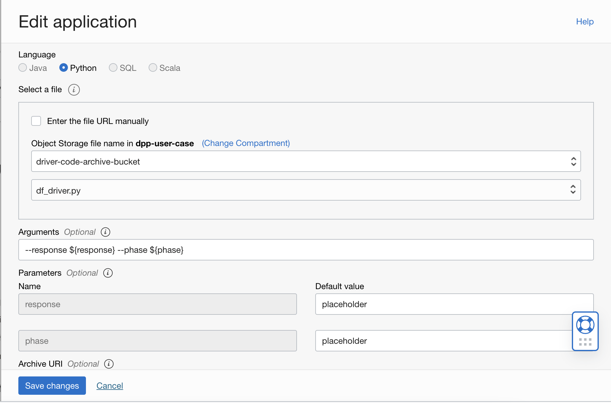

Lab 5: Setup Data Flow
===

Data Flow is OCI's cloud based Spark engine service, and we will mainly rely on Data Flow to process our data and conduct post processing steps. Choose the appropriate shape for the driver and executor nodes based on data size. Increasing the number of Executors will speed up the processing for large data sets, but for small scale data, most of the configs can be leave as default values, but you have to update the following ones:

*   At **Language** section, choose **Python**.
*   Select the driver code from your driver bucket.
*   At **Arguments**, simply input `--response ${response} --phase ${phase}`, and put **placeholder** as the default value. We will override it later
*   At **Archive URI**, put the oci path of your archive.zip. The structure of path is `oci://<bucket-name>@<namespace>/<path-to-archive.zip>`. Same below.
*   At **Application log location**, oci path of your logs-bucket. This is very useful for debugging when your application running is failed.