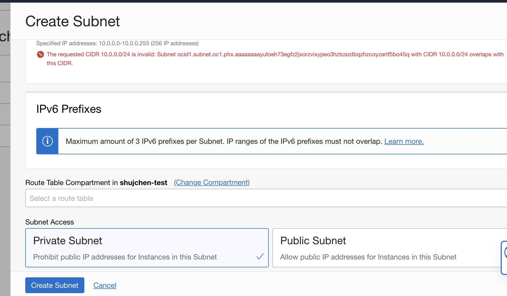
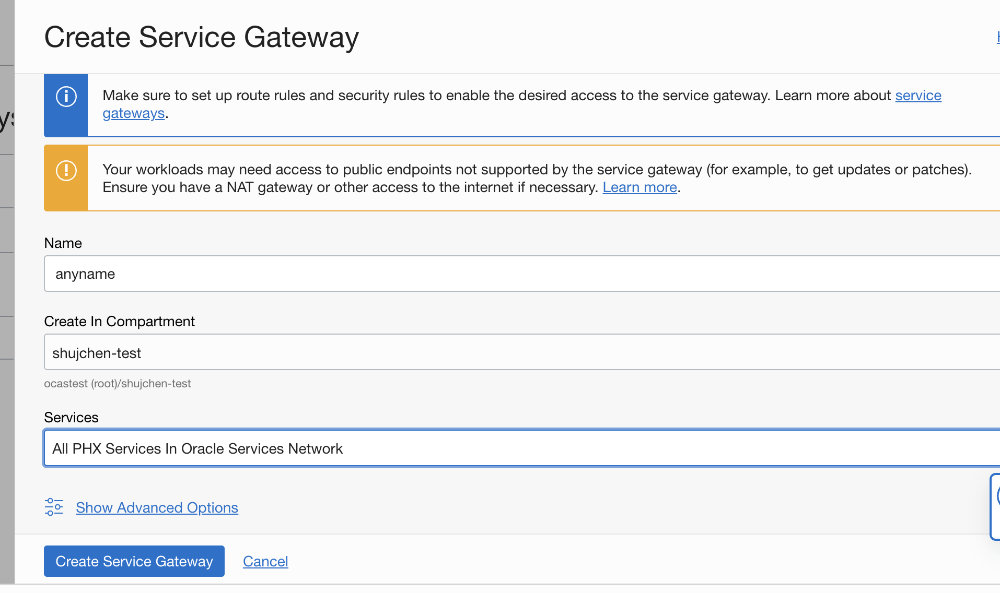
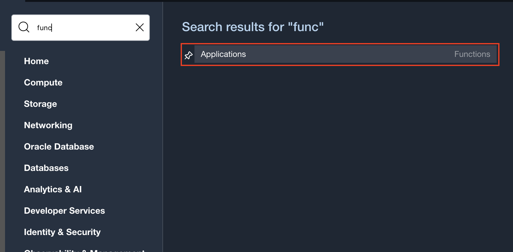
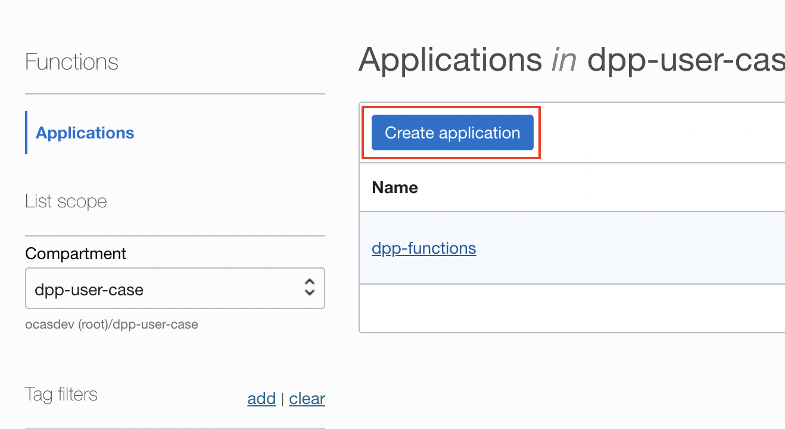
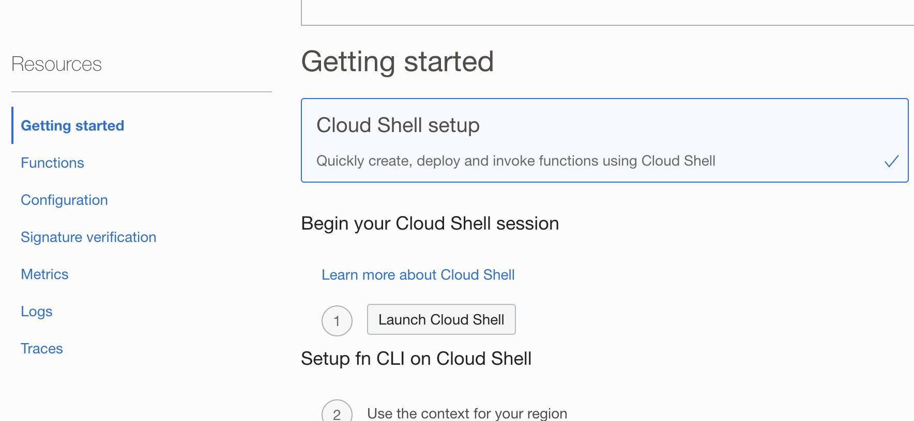
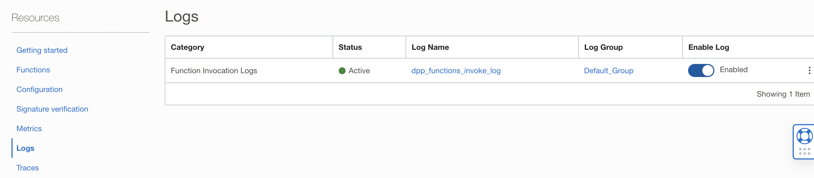

Lab 6: Configure OCI Functions
=== 

## 6.1 Setting Virtual Cloud Network

1.  Go to Virtual Cloud Network and create a **VCN**. For IPv4 CIDR Blocks, the recommended one **10.0.0.0/16** can be used:  
    
2.  Inside the generated VCN, create a **subnet**. For IPv4 CIDR Block, the recommended one **10.0.0.0/24** can be used. For Subnet Access, choose Private Subnet.  
    
3.  Under the VCN, create a **Service Gateway**. Remember to choose **ALL <Region> Services In Oracle Service Network** under Services:  
    
4.  Under the VCN, go to **Route Tables** and click on **Default Route Table for <vcn-name>**. Choose **Add Route Rules**. Choose **Service Gateway** as the Target Type, **ALL <Region> Services In Oracle Service Network** as Destination Service, and choose the Service Gateway created in the previous step as Target Service Gateway.  
    
    

## 6.2 Creating an OCI Function

Go to **Functions** → **Applications**, and Create an application below. Go to **Getting Started** and use **Cloud Shell setup**. Follow the instructions on the pad and deploy the demo function. Verify that it can be invoked successfully.







```
$ fn invoke <func-name> <app-name>
Hello, World!
```

## 6.3 Configuring OCI Function to invoke the Data Flow

Change the function body (func.py) to the content in the [link](https://github.com/bug-catcher/oci-data-science-ai-samples/blob/415e072962940f51dd811875386ddb2c728a3af8/ai_services/anomaly_detection/data_preprocessing_examples/oci_data_flow_based_examples/example_code/end_to_end_example/func.py).
Update the following lines
```
if bucketName == "<training_bucket_name>":
        config_bucket_name = "<training_config_bucket_name>"
        object_name = "<driver_config>.json"
        resp = get_object(namespace, config_bucket_name, object_name)
```
to replace <training_bucket_name> with **training-data-bucket**, <training_config_bucket_name> with **training-config-bucket**,"<driver_config>.json" with **training-config.json**. These are the values used in Lab 4 and Lab 5.

Update the following lines
```
    elif bucketName == "<inferencing_bucket_name>":
        config_bucket_name = "<inferencing_config_bucket_name>"
        object_name = "<driver_config>.json"
        resp = get_object(namespace, config_bucket_name, object_name)
```
to replace <inferencing_bucket_name> with **inferencinging-data-bucket**, <inferencing_config_bucket_name> with **inferencinging-config-bucket**,"<driver_config>.json" with **inferencing-config.json**. These are the values used in Lab 4 and Lab 5.

Update the following lines
```
create_run_details=oci.data_flow.models.CreateRunDetails(
            compartment_id="<compartment-ocid>",
            application_id="<application-ocid>",
            arguments=[ "--response", response, "--phase", phase],
            display_name="complete-dpp-test",
            logs_bucket_uri="oci://<bucket-name>@<namespace>/")
```
to replace <compartment-ocid> with the compartment of the DataFlow Application, <application-ocid> with the Application OCID and the logging bucket and namespace configured in Lab 4.


Also update requirements.txt to the following:

 Expand source

```
fdk>=0.1.46
oci>=2.2.18
```

Invoke the function to make sure the options were correctly configured, and publish it to an application. A run should succesfully get created for the Data Flow if everything was set up correctly.

Finally, enable the logs under the function for troubleshooting purpose.

