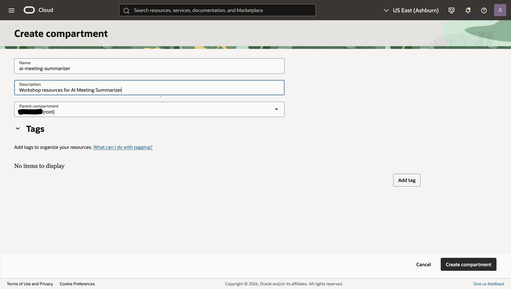
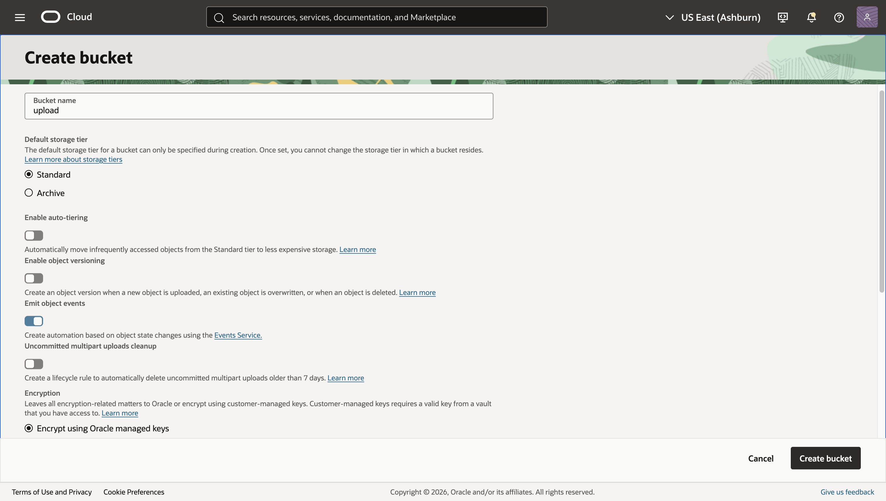
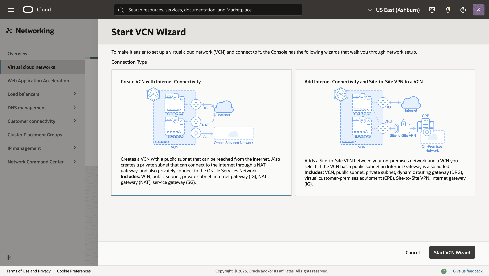
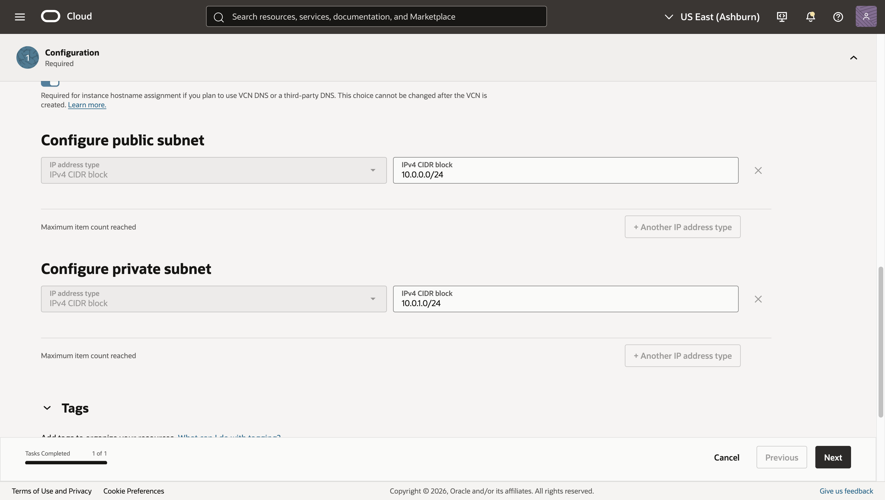
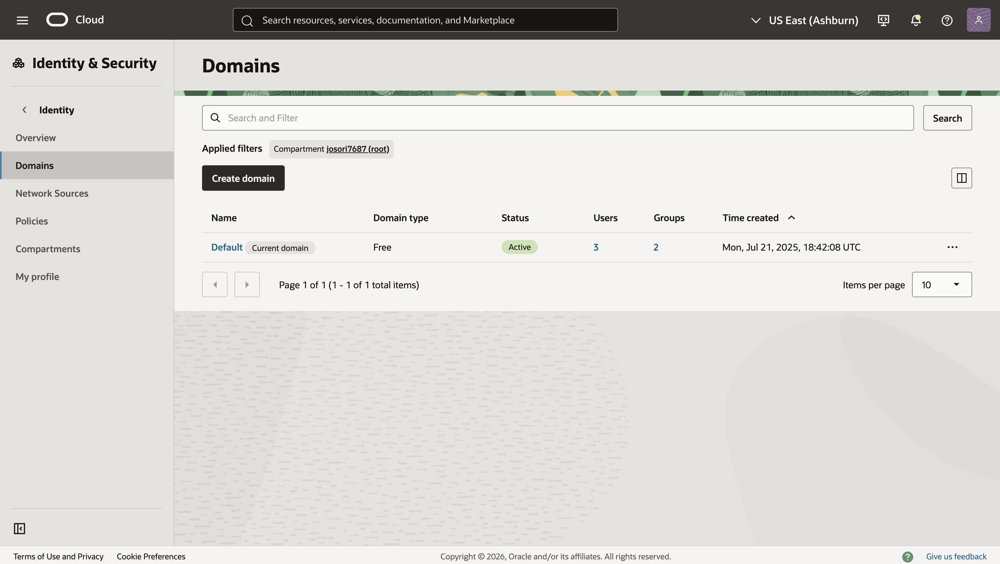
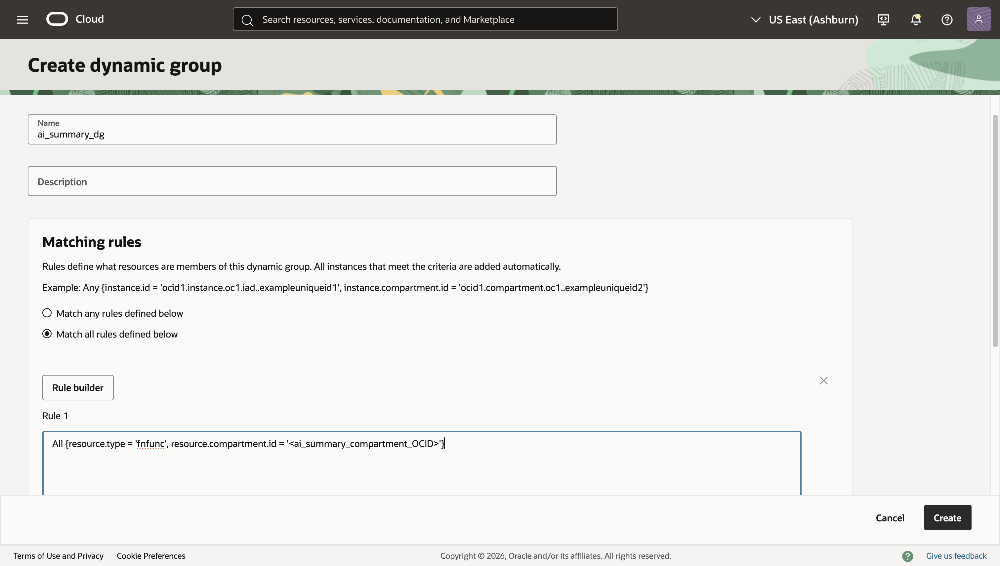
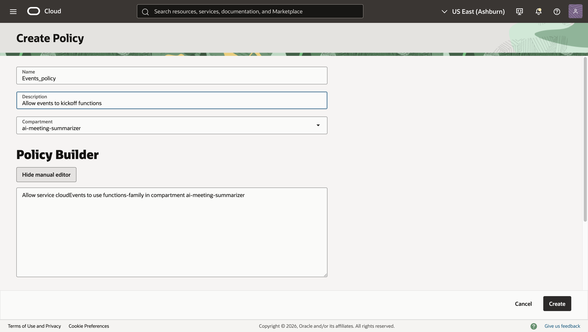
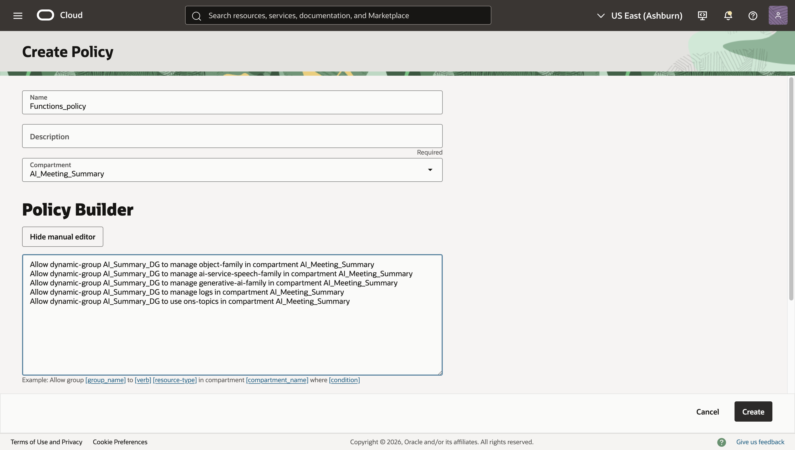

# Provision Necessary Resources

## Introduction

In this lab, you’ll prepare the foundation for the AI Meeting Summarizer workflow. You will create a dedicated compartment, three Object Storage buckets (uploads, transcripts, and results), networking dependencies, and policies. Creating these components will establish the foundations that the rest of the lab is built on.

Estimated Time: 20 minutes

### Objectives

In this lab, you will:

* Create a compartment for the workshop resources.
* Create private Object Storage buckets for uploads, transcripts, and results.
* Create networking dependencies i.e VCN, subnets, etc.
* Create policies to give instance principals access to resources.

### Prerequisites

This lab assumes you have:

* An Oracle Cloud account with permissions to create compartments, buckets, and Events.
* Familiarity with the OCI Console (helpful but not required).
* Region chosen for all resources (keep everything in the same region).

## Task 1: Create a compartment

1. In the OCI Console, open the navigation menu and go to **Identity & Security → Identity → Compartments**.

2. Click Create compartment.

3. Enter:

   * Name: ai-meeting-summarizer
   * Description: Workshop resources for AI Meeting Summarizer
   * Parent compartment: Your tenancy root or a suitable parent

4. Click Create compartment.

    

> Save the OCID of the compartment which can be found on the details page when clicking into the compartment. It will be used to later steps.

## Task 2: Create Object Storage buckets and enable events

Navigate to **Storage → Object Storage & Archive Storage → Buckets** where you will create three private buckets in the same region and namespace.

A. Upload bucket

1. Make sure you are in the ai-meeting-summarizer compartment you have just created.

2. Click Create bucket.

3. Enter:

   * Name: upload
   * Default storage tier: Standard
   * Emit object events: Toggle it on
   * Encryption: Use Oracle-managed keys (or choose a customer-managed key if required)

4. Click Create.

    

> If you cannot find the compartment, wait a couple of minutes and refresh as it can take time to provision

B. Transcripts Bucket

1. Follow the same steps as you did for the upload bucket, but instead replace the name with transcripts

C. Results bucket

1. Follow the same steps as you did for the previous buckets, but instead replace the name with results and keep emit object events off

> Note: Record your Object Storage namespace (visible at the top of Buckets page). You’ll use it in later labs.

## Task 3: Establish Networking

1. Navigate to **Networking → Virtual Cloud Networks → Actions → Start VCN Wizard**

   * Connection Type: Create VCN with Internet Connectivity

2. Click Start VCN Wizard

    

   * Name: ai-ms-vcn
   * IPv4 CIDR block: 10.0.0.0/16
   * Compartment: ai-meeting-summarizer
   * Configure public subnet IPv4 CIDR block: 10.0.0.0/24
   * Configure private subnet IPv4 CIDR block: 10.0.1.0/24

    

3. Click **Next → Create**.

## Task 4: Create Dynamic Group

1. Navigate to **Identity & Security → Identity → Domains**.

2. Change the compartment to your root compartment.

    

3. Click on **Default → Dynamic Groups → Create dynamic group**.

    * Name: ai_summary_dg
    * Matching rules: Match all rules defined below
    * Rule 1: All {resource.type = 'fnfunc', resource.compartment.id = '<ai_summary_compartment_OCID>'}

4. Click **Create**.

    

## Task 5: Create Policies

1. Navigate to **Identity & Security → Identity → Policies**.

2. Change the compartment to your AI meeting summarizer compartment using the applied filters button.

3. Click **Create Policy**

    * Name: Events_policy
    * Description: Allow events to kickoff functions
    * Compartment: ai-meeting-summarizer
    * Policy Builder (Show manual editor): Allow service cloudEvents to use functions-family in compartment ai-meeting-summarizer

4. Click **Create**

    

5. Now create another policy:

    * Name: Functions_policy
    * Description: Give functions access to object storage, ai speech, logs, topics and generative ai services.
    * Compartment: ai-meeting-summarizer
    * Policy Builder (Show manual editor):

        * Allow dynamic-group ai_summary_dg to manage object-family in compartment ai-meeting-summarizer
        * Allow dynamic-group ai_summary_dg to manage ai-service-speech-family in compartment ai-meeting-summarizer
        * Allow dynamic-group ai_summary_dg to manage generative-ai-family in compartment ai-meeting-summarizer
        * Allow dynamic-group ai_summary_dg to manage logs in compartment ai-meeting-summarizer
        * Allow dynamic-group ai_summary_dg to use ons-topics in compartment ai-meeting-summarizer

6. Click **Create**

    

You may now **proceed to the next lab**.

## Acknowledgements

* **Author** - **Josiah Oriendo**, Cloud Architect
* **Last Updated By/Date** - **Josiah Oriendo**, March 2026
