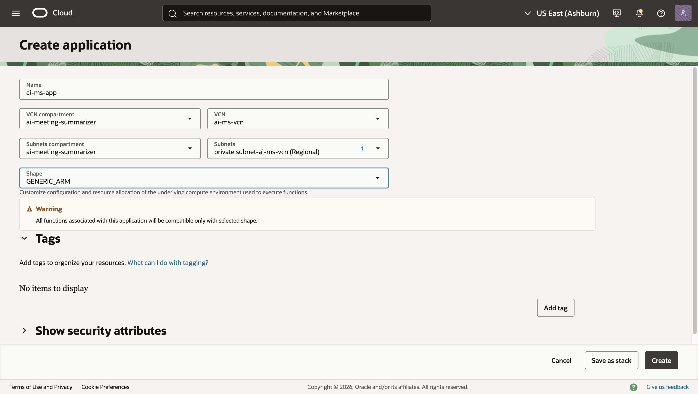
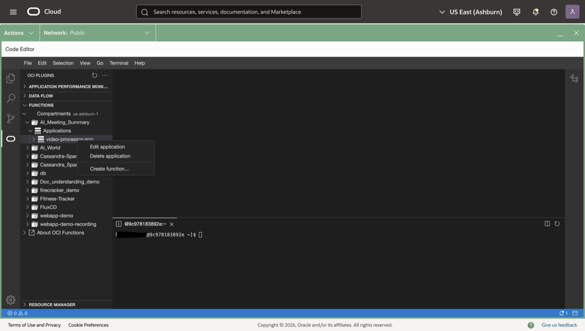
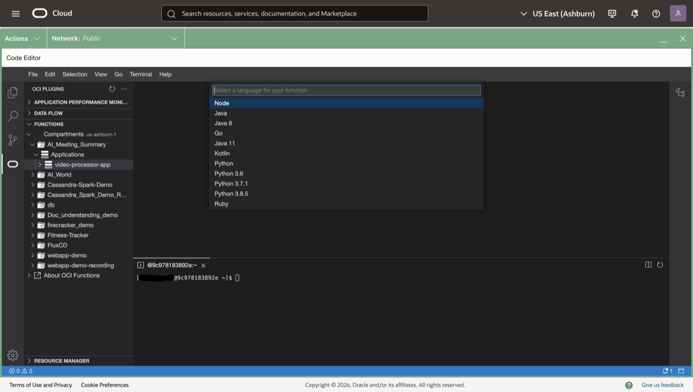
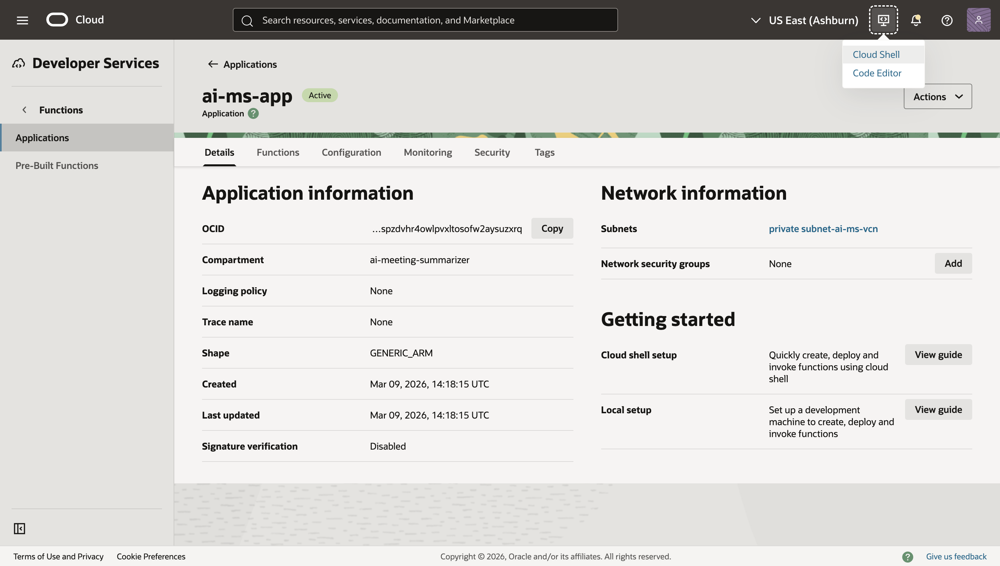
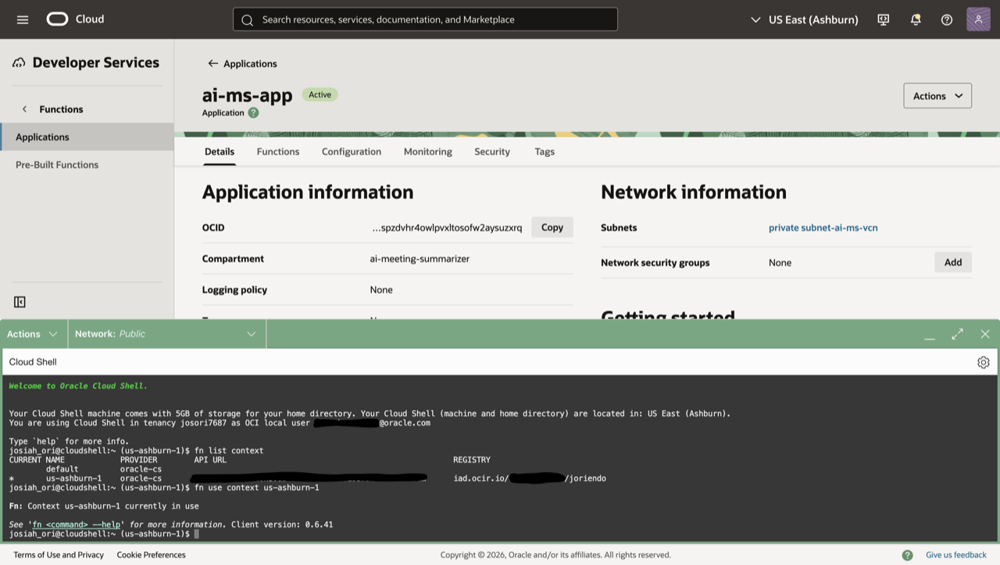
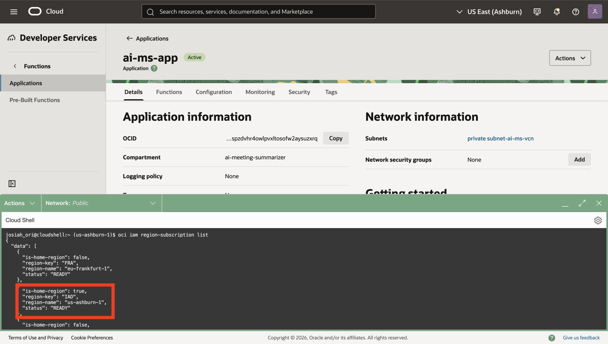
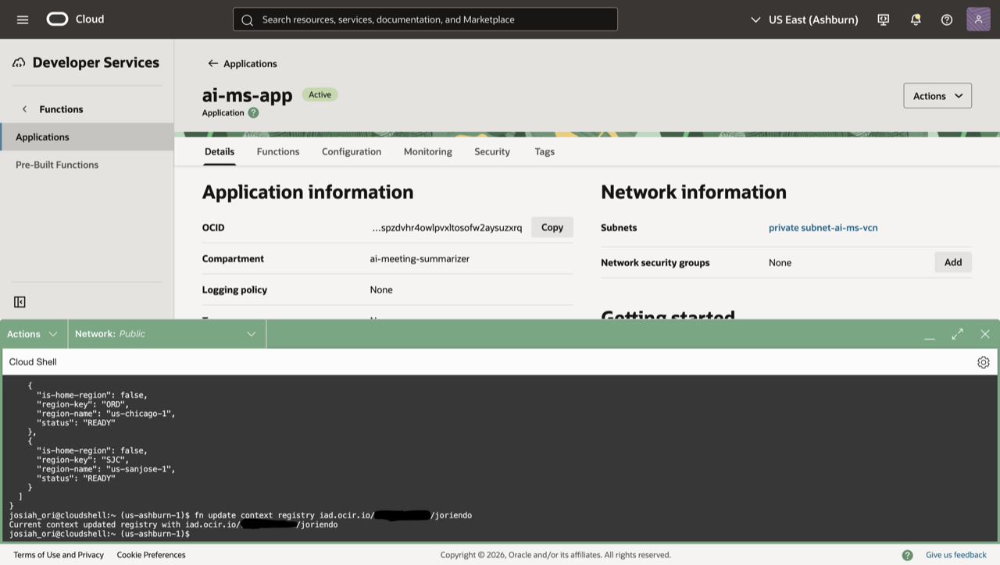
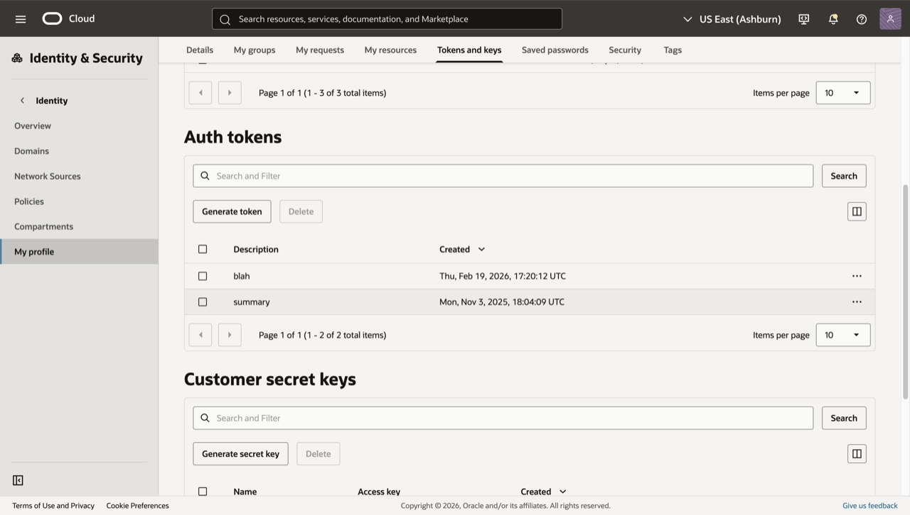

# Deploy Functions

## Introduction

This lab walks you through creating an OCI Functions application, deploying two Python functions (Transcribe and Summary), and configuring the required environment variables.

Estimated Time: 30–45 minutes

### Objectives

In this lab, you will:

- Create a Functions application
- Initialize, build, and deploy the Transcribe and Summary Python functions

### Prerequisites

This lab assumes you have:

- Access to OCI Cloud Shell or a local development environment
- Permissions to create Functions, attach policies, and publish to Notifications

## Task 1: Create a Functions application

1. Navigate to **Developer Services → Functions → Applications → Create application**

2. Enter:

   - Name: ai-ms-app
   - VCN Compartment: ai-meeting-summarizer
   - VCN: ai-ms-vcn
   - Subnets Compartment: ai-meeting-summarizer
   - Subnet: ai-ms-private-subnet (Private)
   - Shape: GENERIC\_ARM

3. Click **Create**



## Task 2: Create Transcribe Function

1. If not already open, enter the application you just created and navigate to **Functions → Create in code editor**

2. Once the editor loads, the application folder should automatically open on the left-hand side. Follow these steps to locate the correct folders (otherwise, skip to step 3):

   - On the left-hand side, locate your compartments and select the compartment where you created the function
   - Expand the **Applications** dropdown to view your application

3. Right-click the application and select **Create function → Create from a template → Python**






4. Enter **transcriber** as your function name and press Enter. A new function will appear under your application.

5. Edit the `func.yaml` file to match the following, where `&lt;function-name&gt;` is replaced with your actual function name:

   ```yaml
   schema_version: 20180708
   name: &lt;function-name&gt;
   version: 0.0.1
   runtime: python
   entrypoint: /python/bin/fdk /function/func.py handler
   memory: 256
   timeout: 300
   ```

6. Edit the requirements.txt file by selecting the file and making sure it reflects the below information:

   ```text
   fdk
   oci
   ```

7. Edit the func.py file by replacing its contents with the following Python code:

   ```python
   import io
   import json
   import os
   import logging
   import oci
   from fdk import response

   # Set up logging
   logger = logging.getLogger()
   logger.setLevel(logging.INFO)

   def handler(ctx, data: io.BytesIO = None):
      """
      Transcribe Function: Triggered when video/audio files are uploaded to the bucket.
      Creates a transcription job using OCI AI Speech service.
      """
      logger.info("Inside Transcribe Function")
      try:
         raw_body = data.getvalue()
         logger.info(f"Raw body: {raw_body}")
         body = json.loads(raw_body)

         namespace = body["data"]["additionalDetails"]["namespace"]
         bucket_name = body["data"]["additionalDetails"]["bucketName"]
         resource_name = body["data"]["resourceName"]
         compartment_id = body["data"]["compartmentId"]

         logger.info(f"Namespace: {namespace}")
         logger.info(f"Bucket Name: {bucket_name}")
         logger.info(f"Resource Name: {resource_name}")
         logger.info(f"Compartment Id: {compartment_id}")

      except (Exception, ValueError) as ex:
         logger.error(f"Error parsing json payload: {str(ex)}")
         return response.Response(
               ctx,
               response_data=json.dumps({"error": f"Error parsing Event json payload: {str(ex)}"}),
               headers={"Content-Type": "application/json"},
               status_code=400
         )

      # Get target bucket from configuration
      try:
         cfg = ctx.Config()
         target_bucket = cfg.get("RESULT_BUCKET")
         # If the target_bucket is not configured then the source bucket will be used
         if target_bucket is None:
               target_bucket = bucket_name
               logger.info(f"RESULT_BUCKET not configured, using source bucket: {bucket_name}")
         else:
               logger.info(f"Using target bucket: {target_bucket}")
      except Exception as ex:
         logger.error(f"ERROR: Missing configuration keys: {str(ex)}")
         target_bucket = bucket_name

      try:
         signer = oci.auth.signers.get_resource_principals_signer()
         ai_speech_client = oci.ai_speech.AIServiceSpeechClient(config={}, signer=signer)

         # CRITICAL: Create a sanitized display name (remove invalid characters)
         # The displayName must contain only alphanumerics, dashes, or underscores
         base_name = os.path.basename(resource_name)
         base_id = os.path.splitext(base_name)[0]  # Remove file extension
         # Replace any invalid characters (spaces, dots, etc.) with underscores
         clean_id = ''.join(c if c.isalnum() or c in '-_' else '_' for c in base_id)
         display_name = f"Transcription_{clean_id}"

         logger.info(f"Creating transcription job with display name: {display_name}")

         create_transcription_job_response = ai_speech_client.create_transcription_job(
               create_transcription_job_details=oci.ai_speech.models.CreateTranscriptionJobDetails(
                  display_name=display_name,  # REQUIRED: Must be alphanumeric, dashes, or underscores only
                  compartment_id=compartment_id,
                  input_location=oci.ai_speech.models.ObjectListInlineInputLocation(
                     location_type="OBJECT_LIST_INLINE_INPUT_LOCATION",
                     object_locations=[
                           oci.ai_speech.models.ObjectLocation(
                              namespace_name=namespace,
                              bucket_name=bucket_name,
                              object_names=[resource_name]
                           )
                     ]
                  ),
                  output_location=oci.ai_speech.models.OutputLocation(
                     namespace_name=namespace,
                     bucket_name=target_bucket,
                     prefix=f"transcriptions/{base_name}/"  # Organize by original filename
                  ),
                  normalization=oci.ai_speech.models.TranscriptionNormalization(
                     is_punctuation_enabled=True,  # Changed to True for better readability
                     filters=[
                           oci.ai_speech.models.ProfanityTranscriptionFilter(
                              type="PROFANITY",
                              mode="MASK"
                           )
                     ]
                  )
               )
         )

         job_id = create_transcription_job_response.data.id
         logger.info(f"Transcription job created successfully with ID: {job_id}")

         logger.info("Transcribe Function Completed")
         return response.Response(
               ctx,
               response_data=json.dumps({
                  "message": "Transcription job created successfully",
                  "jobId": job_id,
                  "displayName": display_name,
                  "resourceName": resource_name
               }),
               headers={"Content-Type": "application/json"}
         )

      except Exception as ex:
         logger.error(f"Error creating transcription job: {str(ex)}")
         return response.Response(
               ctx,
               response_data=json.dumps({
                  "error": f"Error creating transcription job: {str(ex)}"
               }),
               headers={"Content-Type": "application/json"},
               status_code=500
         )
   ```

## Task 3: Setup fn CLI & Deploy Transcriber

1. Return to the OCI Console and open up the Cloud Shell by clicking on the computer icon in the top right corner.

   

2. Navigate to the directory of your new function in the terminal:

   ```text
   cd oci-ide-plugins/
   cd faas-artifacts/
   cd &lt;app-OCID&gt;
   cd &lt;function-name&gt;
   ```

3. Using the cloud shell, set the context for your region, by running the first command and taking the information under default that aligns with your current region. Then use that information to replace \<region> in the second command:

   ```text
   fn list context
   fn use context &lt;region&gt;
   ```

   

4. Update the context with the function's compartment ID which can be found on the details page of the compartment you created in the beginning:

   ```text
   fn update context oracle.compartment-id &lt;compartment\_OCID&gt;
   ```

5. Provide a unique repository name prefix to distinguish your function images from other people’s. Get the object storage namespace by looking at the details of any of the buckets you created prior, and the repo name is up to your own discretion. For the region key in the second command, run the first command below and in the dictionary where the "is-home-region" value is true, use the region key below it with all lowercase:

   ```text
   oci iam region-subscription list
   fn update context registry &lt;region-key&gt;.ocir.io/&lt;object\_storage\_namespace&gt;/[repo-name-prefix]
   ```

   
   

6. In a new tab, navigate to your **OCI Console → Profile → Tokens and keys → Auth tokens → Generate token**.

   

7. Give the token a name and then make sure to save this token for use in function deployment as it will not be shown again.

8. Return to your tab with the code editor and in the terminal you have been working in log into the registry using the auth token as your password when prompted following this command. Use the email that is tied to your oracle cloud account, and the region key and object storage namespace you retrieved previously.

   ```text
   docker login -u '&lt;object\_storage\_namespace&gt;/&lt;email&gt;' &lt;region-key&gt;.ocir.io
   ```

9. Deploy the transcribe function:

   ```text
   fn -v deploy --app &lt;app\_name&gt;
   ```

## Task 4: Deploy the Summary Function

1. Return to the code editor and create a new function called summarizer, following the same process you did for task 2 and 3

2. When you get to the point where you need to edit the func.py file, instead of using the code from the transcriber, use this:

   ```python
   import io
   import json
   import os
   import logging
   import oci
   from fdk import response

   # Set up logging
   logger = logging.getLogger()
   logger.setLevel(logging.INFO)


   def handler(ctx, data: io.BytesIO = None):
      """
      Summary Function: Triggered when transcription JSON files are created.
      Reads the transcript and generates a summary using OCI Generative AI.
      Uses on-demand inferencing with model OCID.
      """
      logger.info("Inside Summary Function")

      # Get configuration - for on-demand inferencing, we need model OCID and region endpoint
      try:
         cfg = ctx.Config()
         model_id = cfg.get("GENAI_MODEL_ID")  # Your model OCID
         region = cfg.get("OCI_REGION", "us-ashburn-1")
         summary_bucket = cfg.get("SUMMARY_BUCKET")
         topic_ocid = cfg.get("ONS_TOPIC_OCID")  # ONS Topic for email

         # Build endpoint from region for on-demand inferencing
         endpoint = f"https://inference.generativeai.{region}.oci.oraclecloud.com"

         if not model_id:
               raise ValueError("GENAI_MODEL_ID configuration is required (model OCID)")
         if not summary_bucket:
               raise ValueError("SUMMARY_BUCKET configuration is required")
         if not topic_ocid:
               logger.warning("ONS_TOPIC_OCID not configured - email notification will be skipped")

         logger.info(f"Using Model OCID: {model_id}")
         logger.info(f"Using Region: {region}")
         logger.info(f"Using Endpoint: {endpoint}")
         logger.info(f"Saving summary to bucket: {summary_bucket}")
         if topic_ocid:
               logger.info(f"Email notifications enabled with topic: {topic_ocid}")

      except Exception as ex:
         logger.error(f"ERROR: Missing configuration keys: {str(ex)}")
         return response.Response(
               ctx,
               response_data=json.dumps({"error": "Missing required configuration"}),
               headers={"Content-Type": "application/json"},
               status_code=500
         )

      # Parse event
      try:
         raw_body = data.getvalue()
         logger.info(f"Raw body: {raw_body}")
         body = json.loads(raw_body)

         namespace = body["data"]["additionalDetails"]["namespace"]
         bucket_name = body["data"]["additionalDetails"]["bucketName"]
         resource_name = body["data"]["resourceName"]
         compartment_id = body["data"]["compartmentId"]

         # Skip non-JSON files (e.g., .srt files)
         if not resource_name.endswith('.json'):
               logger.info(f"Skipping non-JSON file: {resource_name}")
               return response.Response(
                  ctx,
                  response_data=json.dumps({"message": "Skipped non-JSON file"}),
                  headers={"Content-Type": "application/json"}
               )

         logger.info(f"Namespace: {namespace}")
         logger.info(f"Source Bucket Name: {bucket_name}")
         logger.info(f"Resource Name: {resource_name}")
         logger.info(f"Compartment Id: {compartment_id}")

      except (Exception, ValueError) as ex:
         logger.error(f"Error parsing json payload: {str(ex)}")
         return response.Response(
               ctx,
               response_data=json.dumps({"error": f"Error parsing Event json payload: {str(ex)}"}),
               headers={"Content-Type": "application/json"},
               status_code=400
         )

      try:
         # Initialize OCI clients
         signer = oci.auth.signers.get_resource_principals_signer()
         object_storage_client = oci.object_storage.ObjectStorageClient(config={}, signer=signer)

         # Read the transcription JSON file
         logger.info("Fetching transcription file from Object Storage...")
         get_object_response = object_storage_client.get_object(
               namespace_name=namespace,
               bucket_name=bucket_name,
               object_name=resource_name
         )

         transcribed_text = get_object_response.data.text
         json_text = json.loads(transcribed_text)

         # Extract transcript from JSON (handle different formats)
         transcription = None
         if "transcriptions" in json_text and json_text["transcriptions"]:
               transcription = json_text["transcriptions"][0].get("transcription")
         elif "transcripts" in json_text and json_text["transcripts"]:
               transcription = json_text["transcripts"][0].get("transcript")

         if not transcription:
               raise ValueError("Could not extract transcription from JSON")

         logger.info(f"Transcription extracted: {len(transcription)} characters")

         # Build the System Message (Instructions for the LLM)
         system_prompt = (
            "Act as an expert Executive Assistant, Professional Scribe, and Oracle Sales Representative. Work strictly from the transcript; do not invent facts. "
            "If a detail is missing, write 'Unknown'. Preserve vague timing exactly as stated (e.g., 'next week'). "
            "If speakers are unlabeled, use context to assign descriptive labels (e.g., 'Speaker 1 (likely Project Manager)'). "
            "Return the output in plain text (no Markdown, no emojis) using EXACTLY the sections and formatting below.\n\n"
            "MEETING SUMMARY\n"
            "- Executive Summary: 3–5 sentences covering context, goals, and major outcomes.\n"
            "- Primary Purpose/Goal: &lt;one concise sentence&gt;\n\n"
            "ACTION ITEMS (HIGH PRIORITY)\n"
            "[Party A / My Company]\n"
            "- List every actionable task as a checklist line using this exact format:\n"
            " [ ] Owner: &lt;Name&gt;; Task: &lt;What to do&gt;; Due: &lt;Date or 'Unknown'&gt;\n"
            "[Party B / The Client / Vendor]\n"
            "- Use the same checklist format:\n"
            " [ ] Owner: &lt;Name&gt;; Task: &lt;What to do&gt;; Due: &lt;Date or 'Unknown'&gt;\n\n"
            "KEY DECISIONS MADE\n"
            "- List each agreement, approval, or decision. Include any dates, metrics, quantities, or versions mentioned.\n\n"
            "DETAILED NOTES (BY TOPIC)\n"
            "- Organize by topic, not chronology. For each topic, use:\n"
            " Topic: &lt;Topic Name&gt;\n"
            " - Bullet points capturing key details, including numbers/metrics, dates, technical specifications, risks/concerns, and objections.\n"
            " - Attribute comments to speakers when clear (e.g., 'Speaker 2 (CTO): ...').\n\n"
            "UNRESOLVED ISSUES / PARKING LOT\n"
            "- Questions asked but not answered\n"
            "- Items deferred to a future discussion\n\n"
            "DEAL ADVANCEMENT PLAN (SALES REP VIEW)\n"
            "- Qualification Snapshot (what is known): Budget: &lt;value or 'Unknown'&gt;; Authority/Decision Process: &lt;details&gt;; Need/Metrics: &lt;KPIs&gt;; Timeline/Compelling Event: &lt;dates&gt;\n"
            "- Risks/Objections → Mitigations: &lt;brief bullets aligned to enterprise security, privacy, and compliance&gt;\n"
            "- Mutual Next Steps / Close Plan: Step, Owner, Target Date (e.g., security review, pilot scope, success criteria, commercials, procurement/legal)\n\n"
            "FOLLOW-UP EMAIL DRAFT (PLAIN TEXT)\n"
            "- A short customer-facing note summarizing value, decisions, and confirmed next steps with dates\n\n"
            "Formatting rules:\n"
            "- Plain text only. Use '- ' for bullets and the checklist format shown. Do not use special symbols beyond standard ASCII.\n"
            "- Be objective, concise, and faithful to the transcript. Mark unknown items as 'Unknown'.\n"
         )

         # Build the User Message (The data to be summarized)
         user_prompt = f"Run it on this:\n\n{transcription}"

         # Initialize Generative AI client with region endpoint
         generative_ai_client = oci.generative_ai_inference.GenerativeAiInferenceClient(
               config={},
               signer=signer,
               service_endpoint=endpoint
         )

         logger.info("Generating summary with Generative AI (on-demand) using CHAT API...")

         # Define the System Message object (Role=SYSTEM)
         system_content = oci.generative_ai_inference.models.TextContent(text=system_prompt)
         system_message = oci.generative_ai_inference.models.Message(
               role="SYSTEM",
               content=[system_content]
         )

         # Define the User Message
         user_content = oci.generative_ai_inference.models.TextContent(text=user_prompt)
         user_message = oci.generative_ai_inference.models.Message(
               role="USER",
               content=[user_content]
         )

         messages = [system_message, user_message]

         # Define the Chat Request parameters
         chat_request = oci.generative_ai_inference.models.GenericChatRequest(
               messages=messages,
               max_tokens=800,
               temperature=0.3,
               top_p=0.9,
               frequency_penalty=0.0,
               presence_penalty=0.0
         )

         # Define the main Chat Details object
         chat_details = oci.generative_ai_inference.models.ChatDetails(
               compartment_id=compartment_id,
               serving_mode=oci.generative_ai_inference.models.OnDemandServingMode(
                  model_id=model_id
               ),
               chat_request=chat_request,
         )

         # Make the Chat API call
         chat_response = generative_ai_client.chat(chat_details)

         # Extract the generated text from the Chat API response
         summary = chat_response.data.chat_response.choices[0].message.content[0].text

         logger.info("Summary generated successfully")
         logger.info(f"Summary length: {len(summary)} characters")

         # Save summary to Object Storage
         original_name = os.path.basename(resource_name)
         parts = resource_name.split('/')
         if len(parts) >= 2:
               video_name = parts[1]
         else:
               video_name = original_name

         base_name = os.path.splitext(video_name)[0]
         summary_key = f"summaries/{base_name}_summary.txt"

         object_storage_client.put_object(
               namespace_name=namespace,
               bucket_name=summary_bucket,
               object_name=summary_key,
               put_object_body=summary.encode('utf-8')
         )

         logger.info(f"Summary saved to: {summary_key} in bucket {summary_bucket}")

         # Send email notification if topic is configured
         if topic_ocid:
               try:
                  logger.info("Sending email notification...")
                  send_email_via_notifications(
                     signer=signer,
                     region=region,
                     topic_ocid=topic_ocid,
                     subject=f"Meeting Summary: {base_name}",
                     body=summary,
                     summary_location=f"{summary_bucket}/{summary_key}"
                  )
                  logger.info("Email notification sent successfully")
               except Exception as email_ex:
                  logger.error(f"Failed to send email notification: {str(email_ex)}")
                  # Don't fail the whole function if email fails

         logger.info("Summary Function Completed")

         return response.Response(
               ctx,
               response_data=json.dumps({
                  "message": "Summarization completed successfully",
                  "summaryLocation": summary_key,
                  "summaryBucket": summary_bucket,
                  "summaryLength": len(summary),
                  "transcriptionLength": len(transcription),
                  "emailSent": topic_ocid is not None
               }),
               headers={"Content-Type": "application/json"}
         )

      except Exception as ex:
         logger.error(f"Error in summarization: {str(ex)}")
         import traceback
         traceback.print_exc()
         return response.Response(
               ctx,
               response_data=json.dumps({
                  "error": f"Error in summarization: {str(ex)}"
               }),
               headers={"Content-Type": "application/json"},
               status_code=500
         )


   def send_email_via_notifications(signer, region, topic_ocid, subject, body, summary_location):
      """
      Send email notification via OCI Notifications Service
      """
      try:
         # Initialize ONS client
         ons_client = oci.ons.NotificationDataPlaneClient(
               config={"region": region},
               signer=signer
         )

         # Format the email body with location info
         email_body = f"""
   Meeting Summary Generated
   ========================

   {body}

   ========================
   Full summary saved to: {summary_location}

   This is an automated notification from the AI Meeting Summary system.
   """

         # Create message details
         message_details = oci.ons.models.MessageDetails(
               title=subject,
               body=email_body[:64000]  # ONS limit is ~64KB, truncate if needed
         )

         # Publish message to topic
         publish_response = ons_client.publish_message(
               topic_id=topic_ocid,
               message_details=message_details
         )

         logger.info(f"Email published to ONS topic. Message ID: {publish_response.data.message_id}")
         return publish_response

      except Exception as e:
         logger.error(f"Error sending email via ONS: {str(e)}")
         raise
   ```

You may now **proceed to the next lab**.

## Learn More

- OCI Functions: https://docs.oracle.com/iaas/Content/Functions/Concepts/functionsoverview.htm

## Acknowledgements

- **Author** - **Josiah Oriendo**, Cloud Architect
- **Last Updated By/Date** - Josiah Oriendo, February 2026
