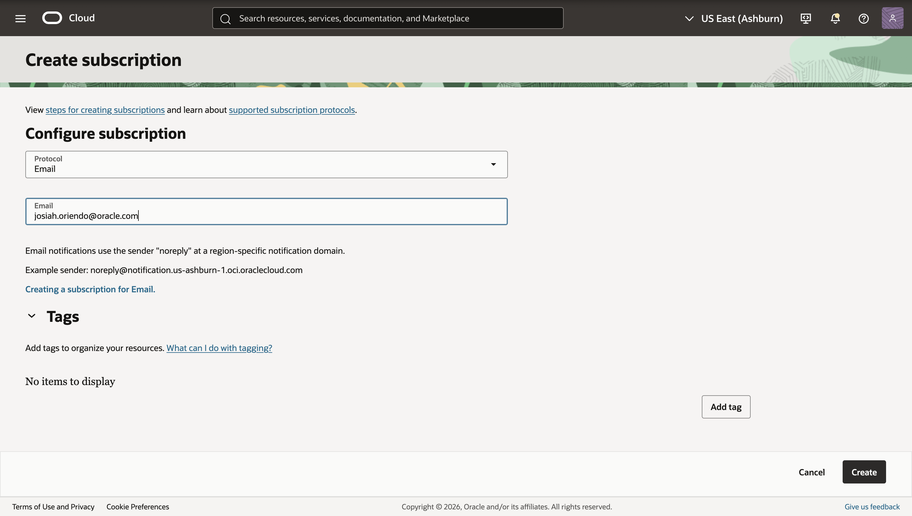
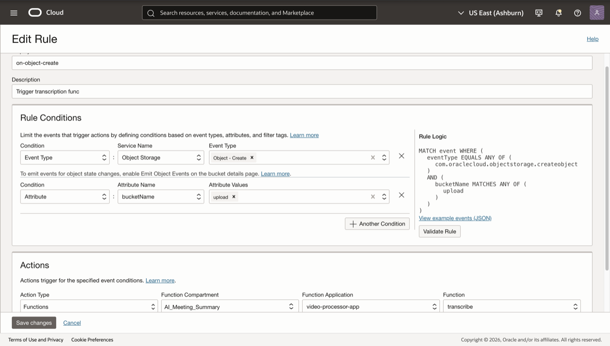
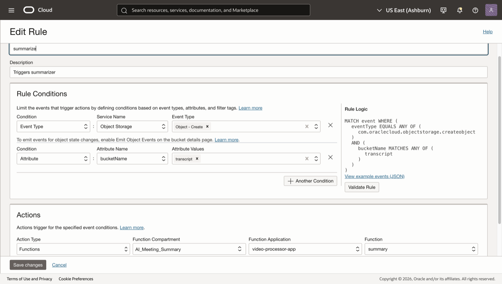
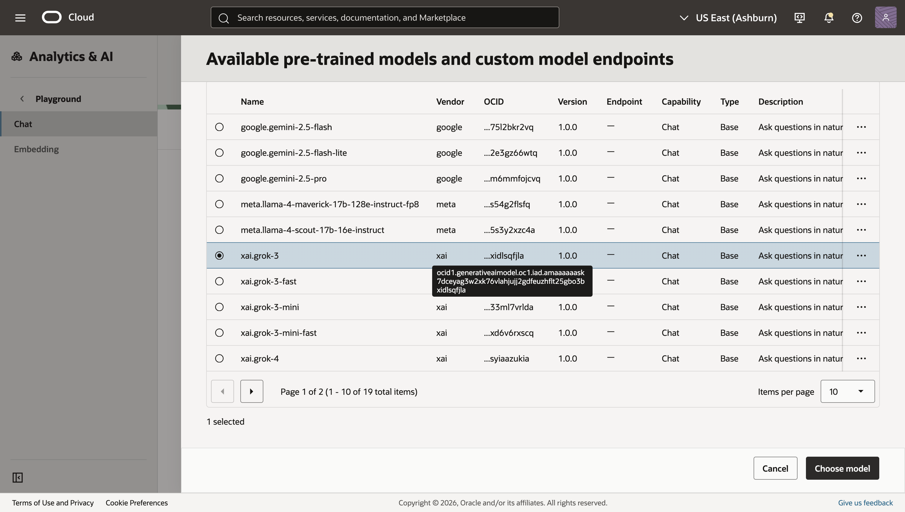
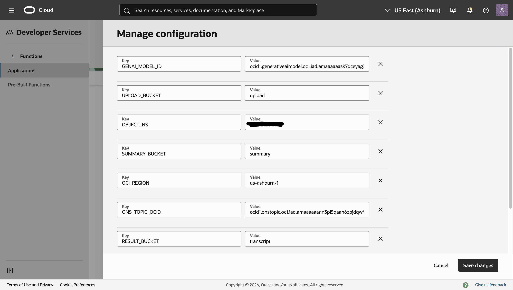
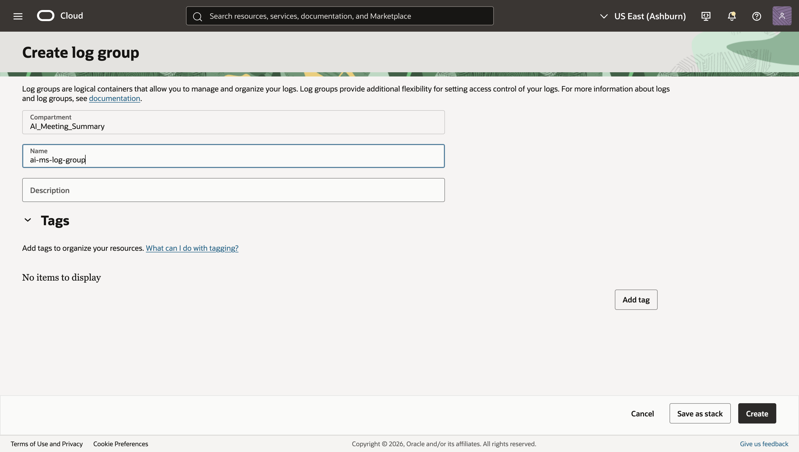
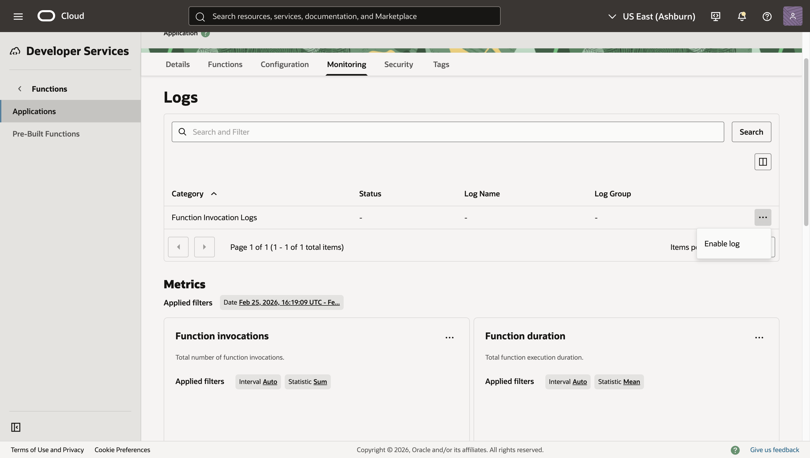
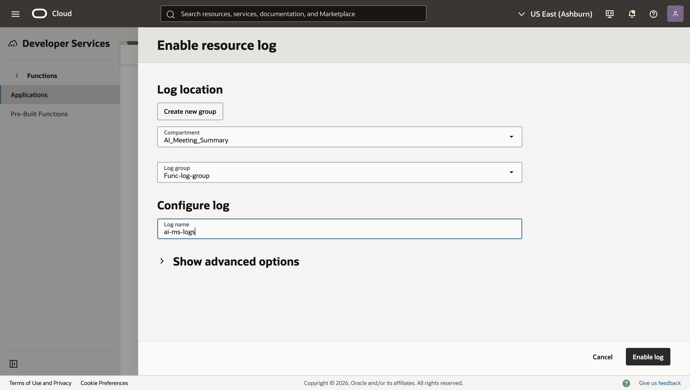

# Configure Events, Function Configuration, Logging, and Email Notifications

## Introduction

This lab wires your deployment together. You will configure application/function variables, attach an Events rule so uploads trigger the Transcribe Function and in turn the summary function, create a Notifications topic and email subscription, and enable function logs for troubleshooting.

Estimated Time: 20–30 minutes

### Objectives

In this lab, you will:

- Set application and function configuration keys (region, namespace, buckets, model OCID, topic OCID)
- Create a Notifications topic and email subscription
- Attach the Events rule to trigger the Transcribe Function on object creation
- Enable a Log Group and function logs

### Prerequisites

This lab assumes you have:

- Permissions to access Functions and the GenAI service, and publish to Notifications.

## Task 1: Create a Notifications topic and email subscription

You will publish summaries to this topic; subscribers receive an email.

1. Navigate to **Developer Services → Application Integration → Notifications → Topics → Create Topic**.

   - Name: ai-ms-topic
   - Compartment: ai-meeting-summarizer

2. Click create.

    

3. Click on the topic you just created **→ Subscriptions → Create Subscription**.

   - Protocol: Email
   - Email: &lt;your_email@domain&gt;

4. Click create.

    

5. Check your inbox, and click Confirm subscription.

6. Copy the Topic OCID from the topic’s Details page, it will be needed later in the lab.

## Task 2: Attach the Events rule to the Transcribe Function

Ensure new uploads trigger the transcriber function.

1. Navigate to **Observability & Management → Events Service → Rules → Create Rule**.

   - Name: on-object-create
   - Description: Trigger transcription func
   - Rule conditions: Condition: Event Type, Service Name: Object Storage, Event Type: Object - Create
   - (Click +Another Condition)Rule conditions: Condition: Attribute, Attribute Name: bucketName, Attribute Values: uploads
   - Actions: Action Type: Functions, Function Compartment: ai-meeting-summarizer, Function Application: ai-ms-app, Function: transcriber

2. Click Create Rule.

    

3. Create a second rule with the following information:

   - Name: summarize
   - Description: Trigger summarization func
   - Rule conditions: Condition: Event Type, Service Name: Object Storage, Event Type: Object - Create
   - (Click +Another Condition)Rule conditions: Condition: Attribute, Attribute Name: bucketName, Attribute Values: transcripts
   - Actions: Action Type: Functions, Function Compartment: ai-meeting-summarizer, Function Application: ai-ms-app, Function: summarizer

    

## Task 3: Configure application-level variables

1. Navigate to **Analytics & AI → AI Services → Generative AI → Playground → Chat → View model details**.

2. Select the xai.grok-3 model, and Copy the OCID and store that for later use.

    

3. Navigate to **Developer Services → Functions → Applications → ai-ms-app → Configuration → Manage configuration**.

4. Click on Add configuration for every key, value pair below

   - Key: GENAI\_MODEL\_ID, Value: &lt;your-text&gt;
   - Key: UPLOAD_BUCKET, Value: uploads
   - Key: OBJECT_NS, Value: &lt;object_storage_namespace&gt;
   - Key: SUMMARY_BUCKET, Value: results
   - Key: OCI_REGION, Value: us-ashburn-1
   - Key: ONS\_TOPIC\_OCID, Value: &lt;topic_OCID&gt;
   - Key: RESULT_BUCKET, Value: transcripts
   - Key: COMPARTMENT_OCID, Value: &lt;ai-meeting-summarizer-OCID&gt;

    

5. Click Save changes.

## Task 4: Enable logging for both functions

Create a Log Group and enable function logs for observability.

1. Navigate to **Observability & Management → Logging → Log Groups → Create Log Group**.
   - Name: ai-ms-log-group
   - Compartment: ai-meeting-summarizer
   - Create.

    

2. Navigate to **Developer Services → Functions → Applications → ai-ms-app → Monitoring**.

3. Under Logs in the Function Invocation Logs line click the 3 dots and select Enable log

    

   - Compartment: ai-meeting-summarizer
   - Log group: ai-ms-log-group
   - Log name: ai-ms-logs

    

You may now **proceed to the next lab**.

## Learn More

- Notifications: https://docs.oracle.com/iaas/Content/Notification/home.htm
- Events: https://docs.oracle.com/iaas/Content/Events/Concepts/eventsoverview.htm
- Logging: https://docs.oracle.com/iaas/Content/Logging/Concepts/loggingoverview.htm

## Acknowledgements

- **Author** - **Josiah Oriendo**, Cloud Architect
- **Last Updated By/Date** - Josiah Oriendo, February 2026
