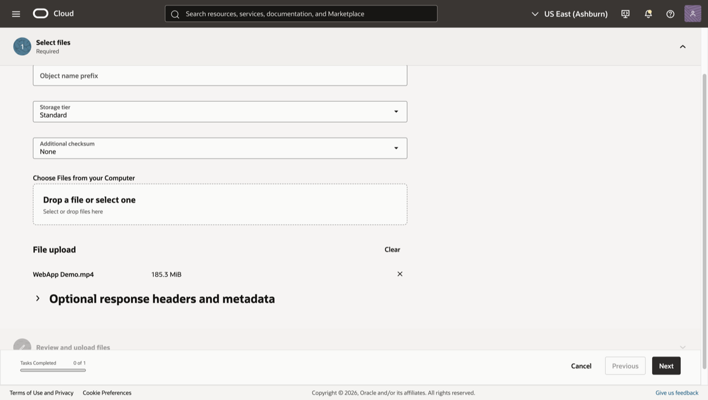
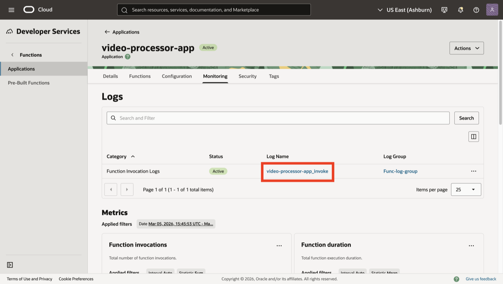
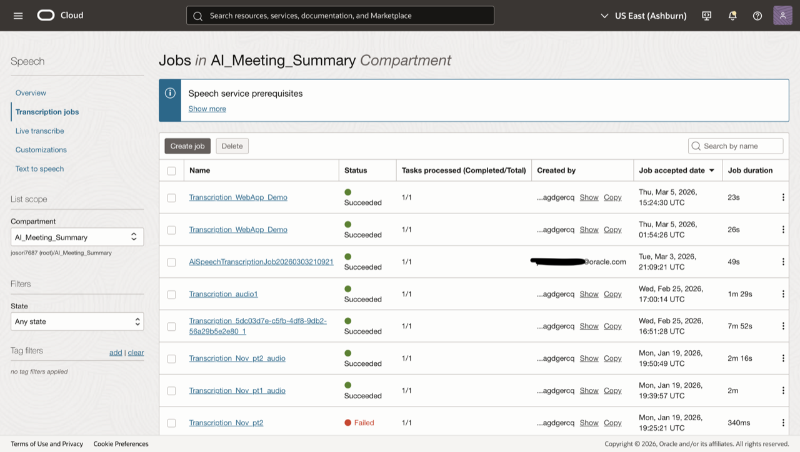
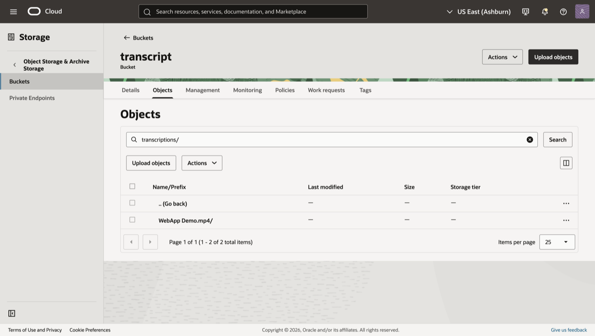
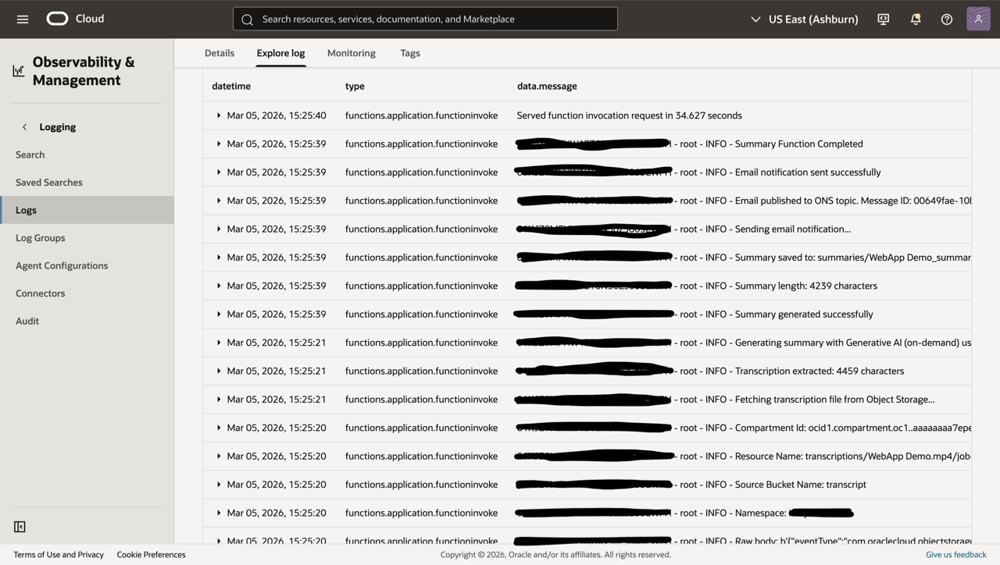
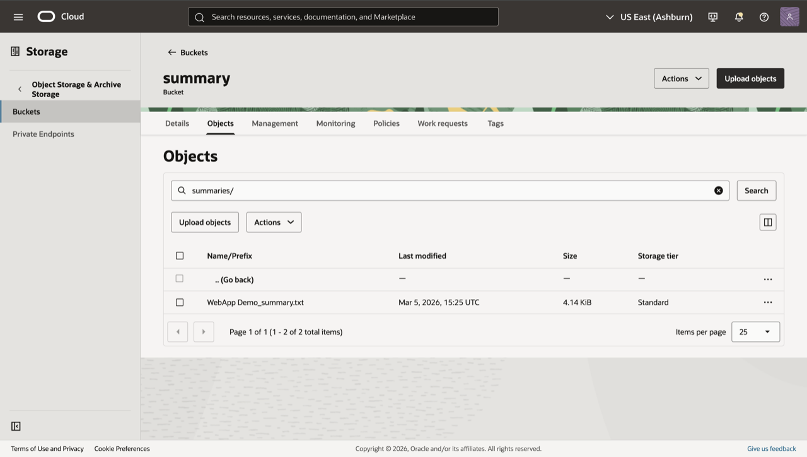
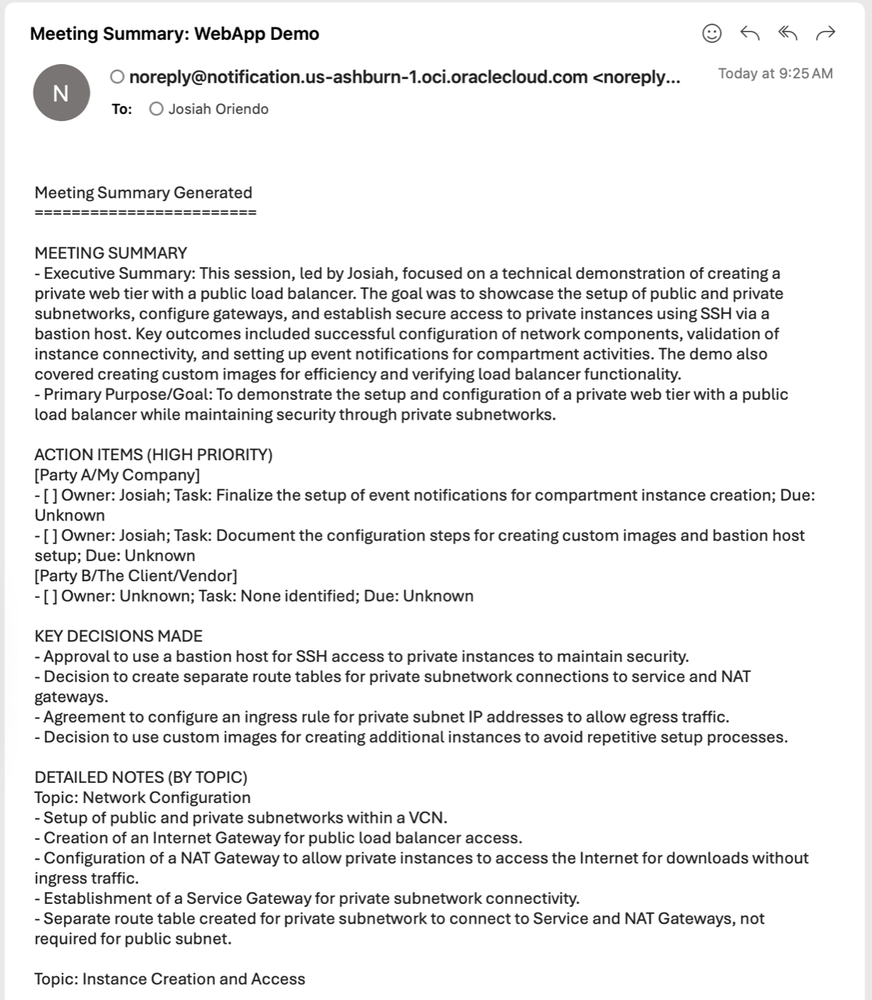

# Run the Workflow: Upload, Transcribe, Summarize, and Notify

## Introduction

In this final lab, you will kick off the end-to-end pipeline by uploading a media file to the uploads bucket. You will then verify the Functions logs, track the AI Speech transcription job, retrieve the transcript from Object Storage, confirm the summary file, and verify the email notification.

Estimated Time: 10–20 minutes

### Objectives

In this lab, you will:

- Upload a media file in a supported format to the uploads bucket
- Verify the Transcribe Function invocation in logs
- Check the AI Speech job status
- Retrieve the transcript from the transcripts bucket
- Verify the Summary Function ran, review the summary file, and confirm the email notification

### Prerequisites

This lab assumes you have:

- A small media file in one of the supported formats:
  - AAC, AC3, AMR, AU, FLAC, M4A, MKV, MP3, MP4, OGA, OGG, OPUS, WAV, WEBM
- All resources deployed in the same region

## Task 1: Upload a media file to the upload bucket

1. Navigate to **Storage → Object Storage & Archive Storage → Buckets**

2. Ensure you are in the ai-meeting-summarizer compartment. If not, select it and open the **upload** bucket

3. Click **Upload objects** and select a small media file in a supported format (see list above):

    - Storage tier: Standard
    - Drop a file or select one

4. Click **Next → Upload objects**

    

## Task 2: Verify the Transcribe Function invocation

1. Navigate to **Developer Services → Functions → Applications → ai-ms-app → Monitoring → ai-ms-logs → Explore log**, where you will see logs from the function, such as invocation requests and completion messages

    

    

> Note: If you do not see logs immediately, refresh after a few seconds. Keep this tab open for reference.

## Task 3: Check the AI Speech job status

1. Navigate to **Analytics & AI → AI Services → Speech → Transcription Jobs**

2. Locate a job with a display name similar to “Transcription\_&lt;sanitized-filename&gt;”. You will be able to view the job status as it transitions from ACCEPTED/IN\_PROGRESS to SUCCEEDED

    - If FAILED, open the job to review lifecycle\_details or failure\_details for troubleshooting

    

> Common issues: The media file is not in a supported format or is too long

## Task 4: Retrieve the transcript from Object Storage

1. Once the transcription job status shows SUCCEEDED, navigate to **Storage → Buckets → transcripts**

2. Navigate to the prefix:

    - transcriptions/&lt;sanitized-filename&gt;/&lt;job-name&gt;

    

3. To view the transcript, download the file and open it in any text editor

> Note: If you do not see the transcript immediately after SUCCEEDED, wait 30–90 seconds and refresh.

## Task 5: Verify the Summary Function and view the summary

1. Return to the logs tab, or navigate again using the previous steps, to view logs from the Summary Function

    

2. After confirming the Summary Function has completed, navigate to **Storage → Buckets → results**

3. Open the prefix and download the file to review the plain-text summary:

    - summaries/&lt;base&gt;\_summary.txt

    

## Task 6: Confirm email notification

1. Check your inbox for an email from OCI Notifications with a subject similar to:

    - “Meeting Summary: &lt;base&gt;”

2. Open the email and review the summary content (truncated if very long) and the storage location reference

    

> If you do not see the email, verify that your subscription is CONFIRMED and that the function has permission to use ons-topics.

## Troubleshooting quick tips

- No Transcribe Function logs:
  - Ensure the Events rule is enabled and filters `bucketName=upload`; verify function, application, and compartment selections
- AI Speech job FAILED:
  - Open job details for lifecycle\_details/failure\_details; confirm the tenancy-level policy allows the ai\_speech service to manage objects in the transcripts bucket (and KMS permissions if using a CMK)
- Transcript missing after SUCCEEDED:
  - Wait and refresh (eventual consistency); confirm RESULT\_BUCKET name and region
- Summary missing:
  - Check summarizer logs for configuration issues (GENAI\_MODEL\_ID, SUMMARY\_BUCKET, OCI\_REGION, OBJECT\_NS, ONS\_TOPIC\_OCID)
  - Ensure the Generative AI client is using the correct regional endpoint
- Email missing:
  - Confirm the Notifications subscription status is CONFIRMED; check function logs for publish\_message success
- 503 error when attempting to run the function:
  - Wait a short period and retry the workflow

## Learn More

- AI Speech: https://docs.oracle.com/iaas/Content/speech/home.htm  
- Generative AI: https://docs.oracle.com/iaas/Content/generative-ai/home.htm  
- Notifications: https://docs.oracle.com/iaas/Content/Notification/home.htm  
- Events: https://docs.oracle.com/iaas/Content/Events/Concepts/eventsoverview.htm  
- Logging: https://docs.oracle.com/iaas/Content/Logging/Concepts/loggingoverview.htm  

## Acknowledgements

- **Author** - **Josiah Oriendo**, Cloud Architect  
- **Last Updated By/Date** - Josiah Oriendo, February 2026