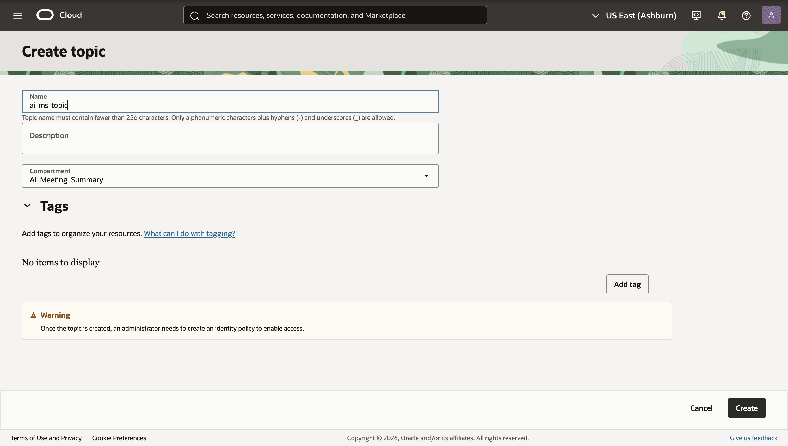

# Configure Events, Function Configuration, Logging, and Email Notifications

## Introduction

This lab wires your deployment together. You will configure application/function variables, attach an Events rule so uploads trigger the Transcribe Function and in turn the summary function, create a Notifications topic and email subscription, and enable function logs for troubleshooting.

Estimated Time: 20–30 minutes

### Objectives

In this lab, you will:

- Set application and function configuration keys (region, namespace, buckets, model OCID, topic OCID)
- Create a Notifications topic and email subscription
- Attach the Events rule to trigger the Transcribe Function on object creation
- Enable a Log Group and function logs

### Prerequisites

This lab assumes you have:

- Permissions to access Functions and the GenAI service, and publish to Notifications.

## Task 1: Create a Notifications topic and email subscription

You will publish summaries to this topic; subscribers receive an email.

1. Navigate to **Developer Services → Application Integration → Notifications → Topics → Create Topic**.

   - Name: ai-ms-topic
   - Compartment: ai-meeting-summarizer

2. Click create.

    

3. Click on the topic you just created **→ Subscriptions → Create Subscription**.

   - Protocol: Email
   - Email: <your_email@yourdomain>

4. Click create.

    

5. Check your inbox, and click Confirm subscription.

6. Copy the Topic OCID from the topic’s Details page, it will be needed later in the lab.

## Task 2: Attach the Events rule to the Transcribe Function

Ensure new uploads trigger the transcriber function.

1. Navigate to **Observability & Management → Events Service → Rules → Create Rule**.

   - Name: on-object-create
   - Description: Trigger transcription func
   - Rule conditions: Condition: Event Type, Service Name: Object Storage, Event Type: Object - Create
   - (Click +Another Condition)Rule conditions: Condition: Attribute, Attribute Name: bucketName, Attribute Values: upload
   - Actions: Action Type: Functions, Function Compartment: ai-meeting-summarizer, Function Application: ai-ms-app, Function: transcriber

2. Click Create Rule.

> Optional: You may add a second rule that targets summarizer directly on transcript JSON creation (filter resourceName endsWith ".json"). This is not required if summarizer is already triggered by your design.

## Task 3: Configure application-level variables

1. Navigate to **Developer Services → Functions → Applications → ai-ms-app → Configuration → Manage configuration**.

2. Click on Add configuration for every key, value pair below

   - Key: GENAI_MODEL_ID, Value: <model_OCID>
   - Key: UPLOAD_BUCKET, Value: upload
   - Key: OBJECT_NS, Value: <object_storage_namespace>
   - Key: SUMMARY_BUCKET, Value: results
   - Key: OCI_REGION, Value: idwy6hudkhwz
   - Key: ONS_TOPIC_OCID, Value: <topic_OCID>
   - Key: RESULT_BUCKET, Value: transcripts
   - Key: COMPARTMENT_OCID, Value: <ai-meeting-summarizer-OCID>

> Note: Messages over ~64 KB may be truncated by Notifications. Keep emails concise; store full content in Object Storage.

## Task 4: Enable logging for both functions

Create a Log Group and enable function logs for observability.

1. Console → Observability & Management → Logging → Log Groups → Create Log Group.
   - Name: ai-ms-log-group
   - Compartment: ai-meeting-summarizer
   - Create.
2. Functions → Applications → ai-ms-app → Logs → Create Log.
   - Log Group: ai-ms-log-group
   - Log Name: transcriber-log
   - Category: Function logs
   - Create.
3. Repeat for summarizer:
   - Log Name: summarizer-log
   - Category: Function logs

> Tip: Use logs to trace event invocations and inspect errors (e.g., Speech job failure_details or Generative AI response issues).

## Troubleshooting quick tips

- Speech job accepted but no transcript:
  - Confirm a tenancy-level policy allows the AI Speech service to write to your results bucket. Without it, jobs may fail on output write.
- Summarizer errors:
  - Ensure GENAI_MODEL_ID is correct and clients use the same region. If SDK response shape varies, handle missing fields defensively.
- Email not received:
  - Ensure the subscription is CONFIRMED and the function’s Dynamic Group has permission to use ons-topics.
- Permissions:
  - Verify dynamic group policies in the ai-meeting-summarizer compartment are applied and the Events rule is Enabled.

## Learn More

- Notifications: https://docs.oracle.com/iaas/Content/Notification/home.htm
- Events: https://docs.oracle.com/iaas/Content/Events/Concepts/eventsoverview.htm
- Logging: https://docs.oracle.com/iaas/Content/Logging/Concepts/loggingoverview.htm

## Acknowledgements

* **Author** - **Josiah Oriendo**, Cloud Architect
* **Last Updated By/Date** - Josiah Oriendo, February 2026
