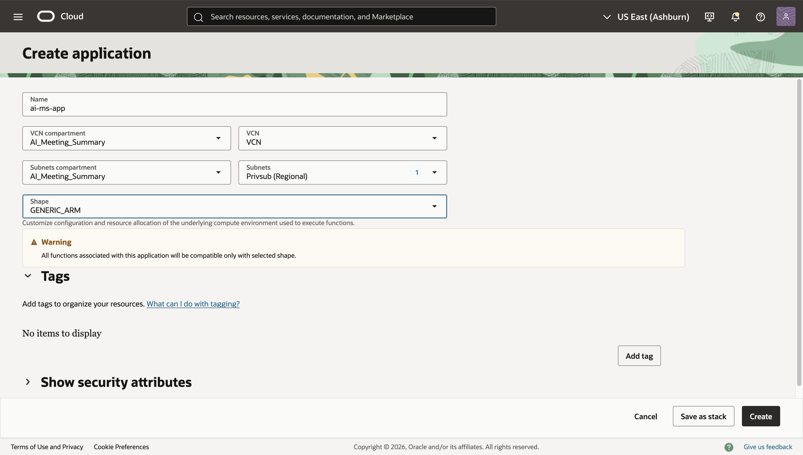
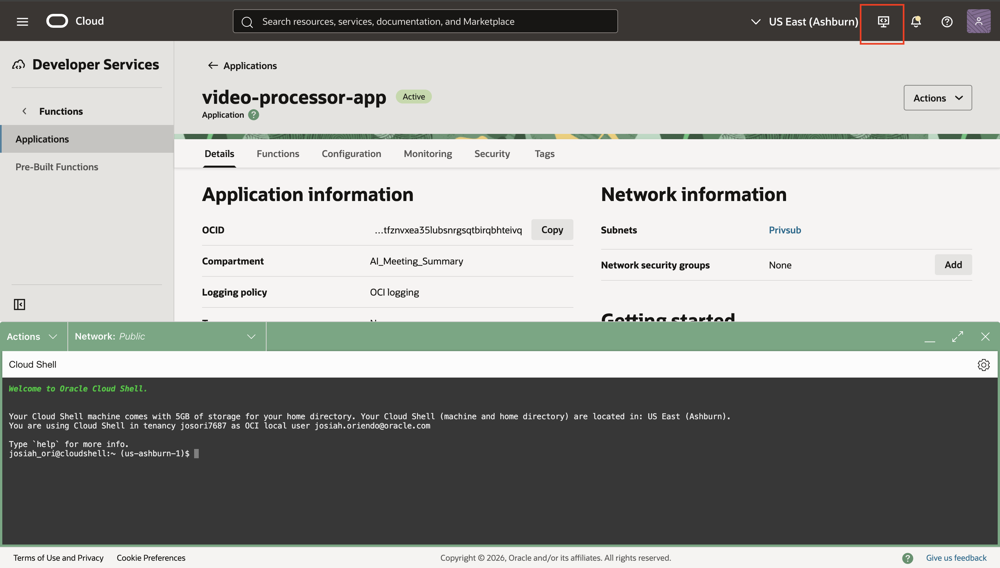

# Deploy Functions and Wire the Event Trigger

## Introduction

This lab walks you through creating an OCI Functions application, deploying two Python functions (Transcribe and Summary), configuring required environment keys, and wiring the Events rule to trigger the Transcribe Function when an object is created in the uploads bucket.

Estimated Time: 30–45 minutes

### Objectives

In this lab, you will:

- Create a Functions application.
- Initialize, build, and deploy the Transcribe and Summary Python functions.
- Configure function application and function-level variables.
- Attach the Events rule action to the Transcribe Function and validate end-to-end.

### Prerequisites

This lab assumes you have:

- Access to OCI Cloud Shell or a local dev environment with Fn CLI configured.
- Permissions to create Functions, attach policies, and publish to Notifications.

## Task 1: Create a Functions application

1. Navigate: Developer Services → Functions → Applications → Create application.

2. Enter:

   - Name: ai-ms-app
   - VCN Compartment: ai-meeting-summarizer
   - VCN: ai-ms-vcn
   - Subnets Compartment: ai-meeting-summarizer
   - Subnet: ai-ms-private-subnet (Private)
   - Registry: Select your OCIR repo (or create one)
   - Shape: GENERIC_ARM

3. Click Create.

    

## Task 2: Configure Fn CLI and OCIR registry

1. Click on the application you just created.

2. Open Cloud Shell by pressing the computer icon in the top right corner.

    

3. Set your OCIR registry and login:

   ```
   fn update context registry <region-key>.ocir.io/<tenancy-namespace>/<repo>
   docker login <region-key>.ocir.io
   ```

4. Verify Functions context:

   ```
   fn list contexts
   fn use context default
   ```

> Note: Replace <region-key> (e.g., iad), <tenancy-namespace>, and <repo> with your values.

## Task 3: Initialize and deploy the Transcribe Function

1. Initialize a Python function:

   ```
   fn init --runtime python transcribe-fn
   cd transcribe-fn
   ```

2. Edit requirements.txt to include:

   ```
   oci
   ```

3. Replace func.py with your Transcribe handler (submit AI Speech job), or paste the provided sample in this workshop’s code folder.

4. Deploy:

   ```
   fn -v deploy --app ai-ms-app
   ```

5. In the Console → Functions → Applications → ai-ms-app, confirm the function transcribe-fn appears.

> Note: The function only submits the Speech job. Completion and transcript creation happen asynchronously.

## Task 4: Initialize and deploy the Summary Function

1. From Cloud Shell:

   ```
   cd ..
   fn init --runtime python summary-fn
   cd summary-fn
   ```

2. Edit requirements.txt to include:

   ```
   oci
   ```

3. Replace func.py with your Summary handler (reads transcript JSON, calls Generative AI on-demand, saves summary, publishes Notifications).

4. Deploy:

   ```
   fn -v deploy --app ai-ms-app
   ```

> Note: Use the plain-text system prompt provided earlier to produce consistent meeting minutes.

## Task 5: Set application and function configuration

Set app-level config (shared across functions) and function-level overrides (as needed).

A. Application configuration (Console → Functions → Applications → ai-ms-app → Configuration)

- Add:
  - OCI_REGION: <your-region> (e.g., us-ashburn-1)
  - OBJECT_NS: <your-object-storage-namespace>
- Save.

B. Transcribe Function configuration

- RESULT_BUCKET: results
- (Optional) Additional keys if your code expects them.

C. Summary Function configuration

- SUMMARY_BUCKET: results
- GENAI_MODEL_ID: ocid1.generativeaimodel.oc1... (on-demand model OCID)
- ONS_TOPIC_OCID: ocid1.onstopic.oc1...
- (Optional) System prompt text (if you externalize it as a config key)

> Note: Keep all resources in the same region. If you set region at the client, use config={"region": OCI_REGION} in SDK clients.

## Task 6: Update IAM policies (if not already completed)

Ensure your Dynamic Group for Functions can call the services used by your functions:
- In ai-meeting-summarizer compartment:
  - allow dynamic-group AI_Summary_DG to manage object-family in compartment ai_meeting_summarizer
  - allow dynamic-group AI_Summary_DG to use ai-service-speech-family in compartment ai_meeting_summarizer
  - allow dynamic-group AI_Summary_DG to use generative-ai-family in compartment ai_meeting_summarizer
  - allow dynamic-group AI_Summary_DG to use ons-topics in compartment ai_meeting_summarizer
- At tenancy (root), allow Speech to write to your results bucket:
  - allow service ai_speech to manage objects in compartment ai_meeting_summarizer where target.bucket.name='results'
  - If you use a customer-managed KMS key on results, also:
    - allow service ai_speech to use keys in compartment ai_meeting_summarizer
    - allow service ai_speech to use key-delegate in compartment ai_meeting_summarizer

> Note: If your environment doesn’t accept “service ai_speech”, use the conditional any-user pattern with request.principal.service='ai_speech'.

## Task 7: Wire the Events rule to the Transcribe Function

1. Go to Developer Services → Events Service → Rules → on-object-create → Edit.
2. Under Actions → Add action → Functions.
3. Select:
   - Compartment: ai-meeting-summarizer
   - Application: ai-ms-app
   - Function: transcribe-fn
4. Save.

> Note: The rule listens to com.oraclecloud.objectstorage.createobject for the upload bucket.`

## Learn More

- OCI Functions: https://docs.oracle.com/iaas/Content/Functions/Concepts/functionsoverview.htm
- AI Speech: https://docs.oracle.com/iaas/Content/speech/overview.htm
- Generative AI Inference: https://docs.oracle.com/iaas/Content/generative-ai/overview.htm
- Events Service: https://docs.oracle.com/iaas/Content/Events/Concepts/eventsoverview.htm
- Notifications: https://docs.oracle.com/iaas/Content/Notification/home.htm

## Acknowledgements

- Author – <Name, Title, Group>
- Contributors – <Name, Group> (optional)
- Last Updated By/Date – <Name>, <Month Year>