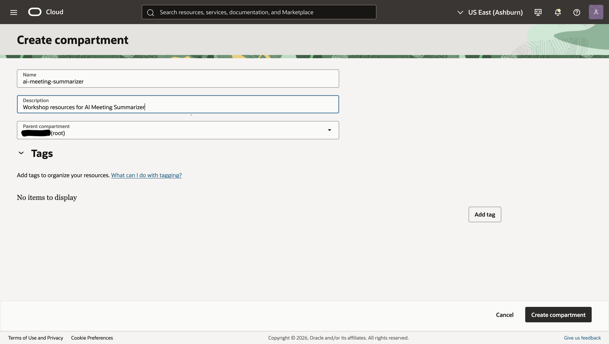
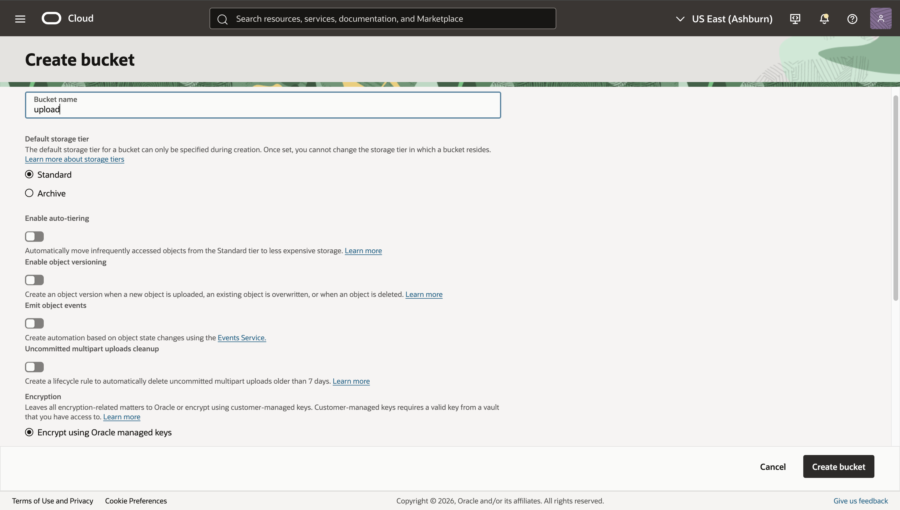
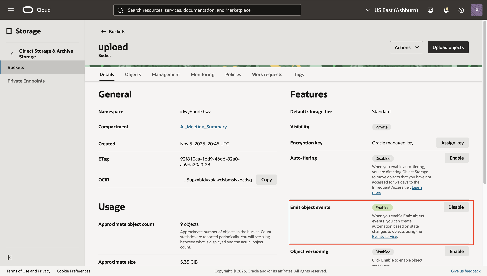

# Provision Necessary Resources

## Introduction

In this lab, you’ll prepare the foundation for the AI Meeting Summarizer workflow. You will create a dedicated compartment, three Object Storage buckets (uploads, transcripts, and results), and an Event rule that triggers a Function whenever a new object is uploaded. This enables an event-driven pipeline on OCI with clear separation of data and least-privilege access.

Estimated Time: 20 minutes

### Objectives

In this lab, you will:

* Create a compartment for the workshop resources.
* Create private Object Storage buckets for uploads, transcripts, and results.
* Enable events on the uploads bucket and create an Event rule for object creation.

### Prerequisites (Optional)

This lab assumes you have:

* An Oracle Cloud account with permissions to create compartments, buckets, and Events.
* Familiarity with the OCI Console (helpful but not required).
* Region chosen for all resources (keep everything in the same region).

## Task 1: Create a compartment

1. In the OCI Console, open the navigation menu and go to **Identity & Security → Compartments**.

2. Click Create compartment.

3. Enter:

   * Name: ai-meeting-summarizer
   * Description: Workshop resources for AI Meeting Summarizer
   * Parent compartment: Your tenancy root or a suitable parent

4. Click Create compartment.

    

## Task 2: Create Object Storage buckets

Create two private buckets in the same region and namespace.

A. Upload bucket

1. Click the hamburger icon and navigate to **Storage → Buckets**.

2. Select the ai-meeting-summarizer compartment you have just created.

3. Click Create bucket.

4. Enter:

   * Name: upload
   * Default storage tier: Standard
   * Encryption: Use Oracle-managed keys (or choose a customer-managed key if required)

5. Click Create.

    

B. Transcripts Bucket

1. Follow the same steps as you did for the upload bucket, replacing the name with transcripts

C. Results bucket

1. Follow the same steps as you did for the previous buckets, replacing the name with results

Note: Record your Object Storage namespace (visible at the top of Buckets page). You’ll use it in later labs.

## Task 3: Enable events on the buckets

1. Open the upload bucket.

2. In Bucket details, under the Features section ensure Emit Object Events is enabled. If disabled, click the Enable button.

    

3. Follow the same steps for the transcript bucket

## Task 4: Create an Event rule for object creation

1. Navigate to Observability & Management → Events Service → Rules.

2. Make sure you’re in the ai-meeting-summarizer compartment.

3. Click Create rule and enter:

   * Name: on-object-create
   * Description: Trigger function when a new object is created in upload bucket
   * Rule condition: Use Event Type = Object - Create (com.oraclecloud.objectstorage.createobject)
   * Condition filter (Attributes):
     * bucketName equals upload
     * namespace equals your namespace (optional but recommended)

4. Actions:

   * Click Add action → Select Action Type: Functions
   * Choose the application and function (you can leave this blank if you will create the function in the next lab; you can return to add it later)

5. Click Create rule.

Note: If the function is not yet deployed, create the rule now without the action, then edit the rule later to add the Functions action once your Transcribe Function is available.

## Validation

* In the Buckets list, confirm both upload and transcript buckets exist in the ai-meeting-summarizer compartment and are Private.
* In the upload bucket, confirm Emit Object Events = On.
* In Events → Rules, confirm on-object-create is Enabled and scoped to the correct compartment.

If everything looks good, proceed to the next lab to configure IAM policies and deploy the Transcribe Function

## Learn More

* [URL text 1](http://docs.oracle.com)
* [URL text 2](http://docs.oracle.com)
* **Last Updated By/Date** - <Name, Month Year>

## Acknowledgements
* **Author** - <Name, Title, Group>
* **Contributors** -  <Name, Group> -- optional
