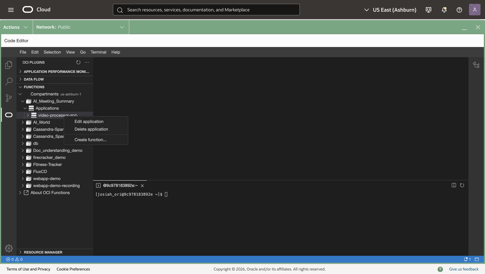
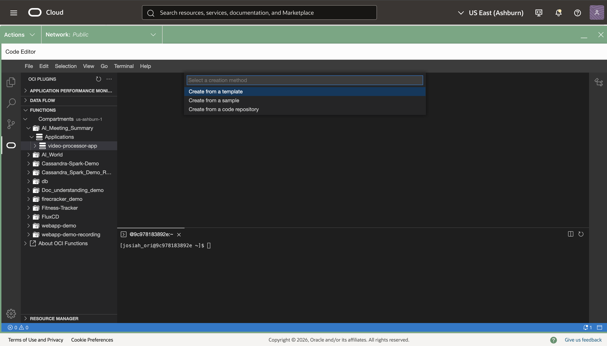
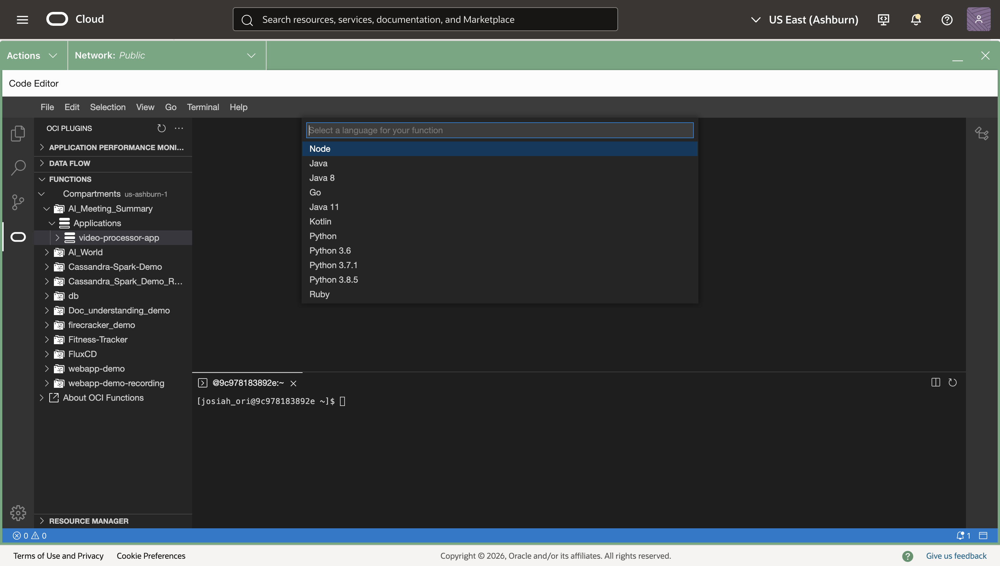
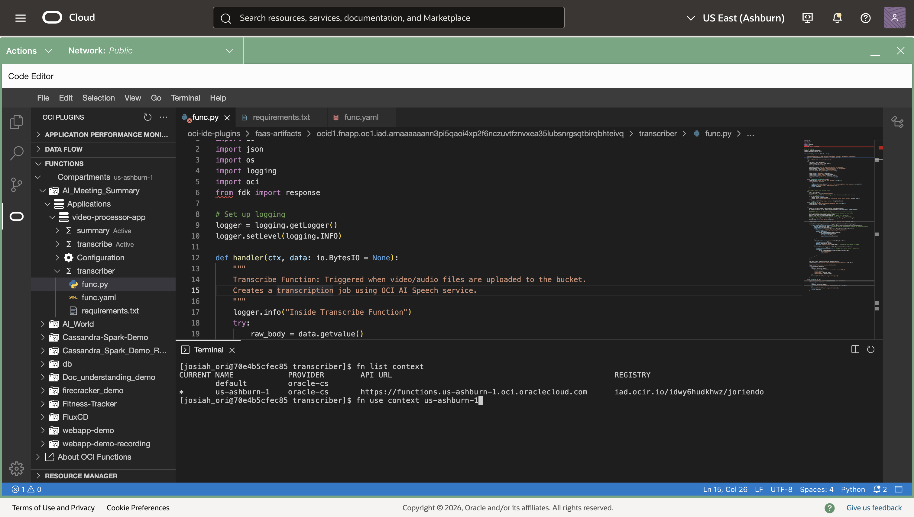

# Deploy Functions and Wire the Event Trigger

## Introduction

This lab walks you through creating an OCI Functions application, deploying two Python functions (Transcribe and Summary), configuring required environment keys, and wiring the Events rule to trigger the Transcribe Function when an object is created in the uploads bucket.

Estimated Time: 30–45 minutes

### Objectives

In this lab, you will:

- Create a Functions application.
- Initialize, build, and deploy the Transcribe and Summary Python functions.
- Configure function application and function-level variables.
- Attach the Events rule action to the Transcribe Function and validate end-to-end.

### Prerequisites

This lab assumes you have:

- Access to OCI Cloud Shell or a local dev environment with Fn CLI configured.
- Permissions to create Functions, attach policies, and publish to Notifications.

## Task 1: Create a Functions application

1. Navigate: Developer Services → Functions → Applications → Create application.

2. Enter:

   - Name: ai-ms-app
   - VCN Compartment: ai-meeting-summarizer
   - VCN: ai-ms-vcn
   - Subnets Compartment: ai-meeting-summarizer
   - Subnet: ai-ms-private-subnet (Private)
   - Registry: Select your OCIR repo (or create one)
   - Shape: GENERIC_ARM

3. Click Create.

    

## Task 2: Create Transcribe Function

1. Click on the application you just created → Functions tab → Create in code editor.

2. Once the editor loads, the application folder should automatically open on the left hand side, if not follow these steps, otherwise skip to step 3

   - The left hand side will have a list of your compartments, press on the compartment that you created the function in.
   - It will show a drop down for applications, open it and you should see the name of the function you just created

3. Right click on the function you just created and press Create function... → Create from a template  → select Python

    

    

    

4. Enter transcriber as your function name and press enter, which should populate a new function under your application on the left hand side.

5. Edit the func.yaml file by selecting the file and making sure it reflects the below information:

   ```yaml
   schema_version: 20180708
   name: transcriber
   version: 0.0.1
   runtime: python
   entrypoint: /python/bin/fdk /function/func.py handler
   memory: 256
   timeout: 300
   ```

6. Edit the requirements.txt file by selecting the file and making sure it reflects the below information:

   '''text
   fdk
   oci
   '''

7. Edit the func.py file by selecting the file, deleting the current contents and pasting the below python code:

   '''python
   import io
   import json
   import os
   import logging
   import oci
   from fdk import response

   # Set up logging
   logger = logging.getLogger()
   logger.setLevel(logging.INFO)

   def handler(ctx, data: io.BytesIO = None):
      """
      Transcribe Function: Triggered when video/audio files are uploaded to the bucket.
      Creates a transcription job using OCI AI Speech service.
      """
      logger.info("Inside Transcribe Function")
      try:
         raw_body = data.getvalue()
         logger.info(f"Raw body: {raw_body}")
         body = json.loads(raw_body)

         namespace = body["data"]["additionalDetails"]["namespace"]
         bucket_name = body["data"]["additionalDetails"]["bucketName"]
         resource_name = body["data"]["resourceName"]
         compartment_id = body["data"]["compartmentId"]

         logger.info(f"Namespace: {namespace}")
         logger.info(f"Bucket Name: {bucket_name}")
         logger.info(f"Resource Name: {resource_name}")
         logger.info(f"Compartment Id: {compartment_id}")

      except (Exception, ValueError) as ex:
         logger.error(f"Error parsing json payload: {str(ex)}")
         return response.Response(
               ctx,
               response_data=json.dumps({"error": f"Error parsing Event json payload: {str(ex)}"}),
               headers={"Content-Type": "application/json"},
               status_code=400
         )

      # Get target bucket from configuration
      try:
         cfg = ctx.Config()
         target_bucket = cfg.get("RESULT_BUCKET")
         # If the target_bucket is not configured then the source bucket will be used
         if target_bucket is None:
               target_bucket = bucket_name
               logger.info(f"RESULT_BUCKET not configured, using source bucket: {bucket_name}")
         else:
               logger.info(f"Using target bucket: {target_bucket}")
      except Exception as ex:
         logger.error(f"ERROR: Missing configuration keys: {str(ex)}")
         target_bucket = bucket_name

      try:
         signer = oci.auth.signers.get_resource_principals_signer()
         ai_speech_client = oci.ai_speech.AIServiceSpeechClient(config={}, signer=signer)

         # CRITICAL: Create a sanitized display name (remove invalid characters)
         # The displayName must contain only alphanumerics, dashes, or underscores
         base_name = os.path.basename(resource_name)
         base_id = os.path.splitext(base_name)[0]  # Remove file extension
         # Replace any invalid characters (spaces, dots, etc.) with underscores
         clean_id = ''.join(c if c.isalnum() or c in '-_' else '_' for c in base_id)
         display_name = f"Transcription_{clean_id}"

         logger.info(f"Creating transcription job with display name: {display_name}")

         create_transcription_job_response = ai_speech_client.create_transcription_job(
               create_transcription_job_details=oci.ai_speech.models.CreateTranscriptionJobDetails(
                  display_name=display_name,  # REQUIRED: Must be alphanumeric, dashes, or underscores only
                  compartment_id=compartment_id,
                  input_location=oci.ai_speech.models.ObjectListInlineInputLocation(
                     location_type="OBJECT_LIST_INLINE_INPUT_LOCATION",
                     object_locations=[
                           oci.ai_speech.models.ObjectLocation(
                              namespace_name=namespace,
                              bucket_name=bucket_name,
                              object_names=[resource_name]
                           )
                     ]
                  ),
                  output_location=oci.ai_speech.models.OutputLocation(
                     namespace_name=namespace,
                     bucket_name=target_bucket,
                     prefix=f"transcriptions/{base_name}/"  # Organize by original filename
                  ),
                  normalization=oci.ai_speech.models.TranscriptionNormalization(
                     is_punctuation_enabled=True,  # Changed to True for better readability
                     filters=[
                           oci.ai_speech.models.ProfanityTranscriptionFilter(
                              type="PROFANITY",
                              mode="MASK"
                           )
                     ]
                  )
               )
         )

         job_id = create_transcription_job_response.data.id
         logger.info(f"Transcription job created successfully with ID: {job_id}")

         logger.info("Transcribe Function Completed")
         return response.Response(
               ctx,
               response_data=json.dumps({
                  "message": "Transcription job created successfully",
                  "jobId": job_id,
                  "displayName": display_name,
                  "resourceName": resource_name
               }),
               headers={"Content-Type": "application/json"}
         )

      except Exception as ex:
         logger.error(f"Error creating transcription job: {str(ex)}")
         return response.Response(
               ctx,
               response_data=json.dumps({
                  "error": f"Error creating transcription job: {str(ex)}"
               }),
               headers={"Content-Type": "application/json"},
               status_code=500
         )
   '''

## Task 3: Setup fn CLI & Deploy Transcriber

1. In the code editor, right click on anyone of the files you edited (func.yaml, func.py, or requirements.txt) and select Open in terminal

2. Using the terminal, set the context for your region, by taking the information under default in the first command and filling that information into the second command:

   '''text
   fn list context
   fn use context <region>
   '''

   

3. Update the context with the function's compartment ID:

   '''text
   fn update context oracle.compartment-id <compartment_OCID>
   '''

4. Provide a unique repository name prefix to distinguish your function images from other people’s. Get the object storage namespace by looking at the details of any of the buckets prior, and the repo name is up to your own discretion. For the region key, follow the first command below and in the dictionary where the "is-home-region" value is true use the region key below it:

   '''text
   oci iam region-subscription list
   fn update context registry <region-key>.ocir.io/<object_storage_namespace>/[repo-name-prefix]
   '''

## Task 3: Initialize and deploy the Transcribe Function

1. Initialize a Python function:

   ```
   fn init --runtime python transcribe-fn
   cd transcribe-fn
   ```

2. Edit requirements.txt to include:

   ```
   oci
   ```

3. Replace func.py with your Transcribe handler (submit AI Speech job), or paste the provided sample in this workshop’s code folder.

4. Deploy:

   ```
   fn -v deploy --app ai-ms-app
   ```

5. In the Console → Functions → Applications → ai-ms-app, confirm the function transcribe-fn appears.

> Note: The function only submits the Speech job. Completion and transcript creation happen asynchronously.

## Task 4: Initialize and deploy the Summary Function

1. From Cloud Shell:

   ```
   cd ..
   fn init --runtime python summary-fn
   cd summary-fn
   ```

2. Edit requirements.txt to include:

   ```
   oci
   ```

3. Replace func.py with your Summary handler (reads transcript JSON, calls Generative AI on-demand, saves summary, publishes Notifications).

4. Deploy:

   ```
   fn -v deploy --app ai-ms-app
   ```

> Note: Use the plain-text system prompt provided earlier to produce consistent meeting minutes.

## Task 5: Set application and function configuration

Set app-level config (shared across functions) and function-level overrides (as needed).

A. Application configuration (Console → Functions → Applications → ai-ms-app → Configuration)

- Add:
  - OCI_REGION: <your-region> (e.g., us-ashburn-1)
  - OBJECT_NS: <your-object-storage-namespace>
- Save.

B. Transcribe Function configuration

- RESULT_BUCKET: results
- (Optional) Additional keys if your code expects them.

C. Summary Function configuration

- SUMMARY_BUCKET: results
- GENAI_MODEL_ID: ocid1.generativeaimodel.oc1... (on-demand model OCID)
- ONS_TOPIC_OCID: ocid1.onstopic.oc1...
- (Optional) System prompt text (if you externalize it as a config key)

> Note: Keep all resources in the same region. If you set region at the client, use config={"region": OCI_REGION} in SDK clients.

## Task 6: Update IAM policies (if not already completed)

Ensure your Dynamic Group for Functions can call the services used by your functions:
- In ai-meeting-summarizer compartment:
  - allow dynamic-group AI_Summary_DG to manage object-family in compartment ai_meeting_summarizer
  - allow dynamic-group AI_Summary_DG to use ai-service-speech-family in compartment ai_meeting_summarizer
  - allow dynamic-group AI_Summary_DG to use generative-ai-family in compartment ai_meeting_summarizer
  - allow dynamic-group AI_Summary_DG to use ons-topics in compartment ai_meeting_summarizer
- At tenancy (root), allow Speech to write to your results bucket:
  - allow service ai_speech to manage objects in compartment ai_meeting_summarizer where target.bucket.name='results'
  - If you use a customer-managed KMS key on results, also:
    - allow service ai_speech to use keys in compartment ai_meeting_summarizer
    - allow service ai_speech to use key-delegate in compartment ai_meeting_summarizer

> Note: If your environment doesn’t accept “service ai_speech”, use the conditional any-user pattern with request.principal.service='ai_speech'.

## Task 7: Wire the Events rule to the Transcribe Function

1. Go to Developer Services → Events Service → Rules → on-object-create → Edit.
2. Under Actions → Add action → Functions.
3. Select:
   - Compartment: ai-meeting-summarizer
   - Application: ai-ms-app
   - Function: transcribe-fn
4. Save.

> Note: The rule listens to com.oraclecloud.objectstorage.createobject for the upload bucket.`

## Learn More

- OCI Functions: https://docs.oracle.com/iaas/Content/Functions/Concepts/functionsoverview.htm
- AI Speech: https://docs.oracle.com/iaas/Content/speech/overview.htm
- Generative AI Inference: https://docs.oracle.com/iaas/Content/generative-ai/overview.htm
- Events Service: https://docs.oracle.com/iaas/Content/Events/Concepts/eventsoverview.htm
- Notifications: https://docs.oracle.com/iaas/Content/Notification/home.htm

## Acknowledgements

- Author – <Name, Title, Group>
- Contributors – <Name, Group> (optional)
- Last Updated By/Date – <Name>, <Month Year>