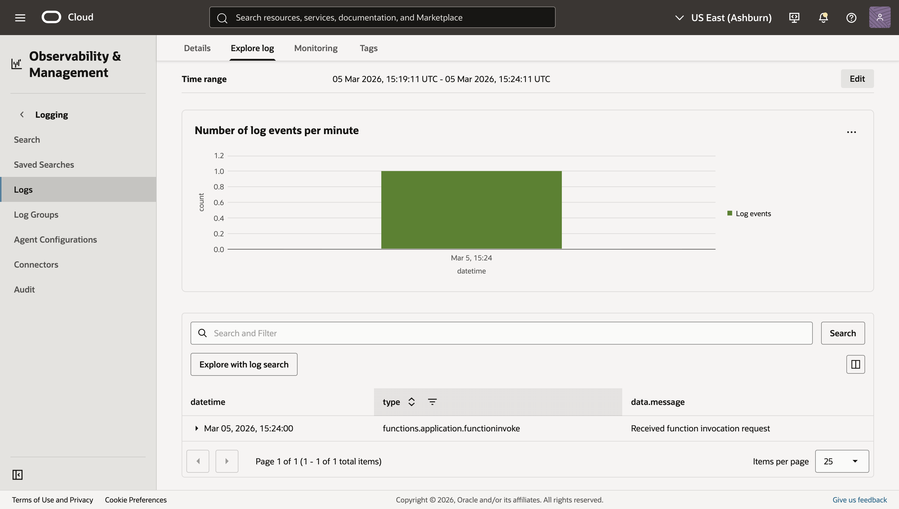
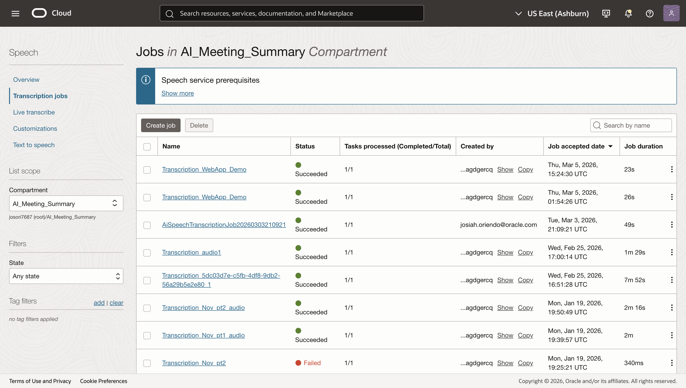
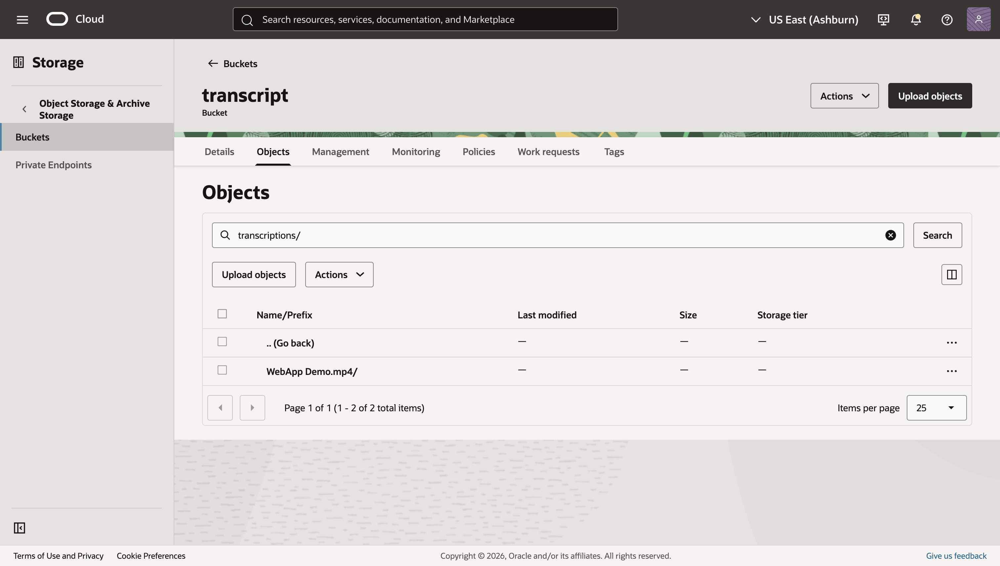
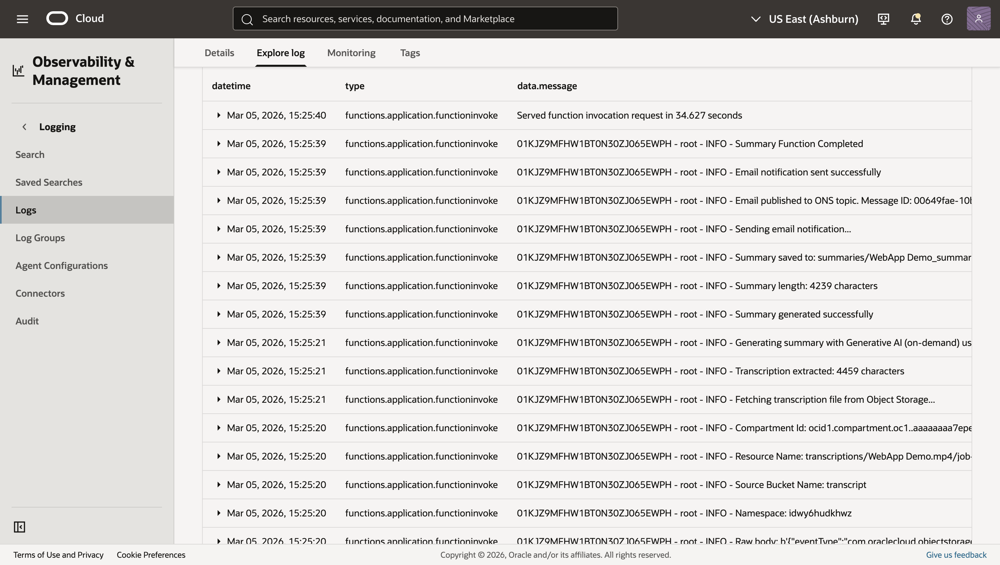
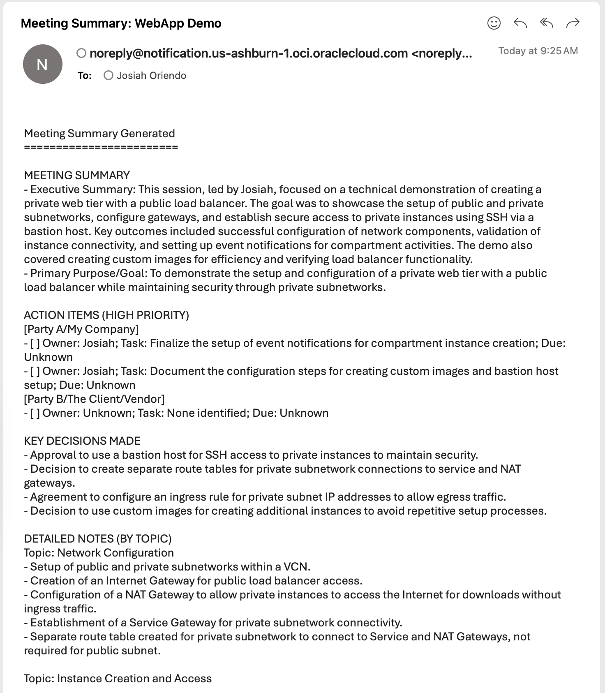

# Run the Workflow: Upload, Transcribe, Summarize, and Notify

## Introduction

In this final lab, you’ll kick off the end-to-end pipeline by uploading a media file to the uploads bucket. You’ll then verify the Functions logs, track the AI Speech transcription job, retrieve the transcript from Object Storage, confirm the summary file, and verify the email notification.

Estimated Time: 10–20 minutes

### Objectives

In this lab, you will:

- Upload a media file in a supported format to the upload bucket
- Verify the Transcribe Function invocation in Logs
- Check the AI Speech job status
- Retrieve the transcript from the transcripts bucket
- Verify the Summary Function ran, view the summary file, and confirm the email notification

### Prerequisites

This lab assumes you have:

- A small media file in one of the supported formats:
  - AAC, AC3, AMR, AU, FLAC, M4A, MKV, MP3, MP4, OGA, OGG, OPUS, WAV, WEBM
- All resources in the same region

## Task 1: Upload a media file to the upload bucket

1. Navigate to Storage → Object Storage & Archive Storage → Buckets.

2. Ensure you are in the ai-meeting-summarizer compartment and if not select it and open the upload bucket.

3. Click Upload objects and select a small media file in a supported format (see list above):

    - Storage tier: Standard
    - Drop a file or select one

4. Click **Next → Upload objects**.

    

## Task 2: Verify the Transcribe Function invocation

1. Navigate to **Developer Services → Functions → Applications → ai-ms-app → Monitoring → ai-ms-logs Logs → Explore log** where you will see logs from the function such as invocation requests and completion of the functions.

    

    

> Note: If you don't see logs immediately refresh after a few seconds. Keep this tab open for future reference

## Task 3: Check the AI Speech job status

1. Navigate to **Analytics & AI → AI Services → Speech → Transcription Jobs**.

2. Locate a job with display name similar to “Transcription_\<sanitized-filename>” and you will be able to view the status of the job from ACCEPTED/IN_PROGRESS to SUCCEEDED.

    - If FAILED, open the job to read lifecycle_details or failure_details for troubleshooting.

    

> Common issues: The video is not of the specified format or too long

## Task 4: Retrieve the transcript from Object Storage

1. Once you see the status of the transcription job SUCCEEDED, navigate to **Storage → Buckets → transcripts bucket**.

2. Navigate to the prefix:

   - transcriptions/\<sanitized-filename>/\<job-name>

    

3. If you would like to view the meeting's transcripts you are able to download this and view it in any editor.

> Note: If you don’t see the transcript immediately after SUCCEEDED, wait 30–90 seconds and refresh.

## Task 5: Verify the Summary Function and view the summary

1. Navigate back to the logs via the previous tab, or by following the prior directions, where you will see logs from the summary function.

    

2. Upon seeing Summary Function complete navigate to **Console → Storage → Buckets → summary**.

3. Click on the prefix where you will be able to download and open the file to review the plain-text summary:
   - summaries/\<base>_summary.txt

    

## Task 6: Confirm email notification

1. Check your inbox for an email from OCI Notifications with a subject like:
   - “Meeting Summary: \base>”

2. Open the email and review the summary content (truncated if very long) and the storage location reference.

    

> If you don’t see the email, verify that your subscription is CONFIRMED and that the function has permission to use ons-topics.

## Troubleshooting quick tips

- No Transcribe Function logs:
  - Ensure Events rule is Enabled and filters bucketName=upload; verify function/application/compartment selections.
- AI Speech job FAILED:
  - Open job details for lifecycle_details/failure_details; confirm the tenancy-level policy allowing the ai_speech service to manage objects in the transcripts bucket (and KMS permissions if using a CMK).
- Transcript missing after SUCCEEDED:
  - Wait and refresh (eventual consistency), confirm RESULT_BUCKET name and region.
- Summary missing:
  - Check summarizer logs for configuration issues (GENAI_MODEL_ID, SUMMARY_BUCKET, OCI_REGION, OBJECT_NS, ONS_TOPIC_OCID).
  - Ensure Generative AI client is using the correct regional endpoint.
- Email missing:
  - Confirm the Notifications subscription status is CONFIRMED; check function logs for publish_message success.

## Learn More

- AI Speech: https://docs.oracle.com/iaas/Content/speech/home.htm
- Generative AI: https://docs.oracle.com/iaas/Content/generative-ai/home.htm
- Notifications: https://docs.oracle.com/iaas/Content/Notification/home.htm
- Events: https://docs.oracle.com/iaas/Content/Events/Concepts/eventsoverview.htm
- Logging: https://docs.oracle.com/iaas/Content/Logging/Concepts/loggingoverview.htm

## Acknowledgements

- **Author** - **Josiah Oriendo**, Cloud Architect
- **Last Updated By/Date** - Josiah Oriendo, February 2026
