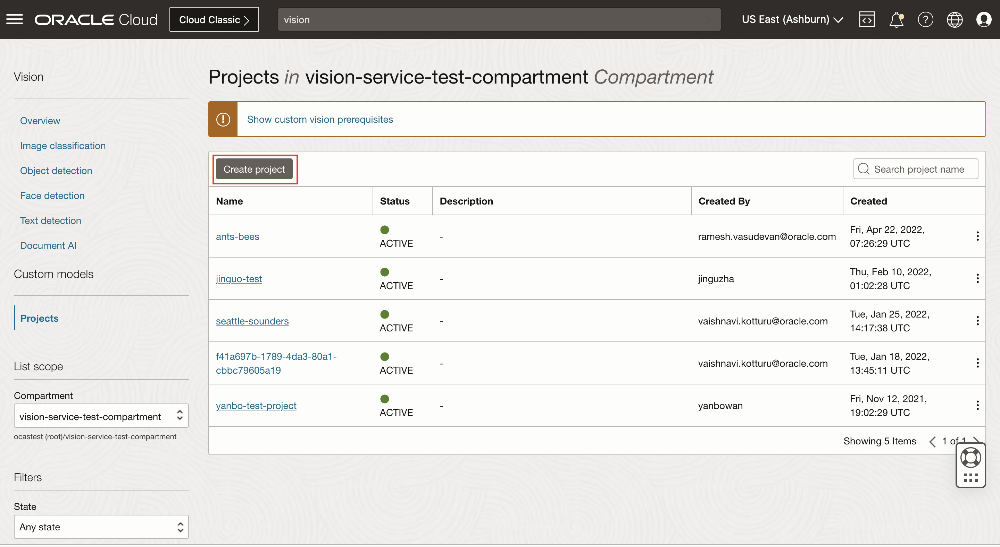
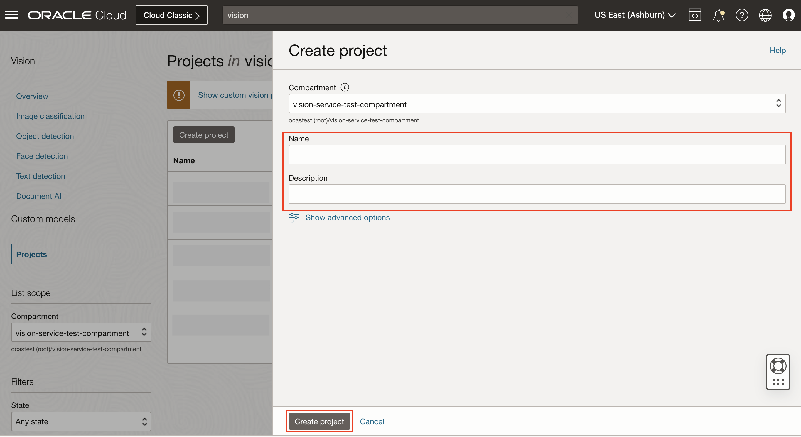
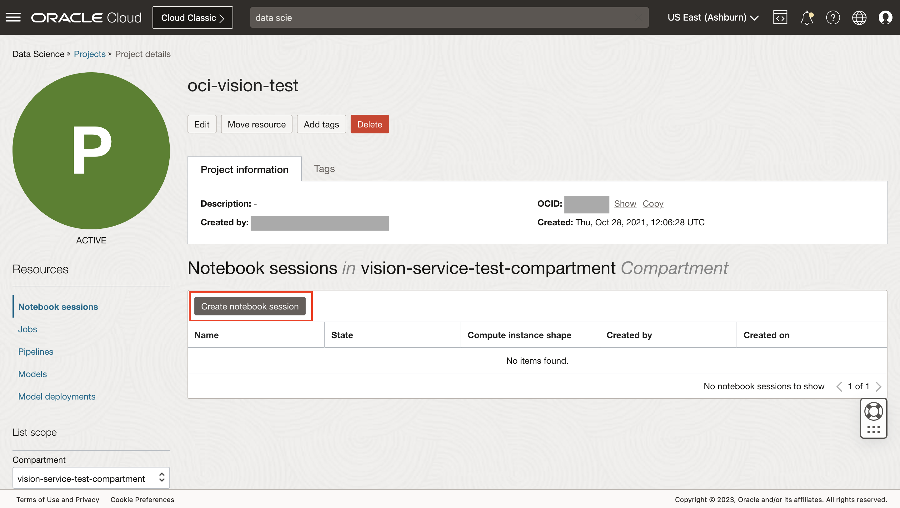
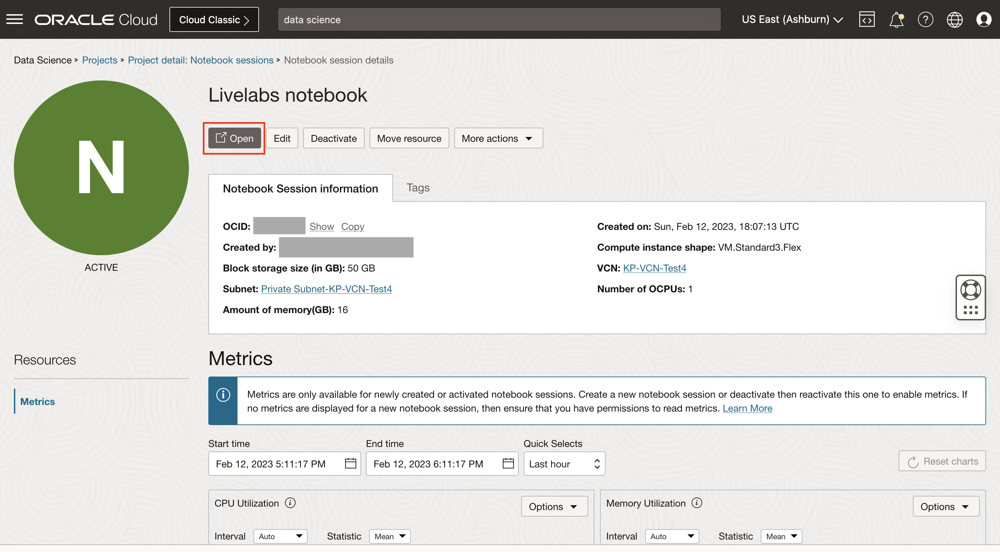

# Access OCI Vision in DataScience Notebook Session

## Introduction

In this lab session, we will show you how to access OCI Vision services in a DataScience Notebook.

The Datascience Notebook is a web application that contains code, results and visualizations that makes testing and sharing ML pipelines simple.

*Estimated Time*: 60 minutes

### Objectives
* Learn how to use Vision Services within a DataScience notebook.

### Prerequisites

Before you can start using Data Science, your tenancy administrator should set up the following networking, dynamic group, and policies.

1. Create VCN and Subnets

    Create a VCN and subnets using Virtual Cloud Networks > Start VCN Wizard > VCN with Internet Connectivity option.
    The Networking Quickstart option automatically creates the necessary private subnet with a NAT gateway.

2. Create Dynamic Group

    Create a dynamic group with the following matching rule:
    ALL { resource.type = 'datasciencenotebooksession' }

3. Create Policies

    Create a policy in the root compartment with the following statements:

    * Service Policies
        ```
        <copy>allow service datascience to use virtual-network-family in tenancy</copy>
        ```

    * Non-Administrator User Policies
        ```
        <copy>
        allow group <data-scientists> to use virtual-network-family in tenancy
        </copy>
        ```
        ```
        <copy>
        allow group <data-scientists> to manage data-science-family in tenancy
        </copy>
        ```

        where data-scientists represents the name of your user group.

    * Dynamic Group Policies
        ```
        <copy>allow dynamic-group <dynamic-group> to manage data-science-family in tenancy</copy>
        ```

        where dynamic-group represents the name of your dynamic group.


## **Task 1:** Navigate to the Data Science Notebook Session

Follow the below steps to open Notebook in DataScience:
1. Navigate to Data Science Service

    Log into OCI Cloud Console. Using the Burger Menu on the top left corner, navigate to Analytics and AI menu and click it, and then select Data Science item under Machine Learning.
        

2. Select Compartment

    Select the Compartment in which want to create your project.
        
    

3. Create Project

    Click Create Project to create a new project.
        
    

4. Enter Project Details

    Enter name and click Create Button.
        
    

5. Create Notebook Session

    Click Create Notebook Session to create a new Notebook session.
        

6. Enter Notebook Details

    Select a name.
    Choose Intel Skylake VM.Standard2.2 as the shape. 
    Set block storage to 50 GB.
    Select the subnet with Internet connectivity. (Select private subnet if you have use VCN Wizard to create VCN)
        

7. Open the OCI Data Science notebook

    The Notebook Session VM will be created. This might take a few minutes. When created you will see a screen like the following.
    Open the notebook session that was provisioned.
        

## **Task 2:** Setup API Signing Key and Config File

Generate an API signing key pair

1. Open User Settings

    Open the Profile menu (User menu icon) and click User Settings.
        

2. Open API Key

    Navigate to API Key and then Click Add API Key.
        

3. Generate API Key

    In the dialog, select Generate API Key Pair. Click Download Private Key, save the key file and then click Add.
        


4. Generate Config File

    Copy the values shown on the console.
        

    Create a config file and paste the values copied.
    Replace the key_file value with the path of your generated API Key.
        

    The private key and config files will be utilized in the next tasks.

    To know more visit [Generating API KEY](https://docs.oracle.com/en-us/iaas/Content/API/Concepts/apisigningkey.htm) and [SDK and CLI Configuration File](https://docs.oracle.com/en-us/iaas/Content/API/Concepts/sdkconfig.htm#SDK_and_CLI_Configuration_File)

5. Setup in DataScience Notebook

    Open the Notebook session you created in Task 1. Open the Terminal by clicking the Terminal icon in the Launcher Tab.

    In the terminal, create a .oci directory in the Data Science notebook session.
        ```
        <copy>mkdir ~/.oci</copy>
        ```

    Upload the Config file and the Private Key to the Notebook Session by clicking on the Upload Files Icon you just created.

    In the terminal, move those files to the .oci folder.
        ```
        <copy>mv <path of the config file> ~/.oci/</copy>
        ```
        ```
        <copy>mv <path of the private key> ~/.oci/</copy>
        ```

    

## **Task 3:** Invoke the analyze image API

Each notebook contains certain feature demos as mentioned below.

| Notebook | Features |
| --- | --- |
| Image Demo 1 | Image Classification |
| Image Demo 2 | * Object Detection<br>* Text Detection |

1. Download and Upload the Files

    Download [Image Demo 1](./files/image-demo1.ipynb) and [Image Demo 2](./files/image-demo2.ipynb) files and upload them in the Notebook. 

    

2. Execute the Notebooks

    Open the Notebooks that you've just uploaded. Now go through each of the cells and run them one by one. You can click Shift+Enter on each cell to run the code in the cell.

    These notebooks demonstrate how you can be more productive by using the Image features of Vision service.

## **Task 4:** Invoke the analyze document API

Each notebook contains certain feature demos as mentioned below.

| Notebook | Features |
| --- | --- |
| Document AI Demo 1 | Text Classification |
| Document AI Demo 2 | * Document Classification<br>* Language Classification<br>* Table Detection |

1. Download and Upload the Files

    Download [Document AI Demo 1](./files/document-demo1.ipynb) and [Document AI Demo 2](./files/document-demo2.ipynb) files and upload them in the Notebook. 
        


2. Execute the Notebooks

    Open the Notebooks that you've just uploaded. Now go through each of the cells and run them one by one. You can click Shift+Enter on each cell to run the code in the cell.

    These notebooks demonstrate how you can be more productive by using the Document AI features of Vision service.

## **Task 5:** Invoke the batch (Async) APIs 

Each notebook contains certain feature demos as mentioned below.

| Notebook | Features |
| --- | --- |
| Image Batch Demo | Image Classification |
| Document Batch Demo | Text Detection |

1. Download and Upload the Files

    Download [Image Batch Demo](./files/image-batch-demo.ipynb) and [Document Batch Demo](./files/document-batch-demo.ipynb) files and upload them in the Notebook. 
        


2. Execute the Notebooks

    Open the Notebooks that you've just uploaded. Now go through each of the cells and run them one by one. You can click Shift+Enter on each cell to run the code in the cell.

    These notebooks demonstrate how you can be more productive by using the image and document AI features over batch input using Vision service.

Congratulations on completing this lab!

[Proceed to the next section](#next).

## Acknowledgements
* **Authors**
    * Kate D'Orazio - Oracle OCI Vision Services
    * Vaishnavi Kotturu - Oracle OCI Vision Services

* **Last Updated By/Date**
    * Vaishnavi Kotturu - Oracle OCI Vision Services, February 2022
