# Lab 1: Sales Automation

<!-- ============================================================ -->

## Overview

In this exercise, you will use Oracle Fusion Sales to review an opportunity, use Deal Advisor for AI-generated insights, and explore agent-driven recommendations for account and opportunity management.  

**Estimated Time:** 10 minutes

<!-- ============================================================ -->

### Objectives

By the end of this lab, you will be able to:

- Use **Deal Advisor** to summarize an opportunity and identify potential risks.
- Use **Sales Command Center** to review territory-level opportunity insights.
- Explore AI-generated communications and pre-meeting briefs.

<!-- ============================================================ -->

## Prerequisites

Log in to Oracle Cloud with the credentials provided by the instructor.

```text
User ID: <user ID to be provided>
Password: <password to be provided>
```

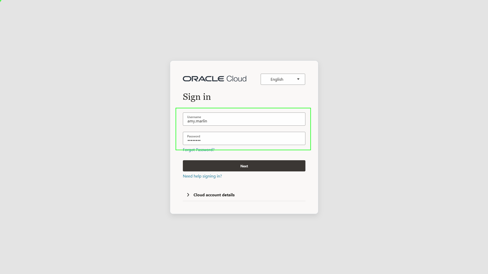

<!-- ============================================================ -->

## Steps

### Step 1: Open Redwood Sales opportunities

Upon returning from the client meeting, verify that the sales process is running smoothly.

1. Select **Redwood Sales**.
2. Select **Opportunities**.

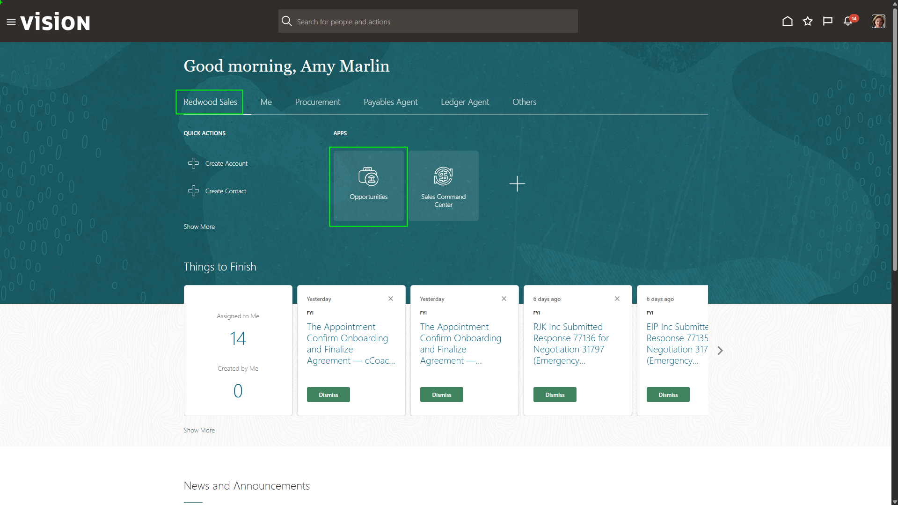

<!-- ============================================================ -->

### Step 2: Open the fitness center expansion opportunity

As a sales representative, when you login to get your day started, you are quickly brought to your list of opportunities. You see a new opportunity in your list for a fitness center expansion build. 

1. Select the opportunity titled:

```text
Fitness Center Expansion - Tandy Fitness Club
```

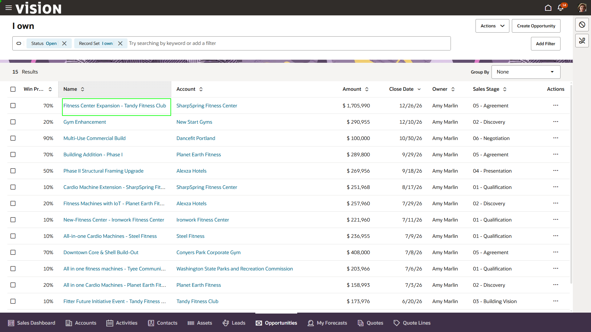

<!-- ============================================================ -->

### Step 3: Launch **Deal Advisor**

The opportunity includes a quick built-in AI summary. Use Deal Advisor to request a deeper summary and identify risks that may arise during the sales cycle.

1. Click the search bar.
2. Type:

```text
<copy>
Deal Advisor
</copy>
```

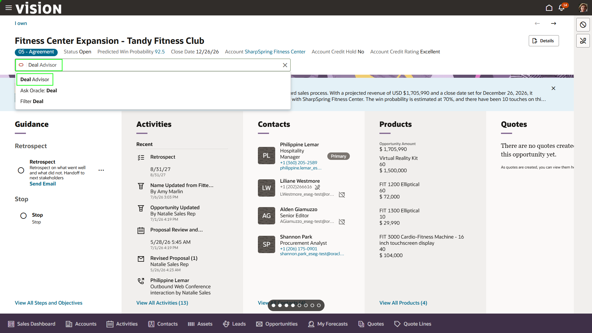

<!-- ============================================================ -->

### Step 4: Request an opportunity overview

The **Deal Advisor** is a built in AI Agent that pulls information from the individual deal as well as the deal library in order to provide accurate steps and details

1. Click the suggestion:

```text
Give me a brief overview of this opportunity
```

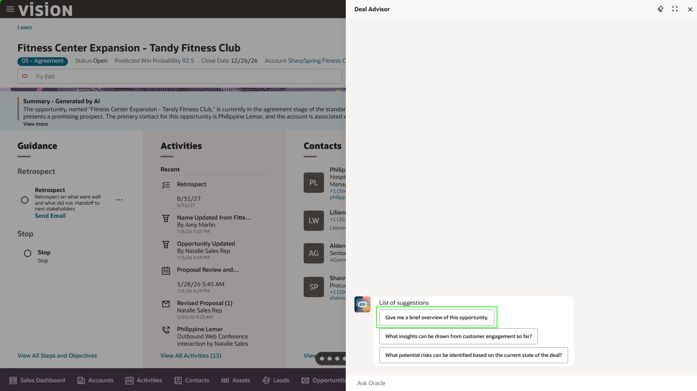

<!-- ============================================================ -->

### Step 5: Ask about sales risks

The insights are brought together in a pop-up. This curated set of insights makes AI accessible for sales users by providing win factors, AI explanations, and recommended next steps.

The application is making the artificial intelligence (AI) very user-friendly. You can click to generate AI explanations, which provides you with both the positively impacting factors for why you may win this deal, as well as, recommended next steps taking out all the guess work from the selling process.   

1. When the Summary is complete, type:

```text
<copy>
What risks may arise?
</copy>
```

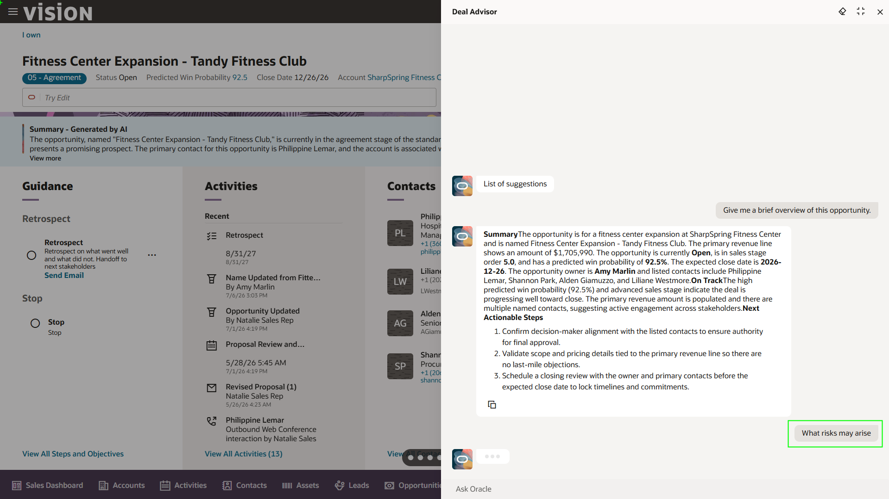

<!-- ============================================================ -->

### Step 6: Close **Deal Advisor**

Users can continuously prompt the agent to get more details. We are specifically looking to see what risks may pop up.

It can analyze other deals from the past that have fallen through and is able to generate best responses based on the actions that were taken in those cycles. 

1. Click **X** in the top-right corner.

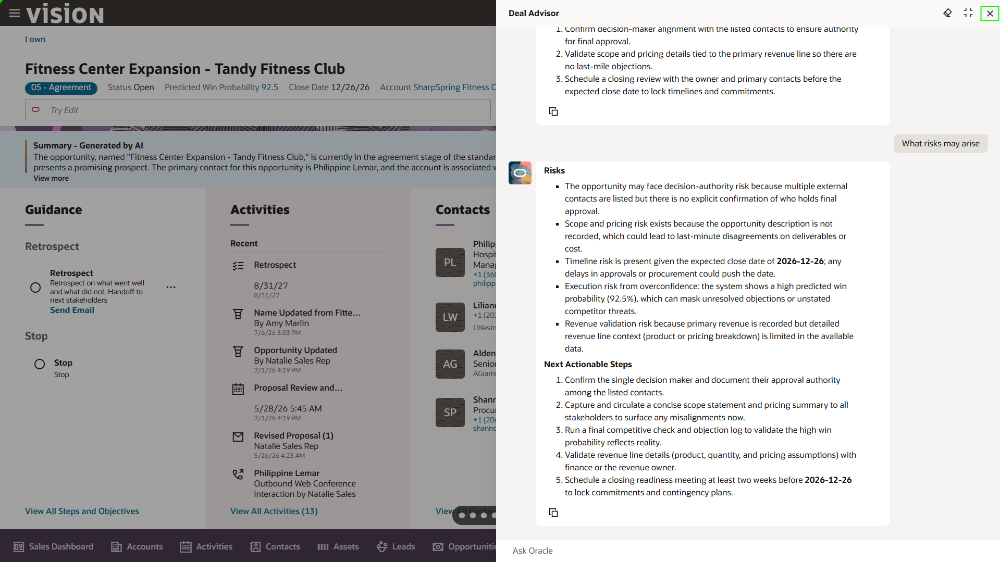

<!-- ============================================================ -->

### Step 7: Return home

That was looking at an individual sales opportunity. Now, let’s use the first agentic app of the day to analyze all your sales opportunities.

1. Click the **Home** button in the top-right corner.

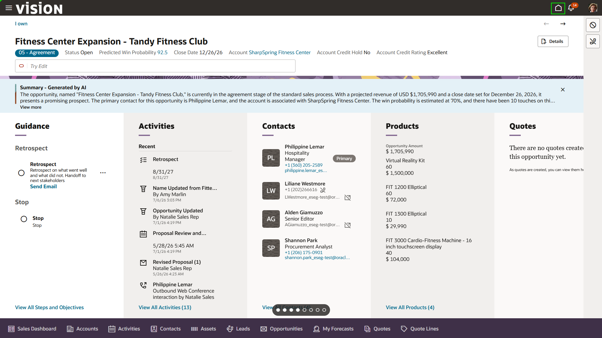

<!-- ============================================================ -->

<!-- ============================================================


### Step 8: Open Sales Command Center

**Sales Command Center** helps sales leaders manage a territory by monitoring account activity, highlighting changes or risks, and recommending next steps for each account and opportunity.

1. Select the **Sales Command Center** tile.

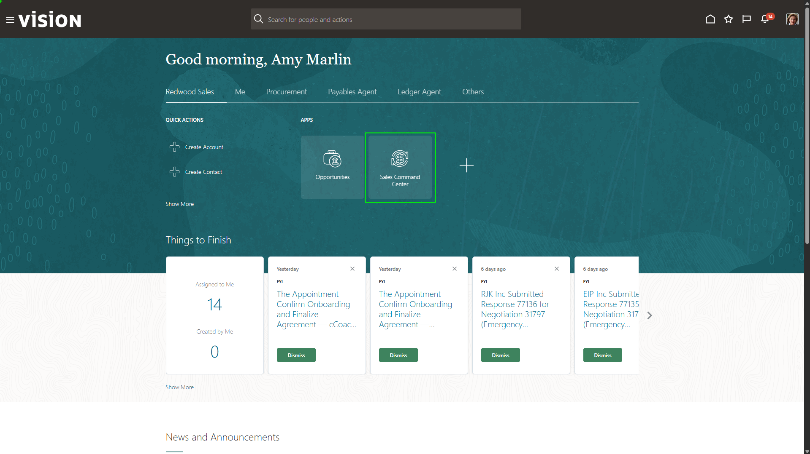

 ============================================================

### Step 9: Select an opportunity in the command center

Sales Command Center uses AI agent teams to monitor your territory, surface risks and opportunities, and drive smarter action across accounts. The tool provides summaries, risks, and next steps for each opportunity.

1. Select the opportunity titled:

```text
Multi-Use Commercial Build
```

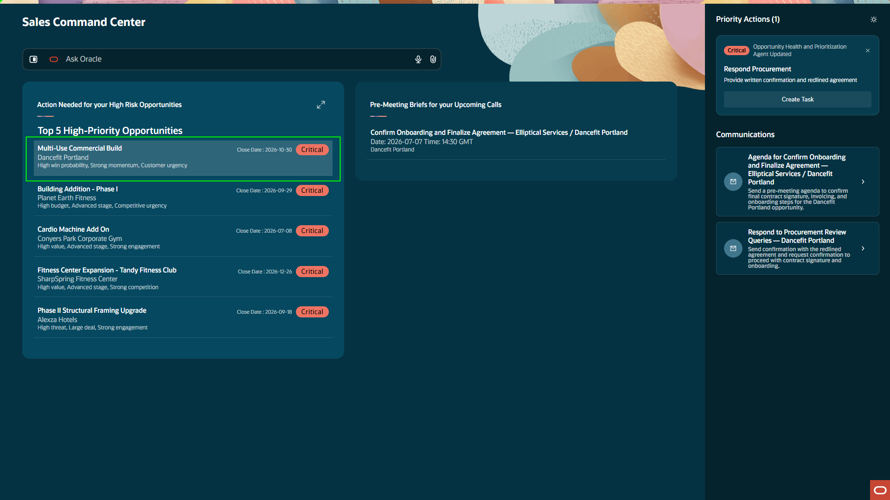

 ============================================================ 

### Step 10: Review AI communication recommendations

AI is constantly analyzing each opportunity and can provide specific recommendations like a pre-typed email. 

1. Select the tab under **Communications**.

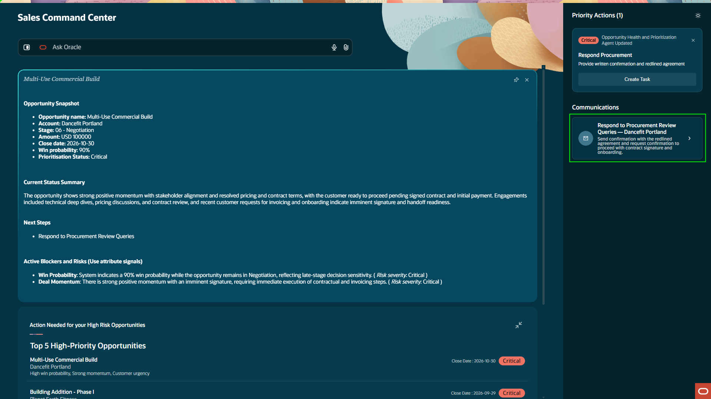

 ============================================================ 

### Step 11: Close the generated email

The tool auto-generates an email based on prior communications and next steps laid out in the business plan. 

1. Select **Close** in the bottom-right corner.

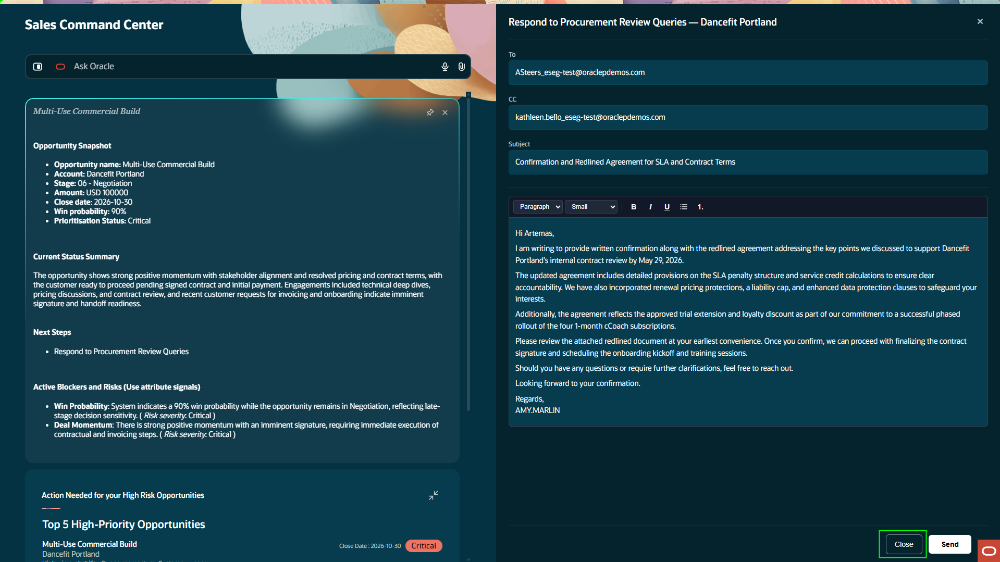

 ============================================================ 

### Step 12: Collapse the agent work area

1. Collapse the agent using the arrows in the top-right of the agent work area.

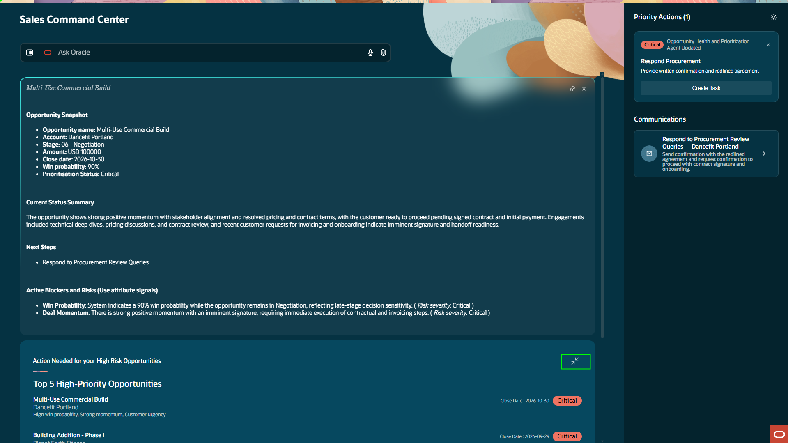

 ============================================================ 

### Step 13: Open the pre-meeting briefs agent

With many agents working together, lots of different actions can be taken from the command center. Users can create appointments, set reminders, and send emails. 

When appointments are set, the tool will automatically generate content to discuss with the customer, depending on the type of appointment. 

1. Select the field within the **Pre-meeting briefs** agent.

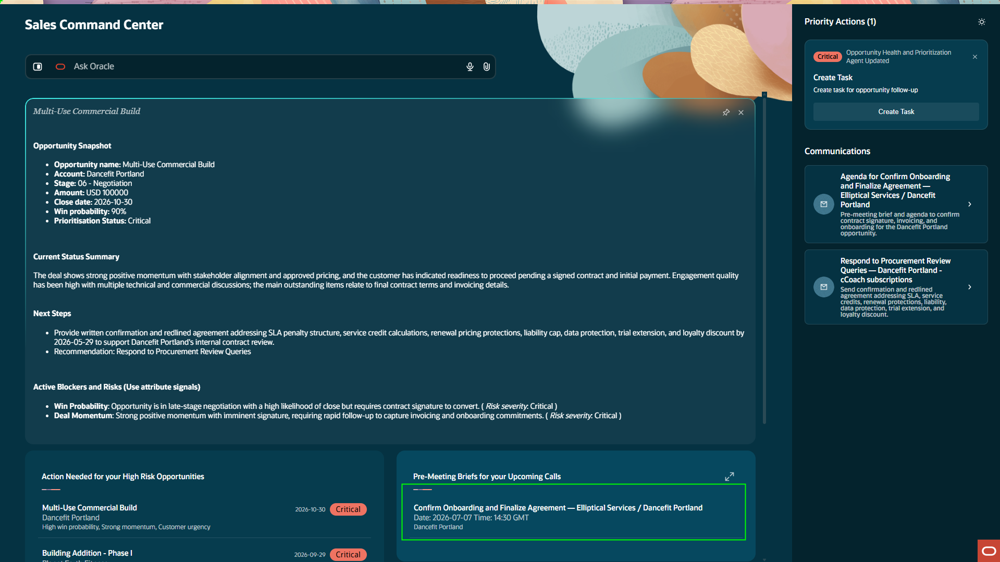

 ============================================================ 

### Step 14: Return to the primary browser tab

The agent can pull in customer stakeholders, generate a pre-meeting checklist, generate discovery questions, and identify next steps and possible gaps. This information is centralized in the command center, so users do not need to leave the application or ask separate LLMs.

1. When complete, return to the primary tab used earlier.
2. Select the tab directly to the left of the current tab.

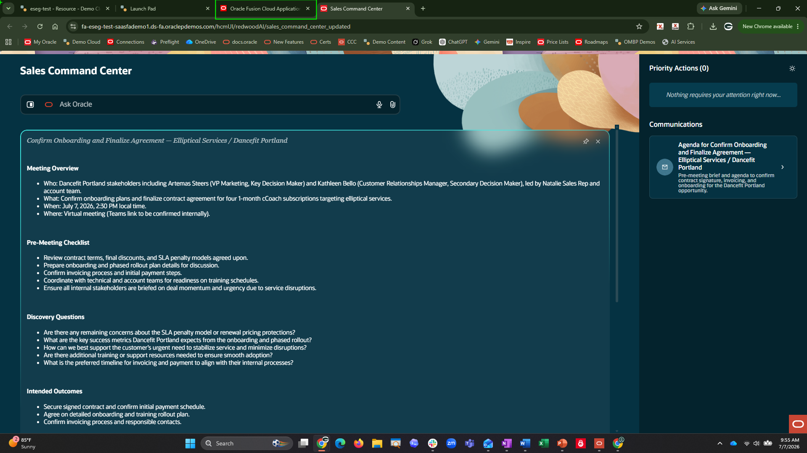

============================================================ -->

[Proceed to the next lab exercise!] (#next)

<!-- ============================================================ -->

## Summary

You have reviewed an opportunity, prompted Deal Advisor for a summary and risks, explored territory-level Sales Command Center insights, and reviewed AI-generated communication and meeting-preparation content.

<!-- ============================================================ -->

Sales Automation uses embedded AI and agentic apps to help sales users move from individual opportunity review to territory-level execution with guided insights, risk identification, and recommended actions.

[Proceed to the next lab exercise!] (#next)

## Acknowledgements
* **Author** - Jimmy Dwyer, Oracle North America
* **Contributors** -  Piyush Ruparelia, Oracle North America
* **Last Updated By/Date** - Piyush Ruparelia, July 2026, based on Fusion 26B