# Lab 2: Managing Your Team

<!-- ============================================================ -->

## Overview

In this exercise, you use **AI Chat** and **Manager Concierge Workspace** to complete managerial responsibilities from a single agentic workspace.

**Estimated Time:** 10 minutes


<!-- ============================================================ -->

### Objectives

By the end of this lab, you will be able to:

- Search for employee absence information.
- Review pending transactions and manager action items.
- Explore AI-generated manager communications.

<!-- ============================================================ -->

## Steps

### Step 1: Open **AI Chat**

Now that sales opportunities are running smoothly, review your managerial responsibilities.

1. Select the **Me** tab.
2. Select **AI Chat**.

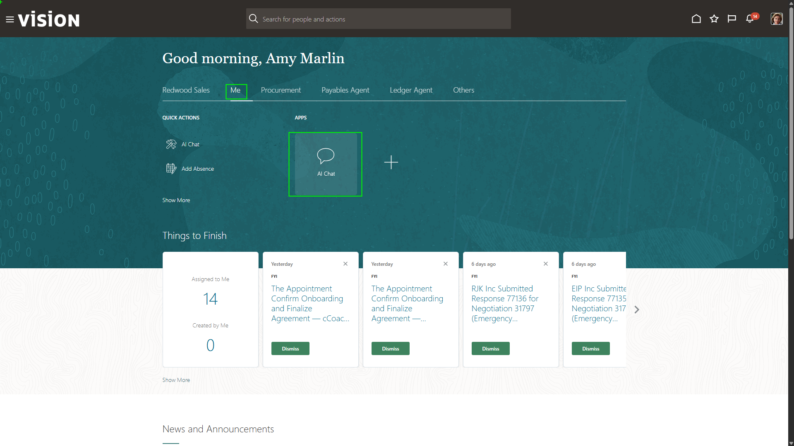

<!-- ============================================================ -->

### Step 2: Open the **Apps** tab

This is the dashboard where you can view all the agents and agentic apps, you have access to. It even includes a tab with status checks for the agents that are executing processes. 

1. Select the **Apps** tab.

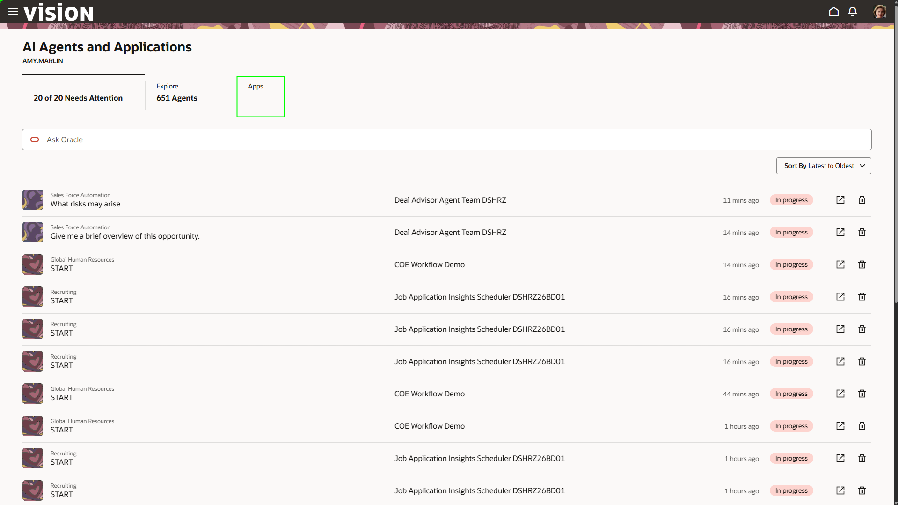

<!-- ============================================================ -->

### Step 3: Launch **Manager Concierge Workspace**

The **Apps** dashboard lists all agentic apps available to you. Agentic apps are enterprise applications powered by coordinated teams of specialized AI agents that are outcome-driven, proactive, reasoning-based, and engineered for enterprise execution.

The **Manager Concierge Workspace** unifies compensation, performance, talent, and absence signals into a single workspace that prioritizes what needs attention and enables managers to act with policy-backed, one-click decisions.

1. Scroll until you find the app titled:

```text
Manager Concierge Workspace DSHRZ26BD01
```

2. Select the pop-out window icon on the far right of the app description.

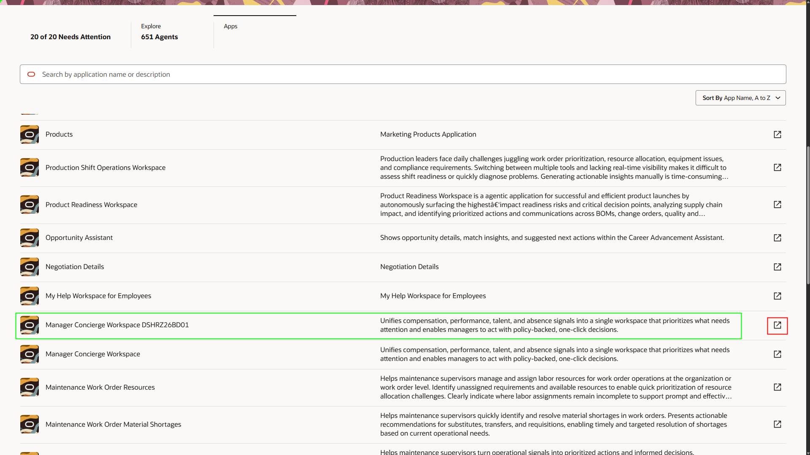

<!-- ============================================================ -->

### Step 4: Search for employee vacation days

Within the app, you see agents continously analyzing the areas that are relevant to the manager. Insights are displayed, action items are highlighted and you can search for relevant information. 

1. In the search bar at the top, type:

```text
<copy>
Debbie Sheen vacation days
</copy>
```

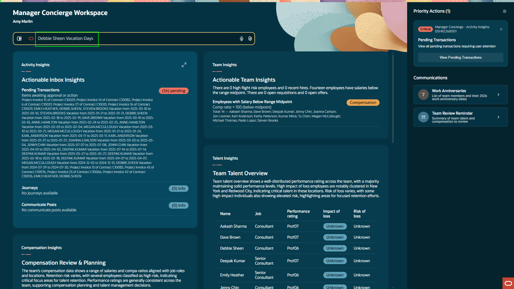

<!-- ============================================================ -->

### Step 5: Open pending transactions

The app uses its team of agents to query the prompt results. In this case, it returns the number of vacation days available for the team member. You can also drill into insights to take action.

1. Select the **Pending Transactions** insight within the **Activity Insights** agent.

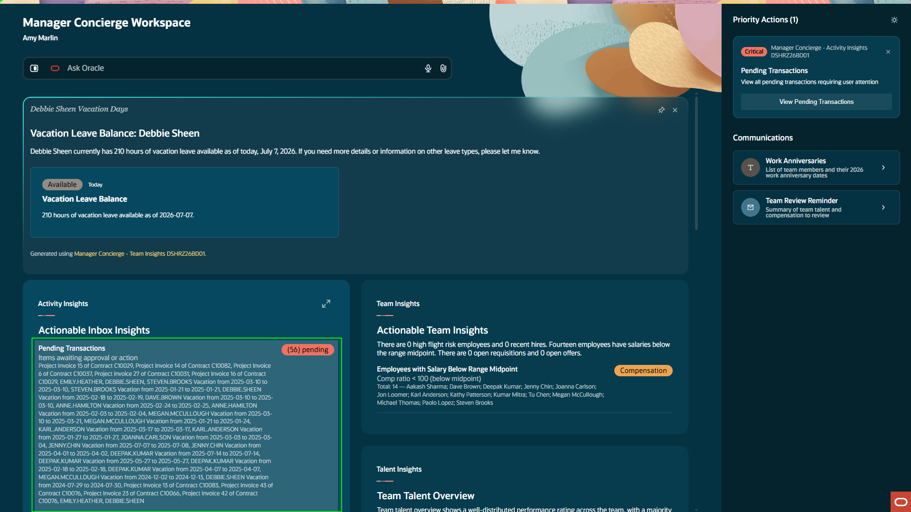

<!-- ============================================================ -->

### Step 6: Close pending transactions and collapse activity insights

The agent pulls in all of the necessary action items that are relevant to our position. Here, we see that we have a lot of approvals to keep our project underway. 

1. Click **X** in the top-right of the pending transaction pop-up.
2. Select the arrows in the top-right of the **Activity Insights** agent to collapse the fields.

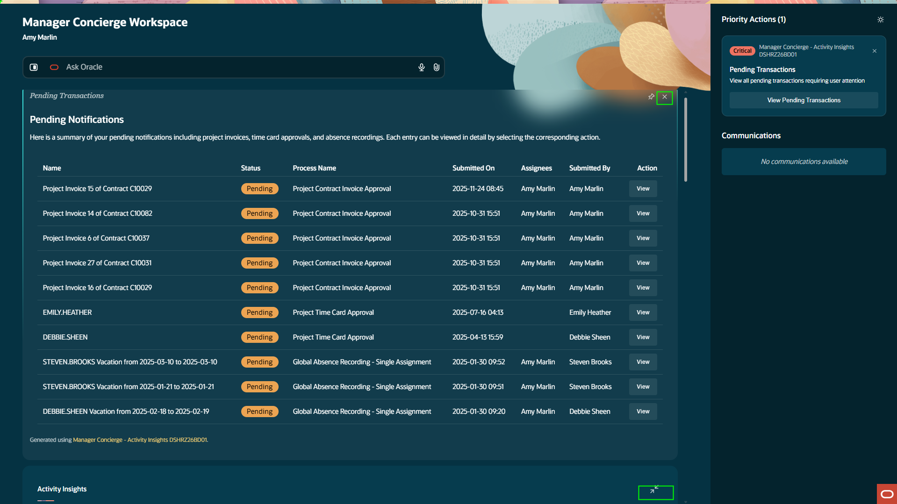

<!-- ============================================================ -->

### Step 7: Review work anniversary communications

The app also provides auto-generated communication messages relevant to a manager position.

1. Under the **Communications** section, select **Work Anniversaries**.


<!-- ============================================================ -->

### Step 8: Close the work anniversaries panel

The app provides details for specific areas like work anniversaries, so managers always have recent information. 

1. Click **X** in the top-right corner.

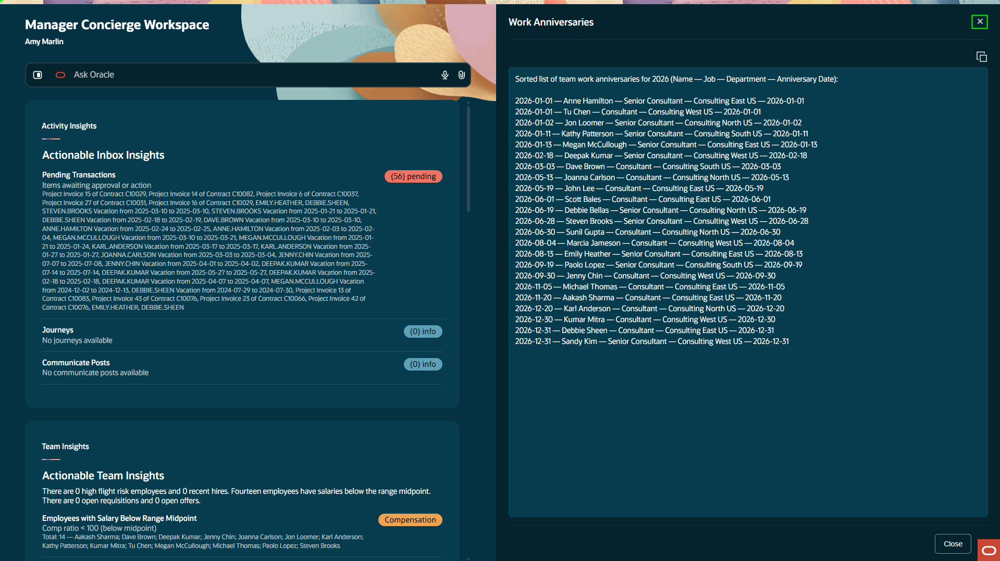

<!-- ============================================================ -->

### Step 9: Open the team review reminder

Similarly, the app can generate reminders or messages depending on tasks that have come down from upper management. 

1. Select the **Team Review Reminder** action item.

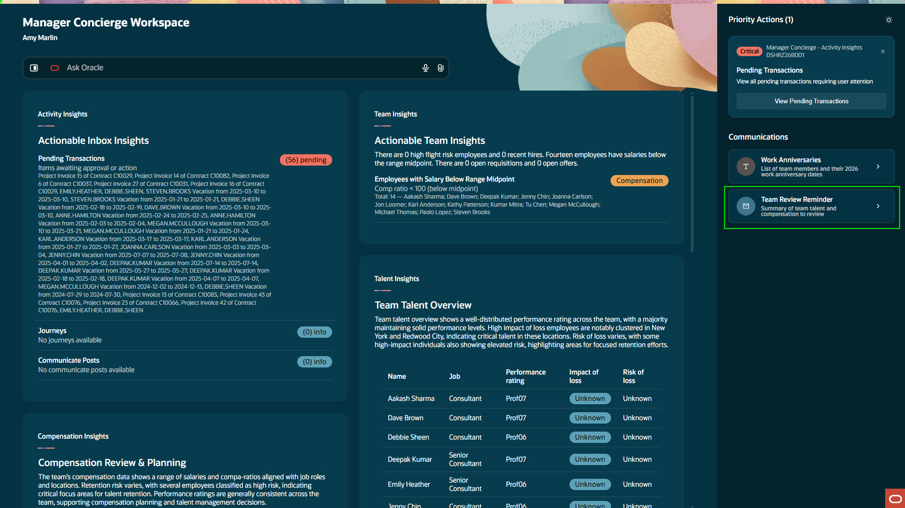

<!-- ============================================================ -->

### Step 10: Close the team review reminder

This was part of our quarterly review process that management requires. The app was able to gather all the data and lay it out in an email that you can easily send to management directly from the app. 

1. Select **X** in the top-right corner of the reminder.

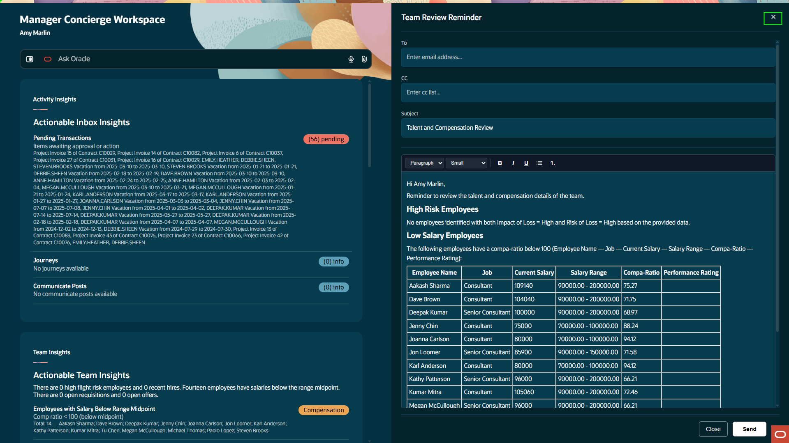

<!-- ============================================================ -->

### Step 11: Return to the **AI Chat** dashboard

With the **Manager Concierge Workspace**, we quickly completed key manager tasks in one place. This agentic app made the work simple, guided, and fast.

1. Select the browser **Back** arrow in the top-left to return to the **AI Chat** dashboard.

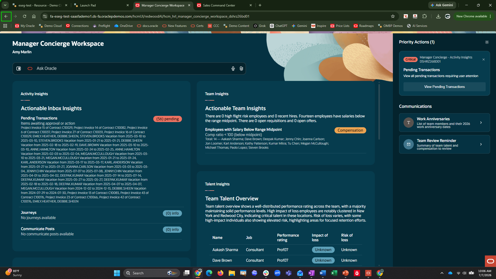

<!-- ============================================================ -->

### Step 12: Stay in **AI Chat**

1. Stay in the AI Chat dashboard.

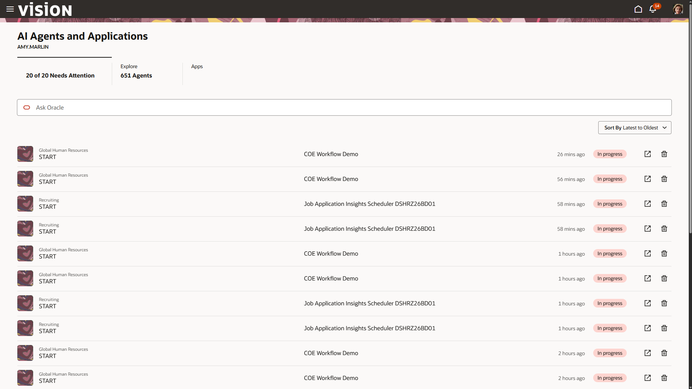

[Proceed to the next lab exercise!] (#next)

<!-- ============================================================ -->

## Summary

You have used the **Manager Concierge Workspace** to search employee information, review pending transactions, and inspect AI-generated manager communications.

**Manager Concierge Workspace** centralizes manager tasks and uses specialized AI agents to surface insights, prioritize actions, and generate communications.

[Proceed to the next lab exercise!] (#next)

## Acknowledgements
* **Author** - Jimmy Dwyer, Oracle North America
* **Contributors** -  Piyush Ruparelia, Oracle North America
* **Last Updated By/Date** - Piyush Ruparelia, July 2026, based on Fusion 26B