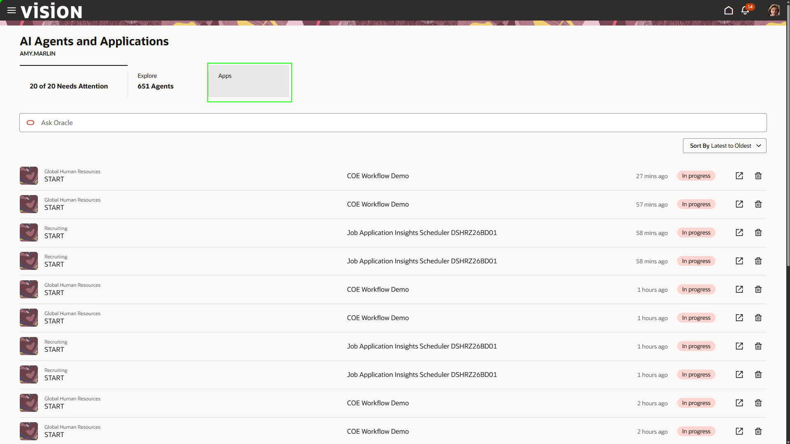
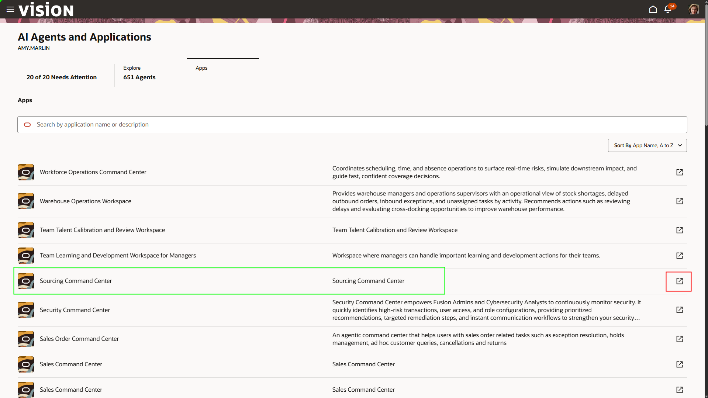
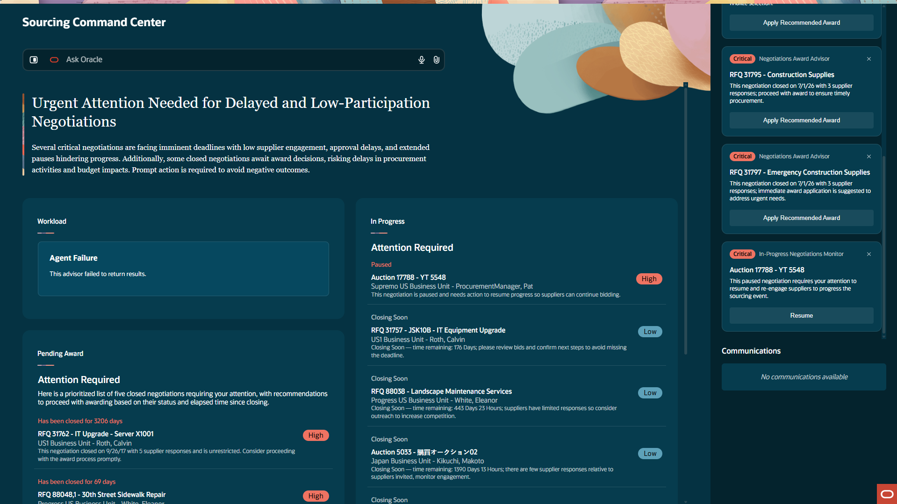
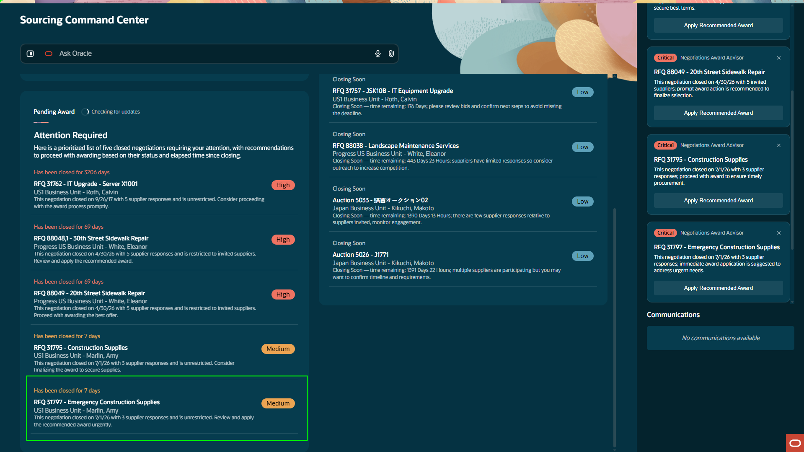
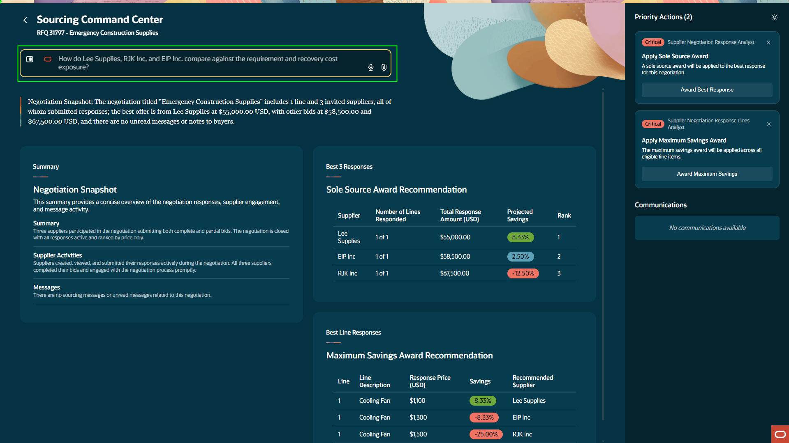
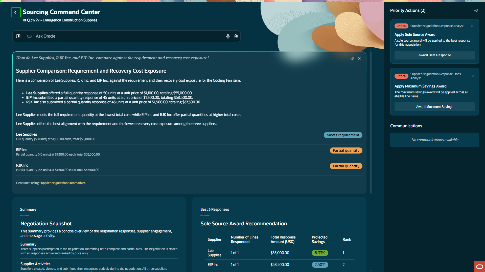
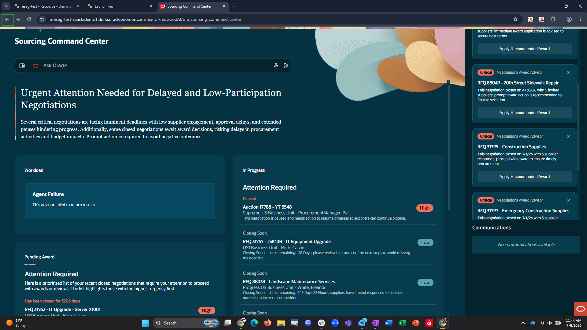

# Lab 3: Automating the Requisition Process

<!-- ============================================================ -->

## Overview

In this exercise, you use **Sourcing Command Center** and AI-assisted requisition workflows to move from supplier negotiation to requisition review and submission.

**Estimated Time:** 10 minutes

<!-- ============================================================ -->

### Objectives

By the end of this lab, you will be able to:

- Review a pending award for emergency construction supplies.
- Prompt the sourcing agent for supplier comparison details.
- Review a requisition created from a supplier quote.

**Notes**

**Instructor-led step:** The first part of the quote-to-requisition process is completed by the instructor. Explanations are provided during the lab.

```text
<b>Important:</b> Do <b>NOT</b> award any supplier during this exercise.
```

<!-- ============================================================ -->

## Steps

### Step 1: Open the **Apps** tab

Now that we’ve managed our sales opportunities and kept up with our managerial responsibilities, we now need to ensure one of our ongoing projects has the materials needed. There is an emergency that caused the loss of key items that need to be requisitioned quickly to keep the project on time.

1. Select the **Apps** tab.



<!-- ============================================================ -->

### Step 2: Launch **Sourcing Command Center**

A negotiation was issued to three suppliers so the necessary supplies can be sourced and the project can stay on track.  We are going to utilize the **Sourcing Command Center** to streamline this process.

1. Find **Sourcing Command Center**.
2. Select the pop-out icon on the far right.



<!-- ============================================================ -->

### Step 3: Review sourcing activity

**Sourcing Command Center** provides one place to monitor sourcing activity, supplier responses, savings opportunities, and items that need attention. It turns sourcing data into clear insights so users can act faster and make better award decisions.



<!-- ============================================================ -->

### Step 4: Open the emergency construction supplies award

The negotiation is closed and ready for action. The embedded agent prioritizes negotiations assigned to you so you can act immediately when necessary.

1. In the **Pending Award** agent, find and select the requisition titled:

```text
Emergency Construction Supplies
```



<!-- ============================================================ -->

### Step 5: Compare supplier responses

The system compiles supplier information into best-action cards. It shows best response, savings, and recommendations for the three supplier responses. 

We can analyze these responses and try to make the best decision possible. We can also prompt the agent for more information because we want to understand the details behind the responses.

1. In the chat bar, type:

```text
<copy>
How do Lee Supplies, RJK Inc, and EIP Inc. compare against the requirements and recovery cost exposure?
</copy>
```



<!-- ============================================================ -->

### Step 6: Return from the award details without awarding

All of this is compiled by the agent, making the decision process much easier and more streamlined.

The system also recommends that we move forward with the option that offers the best cost savings while still meeting expectations. 

1. Do **NOT** award any supplier.
2. Exit the command center by clicking the back arrow **<** next to the **Sourcing Command Center** title located at the top left.



<!-- ============================================================ -->

### Step 7: Return to the main work area

After a negotiation is awarded, the award can move through an automated approval process. The supplier then sends a quote, which can be converted into a requisition.

1. Click the browser **Back** arrow to return to the main work area.



<!-- ============================================================ -->

### Step 8: Return home

1. Select the **Home** button in the top-right corner.


<!-- ============================================================ -->

### Step 9: Instructor-led quote processing

A quote has been received from Lee Supplies. AI Agents are used to process the quote and generate a requisition.

```text
<b>Instructor note:</b> The first part of this process is performed by the instructor.
```

<!-- ============================================================ -->

### Step 10: Open Purchase Requisitions

To continue the requisition process, access the purchase requisition landing page.

1. Click the **Procurement** tab.
2. Click **Purchase Requisitions**.


<!-- ============================================================ -->

### Step 11: Open the **Lee Supplies** requisition

From here, you can view the details around your recent requisitions and see brief details of their status and where they are in the requisition process. This is also the area where you can search the entire catalogue of items. There are also embedded AI features in the top ribbon to allow users to easily find information about their requisition needs.

We can also see the requisition that was auto created by our quote to req agent. 

1. Select the most recent requisition from **Lee Supplies**.


<!-- ============================================================ -->

### Step 12: Open **More Information**

The agent created a new requisition directly from the supplier quote. Note that the requisition is in draft status. This is because the system will not submit this req without human oversight first. 

1. Select the **More Information** section.


<!-- ============================================================ -->

### Step 13: Edit the requisition line

Necessary information was auto populated based on fields depicted from the quote. The original quote is always attached to the system requisition for reference by users. 

1. Select the three dots at the far right of the line.
2. Select the **Edit** option from the drop-down menu.


<!-- ============================================================ -->

### Step 14: Open edit mode

Procurement users can edit any necessary requisition information.

1. Click the pencil icon in the top-right corner.


<!-- ============================================================ -->

### Step 15: Cancel edit mode

If the agent made mistakes or data needs to be changed, edits would be made here.

1. Click **Cancel** in the top-right corner.


<!-- ============================================================ -->

### Step 16: Submit the requisition

The requisition is ready to submit and expedite.

1. Select **Submit** in the top-right corner.


<!-- ============================================================ -->

### Step 17: Return home after submission

After submission, the system processes the requisition, automatically generates a purchase order, sends the purchase order to the supplier, and waits for invoicing and supplies from the awarded supplier.

1. Select the **Home** button in the top-right corner.


[Proceed to the next lab exercise!] (#next)

<!-- ============================================================ -->

## Summary

You have reviewed sourcing options, used the sourcing agent to compare suppliers, inspected a requisition generated from a supplier quote, and submitted the requisition after review.

The requisition process uses agentic AI to streamline sourcing analysis, quote interpretation, requisition creation, and submission while preserving human oversight.

[Proceed to the next lab exercise!] (#next)

## Acknowledgements
* **Author** - Jimmy Dwyer, Oracle North America
* **Contributors** -  Piyush Ruparelia, Oracle North America
* **Last Updated By/Date** - Piyush Ruparelia, July 2026, based on Fusion 26B