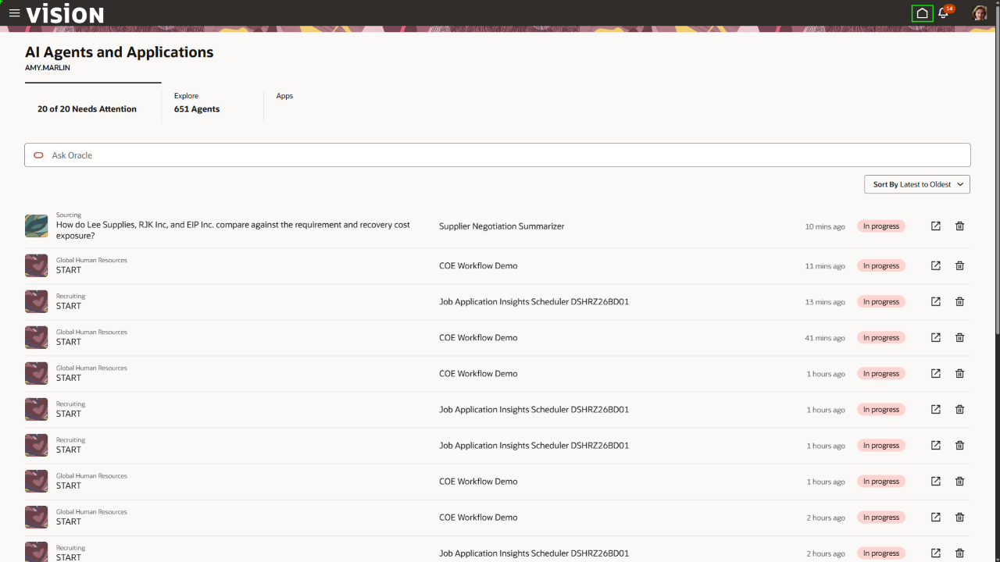
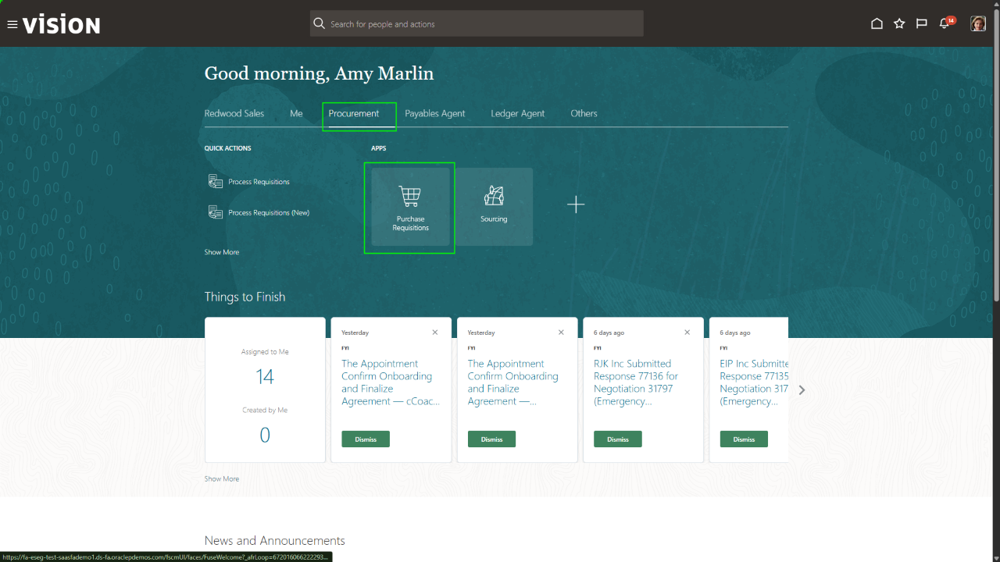
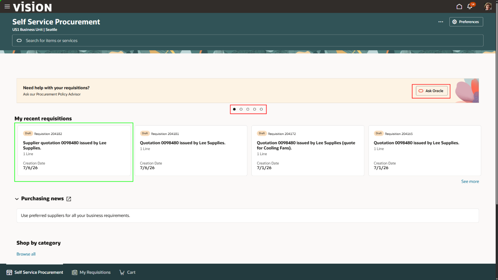
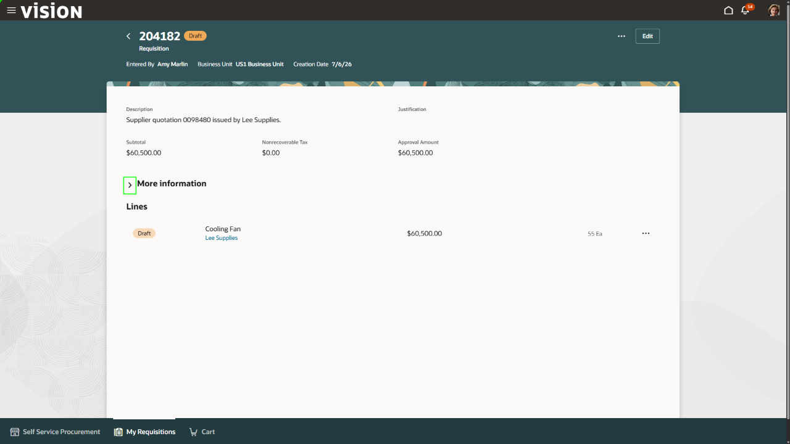
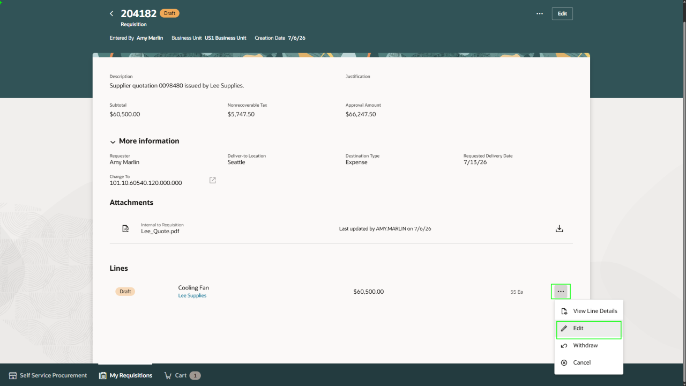
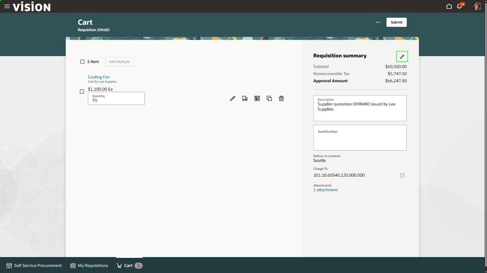
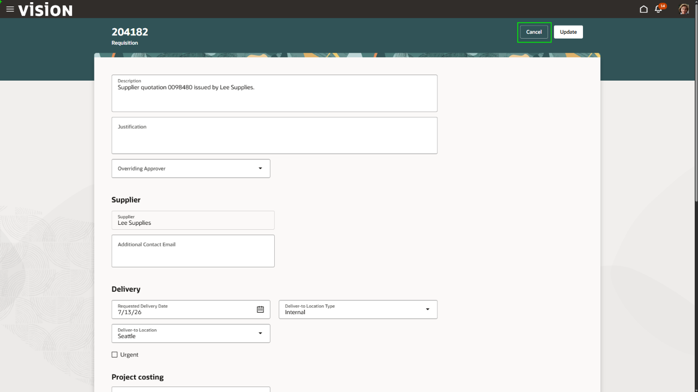
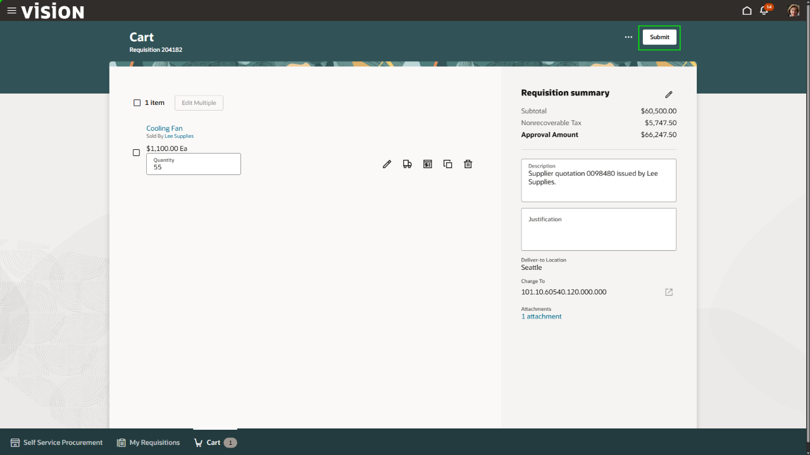
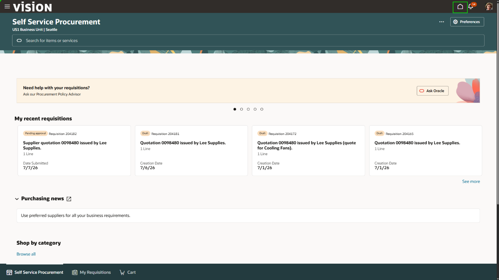

# Lab 3: Automating the Requisition Process

<!-- ============================================================ -->

## Overview

In this exercise, you will see the **Sourcing Command Center** and AI-assisted requisition workflows to move from supplier negotiation to requisition review and submission.

**Estimated Time:** 10 minutes

<!-- ============================================================ -->

### Objectives

By the end of this lab, you will be able to:

- Review a pending award for emergency construction supplies.
- Prompt the sourcing agent for supplier comparison details.
- Review a requisition created from a supplier quote.

<!--
**Notes**

**Instructor-led step:** The first part of the quote-to-requisition process is completed by the instructor. Explanations are provided during the lab.

```text
<b>Important:</b> Do <b>NOT</b> award any supplier during this exercise.
```
-->

<!-- ============================================================ -->

## Steps

### Step 1: Return home

1. If not already on the Home page, select the **Home** button in the top-right corner.



<!-- ============================================================ -->

### Step 2: Instructor-led quote processing

A quote has been received from Lee Supplies. AI Agents are used to process the quote and generate a requisition.

```text
<b>Instructor note:</b> The first part of this process is performed by the instructor.
```

<!-- ============================================================ -->

### Step 3: Open Purchase Requisitions

To continue the requisition process, access the purchase requisition landing page.

1. Click the **Procurement** tab.
2. Click **Purchase Requisitions**.



<!-- ============================================================ -->

### Step 4: Open the **Lee Supplies** requisition

From here, you can view the details around your recent requisitions and see brief details of their status and where they are in the requisition process. This is also the area where you can search the entire catalogue of items. There are also embedded AI features in the top ribbon to allow users to easily find information about their requisition needs.

We can also see the requisition that was auto created by our quote to req agent. 

1. Select the most recent requisition from **Lee Supplies**.



<!-- ============================================================ -->

### Step 5: Open **More Information**

The agent created a new requisition directly from the supplier quote. Note that the requisition is in draft status. This is because the system will not submit this req without human oversight first. 

1. Select the **More Information** section.



<!-- ============================================================ -->

### Step 6: Edit the requisition line

Necessary information was auto populated based on fields depicted from the quote. The original quote is always attached to the system requisition for reference by users. 

1. Select the three dots at the far right of the line.
2. Select the **Edit** option from the drop-down menu.



<!-- ============================================================ -->

### Step 7: Open edit mode

Procurement users can edit any necessary requisition information.

1. Click the pencil icon in the top-right corner.



<!-- ============================================================ -->

### Step 8: Cancel edit mode

If the agent made mistakes or data needs to be changed, edits would be made here.

1. Click **Cancel** in the top-right corner.



<!-- ============================================================ -->

### Step 9: Submit the requisition

The requisition is ready to submit and expedite.

1. Select **Submit** in the top-right corner.



<!-- ============================================================ -->

### Step 10: Return home after submission

After submission, the system processes the requisition, automatically generates a purchase order, sends the purchase order to the supplier, and waits for invoicing and supplies from the awarded supplier.

1. Select the **Home** button in the top-right corner.



[Proceed to the next lab exercise!] (#next)

<!-- ============================================================ -->

## Summary

You have seen the sourcing options within the sourcing agent to compare suppliers, inspected a requisition generated from a supplier quote, and submitted the requisition after review.

The requisition process uses agentic AI to streamline sourcing analysis, quote interpretation, requisition creation, and submission while preserving human oversight.

[Proceed to the next lab exercise!] (#next)

## Acknowledgements
* **Author** - Jimmy Dwyer, Oracle North America
* **Contributors** -  Piyush Ruparelia, Oracle North America
* **Last Updated By/Date** - Piyush Ruparelia, July 2026, based on Fusion 26B