# Exercise 1-4: Accounting Automation

<!-- ============================================================ -->

## Overview

In this exercise, you use Payables Agent and Ledger Agent to process a supplier invoice, review accounting exceptions, create monitoring prompts, and query ledger activity using natural language.

<!-- ============================================================ -->

## Objective

By the end of this exercise, you will be able to:

- Review an invoice processed by Payables Agent.
- Inspect a pending control check and invoice details.
- Use Ledger Agent to review accounting exceptions.
- Create a monitoring prompt from natural language.
- Query payables invoice information from the ledger.

<!-- ============================================================ -->

## Steps

### Step 1: Open Payables Agent

The requisition process is complete, the supplier has sent supplies, and an invoice has been received. Payables Agent helps review and process supplier invoices by checking for issues, highlighting next steps, and moving invoices forward faster.

1. Select the **Payables Agent** tab.
2. Select the **Payables Agent** tile.


<!-- ============================================================ -->

### Step 2: Open the Lee Supplies invoice image

Payables Agent shows relevant invoices from multiple sources, including mass uploads, email, and manual entry. The tool scans invoice information, uploads it to the system, and performs checks to validate accuracy.

1. Find the invoice from **Lee Supplies**.
2. Confirm the amount matches the requisition:

```text
60,225.00
```

3. Select the eye icon on the right side.


<!-- ============================================================ -->

### Step 3: Close the invoice image

The original supplier invoice is attached to the invoice in the system and remains with the transaction throughout its lifecycle, including in the general ledger.

1. Select **X** in the top-right of the image.


<!-- ============================================================ -->

### Step 4: Open the pending control check

Payables Agent checks invoices against required controls before they can move forward. A pending control check means one validation still needs to be completed.

1. Select the blue hyperlink:

```text
1 Pending Control Check
```


<!-- ============================================================ -->

### Step 5: Open the invoice record

The invoice appears in the system and requires user interaction before processing can continue.

1. Click the blue hyperlinked invoice name.


<!-- ============================================================ -->

### Step 6: Review scanned invoice details

The Payables Agent scanned header, line-level, and tax information into the invoice. This process can also be fully automated using user-defined thresholds. The agent can scan the invoice, process information, match the invoice to purchase orders, validate the invoice, post it to the ledger, and route it for payment.

1. Click the **Home** button in the top-right corner.


<!-- ============================================================ -->

### Step 7: Open Ledger Agent

Now that the invoice is processed, use Ledger Agent to ensure accounting accuracy and monitor the general ledger. Ledger Agent helps review ledger activity and guides users through checks, exceptions, and next steps.

1. Select the **Ledger Agent** tab.
2. Select the **Ledger Agent** tile.

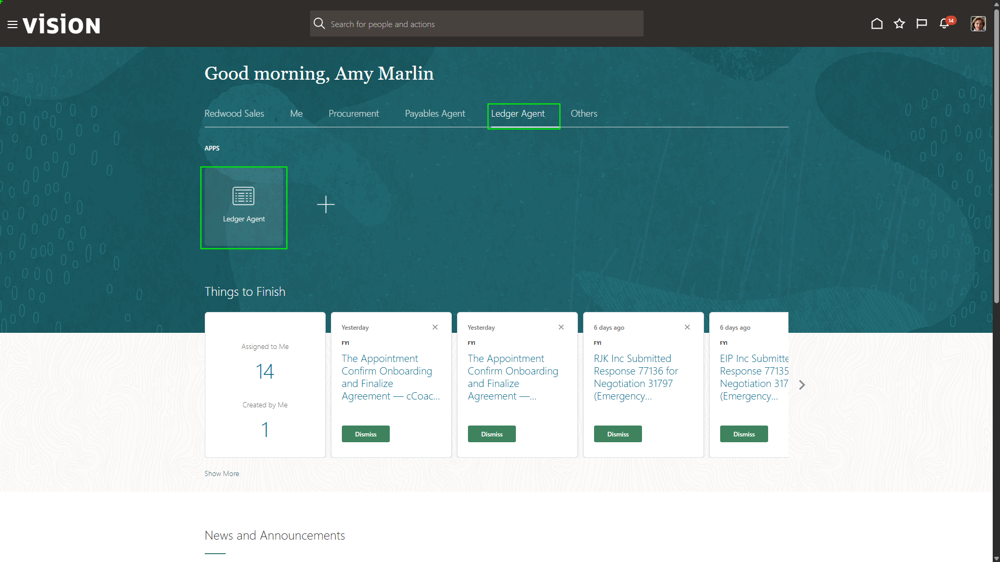

<!-- ============================================================ -->

### Step 8: Open an accounting process exception insight

The Ledger Agent dashboard shows insights into journal activity, balances, and ledger exceptions. These insights help users spot issues, understand trends, and decide what to review next.

1. Select the **Accounting Process Exception** insight that summarizes payables issues.

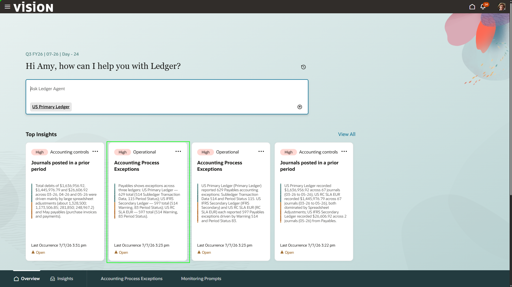

<!-- ============================================================ -->

### Step 9: Ask Ledger Agent about exceptions

The agent provides a list of exceptions based on the insight. You can prompt the agent for additional details to help resolve issues before period close.

1. In the **Ask Ledger Agent** chat box, type:

```text
Show the journals with exceptions for US Primary ledger that are within the Subledger Transaction Data Exception category.
```

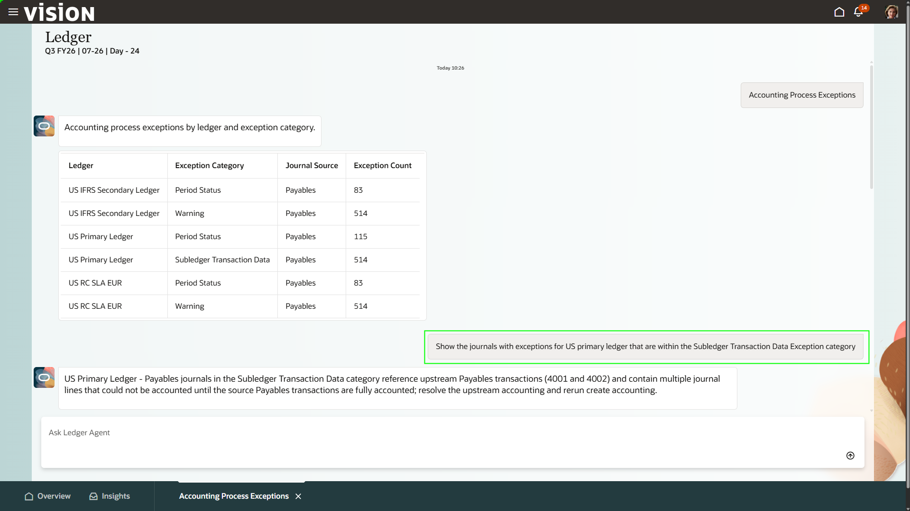

<!-- ============================================================ -->

### Step 10: Return to Insights

The agent returns more granular details with action items for resolving the accounting issue.

1. Select the **Insights** tab in the bottom-left corner.

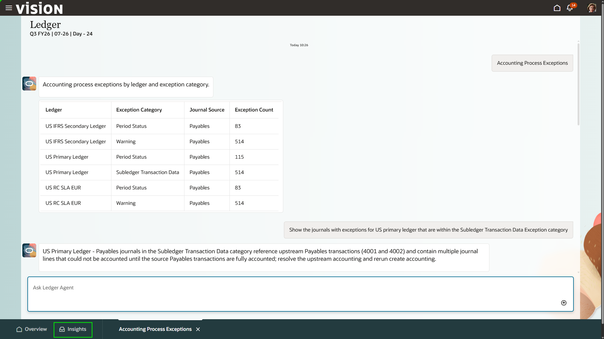

<!-- ============================================================ -->

### Step 11: Open monitoring prompts

The Insights dashboard shows created insights and allows users to create additional prompts. Users can create prompts to monitor accounts or general ledger activity under their purview, enabling the agent to monitor problem areas and support accounting accuracy and a faster close.

1. Select the **Monitoring Prompts** tab.

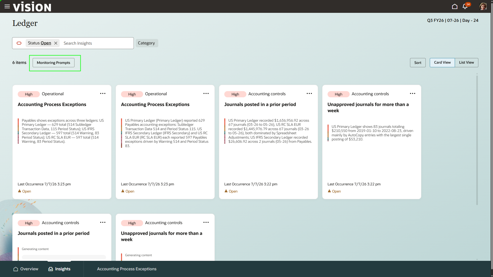

<!-- ============================================================ -->

### Step 12: Create a new monitoring prompt

1. Select the **+** button.

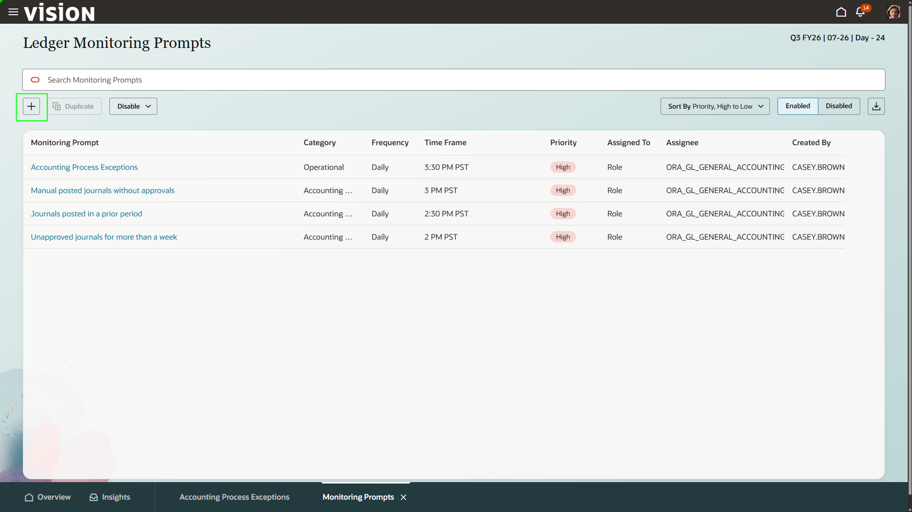

<!-- ============================================================ -->

### Step 13: Select a monitoring prompt template

Prompts can be built from templates or created from scratch.

1. Select:

```text
AP Liability Variance for Vision Foods Marketing US > 10% QoQ
```

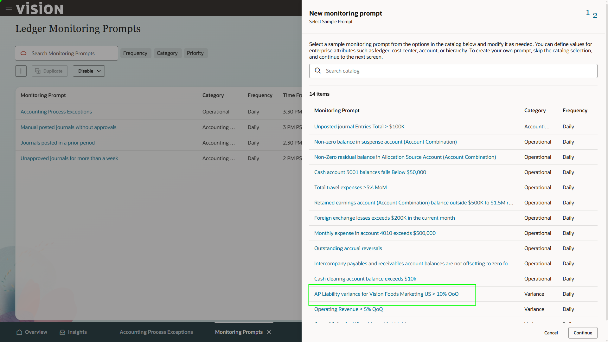

<!-- ============================================================ -->

### Step 14: Build the prompt using natural language

Users can use natural language to build monitoring prompts. The agent identifies areas of concern and understands what the user wants to monitor. Frequency, time frame, and messages can be configured from the dashboard.

1. In the prompt field, type:

```text
AP Liability US QoQ > 10%
```

2. Click **Evaluate**.
3. Notice that the tool populates the required chart of accounts dimensions from the natural language prompt.
4. Select **Create Prompt**.

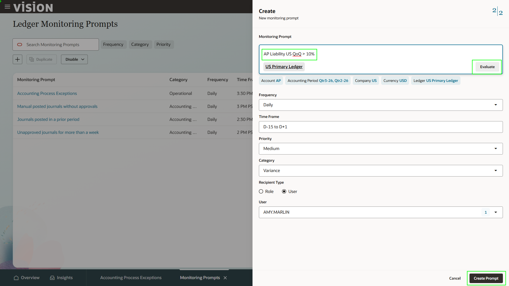

<!-- ============================================================ -->

### Step 15: Return to Overview

A new monitoring prompt is created. If the AP liability account changes by more than 10% from the last quarter, the tool alerts the user and provides supporting documentation such as high-value invoices.

1. Select **Overview** in the bottom-left corner.

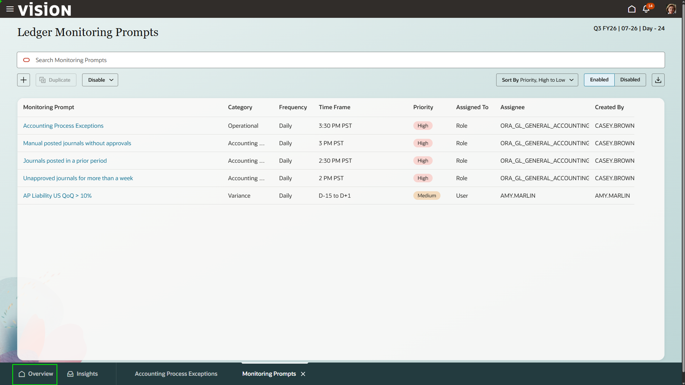

<!-- ============================================================ -->

### Step 16: Ask for supplier-level payables amounts

You can chat with the agent to find general ledger information using natural language.

1. In the search bar, type:

```text
Breakdown by supplier the total accounted amount for payables invoices for account 62520 for period 05-26
```

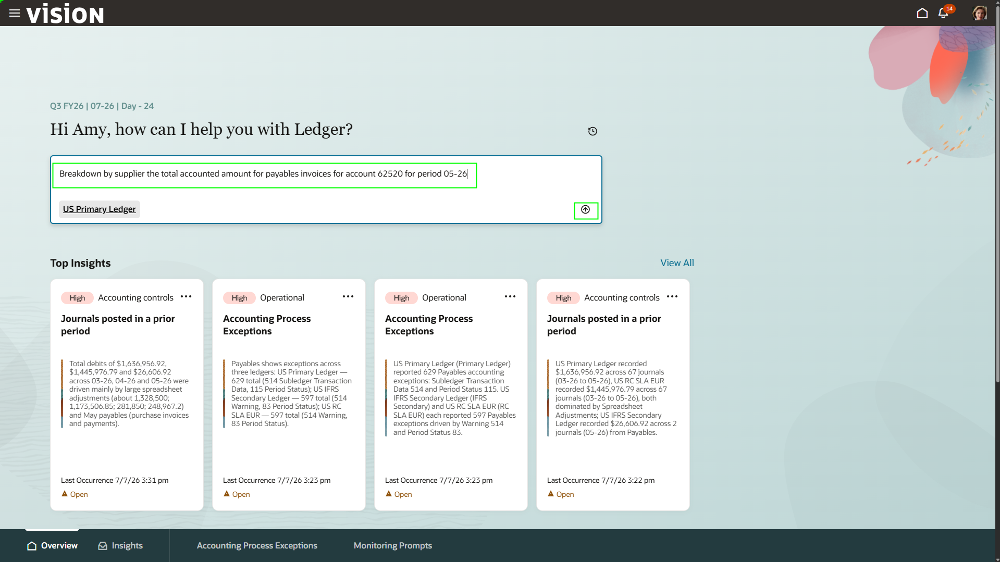

<!-- ============================================================ -->

### Step 17: Ask for Lee Supplies invoices

The agent returns relevant information based on role-based security. If a user requests information outside their permissions, the agent does not provide the details.

1. In the chat bar, type:

```text
Show the invoices for Lee Supplies
```

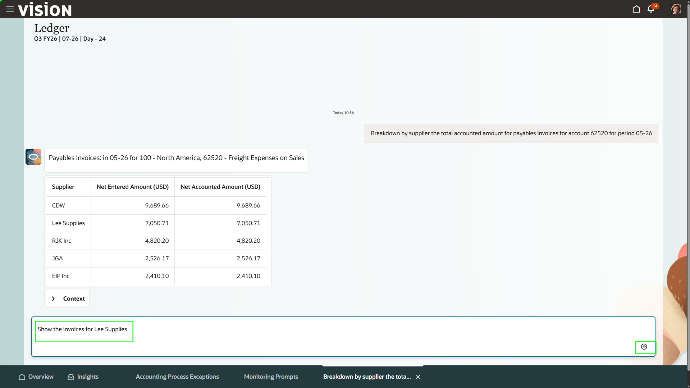

<!-- ============================================================ -->

### Step 18: Ask for payables invoices by account and period

Because the system is connected, invoice details can be reviewed from the ledger. Search for the invoice processed for the emergency requisition.

1. In the chat bar, type:

```text
Show payables invoices for account 63542 in period 07-26
```

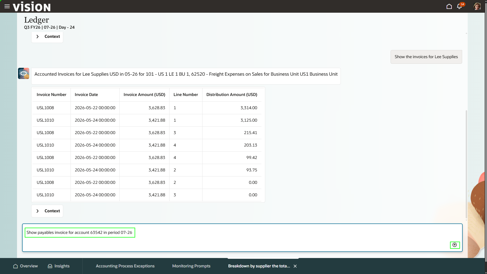

<!-- ============================================================ -->

### Step 19: Return home

The accounted invoice processed by the Payables Agent is shown and broken down by line number. Agentic AI streamlined the process from the original negotiation through the general ledger.

1. Select the **Home** button in the top-right corner.

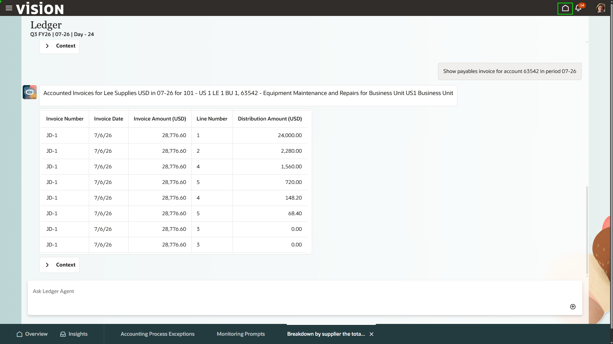

<!-- ============================================================ -->

## Expected Result

You have reviewed a supplier invoice, inspected a pending control check, used Ledger Agent to investigate accounting exceptions, created a monitoring prompt, and queried payables invoice data through natural language.

<!-- ============================================================ -->

## Summary

Payables Agent and Ledger Agent streamline invoice processing, validation, ledger monitoring, exception resolution, and financial analysis across the accounting process.
