# Lab 4: Accounting Automation

<!-- ============================================================ -->

## Overview

In this exercise, you use **Payables Agent** and **Ledger Agent** to process a supplier invoice, review accounting exceptions, create monitoring prompts, and query ledger activity using natural language.

**Estimated Time:** 10 minutes

<!-- ============================================================ -->

### Objectives

By the end of this lab, you will be able to:

- Review an invoice processed by **Payables Agent**.
- Use **Ledger Agent** to review accounting exceptions.
- Create a monitoring prompt from natural language.

<!-- ============================================================ -->

## Steps

### Step 1: Open **Payables Agent**

The requisition process is complete, the supplier has sent supplies, and an invoice has been received. We will continue using AI Agents to automate the accounting process. 

**Payables Agent** helps review and process supplier invoices by checking for issues, highlighting next steps, and moving invoices forward faster.

1. Select the **Payables Agent** tab.
2. Select the **Payables Agent** tile.

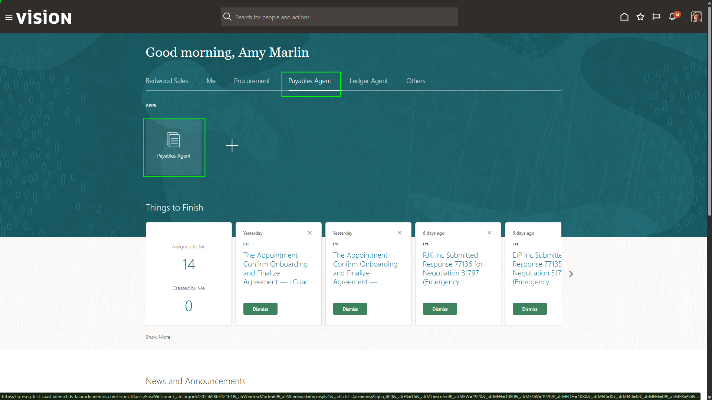

<!-- ============================================================ -->

### Step 2: Open the **Lee Supplies** invoice image

**Payables Agent** shows relevant invoices from multiple sources, including mass uploads, email, and manual entry. The tool scans invoice information, uploads it to the system, and performs checks to validate accuracy.

1. Find the invoice from **Lee Supplies**.
2. Confirm the amount is for **60,225.00** which is the same as the amount of the requisition created earlier.

3. Select the eye icon on the right side.

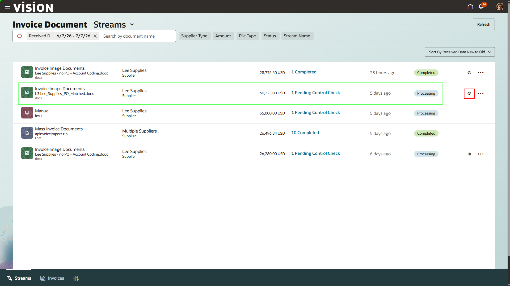

<!-- ============================================================ -->

### Step 3: View & close the invoice image

The original supplier invoice is attached to the invoice in the system and remains with the transaction throughout its lifecycle, including in the general ledger.

1. Select **X** in the top-right of the image.

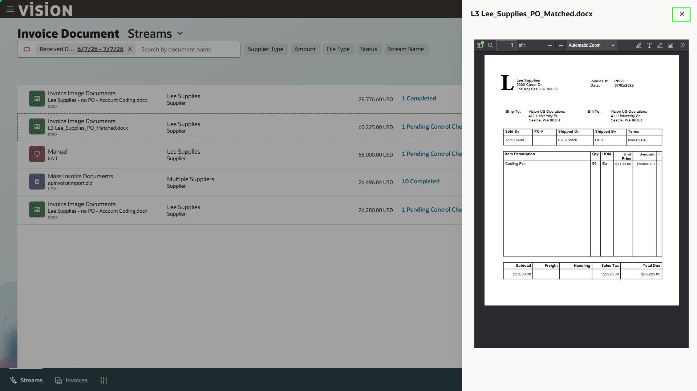

<!-- ============================================================ -->

### Step 4: Open the pending control check

The **Payables Agent** is checking the invoice against required controls before it can move forward. “1 pending control check” means one validation still needs to be completed.

1. Select the blue hyperlink:

```text
1 Pending Control Check
```

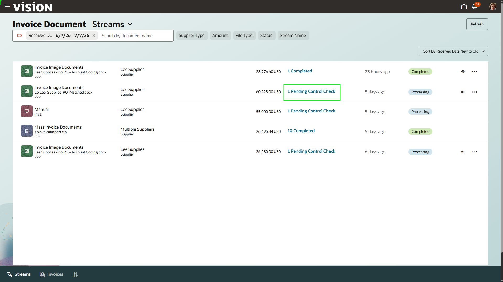

<!-- ============================================================ -->

### Step 5: Open the invoice record

Instantly, we can view the invoice within the system. This one requires user interaction to continue processing this invoice. 

1. Click the **blue** hyperlinked invoice name.

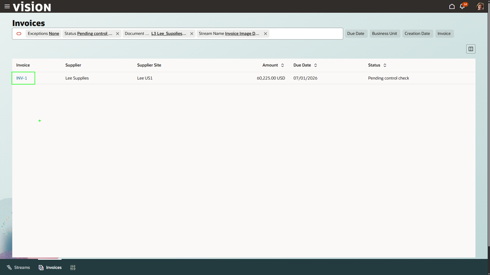

<!-- ============================================================ -->

### Step 6: Review scanned invoice details

Now, we can see all of the information that was scanned in by the agent. The header, line level, and tax information were all brought in by the AP Agent. This process can also be fully automated by the agent. Through different user-defined thresholds, the agent can scan in the invoice, process the information, match the invoice to any PO’s, validate the invoice, post it to the ledger, and send it on its way for payment. 

1. Click the **Home** button in the top-right corner.

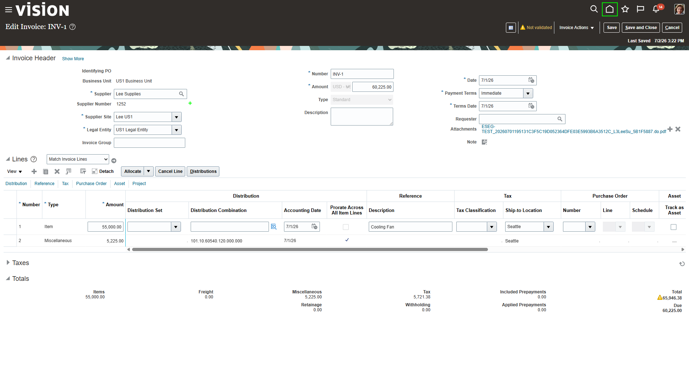

<!-- ============================================================ -->

### Step 7: Analyze Payments

Amy will now use the payments agent. Amy evaluates payment options and benefits in light of working capital goals. The agent works with Amy to manage and optimize payment processing using conversational and insights-driven experiences.

Open the **Payment Agent** tab and select the **Payment Agent** tile.

   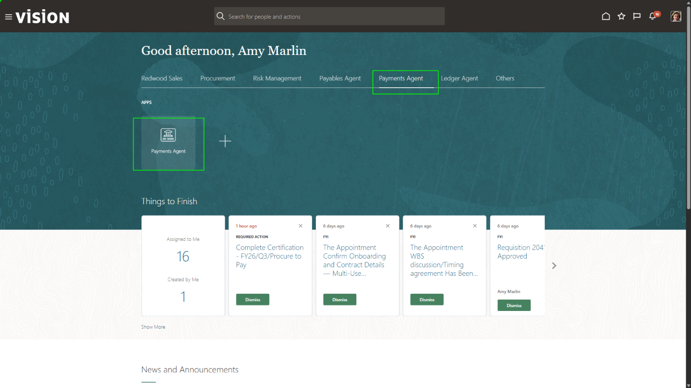

### Step 8: Insight View

The Insights view anchors the new payments experience by surfacing payment run status, exceptions, delays, and patterns that may require operational attention, helping Amy quickly see what is happening and what needs action. It provides visibility into pending, failed, or delayed payments; failed transmission or acknowledgment file processing; pending approvals that require attention; and other conditions that can affect timely, accurate payment processing.

Select the insight below labeled **Payment Run Readiness**

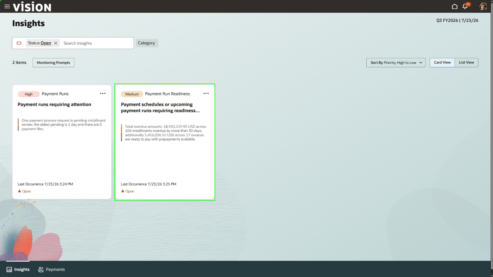

### Step 9: Review Payment Runs

Amy has an option to review payment runs that require immediate user review and action. Invoices in shortlisted supplier offers that are not ready for payment, payment schedules or upcoming payment runs require readiness review.

Select the **Payments** tab at the bottom of the screen to review payment runs requiring attention.

   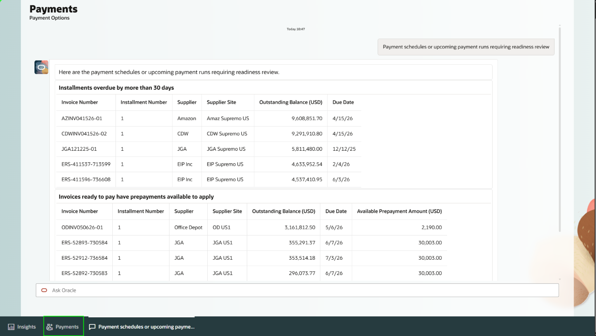

### Step 10: Payment Execution Assistant

The Payment Execution Assistant supports the scheduling, submission, and monitoring of payment processing. Within payment execution, Amy can view all the processes that need her attention. Approvals or oversight might be needed for the system to process these further. 

 Select the **Payment Options** tab at the top of the screen.

   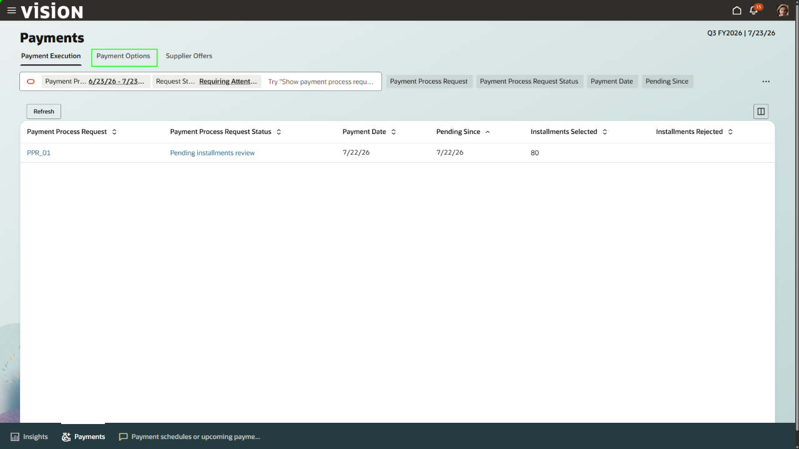

### Step 11: Payment Options Assistant

The Payment Options Assistant helps review suppliers’ upcoming payable installments and identify which are due in the coming weeks. Amy will use this assistant to further inquire about upcoming payments. 

In the Ask Oracle search bar, enter:

   ```
   <copy>
   Show supplier invoices due in the next 30 days for US1 Business Unit in USD
   </copy>
   ```

   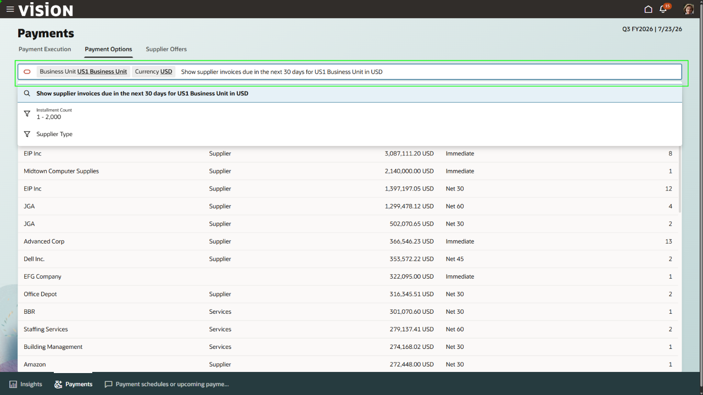

### Step 12: Payment Optimization

The assistant can provide details around Amy’s search, as well as provide follow up actions. Amy wants to see what upcoming benefits are achieved if we pay early.

In the Ask Oracle bar, enter:

   ```
   <copy>
   Calculate the financing program benefits on the fetched optimizable upcoming payments
   </copy>
   ```

   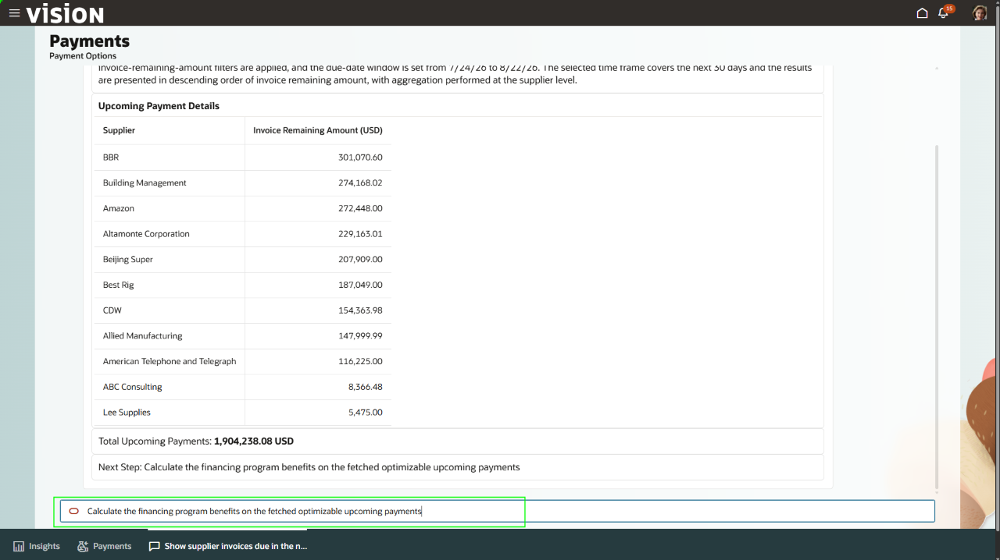

### Step 13: Review Cash Flow Impact

In the Ask Oracle bar, enter:

   ```text
   <copy>
   Visualize your new cash flow to better understand liquidity impact.
   </copy>
   ```

   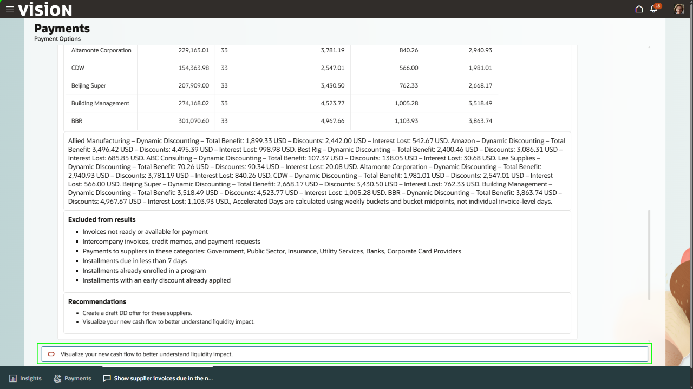


### Step 14: Review Installment Payments

Amy now has a solid look into what the future cash flow looks like if these invoices are paid early. Now, she can use the tool to inquire on individual payments, like the one she looked over in payables. 

In the Ask Oracle bar, enter:

   ```text
   <copy>
   Show me the installments that are due for Lee Supplies
   </copy>
   ```

   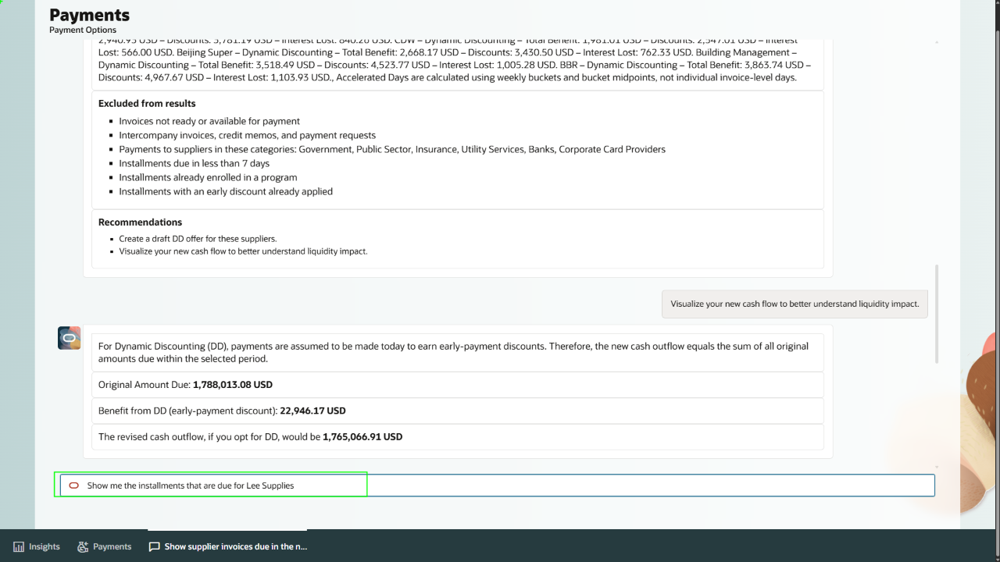

### Step 15: Return Home

Traditionally, payment processing has been a manual, scheduling-driven function often limited to conventional methods like Check or ACH. The legacy process lacks real-time guidance on fund utilization, and payment programs are limited to pre-onboarded suppliers. The Payments Agent addresses these challenges by introducing real-time decision support into the payment process.

Select the **Payments** tab at the bottom of the screen, then select the **Home** button in the upper-right corner.

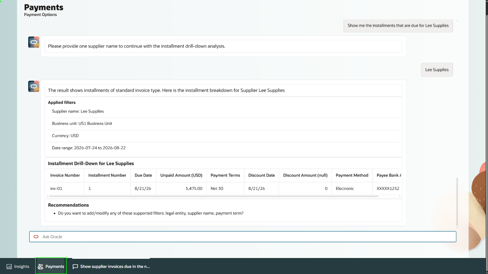

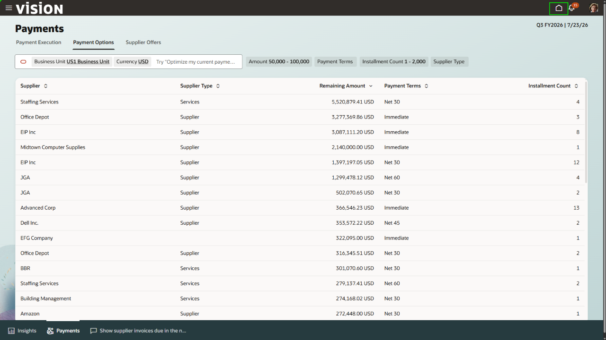

[Proceed to the next lab exercise!] (#next)

<!-- ============================================================ -->

## Summary

You have reviewed a supplier invoice, inspected a pending control check, used **Ledger Agent** to investigate accounting exceptions, created a monitoring prompt, and queried payables invoice data through natural language.

**Payables Agent** and **Ledger Agent** streamline invoice processing, validation, ledger monitoring, exception resolution, and financial analysis across the accounting process.

[Proceed to the next lab exercise!] (#next)

## Acknowledgements
* **Author** - Jimmy Dwyer, Oracle North America
* **Contributors** -  Piyush Ruparelia, Oracle North America
* **Last Updated By/Date** - Piyush Ruparelia, July 2026, based on Fusion 26B