# Lab 5: Anomaly Insights and Advanced Predictions

<!-- ============================================================ -->

## Overview

In this exercise, you use Oracle EPM Cloud Insights to identify anomalies, explore root causes, generate AI-driven narrative summaries, and review Advanced Predictions for performance analysis.

**Estimated Time:** 10 minutes

<!-- ============================================================ -->

### Objectives

By the end of this lab, you will be able to:

- Assess regional revenue trends and variances.
- Investigate anomalies with AI-generated insights.
- Improve forecasts using prediction drivers and accuracy.

<!-- ============================================================ -->

## Prerequisites

Log in to Oracle EPM Cloud with the credentials provided by the instructor.

```text
User ID: Provided on your card
Password: Provided at the front of the room
```

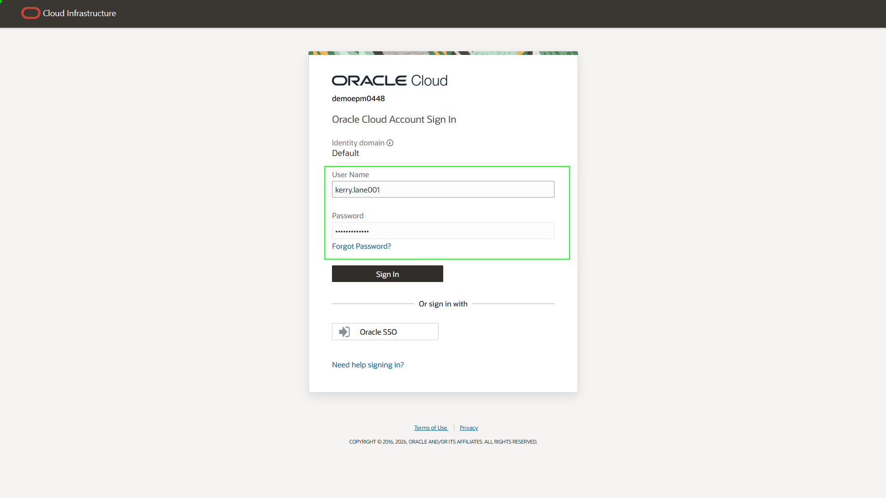

<!-- ============================================================ -->

## Steps

### Step 1: Open Insights Data

After period data is finalized, Kerry begins the performance review process. Let’s see how the Insights provide items for action and facilitates collaboration across various stakeholders. 

1. Click **IPM**.
2. Click **Insights Data**.

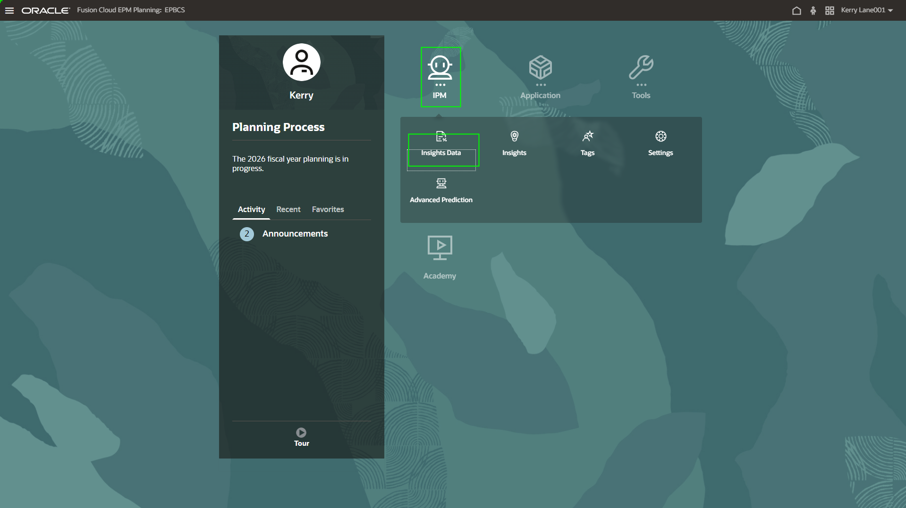

<!-- ============================================================ -->

### Step 2: Review regional revenue performance

The dashboard highlights revenue performance across regions and major product lines. Revenue for Sales US East appears to increase, while Sales US West declines. This requires further investigation using Insights.

1. On the line graph, click the drop-down titled **Total Sales Regions**.
2. Select **Sales US - West** and review.
3. Select **Sales US - East** and review.
4. When finished, click the **Insights** tab on the horizontal bar above the dashboard.

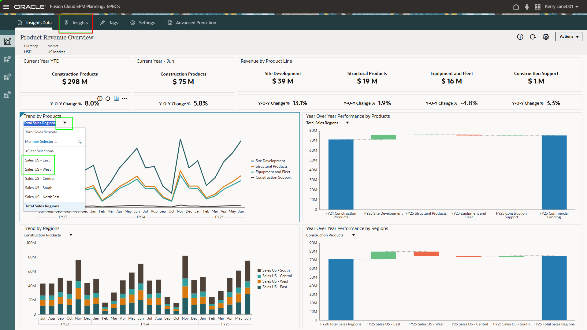

<!-- ============================================================ -->

### Step 3: Review the Insights dashboard

All the Insights generated are brought together onto the Insights dashboard. This is a highly curated set of Insights that are very accessible for a business user.  The application is making the artificial intelligence (AI) very user-friendly. When the Insights are configured, the priority can be determined as high, medium, or low.  Both the $ and % variances are shown along with the data intersections of related data and the type of variance - a Prediction, Forecast Bias, or Anomaly. This exercise will focus on just the Anomaly type. There is also have a high-level explanation of the Insight, its status, and when it was created.  

This exercise focuses on the **Anomaly** type.

1. Scroll down to review the list of Insights.
2. Read a few of the rows of Insights.

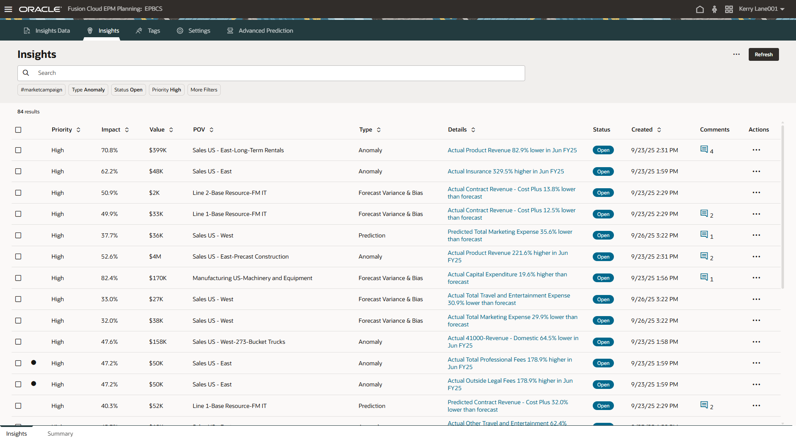

<!-- ============================================================ -->

### Step 4: Filter for the **Sales US East** insight

Kerry aims to identify the factors behind Sales East's strong performance.  He filters the Insights to review anomaly generated for “Sale US - East”

1. In the search box, type:

```text
<copy>
Equipment and Fleet
</copy>
```

2. From the suggested search matches drop-down list, select **Sales US - East - Equipment and Fleet**

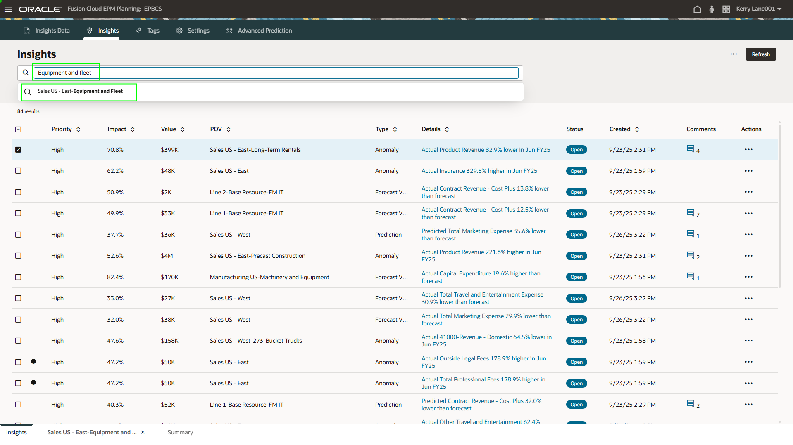

<!-- ============================================================ -->

### Step 5: Open the insight details

The model has generated an anomaly for Sales US Eastern region’s “Equipment and Fleet” products.  This product portfolio has several product lines, and the anomaly is generated at total level.

1. Click the **Details** link to open the selected Insight.

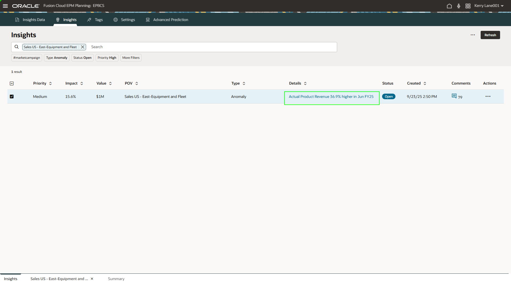

<!-- ============================================================ -->

### Step 6: Review anomaly explanation

On the chart, the orange line is the Actual revenue, and the system has automatically detected that there’s been a spike in the revenue – a very unusual spike.  The system is doing a lot of hard work behind the scenes in identifying the spike.  Just because there is a usual spike in Q4, it’s not going to identify that as an anomaly.  It’s only going to identify the true anomalies in the system, unusual patterns that deviate from expected results.  This is useful information – it might make sense to contact the responsible people for this sales territory and channel because the spike is very specific.  

1. Hover over the data point represented as a star at the far-right side of the line graph.
2. Click the icon at the top-right of the line graph to open the explanations panel.
3. Review the **Insights AI** tab, which contains an AI-generated narrative explanation of the anomaly.

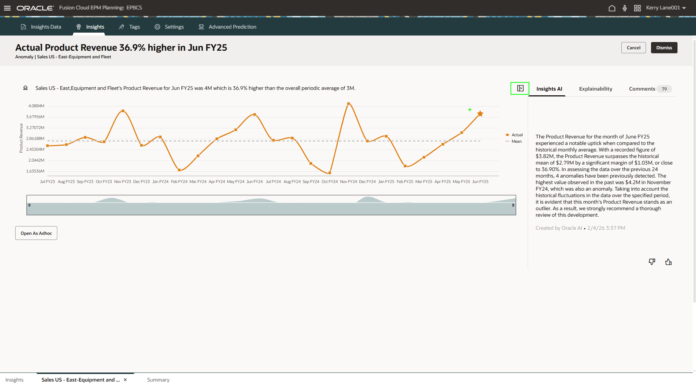

<!-- ============================================================ -->

### Step 7: Review AI-generated summaries

Kerry seeks to determine what drove Sales East's exceptional results.  He utilizes Gen AI to create a summary that identifies which specific products and lines were responsible for this unusual performance.
Kerry is presented with a ready-to-use summary explaining how the performance at individual entity / product level contributed to the overall anomaly.  This summary helps Kerry zero in on the root cause for the Insight and makes it easy to collaborate across functions.  Some of the product lines have contributed significantly for the anomaly. 

This summary can be taken to reports and/or presentations as ready to use content with all relevant data points.

1. Click the **Summary** tab at the bottom-left of the screen to see a list of summaries.
2. After review, close the summary text by clicking **X**.

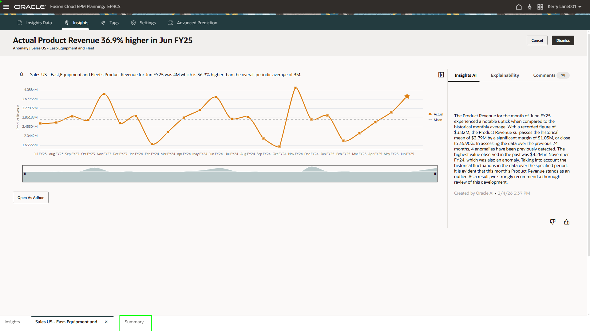

<!-- ============================================================ -->

### Step 8: Open the first summary

Now we can see a summary of the data telling us why there is a surge in sales. We let AI determine the what and they why to the anomaly without having to do any extra analysis, excel building, data exports, etc. 

1. Select the first summary in the list.

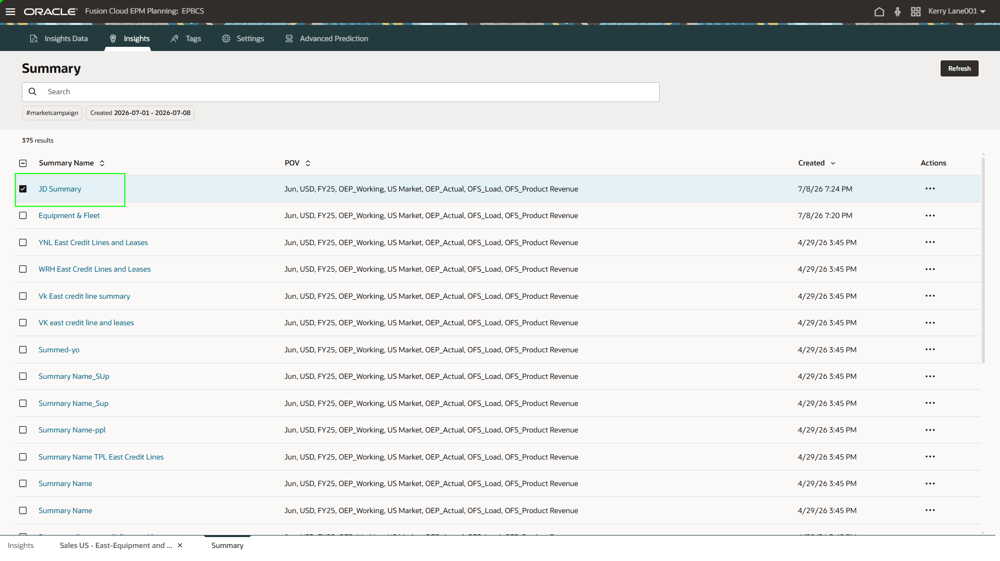

<!-- ============================================================ -->

### Step 9: Open **Advanced Prediction**

**Advanced Prediction** help planners create stronger forecasts by using machine learning and multiple business drivers, such as price, marketing spend, industry volume, and economic trends. Instead of only projecting from past results, it explains the forecast, shows accuracy, and highlights which drivers had the biggest impact.

1. Click the **Advanced Prediction** tab at the top of the screen.

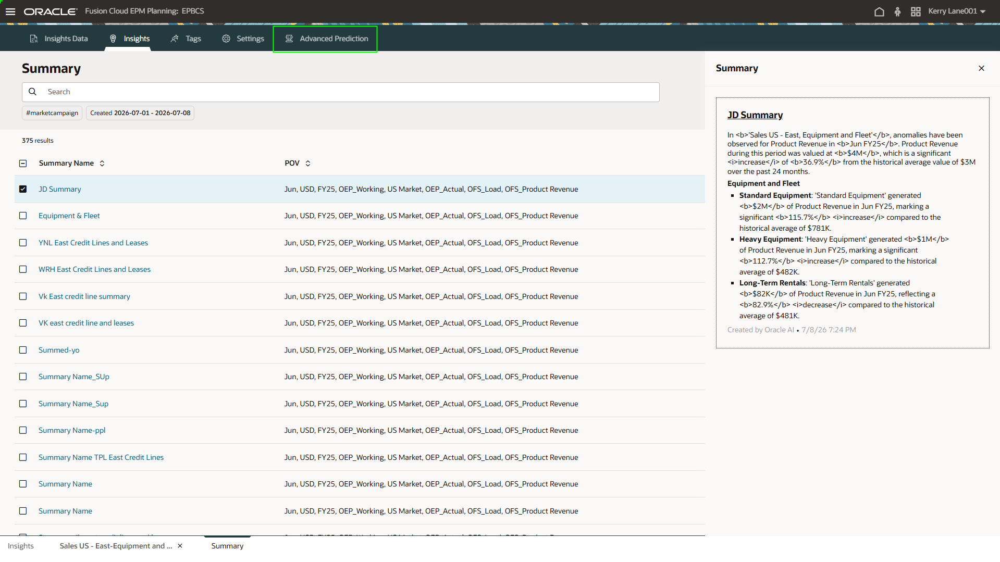

<!-- ============================================================ -->

### Step 10: Review driver inputs

You are reviewing product-level driver inputs, such as marketing spend, industry volume, selling price, discounts, and macroeconomic variables. The dropdown shows that you can switch between drivers to understand what data is feeding the prediction.

1. Open the drop-down and select **Marketing Spend**.

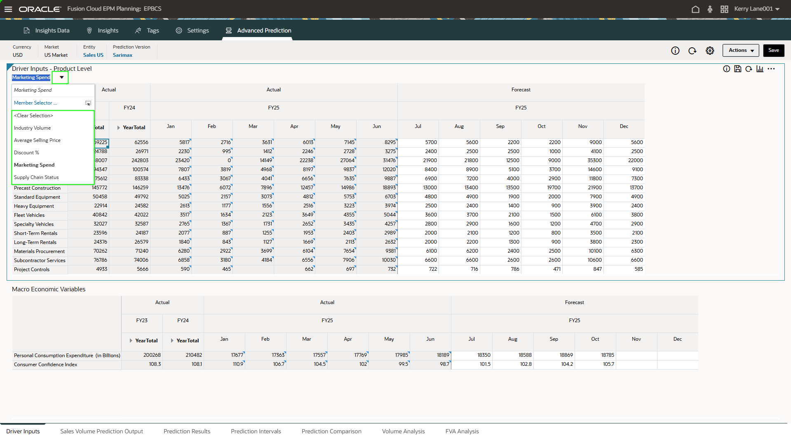

<!-- ============================================================ -->

### Step 11: Open Sales Volume Prediction Output

We start by selecting the drivers that influence sales volume. Advanced Predictions uses these inputs to build a stronger forecast.

1. Click **Sales Volume Prediction Output** in the bottom-left corner.

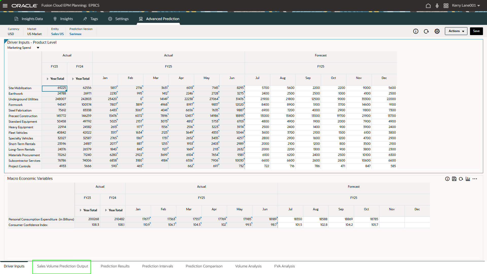

<!-- ============================================================ -->

### Step 12: Explain a prediction

Now you are going to analzye monthly sales volume prediction output by product. You can review forecasted volumes across products like Site Mobilization, Earthwork, Underground Utilities, and others.

Advanced Predictions generates monthly sales volume forecasts for each product. The results are organized in one clear planning grid.

1. Right-click the first column under **Dec**.
2. Select **Explain Predictions**.

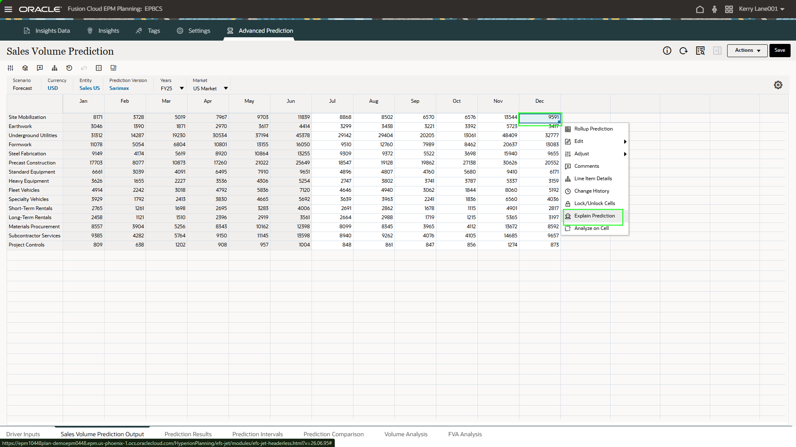

<!-- ============================================================ -->

### Step 13: Open **Feature Importance**

You have selected a forecasted value, and the explainability panel is showing the prediction trend, forecast range, and prediction details. The screen highlights accuracy, error measure, algorithm used, and the forecast period.

You can click into a forecast and see how confident the model is. The system explains the prediction with trends, ranges, and accuracy details.

1. Click the **Feature Importance** tab.

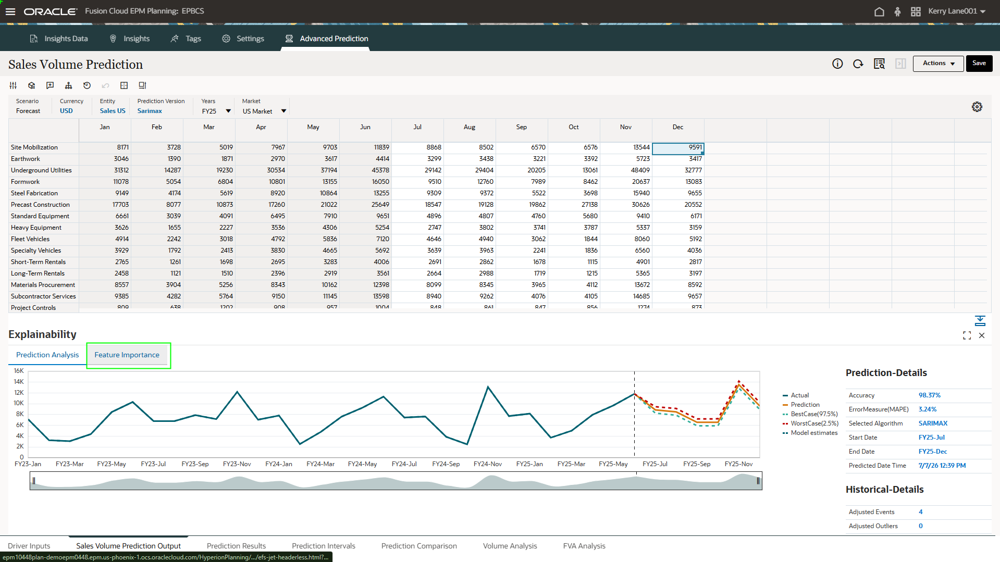

<!-- ============================================================ -->

### Step 14: Review key prediction drivers

The explainability view ranks the drivers that influenced the prediction, including marketing spend, supply chain status, economic indicators, and other drivers.

Advanced Predictions does not just give a number. It shows which drivers had the biggest impact on the forecast.

1. Click the **Prediction Results** tab in the bottom-left corner.

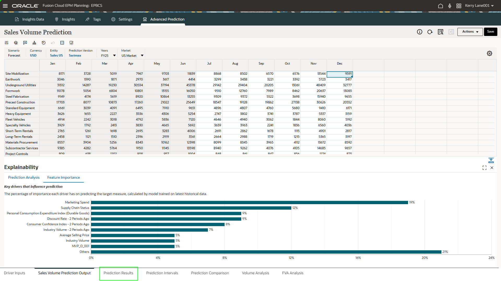

<!-- ============================================================ -->

### Step 15: Review prediction results

We are reviewing prediction results, including actuals, forecasts, product drivers, and a sales volume mix chart by quarter. This view connects the forecast output to the supporting driver details.

We can review the forecast results alongside the drivers behind them. This helps planners understand both the numbers and the business context.

1. Select the **FVA Analysis** tab at the bottom.

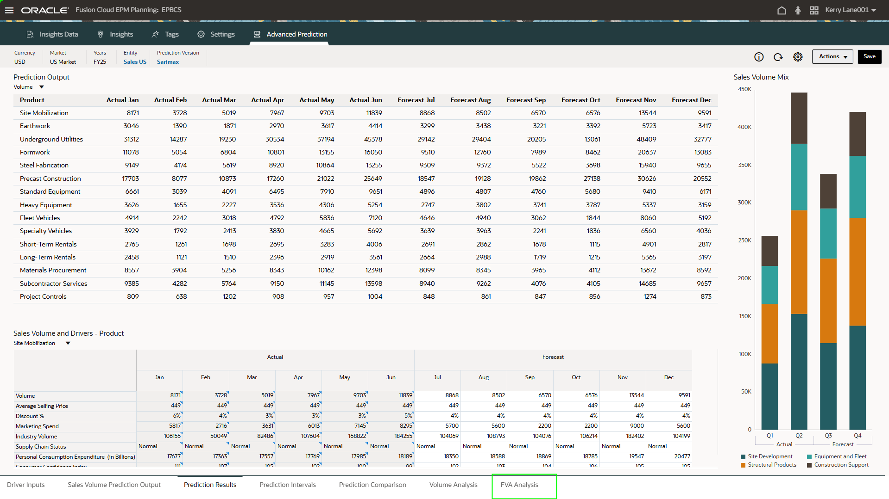

<!-- ============================================================ -->

### Step 16: Review FVA Analysis and sign out

We are comparing forecast accuracy across methods, including Trend Method, Driver Method, Predictive Planning, and Advanced Predictions. The charts and tables show that Advanced Predictions delivers strong accuracy and value add.

Advanced Predictions is compared against other forecasting methods. The analysis shows where it improves accuracy and adds value.

1. Click the user name in the top-right corner.
2. Select **Sign out**.

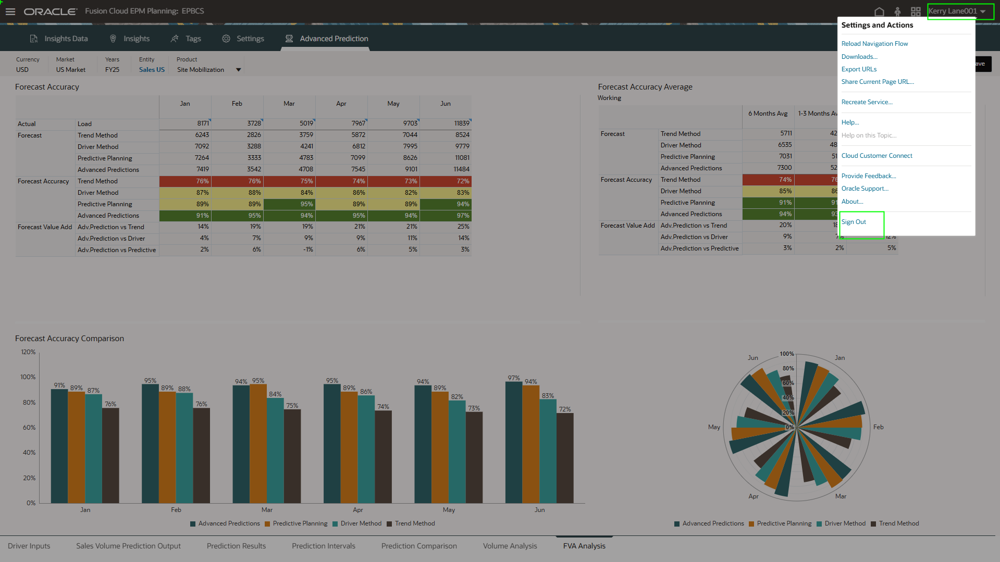

<!-- ============================================================ -->

## Summary

You have used Insights to investigate an anomaly, reviewed AI-generated explanations and summaries, and explored **Advanced Predictions** and **FVA Analysis** to understand forecast drivers and value add.

**Insights** and **Advanced Predictions** help business users identify anomalies, explain root causes, collaborate with AI-generated summaries, and create stronger forecasts using transparent model drivers.

## Acknowledgements
* **Author** - Jimmy Dwyer, Oracle North America
* **Contributors** -  Piyush Ruparelia, Oracle North America
* **Last Updated By/Date** - Piyush Ruparelia, July 2026, based on Fusion 26B