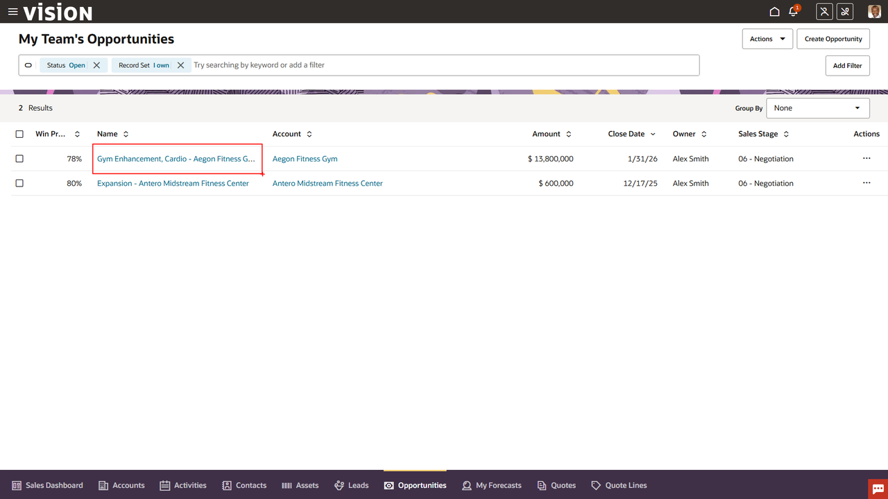
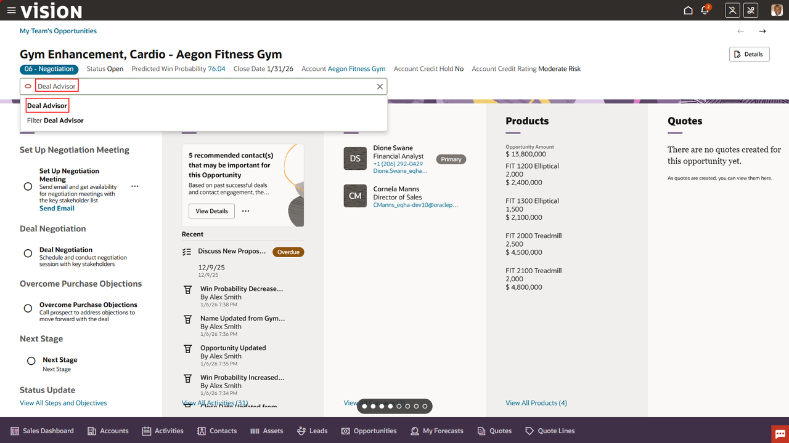
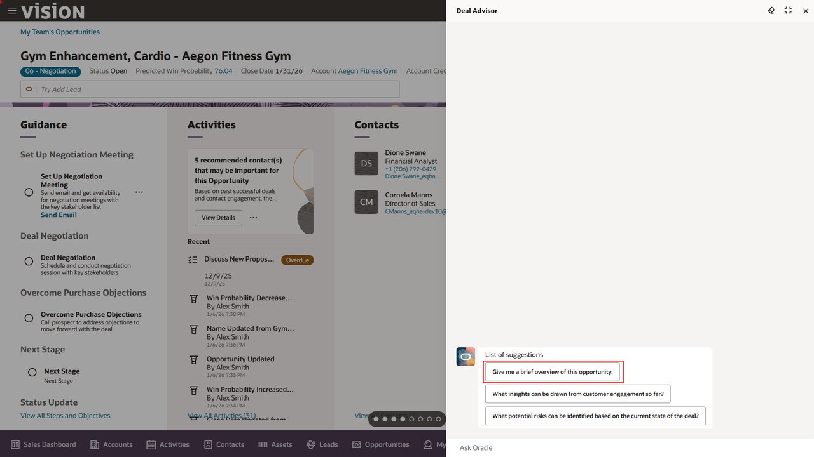
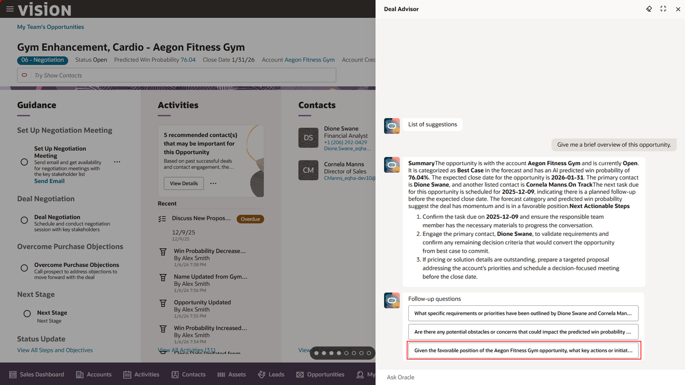
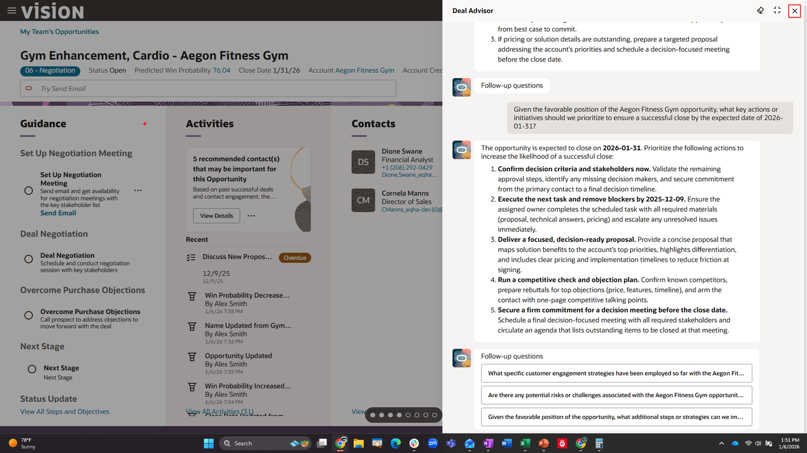
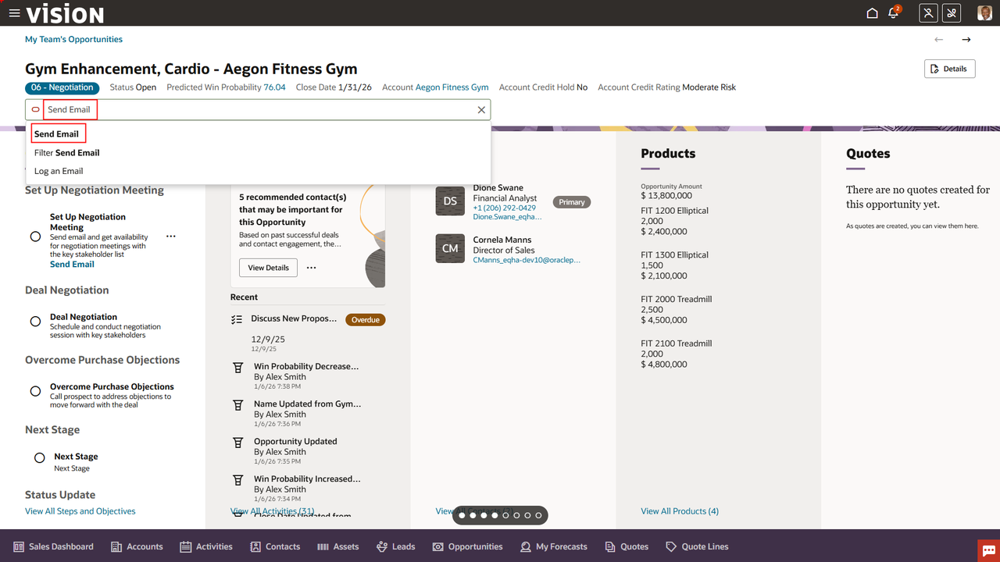
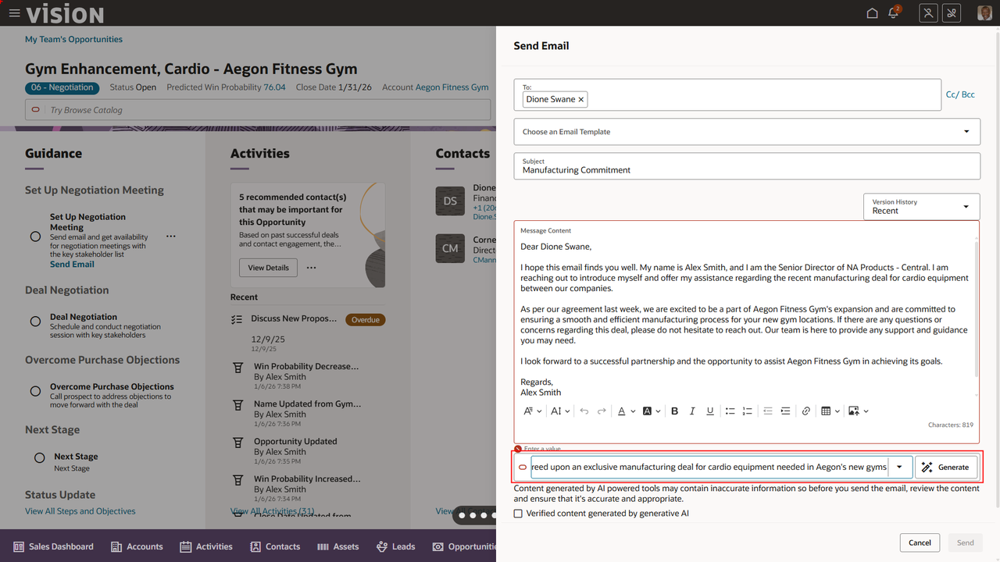
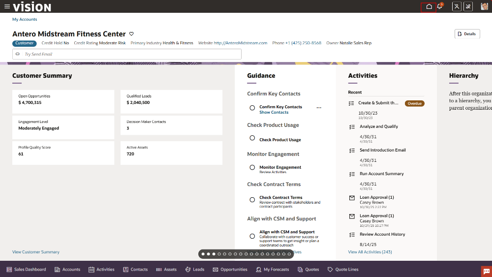

# Use pre-built AI features in Fusion Customer Experience to manage a Sales Opportunity

## Introduction

Oracle Fusion Sales offers several generative AI features that streamline and enhance the daily workflow of sales representatives. AI-generated follow-up emails help reps maintain timely and personalized communication with prospects, while conversational summaries capture key insights from sales meetings and recommend next best actions. Generative AI-driven deal insights and pipeline predictions enable reps to prioritize opportunities with the highest likelihood of success. These capabilities collectively save time on manual tasks, improve customer engagement, and empower sales reps to focus on closing deals and building strong client relationships.

Estimated Time: 10 minutes

### Objectives

In this exercise we will explore some of the embedded AI features available in Fusion Sales and how it can help accelerate some of the day-to-day tasks performed by a sales person.

## Task 1: Find and open the pre-existing opportunity

1. First you will log in and navigate to **Opportunities**.

      > Login to the lab environment using the credentials provided. Make sure to use your assigned user.

      
   </br>

2. Locate and open the Opportunity.

     > Go to the **Redwood Sales** tab and Click on the tile for **Opportunities**.

     

      As a sales representative, when I log into CRM to get my day started, I’m quickly brough to my list of opportunities. I see a new opportunity in my list for Enterprise generator package and want to do my due diligence.

     > Select the opportunity *Gym Enhancement, Cardio – Aegon Fitness Gym*.

     

## Task 2: Assess the Opportunity

1. Initiate the **Deal Advisor**.

      Let’s see how AI assesses opportunities in real-time using Deal Advisor AI agent to get insights based on current and historical sales data, customer insights, engagements, deal progress and all the opportunity-related data

      The agent helps sellers and their managers identify upsell potential, mitigate risks, develop strategies based on similar won opportunities, suggest next best actions and more.

     > 1.	In the search, type *Deal Advisor*
     > 2.   Select *Deal Advisor* option from the drop down

      

      The **Deal Advisor** AI Agent chat window opens

2. Let's get an overview of the opportunity. 

      When the agent opens, you are presented with suggestions. These guide you to areas of value within the opportunity. 

      > Select the first suggestion - *Give me a brief overview of this opportunity*.

        

3. Ask the AI Agent a follow up question

    The deal advisor delivers actionable insights to sales teams, accelerates deal cycles, and improves win rates by helping sellers focus on the right actions at the right time. Managers can use the agent to get brief but comprehensive insights into the deal, customer engagements, and proactively identify risks. It will also generate follow-up questions based on the information generated. 
     
     >   Select the last option

   

    Using historical references, data within the opportunity, and data from ongoing deals, the agent is able to prioritize next steps in order to close this deal. You notice one of these steps is to secure a firm commitment 

    > Close the agent by clicking the **X** in the top right of the agent

      

## Task 3: Using Generative AI create and send the customer an email

1. Create and send email

      Finally, the AI agent can even help you draft an email to the customer to secure their commitment.

    >  In the search bar type in **send email** and select the *Send Email* option

      

    We will utilize the built in AI to generate an email and automatically send it to our customer. 

    > -   Add a **Subject** like *Manufacturing Commitment*
    > -   In the AI bar at the bottom of the email editor type in the text below
   
      ```txt
      <copy>
      Dear Dione, Last week, our teams agreed upon an exclusive manufacturing deal for cardio equipment needed in Aegon’s new gyms.
      </copy>
      ```

      > -   Click **Generate** button and see **AI in Action**

      

      > -   **Send** email. 

      

   Congratulations!!  You have completed the **Customer Experience** set of embedded AI flows.  
   
      > Click the **Home** icon on the ribbon at the top of the page to return to the main springboard page.

   [Click here to proceed to the next module](#next)

## Summary

By completing these steps, you have explored the AI features available to sales representatives in Fusion Sales, designed to boost their productivity and deliver a more engaging experience. Leverage the power of AI to shape the future of sales!

**You have successfully completed the Activity!**

## Acknowledgements
* **Author** - Brittney Paone, Oracle North America
* **Contributors** -  Jimmy Dwyer, Piyush Ruparelia, Oracle North America
* **Last Updated By/Date** - Piyush Ruparelia, November 2025, based on Fusion 25D
