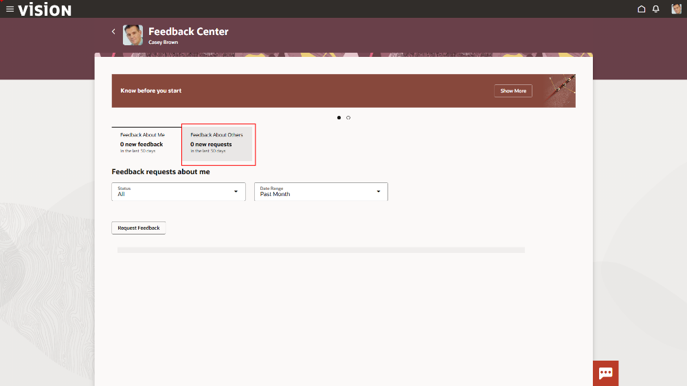
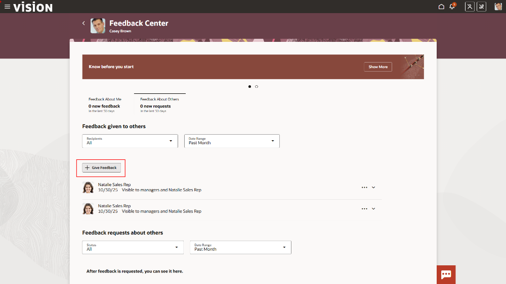
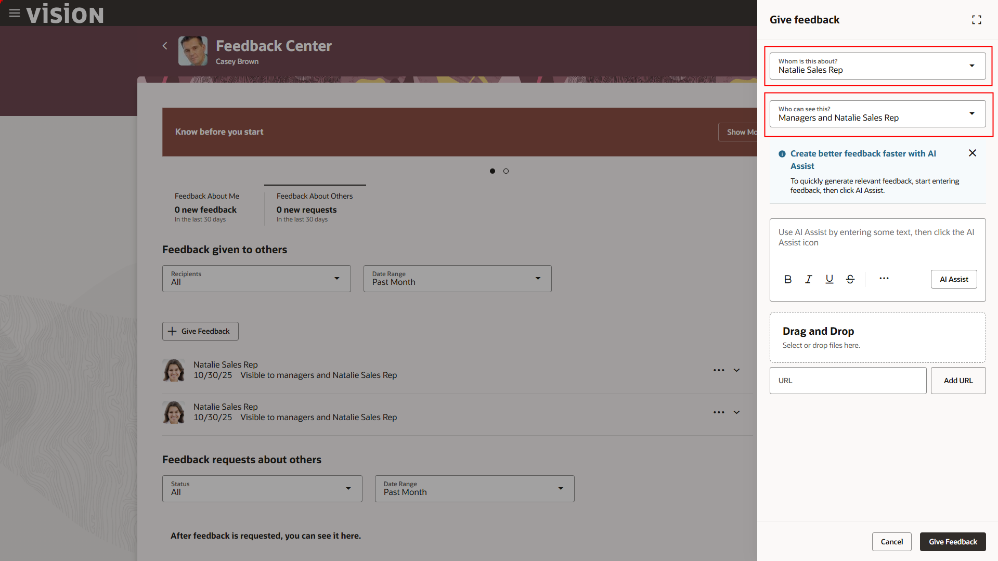

# Provide Feedback for a colleague with built in Generative AI capabilities

## Introduction

Oracle Fusion Human Capital Management (HCM) uses advanced AI features to make everyday HR tasks simpler and more efficient. With Oracle AI for HCM, you can finish work faster, make more informed decisions, and improve employee experiences, all while keeping sensitive information secure. These AI tools help streamline key HR activities like recruiting, managing talent, supporting career growth, and delivering HR services more effectively.

**Estimated Time:** 10 minutes

### Objectives

Now that we’ve updated the sales opportunity, we need to provide feedback for the sales reps that had an impact with the customer. Use generative AI to draft feedback comments to help improve employee performance and engagement.

## Task 1: Search and open the Feedback Center

1. If not already logged in, follow the steps shown below.

    Login to the lab environment using the credentials provided. Make sure to use your assigned user.

   
   </br>

2. Open and Explore Feedback Center

   You are easily able to find areas you’re looking for within the system utilizing the navigation tools built into the UI. </br>
   
      >  Using the Global Search bar at the top, enter *Feedback Center - Me* and click to navigate to the **Feedback Center**

      
   
    Once in the feedback center, you’ll be able to see the history of feedback given to you, or feedback that you’ve given to others. This allows for a one stop shop for users to view all their related feedback.  
   

## Task 2: Select the Sales Rep and Give Feedback

1. Navigate to **Give Feedback** and select a Sales Rep.

      > Click on the **Feedback About Others** tab

      

      > Click the **Give Feedback** button

      

2. Search for the Sales Rep 

   There are different options when it comes to who gets feedback, and how it’s viewed by the business. Since this is part of the unified suite, it’s easy to find your team. 
   
      > -	Search & select employee: *Natalie SalesRep*
      > -   Define visibility: *Managers and Natalie SalesRep*

        

3. Enter your feedback details for the Sales Rep

   Utilizing the built in AI, it makes it much easier to issue feedback. Instead of having to type an entire paragraph, you can provide a couple of key words or phrases and the built in AI tool will generate the rest. 

      

      > -   Click into the feedback text box 
      > -	Enter the text below
   
      ```
      <copy>
      Great job with Antero. You showed ability to understand their needs and know our products well.
      </copy>
      ```

      > -   Click on the **AI Assist** button

        

   The AI tool will wait for final approval from the user before posting the feedback. This is important because it ensures that the user has final say over what the AI generates. 

      **Optional:**  

      The sales VP values positive feedback but also likes to give his team constructive feedback so they are always learning and growing. He notices the generated feedback does not include anything constructive, so he needs to add more

      > Add in additional context
      > -   Add a space beneath the initial paragraph
      > -   Enter text similar to the line below
   
      ```
      <copy>
      improving ability to always set next steps to drive towards progression
      </copy>
      ```

      > -   Click on the **AI Assist** button

        

      Congratulations!!  You have completed the **Human Capital Management** set of embedded AI flows.

      > Click the **Home** icon on the ribbon at the top of the page to return to the main springboard page.

      [Click here to proceed to the next module](#next)

## Summary

By following these steps, you successfully walked thru the AI capabilities available to an employee within Fusion Human Capital Management (HCM) that will enhance their efficiency and provide them a more engaging experience. Embrace the future of HCM with the power of AI!

**You have successfully completed the Activity!**

## Acknowledgements
* **Author** - Shane Stockings, Oracle North America
* **Contributors** -  Jimmy Dwyer, Piyush Ruparelia, Oracle North America
* **Last Updated By/Date** - Piyush Ruparelia, November 2025, based on Fusion 25D
