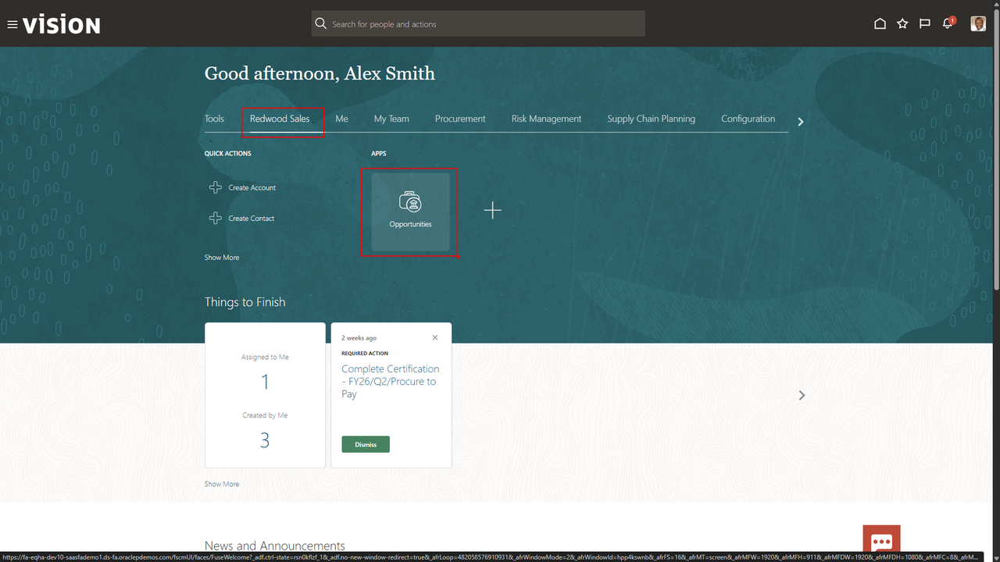
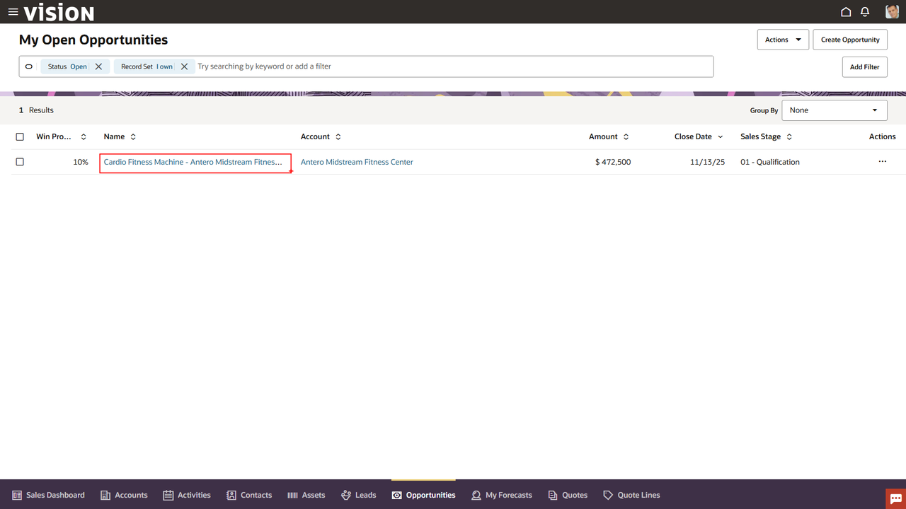
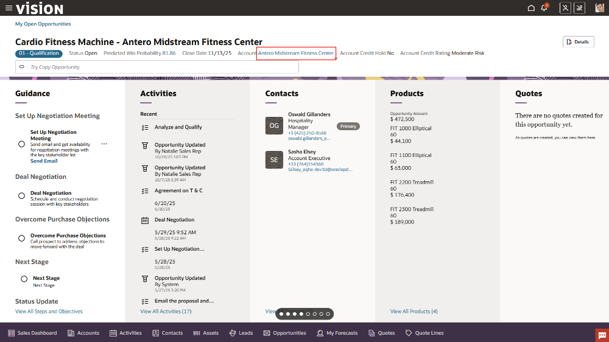
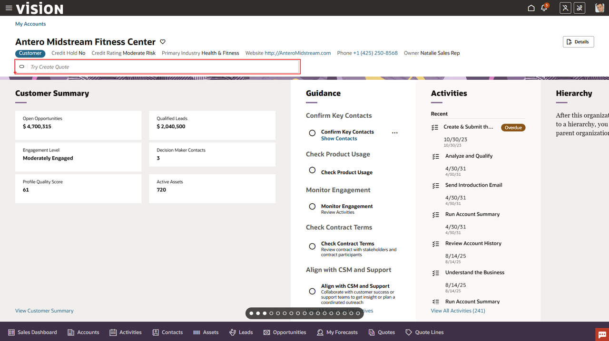
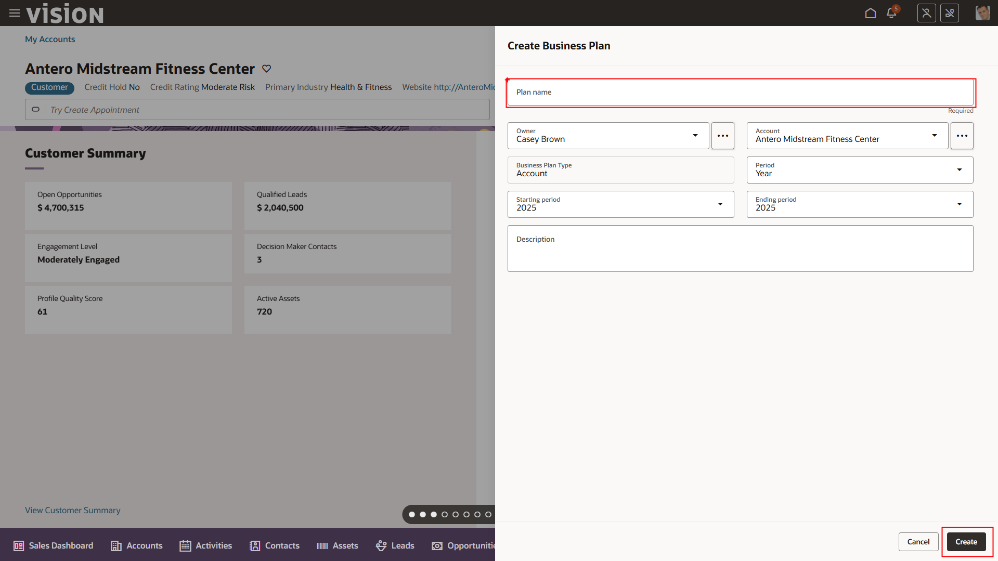
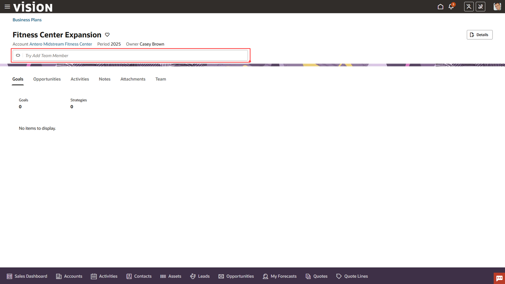
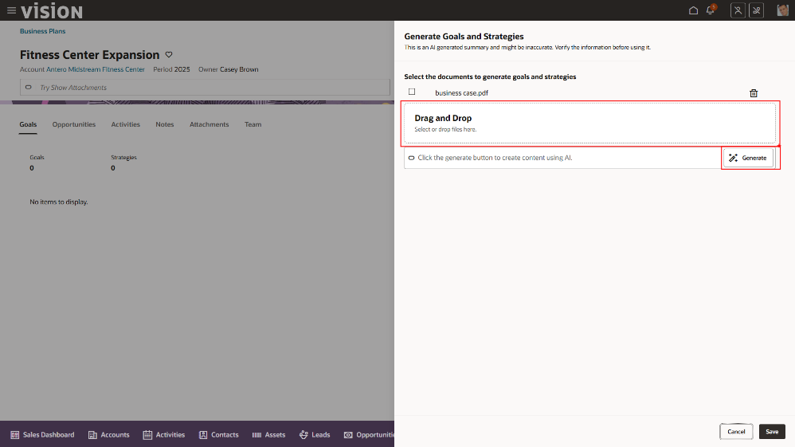
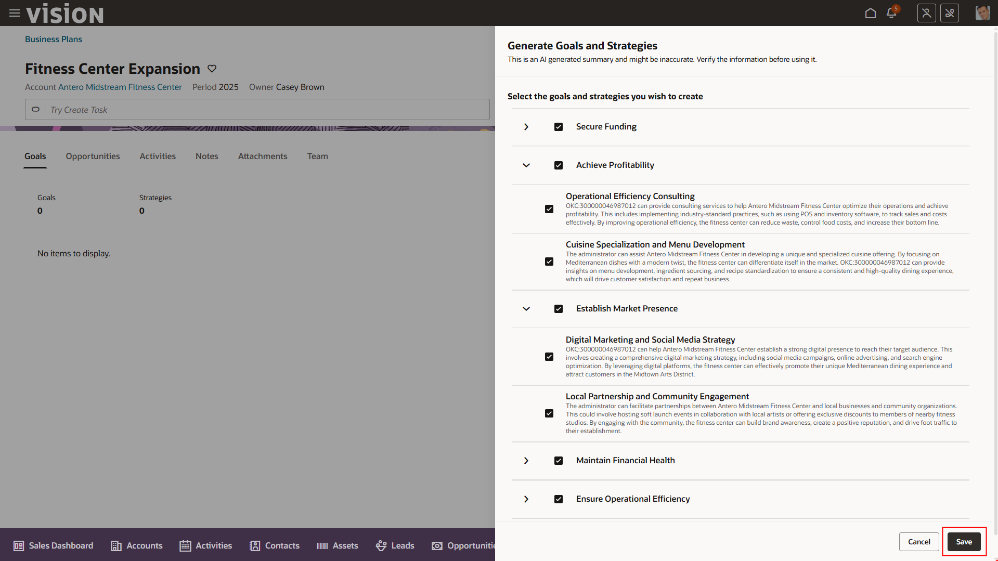
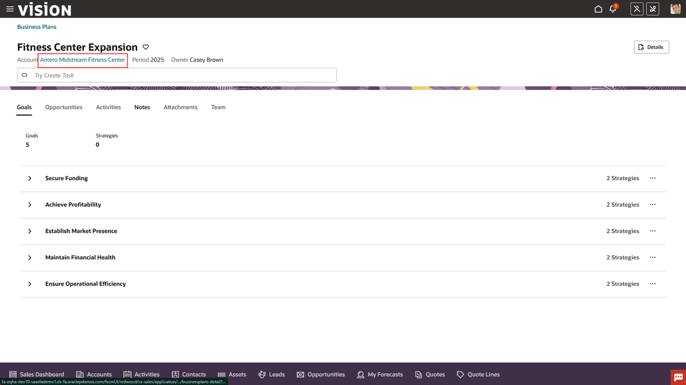

# CX - Sales

## Introduction

Oracle Fusion Sales offers several generative AI features that streamline and enhance the daily workflow of sales representatives. AI-generated follow-up emails help reps maintain timely and personalized communication with prospects, while conversational summaries capture key insights from sales meetings and recommend next best actions. Generative AI-driven deal insights and pipeline predictions enable reps to prioritize opportunities with the highest likelihood of success. These capabilities collectively save time on manual tasks, improve customer engagement, and empower sales reps to focus on closing deals and building strong client relationships.

Estimated Time: 10 minutes

### Objectives

In this exercise we will explore some of the embedded AI features available in Fusion Sales and how it can help accelerate some of the day-to-day tasks performed by a sales person.

## Task 1: Find and open the pre-existing opportunity

1. First you will log in and navigate to **Opportunities**.

   > Login to the lab environment using the credentials provided. Make sure to use your assigned user.

   
   </br>

2. Locate and open the Opportunity.

   > Go to the **Redwood Sales** tab and Click on the tile for **Opportunities**.

   

   > Select the first **opportunity** in the list (Account: **Antero Midstream Fitness Center**).

   

   >  When you drill into the opportunity, you'll immediately notice the predicted win probability and other details related to this opportunity.

## Task 2: Create a business plan for the account associated with the opportunity

1. Open the account.

   > Next, you will drill down on the account.  Click the account name link highlighted in **blue** in the top bar of the opportunity.

   

2. You can use the AI driven search bar to take you to your next steps. 

   > Enter **create business plan** into the search bar.

     

3. Enter details for your business plan

   > At one point, the customer said they were interested in expanding.  You can take the business plan they shared with you in your onsite meeting and feed it into Fusion Sales with a few simple clicks.
   > -	**Plan Name** = “(*your initials*) Fitness Center Expansion”
   > -	Hit the **Create** button in the bottom right.

   

4. With the business plan created, use AI to generate goals and strategies

   > In the search bar, enter: **Generate Goals and Strategies**

   

5. Upload the customer document (i.e. quarterly or annual financial reports, etc.) and generate the goals

   

   >You can attach any documents provided by the customer to have Oracle automatically generate the goals and strategies to help our prospect execute this plan.
   > -   Select the *business case* PDF from your desktop and upload it to the business plan.
   > -	Click the **Generate** AI button in the bottom of the attachments area and see **AI in Action**.

   

   > -   After the Sales VP had AI look at their business plan document, it recommended goals and strategies that they used to talk to Alex.  It really helped him see me as an advisor.
   > -   This creates an "Outside In" look at how we might demonstrate that we know their business, as well as, bringing ideas to the conversation. We can attach this to the loan application for more context and likelihood of approval.  Select the goals and strategies you would like to save.
   > -	Hit **Save** and close.

   

## Task 3: Using Generative AI create and send the customer an email

1. Return to the customer account record

   >  Finally, the AI agent can even help me draft an email to Alex to finalize the loan t's and c's! Click the blue account name in the top left

   

2. Create and send email

   >  We will utilize the built in AI to generate an email and automatically send it to our customer. In the search bar type in **send email** and select the email option

   

   > -   Add a **Subject** like “*Loan Approval*”
   > -   In the AI bar at the bottom of the email editor type in the text below
   
```txt
<copy>Last week, Alex and I agreed on a 150,000 loan that Alex is seeking to expand to a new location. Create an email telling Alex it's time to meet and reviews terms and conditions of that loan.
</copy>
```

   > -   Click **Generate** button and see **AI in Action**
   > -   **Send** email. 

   
   
Congratulations!!  You have completed the **Customer Experience** set of embedded AI flows.  
   
   > Click the **Home** icon on the ribbon at the top of the page to return to the main springboard page.

[Click here to proceed to the next module](#next)

## Summary

By completing these steps, you have explored the AI features available to sales representatives in Fusion Sales, designed to boost their productivity and deliver a more engaging experience. Leverage the power of AI to shape the future of sales!

**You have successfully completed the Activity!**

## Acknowledgements
* **Author** - Jimmy Dwyer, Oracle North America
* **Contributors** -  Piyush Ruparelia, Oracle North America
* **Last Updated By/Date** - Piyush Ruparelia, November 2025, based on Fusion 25D
