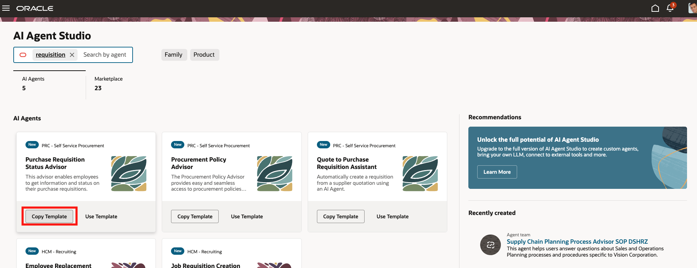
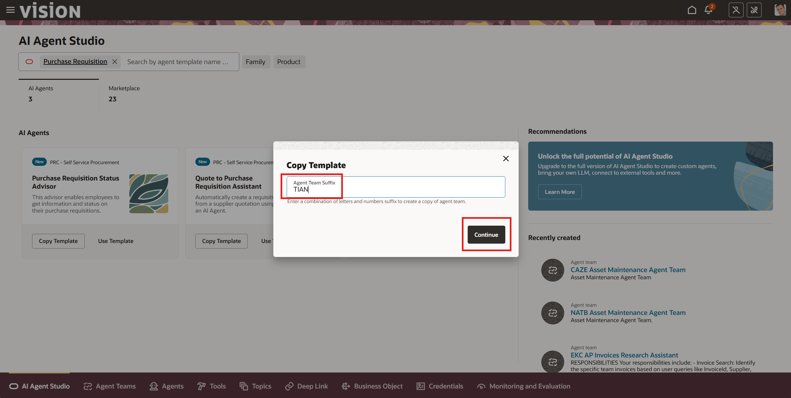
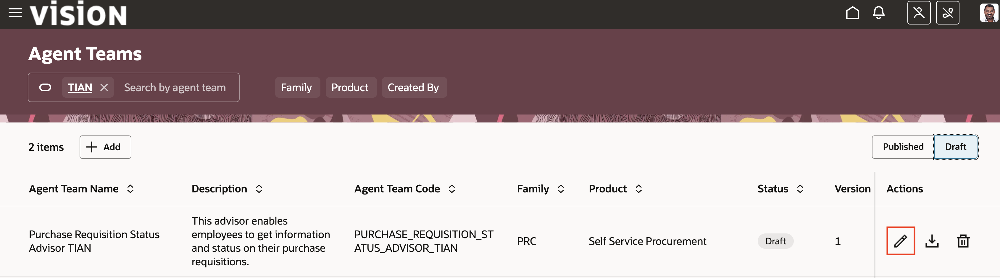

# Exploring a pre-built agent

## Introduction

In this exercise we will learn about the overall capabilities of Fusion AI Agent Studio by reviewing the out of the box tools, business objects, deep links, prompts, topics, and Agent types

Estimated Time: 10 minutes

### Objectives

Understand the structure of a pre-built agent and agent tools in AI Agent Studio

### Usage Notes

When creating agents and teams in Fusion AI Agent Studio, all components must have a unique name.

To ensure your components have a unique name, please use an initial code when naming your components.

Take the first two letters of your first name and last two letters of your last name to form a unique code.  If this spells out a common word, add a number.

> **EXAMPLE:**  
> ***TI***M SULLIV***AN*** = ***TIAN***  
> ***CO***RY WA***DE*** = ***CODE2***

Once you have chosen a code, use it consistently to ensure you can easily find your components

## Task 1: Locate and copy the pre-existing Purchase Requisition Status Advisor agent

1. First you will log in and navigate to AI Agent Studio.

   > Login to the lab environment using the credentials provided. Make sure to use your assigned user.
    

2. Locate and copy the Purchase Requisition Status Advisor agent template.

   > Go to the **Tools** tab and Click on the tile for **AI Agent Studio**.

   

   > Search for **requistion** in the search box.

   

   > Click on **Copy Template** for the Purchase Requisition Status Advisor. 

   > If you do not see **Copy Template**, click on the 3 dots in the bottom right corner of the Purchase Requisition Status Advisor box. 

   >***IMPORTANT!***  
   > ***DO NOT CLICK*** on **Use Template** 
   > **DO CLICK** on **Copy Template**.

   

   > In the Agent Team Suffix box, enter ***YOUR INITIAL CODE***.  

   > Click on the **Continue** button. 
   > If you get a message that a component with that name already exists, make sure you are using a unique code.  Add a number if required.  Just be sure to use that code throughout the rest of the lab.

   

3. Next you will save your agent team template and ensure that you can locate it.

   > Click the **Save and Close** button in the top right of the screen.

   

   > On the tab bar on the bottom of the screen, Click on **Agent Teams**.

   

   > Enter ***YOUR INITIAL CODE*** in the search box and hit **ENTER**.

   

   > Select the **DRAFT** button (your agent team will be in draft status).  You should see your newly-created agent team.

   

   > ***STATUS CHECKPOINT***  
   > If you do not see your agent team, return to step 2 [above](#task1locateandcopythepreexistingpurchaserequisitionstatusadvisoragent)

## Task 2: Examine the pre-built Purchase Requisition Status Advisor Agent components

1. Open your copy of the Purchase Requisition Status Advisor Agent Team template.

   > Click on the pencil icon to open your newly created agent team.

   

2. Let's take a closer look at the components of the Purchase Requisition Status Advisor Agent Team template.

   > Notice that this agent consists of 3 tools and 1 topic.

     

## Summary

By following these steps, you  successfully activated the AI capabilities to enhance efficiency, improve accuracy, and provide a more engaging experience for employees. Embrace the future of human capital management with the power of AI!

**You have successfully completed the Activity!**

## Acknowledgements
* **Author** - Rick Beck, Master Principal SaaS Platform Technologist, NAA Office of Technology and Innovation
* **Contributors** -  Tim Sullivan
* **Last Updated By/Date** - Rick Beck, November 2025, based on Fusion 25D
