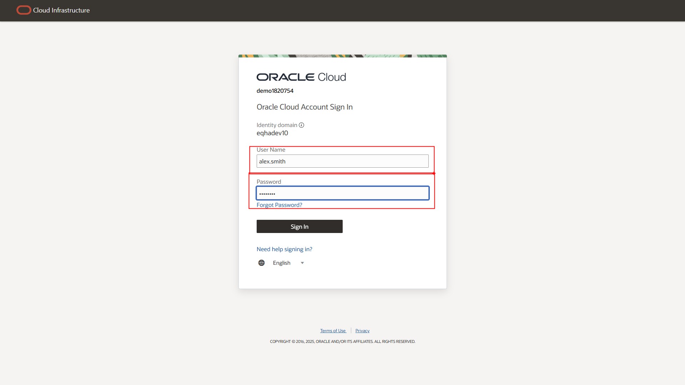
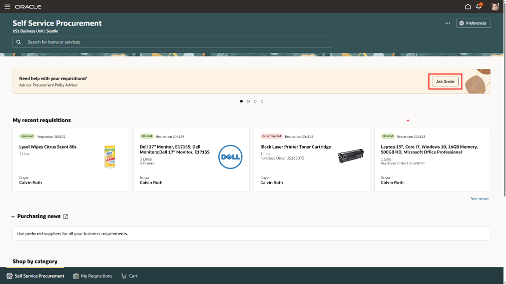
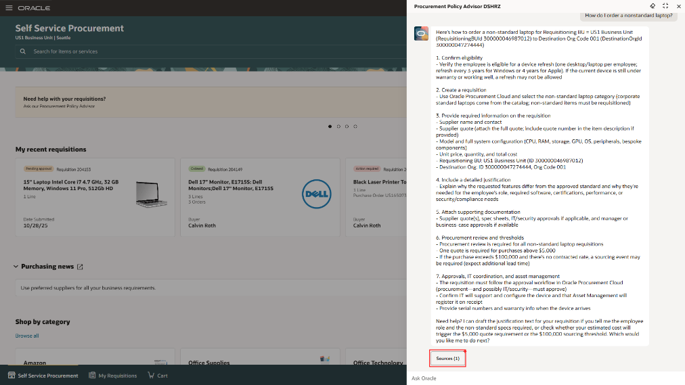
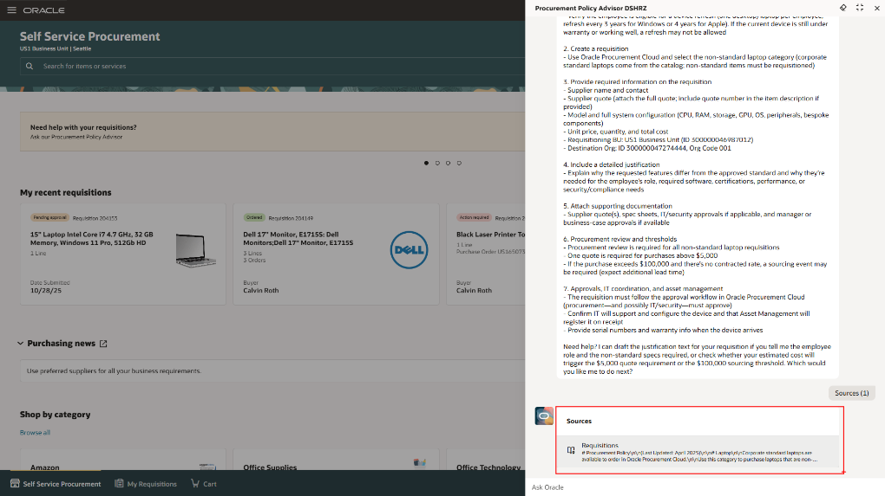
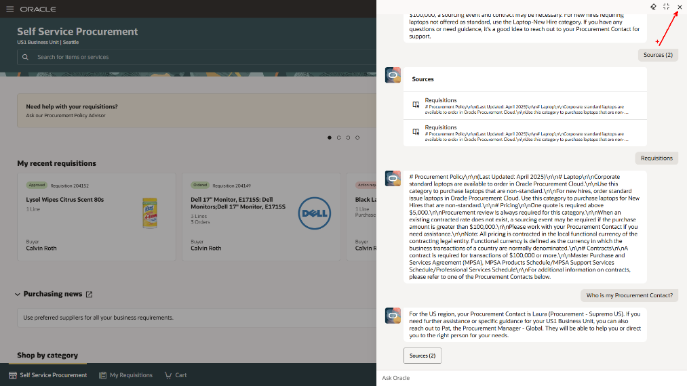
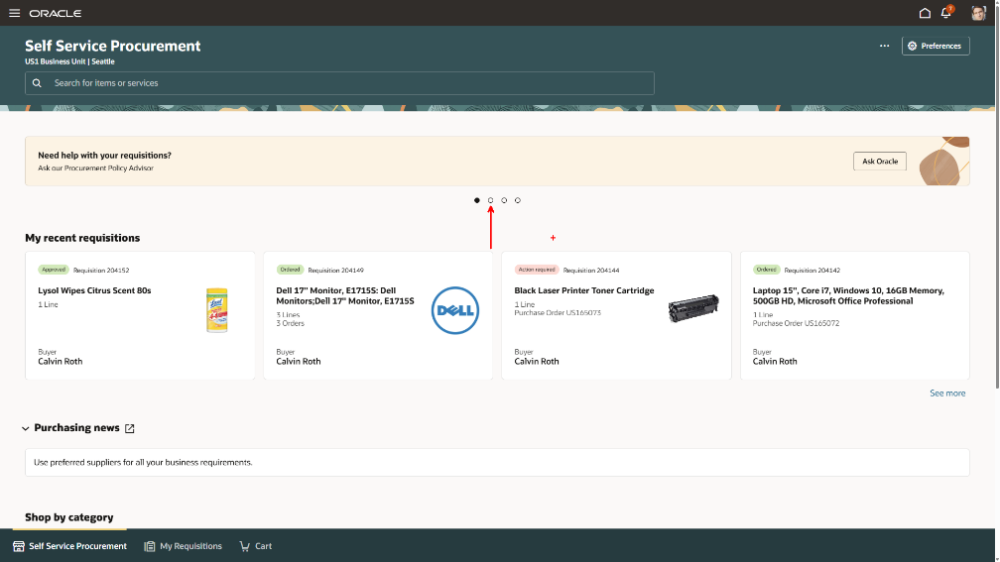
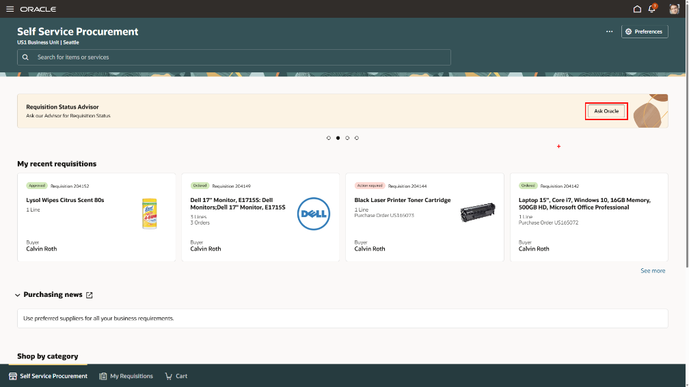
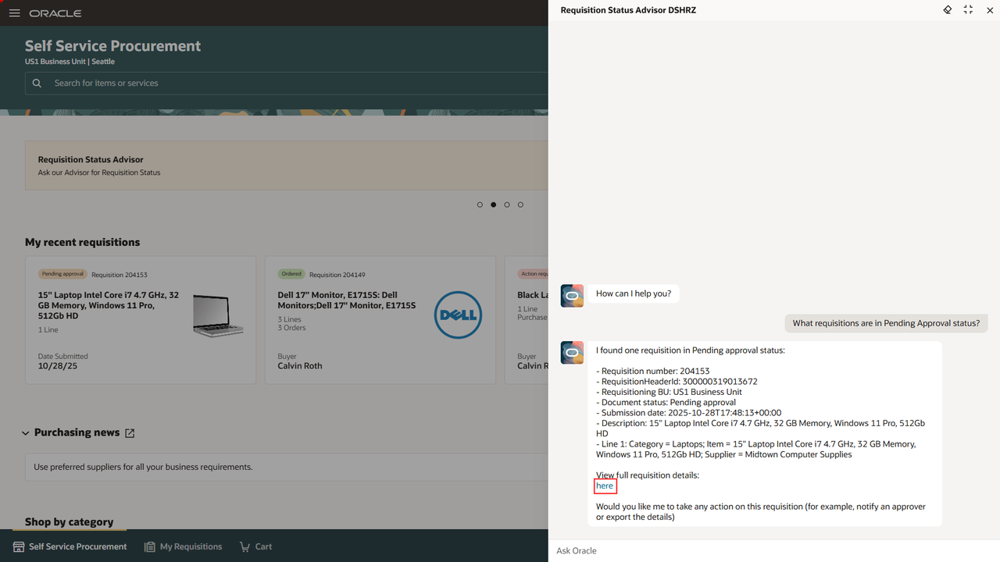
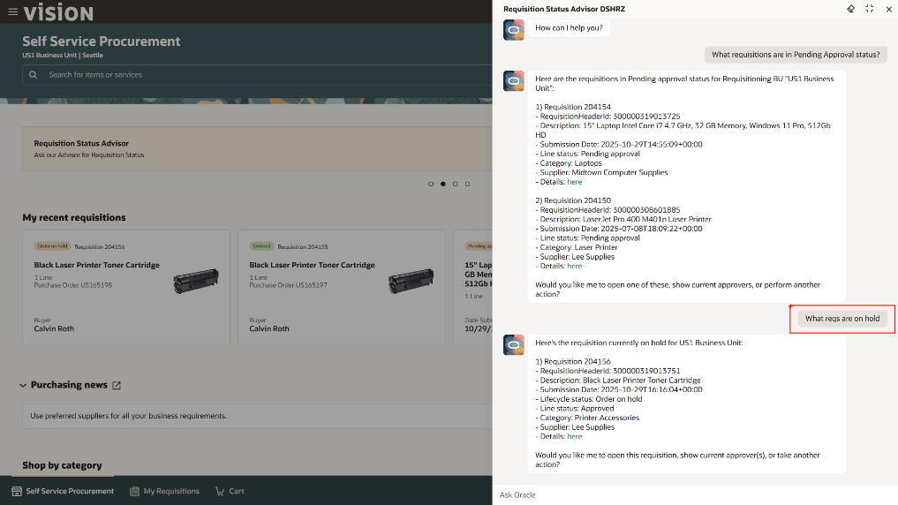
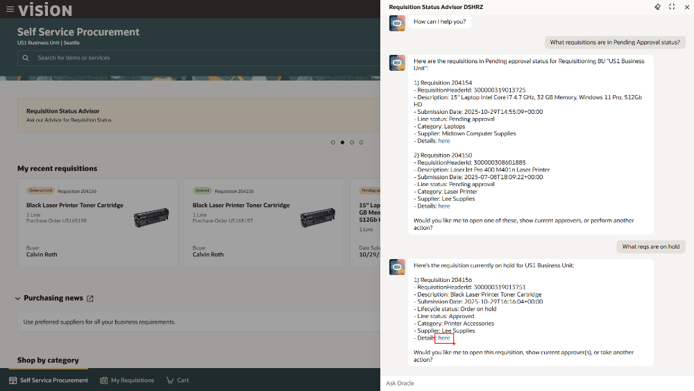

# SCM - Purchase Requisition

## Introduction

Oracle Fusion Procurement leverages advanced AI capabilities to make everyday procurement tasks easier and more efficient. With Oracle AI for Procurement, you can complete work faster, make smarter purchasing decisions, and improve supplier and stakeholder interactions, while ensuring sensitive data remains secure. These AI-driven tools help streamline key processes such as sourcing, contract management, supplier evaluation, and purchasing, enabling your team to achieve greater productivity and value.

**Estimated Time:** 10 minutes

### Objectives

On the same sales trip, the sales VP damaged his laptop and needs to order a new one. He needs to utilize the purchase requisition tool to accomplish this.  We will explore and learn how AI agents can streamline information gathering and improve productivity.

## Task 1: Find and open the Purchase Requisition application

1. If not already logged in, follow the steps shown below.

   Login to the lab environment using the credentials provided. Make sure to use your assigned user.

      
    

2. Open the Purchase Requisition application

   To begin the requisition process, he needs to access the purchase requisition landing page  
   
      > -   Click on **Procurement** tab
      > -   Click on **Purchase Requisitions** tile

      
   
## Task 2: Explore the Purchase Requisition UI and Ask Oracle

   From here, you can view the details around your recent requisitions and see brief details of their status and where they are at in the requisition process. This is also the area where you can search the entire catalogue of items.

1. Open the **Procurement Policy Advisor** AI agent.

   The sales VP is unsure what he’s allowed to order, he utilizes the **Procurement Policy Advisor** to learn about his options. This is an embedded agent that users can talk with to find more information around the companies procurement policies including what items they are allowed to order, warranty information, etc. 

      > Click the **Ask Oracle** button

      

2. Ask about the existing policies for purchasing laptops 

      > In the agent panel, click the **How do I order a nonstandard laptop?** option.

      

      

   The agent pulls in the necessary information from the procurement policy documents and provides information around how to order specific items, like a non-standard laptop. These documents can be hundreds of pages long, so have an embedded AI agent to retrieve the necessary information is a huge time saver.  

   The agent then lists out the step-by-step process for ordering a non-standard laptop. 

      > Click on the **Sources** button

         

   The agent will also provide sources so users can view the actual documentation that outlines the specific policy that is relevant to their request. 

      

      > **Optional:** Click on the first source to see the actual source text.

3. Ask about who you can contact if you need help

   You are able to ask the agent questions about the conversation to get more context or find more information. 

      > In the agent chat box on the bottom, Ask “*Who is my Procurement Contact?*”

      

    Once going over the policy, the sales VP then orders a new laptop using the catalogue (we will not go through this process in today’s flow). Now that the laptop has been ordered, we want to check on the status of the requisition. 

      > Close the chat by clicking the **X** in the top right corner.

      

## Task 3: Check the Purchase Requisition's Status

   The Sales VP wants to check on the status of his laptop purchase.  He is going to use another agent, **Requestion Status Advisor**, that’s embedded into the requisition dashboard.

1. Open the **Requisition Status Advisor** AI agent.

      > Select the second banner item by clicking on the **second dot** under the banner.

   

      > Click the **Ask Oracle** button

   

   The advisor provides details around open requisitions. It can be used by end users that are actively requisitioning items, or by a procurement specialist that is responsible for hundreds of requisitions. 

2. Check the status of the purchase requisition 

   The AI agent makes it much easier to find requisitions that need action taken. The agent will pull up all requisitions that apply to the prompt a user types in. 

      > In the agent panel, click the **What requisitions are in pending approval status?”** option.

      

   The requisition for the laptop the VP ordered will pop up with full details and he has the ability to drill into the requisition. 

      

      
   
   **Optional:** 
      > -   Click the hyperlinked ‘**here**’ option to view the requisition. A new tab will open presenting the requisition details.
      > -   Once you've completed your review, close the broser tab and return to the tab with the agent. 

   While he is in here, he wants to view other requisitions that require action. This allows him to either take direct action or reach out to the right person that can fix the issue. The AI agents within the system can understand natural language, so there is no need to talk like a robot. 

      > In the agent chat box on the bottom, ask “*What reqs are on hold?*”

      

   **Optional:** 
      > -   Click the hyperlinked ‘**here**’ option to view the requisition. A new tab will open presenting the requisition details.
      > -   Once you've completed your review, close the broser tab and return to the tab with the agent. 

      

   You can now view more details regarding this requisition, edit the requisition, and confirm receipt of the items once received so the invoice can be paid to the Supplier.

   **Optional:** view more information around the requisition as well as more details around the item. 

      

   Now that the Sales VP has finished researching his requisitions, he now wants to ensure that the correct people in his organization have appropriate access to the requisition tools. 

   Congratulations!!  You have completed the **Supply Chain Management** set of embedded AI flows.

      > Click the **Home** icon on the ribbon at the top of the page to return to the main springboard page.

   [Click here to proceed to the next module](#next)

## Summary

By following these steps, you successfully walked thru the AI capabilities available to an employee within Fusion Supply Chain Management (SCM) that will enhance their efficiency and provide them a more engaging experience. Embrace the future of SCM with the power of AI!

**You have successfully completed the Activity!**

## Acknowledgements
* **Author** - Jimmy Dwyer, Oracle North America
* **Contributors** -  Piyush Ruparelia, Oracle North America
* **Last Updated By/Date** - Piyush Ruparelia, November 2025, based on Fusion 25D
