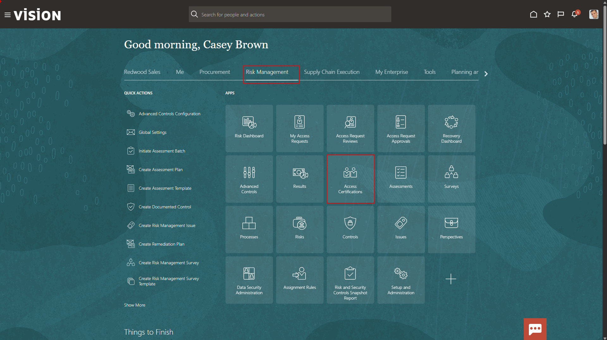
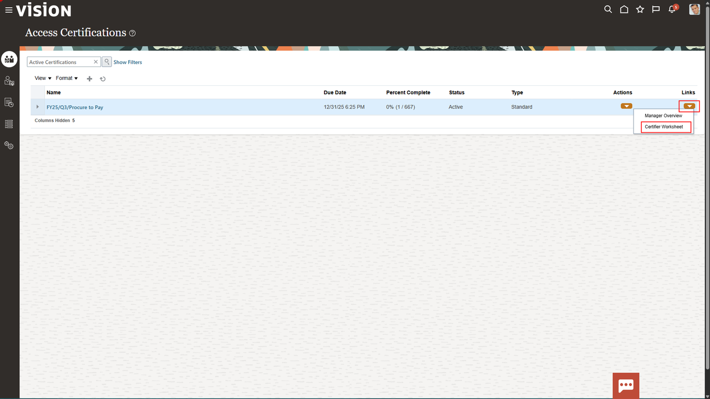
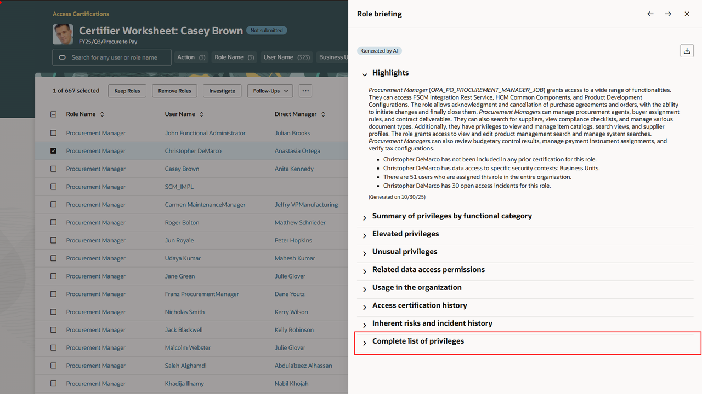
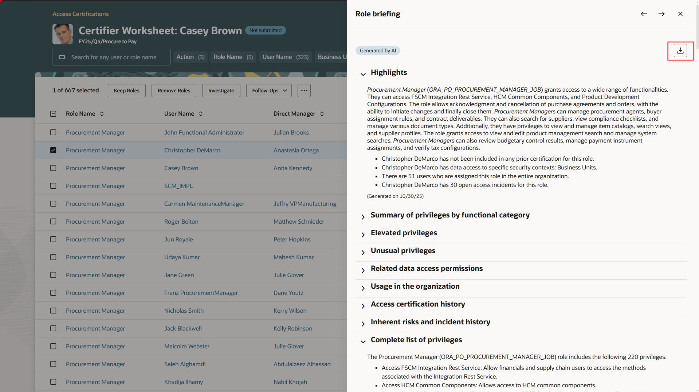
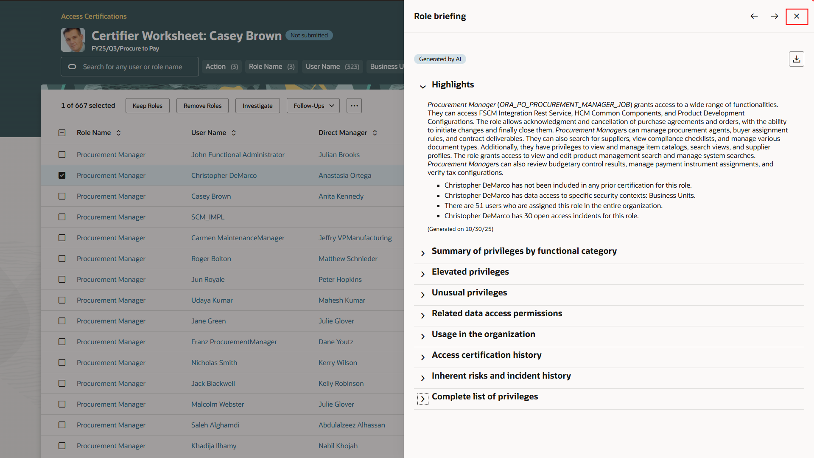

# Examine how Generative AI simplifies the decision process within Risk Management

## Introduction

Oracle’s AI agents for Enterprise Resource Planning (ERP) deliver predictive, generative, and agentic AI to improve operational efficiency, automate standard transactions, increase visibility across financial operations, and optimize finance processes. Embedded within finance workflows, these can help finance leaders transform core finance functions by automating end-to-end processes and delivering predictive insights that boost productivity, enhance performance, and strengthen control.

**Estimated Time:** 10 minutes

### Objectives

Now that the sales VP has finished researching his requisitions, he now wants to ensure that the correct people in his organization have appropriate access to the procurement applications.

## Task 1: Find and open the Access Certifications

1. If not already logged in, follow the steps shown below.

    Login to the lab environment using the credentials provided. Make sure to use your assigned user.

      

2. Open and Explore Access Certifications

   As part of quarterly controls, the Sales VP needs to certify that only authorized team members can create purchase requisitions. Instead of combing through spreadsheets or multiple reports, he accesses **Access Certifications** that utilizes AI for embedded insights and Generative AI brings to surface risks and speedy decisions.  
     
      > -   Click on **Risk Management** tab
      > -   Click on **Access Certifications** tile

      

      > -   For the row, where **Name** column value is **FY25/Q3/Procure to Pay**, click on **Dropdown arrow** under the **Links** column
      > -   Select **Certifier Worksheet** menu option

      

   In the **Certifier Worksheet**, you can see all users who have access to creating a requisition and their assigned roles in one place and an indicator of pending actions.  

      > Under the **Role Name** column, click the **Procurement Manager** link for one of the rows to open the AI powered role briefing. 

       

   Instantly, you get a plain-language summary of what that role allows — in this case, the ability to create purchase requisitions — plus how many users currently have it and if any separation-of-duties conflicts exist. 

3. Review the Briefing Report

   No need to interpret technical privileges or switch to another report — the Generative AI summary gives her everything in context.

       

       

      > You can expand additional sections like **Summary of Privileges**, **Usage in the Organization**, and **Inherent Risks** to see details like functional breakdowns or potential conflicts with other access areas.

   Based on this context, you can now make a quick, confident decision — whether to Keep or Remove the role — and provide a short justification directly in the worksheet. 

      > Expand the **Complete List of Privileges** section

       

   The Generative AI summary gives the full story behind each access decision, right where you need it, helping you close out certifications faster and with stronger audit confidence. 

## Task 2: Complete Review and Complete Certification Tasks

1. Download detailed Role Briefing document.

   If the sales VP or an auditor ever needs detailed evidence, he can instantly export this entire Role Briefing as a formatted report package — no manual screenshots or separate documentation required. 

   With just one click, the system generates a comprehensive PDF containing all of the same insights — the AI-generated summary, privilege details, usage history, and risk indicators — neatly organized by section.

      > -   **Scroll back to the top** of the Role Briefing
      > -   Select the **download Icon**

      

   The export automatically stamps the date and confirms it was ‘**Generated by AI on** *today’s date*', giving a clear audit trail of when and how the review was performed. 

      > Open downloaded report

      

   This packaged report becomes part of the certification record, making it easy for auditors to validate access reviews without additional follow-up or clarification requests. 

   That means less administrative work and more confidence that her access certification is fully documented, compliant, and ready for audit

      > -   Return back to the AI Agent tab.
      > -   Click the **X** to get out of the role briefing and go back to **Certifier Worksheet** page

      

2. Complete Certification Tasks

   After reviewing the AI-generated briefing and confirming the access is still appropriate, The Sales VP decides to keep the role for the user.
   
      > -   Select the row for the user you just reviewed
      > -   Click on **Keep Roles** button

      

      > -   Add a short comment — for example, ”*retain requisition creation access*”
      > -   Click the **Keep** button to complete the task.

      

   See **Action status** is updated and **Comment icon** is now populated for audit trail. 

      

   In just a few clicks, the Sales VP completed the access review — backed by Generative AI explanations, automated evidence capture, and one-click export for audit packages. 

   The result is faster certifications, fewer compliance gaps, and a complete digital trail that’s always ready for auditors — all without leaving Oracle Cloud.

   Congratulations!!  You have completed the **Enterprise Resource Planning** set of embedded AI flows.

      > Click the **Home** icon on the ribbon at the top of the page to return to the main springboard page.

   [Click here to proceed to the next module](#next)

## Summary

By following these steps, you successfully walked thru the AI capabilities available to an employee within Fusion Enterprise Resource Planning (ERP) that will enhance their efficiency and provide them a more engaging experience. Embrace the future of ERP with the power of AI!

**You have successfully completed the Activity!**

## Acknowledgements
* **Author** - Brittani Virgilio, Oracle North America
* **Contributors** -  Jimmy Dwyer, Piyush Ruparelia, Oracle North America
* **Last Updated By/Date** - Piyush Ruparelia, November 2025, based on Fusion 25D
