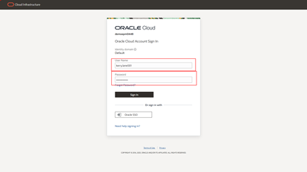
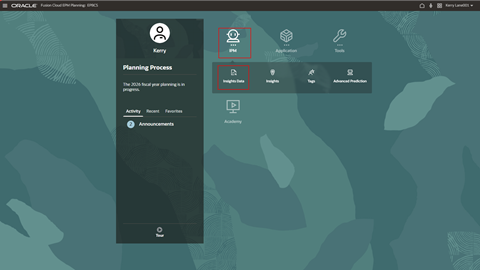
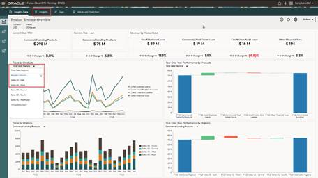
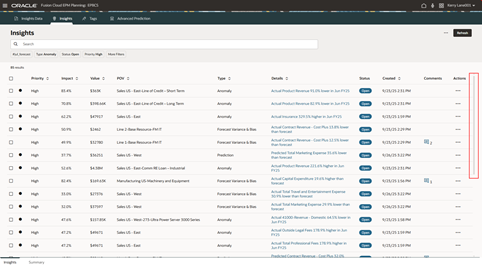
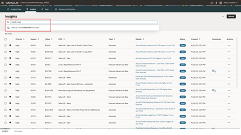
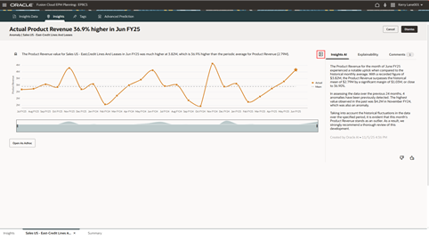
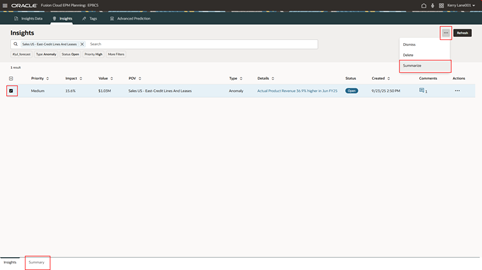
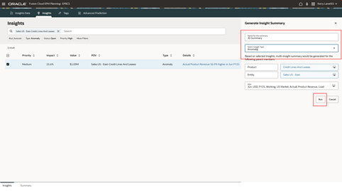
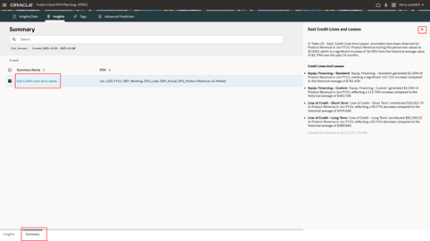
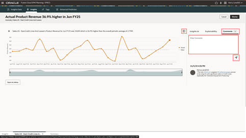

# Enterprise Performance Management - Anomaly Insights

## Introduction

Oracle Fusion Cloud Enterprise Performance Management (EPM) delivers a unified
platform for connected enterprise planning, with embedded intelligence and best practices
for informed financial and operational decision-making—without the need for data
scientists. AI is embedded in the Oracle Cloud EPM platform, within the context of the work
finance is performing. 

Estimated Time: 10 minutes

### Objectives

In this exercise, you will learn how to use Insights to identify anomalies, explore root causes, and generate AI-driven narrative summaries for performance analysis.

## Task 1: Log in and conduct performance review 

1. First you will log in and navigate to **Insights Data**.

      > Login to the lab environment using the credentials provided. Make sure to use your assigned user.

      

   Let’s see how the Insights provide items for action and facilitates collaboration across various stakeholders. 

      > Click on the **IPM** icon
      > Click on  **Insights Data** icon

      

2. Review the insights presented on the dashboard

   The dashboard highlights revenue performance across regions and major product lines.  Change the drop down on the line graph from “**Total Sales Regions**” to “**Sales US East**” and “**Sales US West**”</br></br>
   It seems the revenue for “**Sales US – East**” has increased while in contrast “**Sales US – West**” shows declining revenue.  This situation requires further investigation.  Let’s review this leveraging the Insights.

      > 1.	On the line graph, click on the drop down titled “**Total Sales Regions**”
      > 2.	Select “**Sales US – West**” and review.
      > 3.	Select “**Sales US – East**”  and review.
      > 4.	When finished, click on the “**Insights**” tab on the horizontal bar above the dashboard.

      

## Task 2: Review the various Insights surfaced by AI

1. Review the list of insights

   All the Insights generated are brought together onto the Insights dashboard.  This is a highly curated set of Insights that are very accessible for a business user.  The application is making the artificial intelligence (AI) very user-friendly.  </br>

   When the Insights are configured, the priority can be determined as high, medium, or low.  Both the $ and % variances are shown along with the data intersections of related data and the type of variance - a Prediction, Forecast Bias, or Anomaly. </br>  

   This exercise will focus on just the Anomaly type.  There is also have a high-level explanation of the Insight, its status, and when it was created.  

      > Scroll down to review the listing of Insights.  

      
      

2. Open and Review one of the detected anomalies

   Let us identify the factors behind Sales East's strong performance.  Filter the Insights to review anomaly generated for “**Sale US East – Credit Lines and Leases**”

      > In the search box, type ”**Credit Lines**” and select “**Sales US – East Credit Lines and Leases**”

      

   The model has generated an anomaly for Sales US Eastern region’s “Credit Lines and Leases” products.  This product portfolio has several product lines, and the anomaly is generated at total level.

      > Click the **Details** link to open the selected Insight.

      

3. Review the details behind the Insight for Sales US East

      > 1.	**Hover over** the data point represented as a **star** at the far-right hand side of the line graph. 

      

   On the chart, the orange line is the Actual revenue, and the system has automatically detected that there’s been a spike in the revenue – a very unusual spike.  The system is doing a lot of hard work behind the scenes in identifying the spike.  Just because there is a usual spike in Q4, it’s not going to identify that as an anomaly.  It’s only going to identify the true anomalies in the system, unusual patterns that deviate from expected results.  This is useful information – it might make sense to contact the responsible people for this sales territory and channel because the spike is very specific.  The analysis is not just the overall spikes, but spikes across a multi-dimensional model, and maybe there’s something about this territory or channel or product where something has changed to create this increase in revenue.  If this trend continues, it might be possible to learn from it for other territories or channels.

   You notice the spike in the trend line and review the narration generated automatically by the Insights using Generative AI.  The Insights AI tab uses Generative AI to automatically generate narrative summaries (for a single Insight or group of Insights).  For a single Insight, Genarative AI evaluates the existing analysis, metrics, methods, and rule-based summary, and using Large Language Models (LLMs), generates a meaningful narrative description about the Insight.

      > 2.	Click on the **icon at the top right-hand side** of the line graph to expose the explanations panel from the right-hand side of the chart. 

      > 3.	Review the “**Insights AI**” tab.  It contains a narrative explanation of the anomaly generated by AI.  

      

## Task 3: Determine the cause of the exceptional results

   You want to determine what drove Sales East's exceptional results.  Let us utilize Generative AI to create a summary that identifies which specific products and lines were responsible for this unusual performance.</br>

   Insights also provides the ability to use Generative AI (GenAI) to automatically generate narrative summaries for a parent level Insight.  The entities / products contributing to the anomaly is automatically detected and narrated in a organized, automated summary. 

   > 1.	Navigate back to Insights listing page by clicking on the “**Insights**” tab at the bottom-left hand side of the screen.
      
   > 2.	Select the Insight by putting a **check mark into the box** for the Insight. 
      
   > 3.	Open the **Actions** dropdown and select **Summarize**.

   

   

   Complete the fields as described below.
   > 1.	Provide a name for the **Summary**
   > 2.	Select the “**Anomaly**” **Insight Type** from the dropdown
   > 3.	Other parameters are automatically populated based on the Insight selection
   > 4.	Click the **Run** button
   (It may take a short time to complete the Generative AI summary.)

   

   You are presented with a ready-to-use summary explaining how the performance at individual entity / product level contributed to the overall anomaly.  This summary helps zero in on the root cause for the Insight and makes it easy to collaborate across functions.  Some of the product lines have contributed significantly for the anomaly. </br>

   This summary can be taken to reports and/or presentations as ready to use content with all relevant data points.

   
   

## Task 4: Re-open the Insight and add comments (Optional)

1. Return to the Insight

      > Click on the **Insights** tab at the bottom of the screen to get back to the Insights page.  

      

      > Click again on the **Details** link to see the contents of the Insight again.  

      

2. Add your observations of the Insight

   Adds your comments to the Insight providing additional reasoning for the anomaly.  Tagging is also enabled in comments with # (hashtags).  You can include # (hashtags) in comments, containing relevant key words, which then can be used to filter the Insights.  

      > 1.	Click on the **icon at the top right-hand side** of the line graph to expose the panel from the right-hand side of the chart. 
      > 2.	Click on the “**Comments**” tab to expose the ability to enter comments for the Insight.
      > 3.	Copy and paste from the comment below or type a similar comment using # (hashtags) into the “**Enter Comments**” text box and click the **Post icon**.

      ```txt
<copy>
         The new #AIdriven targeted #marketcampaign proved to be a big hit with significant sales in Credit Lines especially the ‘Standard Equipment Financing’.
</copy>
      ```

   

3. Tag other users and ask them to review the Insight

      > 1.	Start by typing “**@S**” in the “**Enter Comments**” text box.  Then choose “**Susan Chang**” from the list that pops up.  Add more comments asking Susan to review the Insight and “**post**” that comment.  The user tag becomes a filter for Susan to use to focus on only the Insights where she is tagged.  

      

   Congratulations!!  You have completed the **Enterprise Performance Management** set of embedded AI flows.  
   
      > Click the **Home** icon on the ribbon at the top of the page to return to the main springboard page.

## Summary

By completing these steps, you have explored the AI features available in Enterprise Performance Management, designed to boost your productivity and deliver a more engaging experience. Leverage the power of AI to shape the future of finance!

**You have successfully completed the Activity!**

## Acknowledgements
* **Author** - Jimmy Dwyer, Oracle North America
* **Contributors** -  Piyush Ruparelia, Oracle North America
* **Last Updated By/Date** - Piyush Ruparelia, November 2025, based on Fusion 25D
