# Introduction

## Introduction

Use these instructions to setup the Supplier_Stock VB app for the supplier inquiry as well as the API tool to use in the custom agent.

Estimated Completion Time: 20 minutes

### **Objectives**

Setup demo in new environment. You will:
- Add Supplier_Stock Visual Builder app and populate with data
- Add External REST tool to query Supplier_Stock Visual Builder app

### **Prerequisites**
- Visual Builder environment
- Purchase Requisition data accessible to demo user(s)

### **Notes**
- The provided instructions and Visual Builder application are provided as sample code and are not considered supported functionality.
- To give this lab to participants without the setup instructions, direct them to https://oracle-livelabs.github.io/oci/apps-ai-experience-extend-pr-assistant/workshops/tenancy/index.html

## Task 1: Download and install Supplier_Stock Visual Builder app

1. First login to your Visual Builder design app.

2. Import the Supplier_Stock Visual Builder app.  From Visual Builder home page, select Import:
    

3. Select **Application from file**:

    

4. Download zip file **[HERE](files/Supplier_Stock.zip?download=1)** and drag it to **Drag and Drop** area, change application name if desired, and click Import:

    

## Task 2: Validate Application Security Settings


***IMPORTANT: The provided Visual Builder application has authentication and security set to allow anonymous access.  </br>Please change these if your organization requires a secure set up.***

1. Open your newly imported Visual Build Application:

    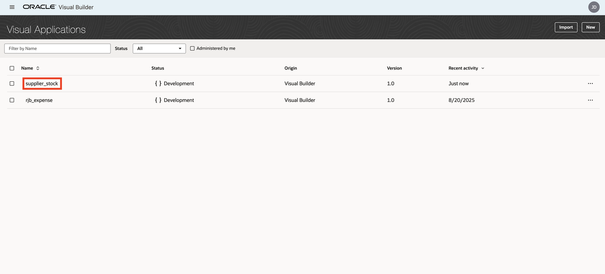

2. Click on the ellipses in the upper right corner to bring up the application menu and click **Settings**:

    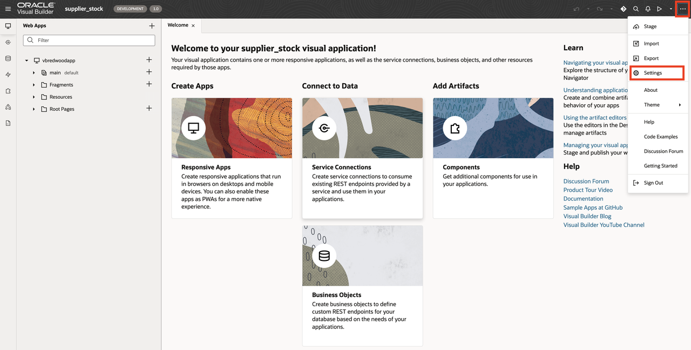

3. Click on the **Business Objects** tab and note the security settings.  This app has been setup to allow anonymous API access.  Change these settings if secure access is desired:

    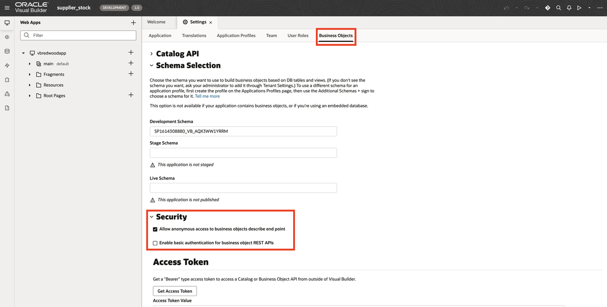

4. Click on the **Business Object** icon &nbsp;&nbsp; in the left margin, then select the **Inventory** Business Object, and select the **Security** tab.  Note that the security for this business object is configured to let anonymous users view the data, while authenticated users can change the data. Change these settings if desired:
    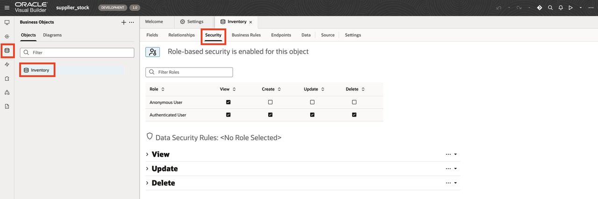

## Task 3: Validate and Modify Seeded Application Data

1. Click on the **Data** tab to preview the seeded data.  You can make changes here to the data.  You should at least change any **availabilityDate** to a future date.  </br>If you are adding or modifying records, make sure that the **item** and **supplier** fields exactly match the data being returned by your Purchase Requisition.  </br>Note that you can also export this data to a .csv file, make changes and re-import.</br>You can also make changes later in the application if you open the application as an authenticated user.

    

## Task 4: Stage the Application and extract the API Endpoint URL

1. Next you will stage the application to make it available outside of the Visual Builder Design Tool.  Click on the ellipses in the upper right corner to bring up the application menu and click **Stage**:

    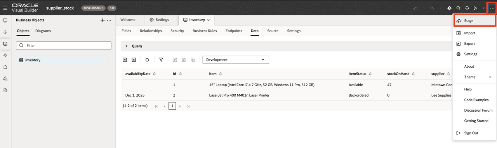

2. Select **Populate Stage with Development data** and click **Stage**.  Note that once you stage the application, data in the Development version and the Staged version are kept separate.  Take care when making data changes that you modifying the correct version.

    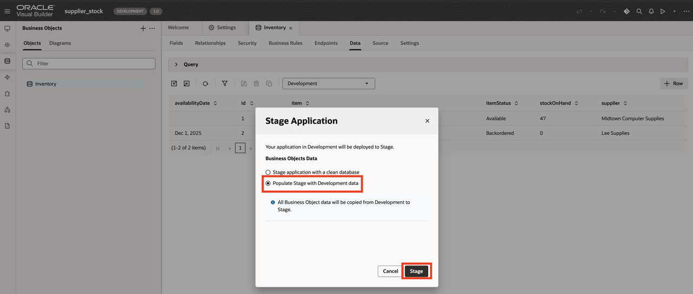


3. Click on the **Endpoints** tab, expand the **Resource APIs** section, and select the **Clipboard** icon &nbsp; &nbsp; next to the **Staging** URL in the **Data** column:

    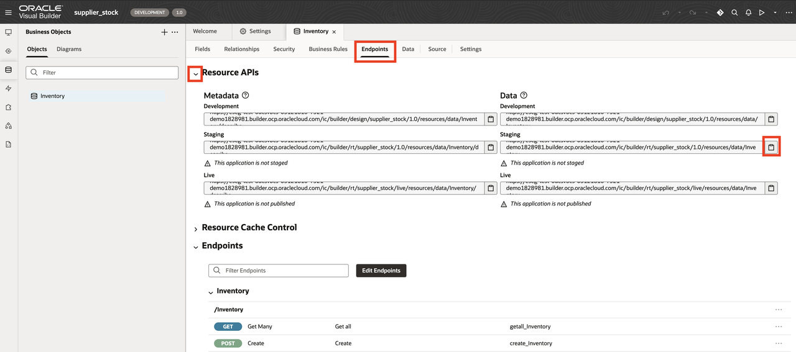

4. Save this endpoint URL to a text file.  You will need this in the next task when you create the External API tool.  It should be in the following format (if you changed the application name **supplier_stock** will instead be the name you selected):</br>
    ```
    https://<your_hostname>/ic/builder/rt/supplier_stock/1.0/resources/data/Inventory
    ```
## Task 5: Create the AIE Supplier Stock Inquiry API tool 

1. Login to Fusion and open AI Agent Studio (use casey.brown for Oracle demo environments)

2. Click on the **Tools** tab at the bottom of the screen:

    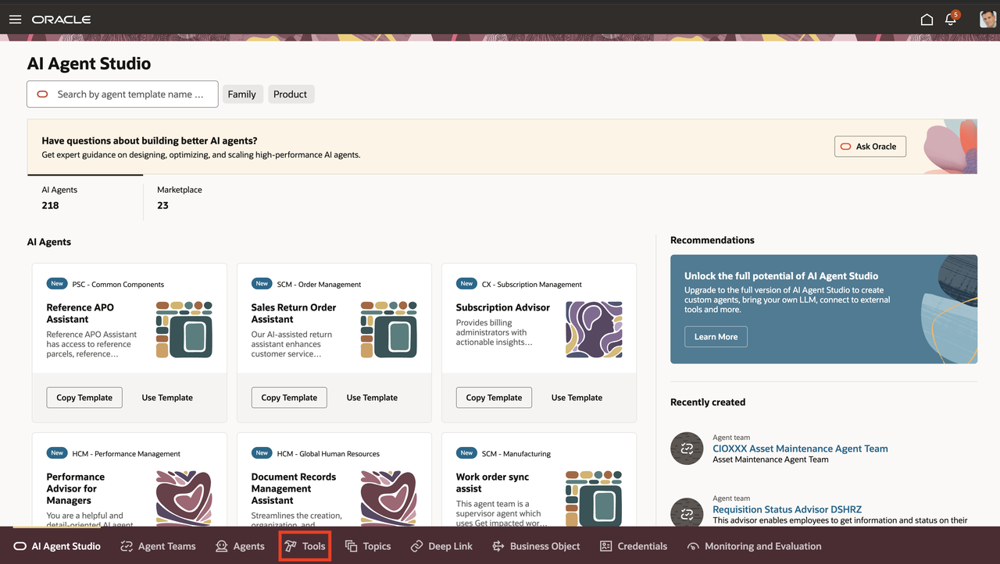

3. Click the **+ Add** button:

    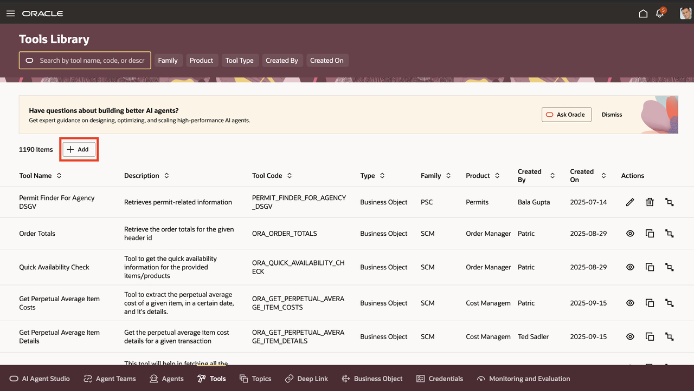

4. Fill out the form as follows:

    | Field | Value |
    | -------- | ------- |
    | Tool Name | AIE Supplier Stock Inquiry Tool |
    | Family | PRC |
    | Product | Self Service Procurement |
    | Description | *(Description of your choice)* |
    {: title="Tool Form field values"}

    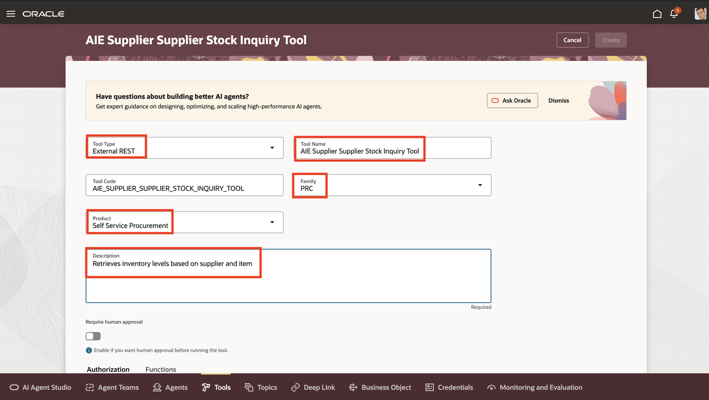

5. Scroll down to the bottom of the form and click the **+ Add** button under the **Authorization** header:

    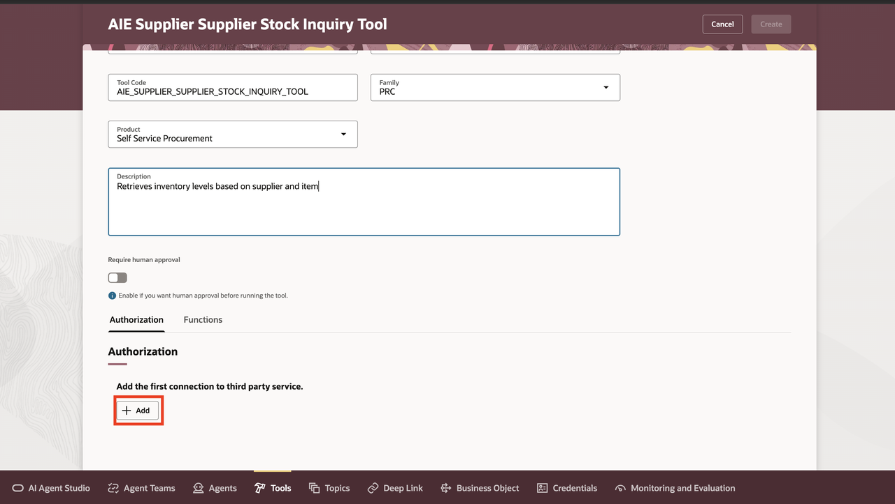

6. For **Instance URL** enter the extracted URL from the previous task up to and including **/data**:

    ```txt
    SAMPLE:
    https://<your_hostname>/ic/builder/rt/supplier_stock/1.0/resources/data
    ```
7. If you did not change the Authorization settings in your Visual Builder app, select **None** for **Authentication**.  If you did make changes select the appropriate authentication type.

8. Enter an appropriate **Description** and click the **Functions** tab:

    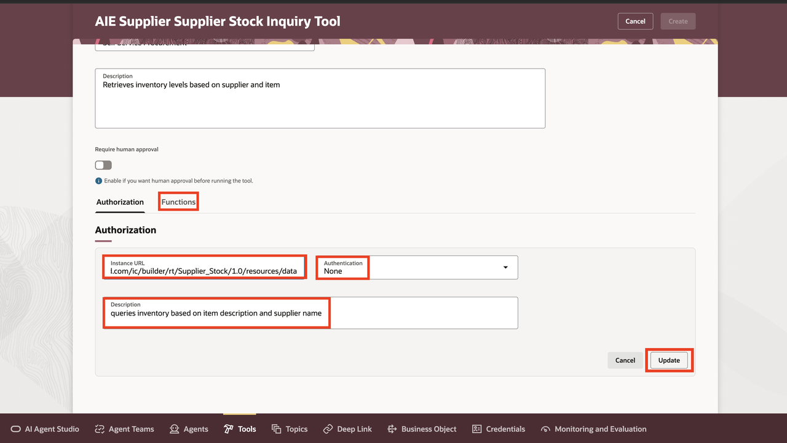

9. Click the **+Add** button:

    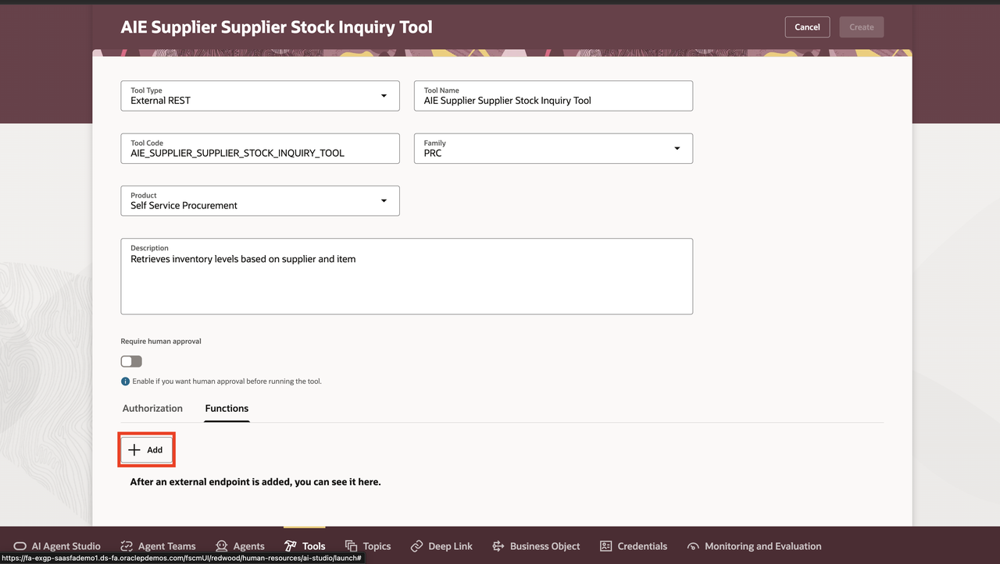

10. Fill out the form as follows: 

    | Field | Value |
    | -------- | ------- |
    | Name | InventoryInquiry |
    | Operation Type | HTTP GET |
    | Description | *(Description of your choice)* |
    {: title="Endpoint Form field values"}

    For **Resource Path** click the **Copy** button below and paste the following:

    ```txt
    <copy>
    /Inventory?onlyData=true&q=supplier='{supplier}' AND item='{itemDescription}'
    </copy>
    ```
    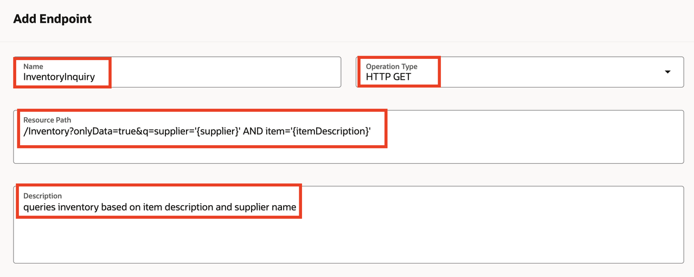

11. Click the **+Add** button under the **Parameters** heading:

    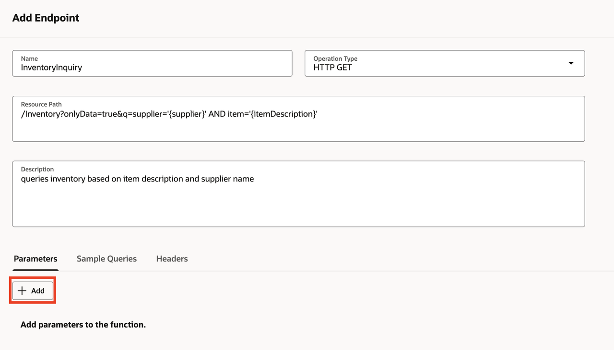

12. Enter **supplier** for **Name** and **Description**.  Check the **URL Parameter** checkbox and click the **Save** button:

    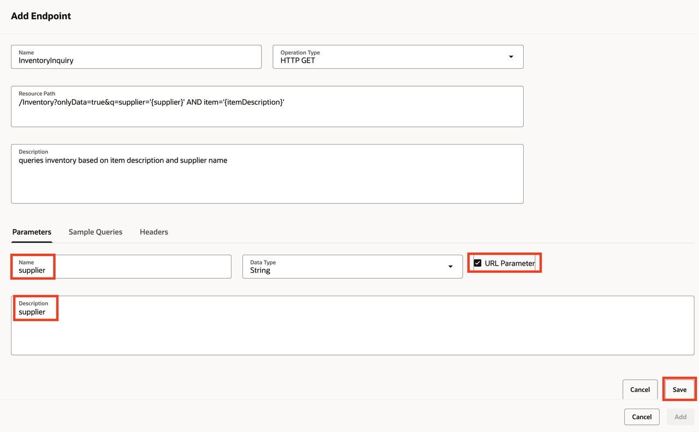

13. Click the **+Add** button under the **Parameters** heading to add a second parameter:

    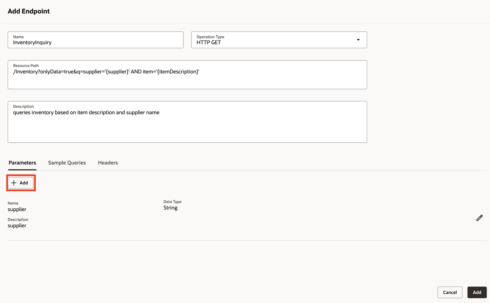

14. Enter **itemDescription** for **Name** and **Description**.  Check the **URL Parameter** checkbox and click the **Save** button:

    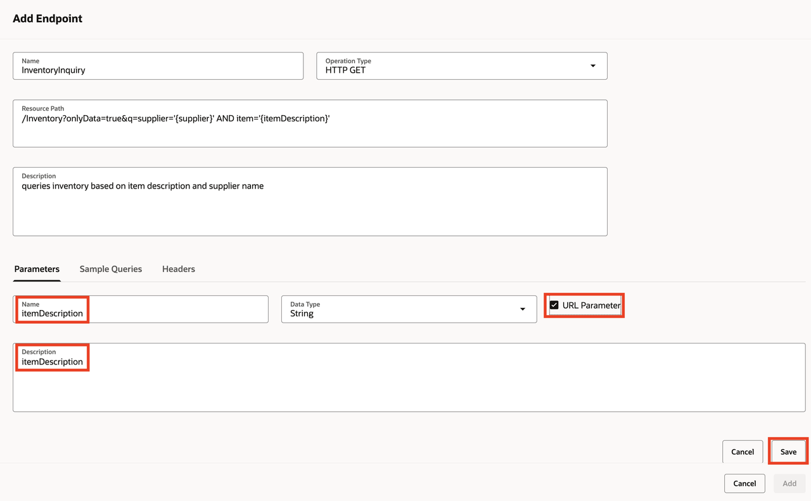

15. Click the black **Add** button at the bottom right of the form:

    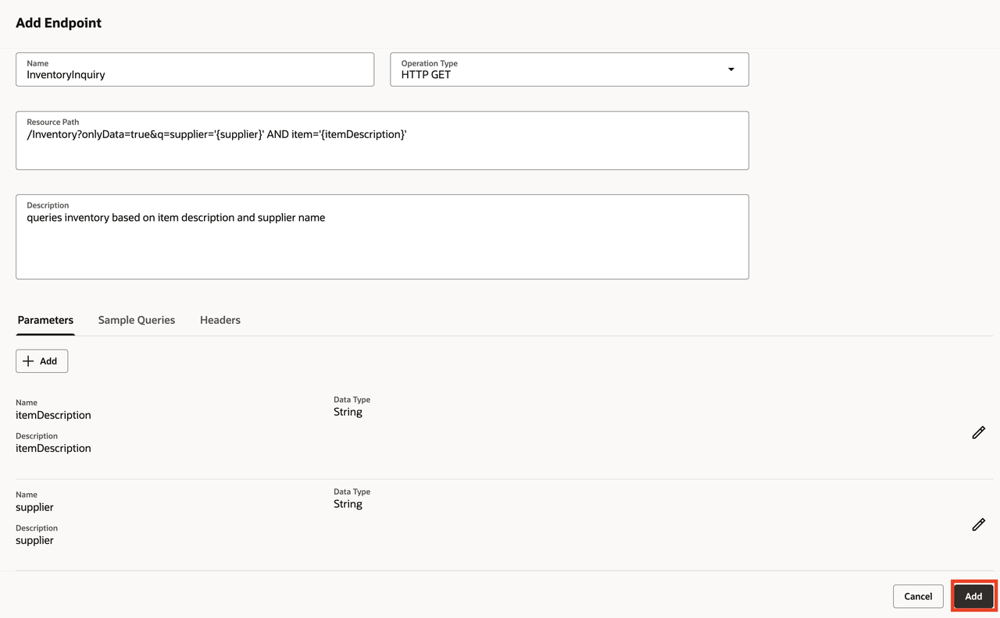

15. Click the **Create** button at the top right of the screen:

    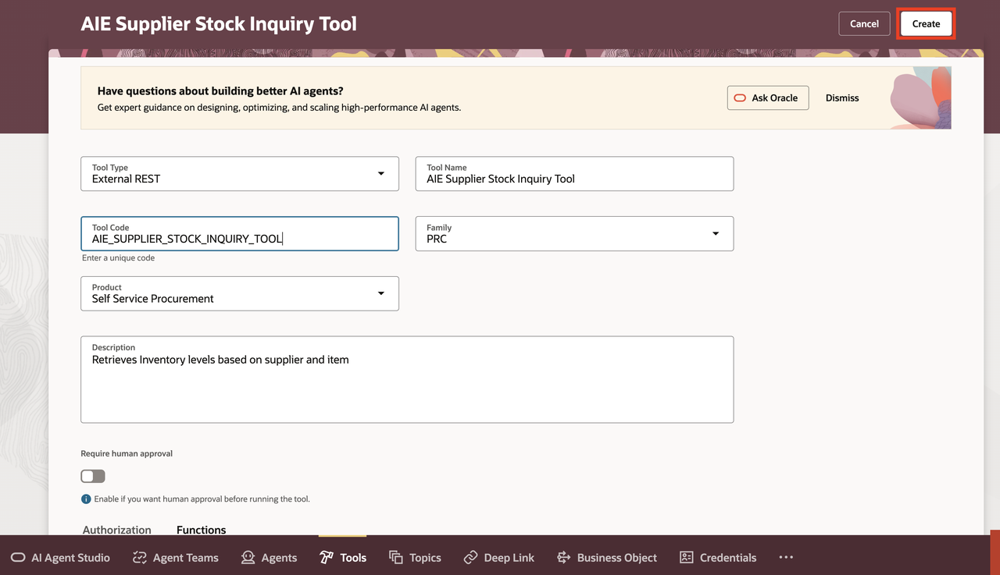

[Proceed to the first lab to get test your agent!] (#next)

## Acknowledgements
* **Author** - [](var:author)
* **Last Updated By/Date** - [](var:last_updated)