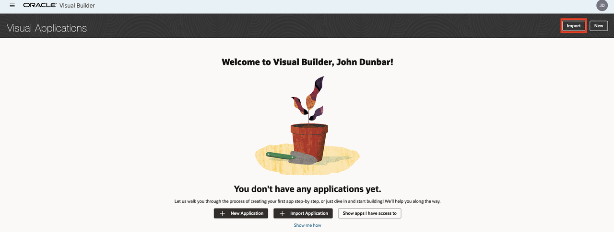
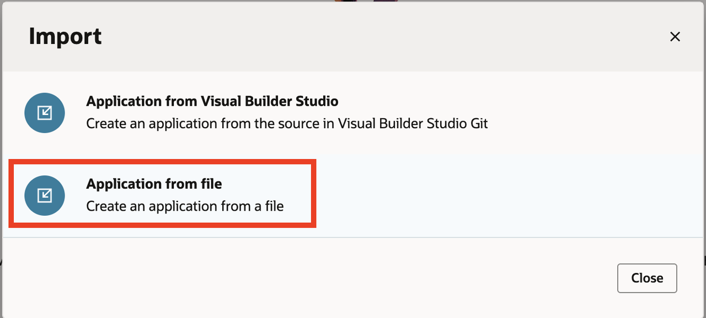
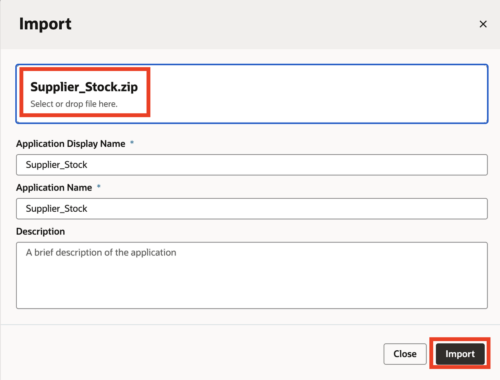

# Introduction

## Introduction

Use these instructions to setup the Supplier_Stock VB app for the supplier inquiry as well as the API tool to use in the custom agent.

Estimated Completion Time: 20 minutes

### **Objectives**

Setup demo in new environment. You will:
- Add Supplier_Stock Visual Builder app and populate with data
- Add External REST tool to query Supplier_Stock Visual Builder app

### **Prerequisites**
- Visual Builder environment
- Purchase Requisition data accessible to demo user(s)

## Task 1: Download and install Supplier_Stock Visual Builder app

1. First login to your Visual Builder design app.

2. Import Supplier_Stock Visual Builder app.
    > From Visual Builder home page, select Import:

    

    > Select **Application from file**:

    

    > Download zip file **[HERE](files/Supplier_Stock.zip?download=1)** and drag it to **Drag and Drop** area, change application name if desired, and click Import:

    

[Proceed to the first lab to get started!] (#next)

## Acknowledgements
* **Author** - 
* **Contributors** - 
* **Last Updated By/Date** - 