# Exploring a pre-built agent team

## Introduction

In this lab we will copy an existing agent template and get an understanding of the various components and the prompts that instruct the large language model (LLM) how to execute the agent team.

Estimated Time: 15 minutes

### Objectives

Understand the structure of a pre-built agent template and agent tools in AI Agent Studio

### Usage Notes

   

## Task 1: Locate and copy the pre-existing Purchase Requisition Status Advisor agent template

1. First you will log in and navigate to AI Agent Studio.

   > Login to the lab environment using the credentials provided. Make sure to use your assigned user.
    

2. Next you will locate and copy the Purchase Requisition Status Advisor agent template.

3. Go to the **Tools** tab and Click on the tile for **AI Agent Studio**:

   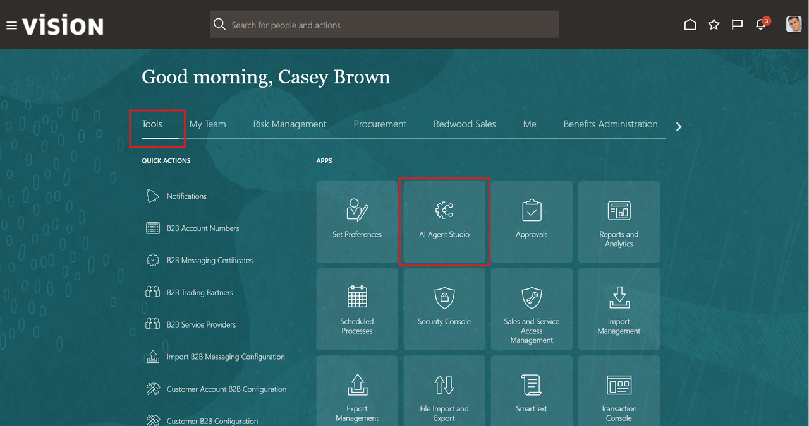

4. Search for **requisition** in the search box:

   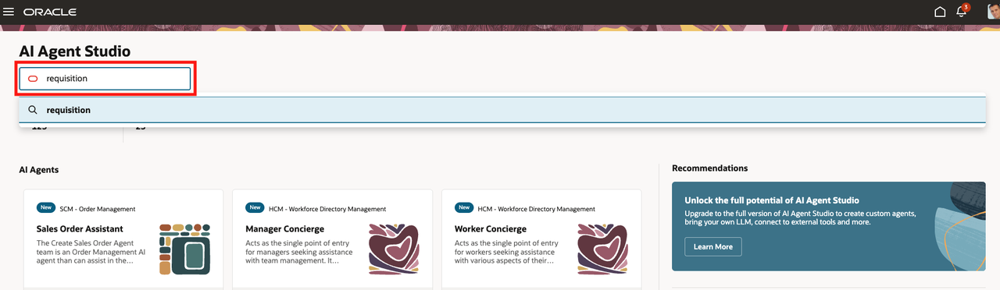

5. Click on **Copy Template** for the Purchase Requisition Status Advisor. 

   If you do not see **Copy Template**, click on the 3 dots in the bottom right corner of the Purchase Requisition Status Advisor box. 

   >  ***IMPORTANT!***  
   > ***DO NOT CLICK*** on **Use Template** 
   > **DO CLICK** on **Copy Template**.

   

6. In the Agent Team Suffix box, enter ***YOUR INITIAL CODE***. 

   Click on the **Continue** button. 
   If you get a message that a component with that name already exists, make sure you are using a unique code.  Add a number if required.  Just be sure to use that code throughout the rest of the lab.

   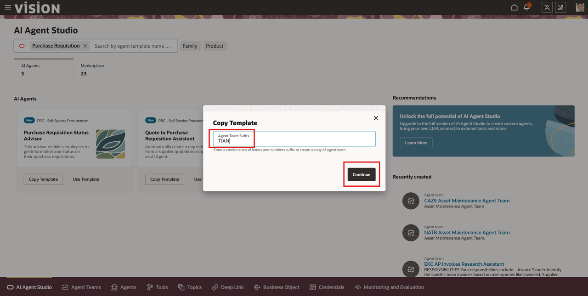

7. Next you will save your agent team copy and ensure that you can locate it.

   Click the **Save and Close** button in the top right of the screen:

   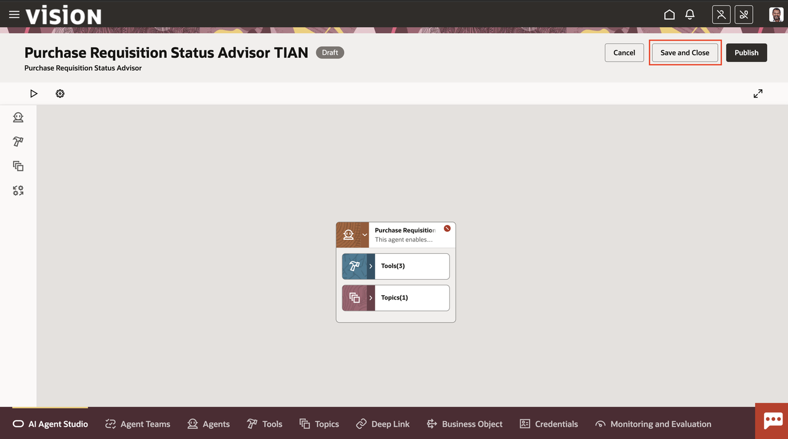

8. On the tab bar on the bottom of the screen, Click on **Agent Teams**:

   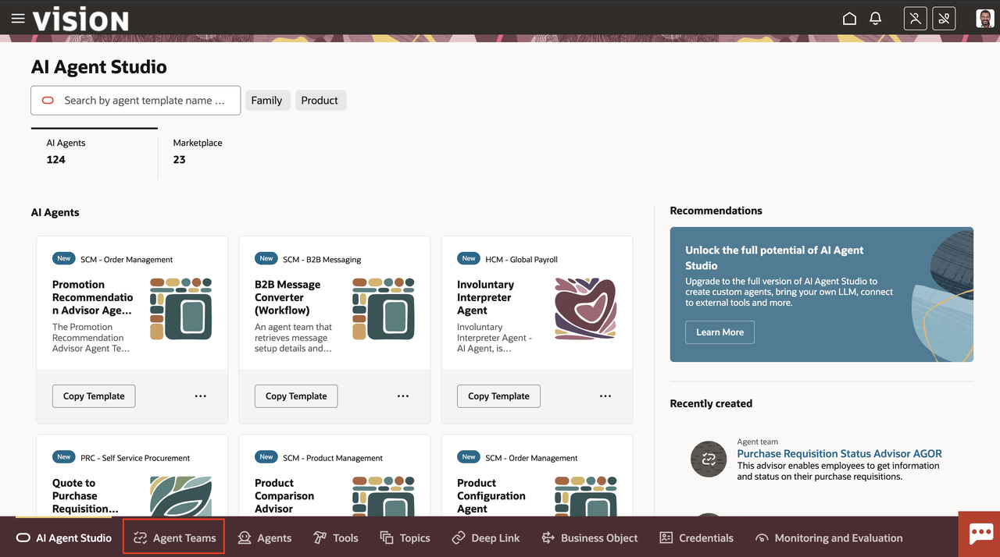

9. Enter ***YOUR INITIAL CODE*** in the search box and hit **ENTER**:

   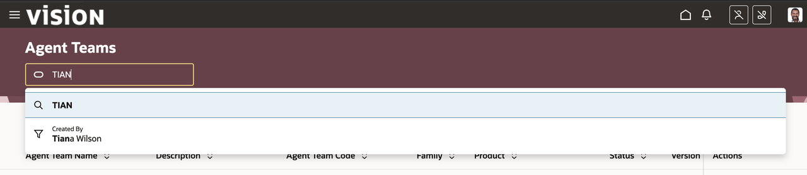

10. Select the **DRAFT** button (your agent team will be in draft status).  You should see your newly-created agent team:

   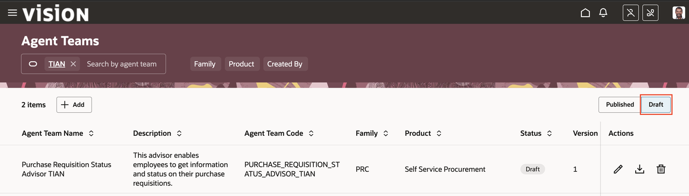

   > ***STATUS CHECKPOINT***  
   > If you do not see your agent team, return to step 2 [above](#task1locateandcopythepreexistingpurchaserequisitionstatusadvisoragent)

   **You have successfully completed Task 1!**

## Task 2: Examine the pre-built Purchase Requisition Status Advisor Agent template components

1. Open your copy of the Purchase Requisition Status Advisor Agent Team template.

   Click on the pencil icon to open your newly created agent team:

   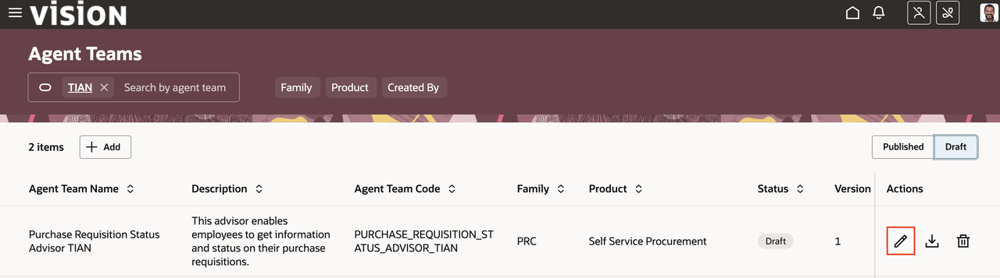

2. Let's take a closer look at the components of the Purchase Requisition Status Advisor Agent Team template.

   Notice that this agent consists of 3 tools and 1 topic:

   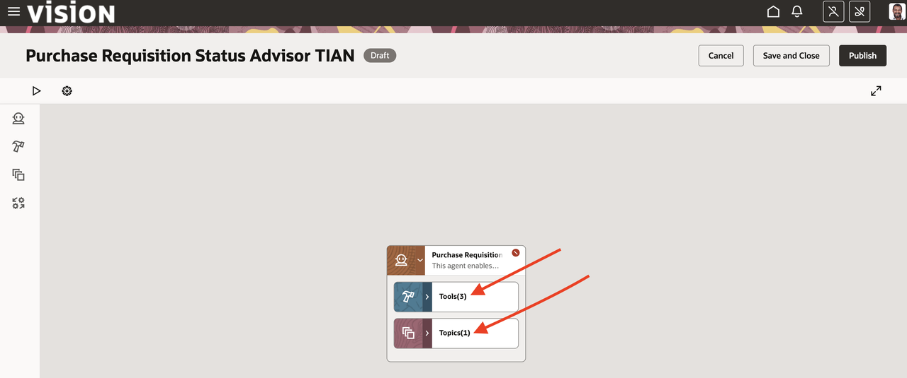

3. Expand the Tools box to expose the 3 included tools:

   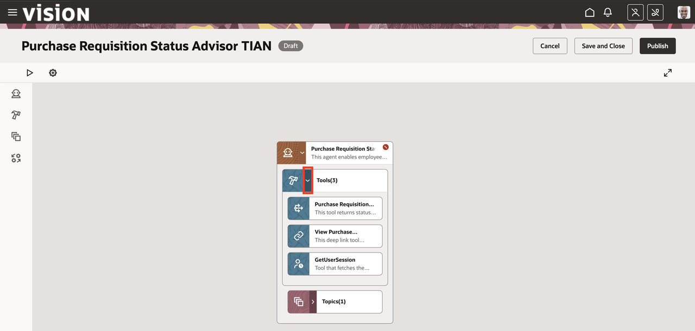

4. Hover on the first tool (Purchase Requisition Detail), click on the 3 dots in the corner, then select **View Details**:

   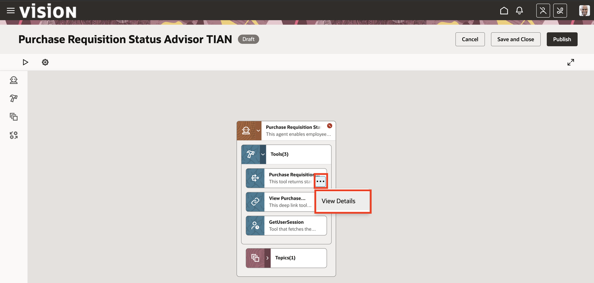

5. Notice that this tool retrieves data from the Purchase Requisitions Business Object.  Notice the multiple functions that allow searches by different parameters, as well as functions to create new purchase requisitions:

   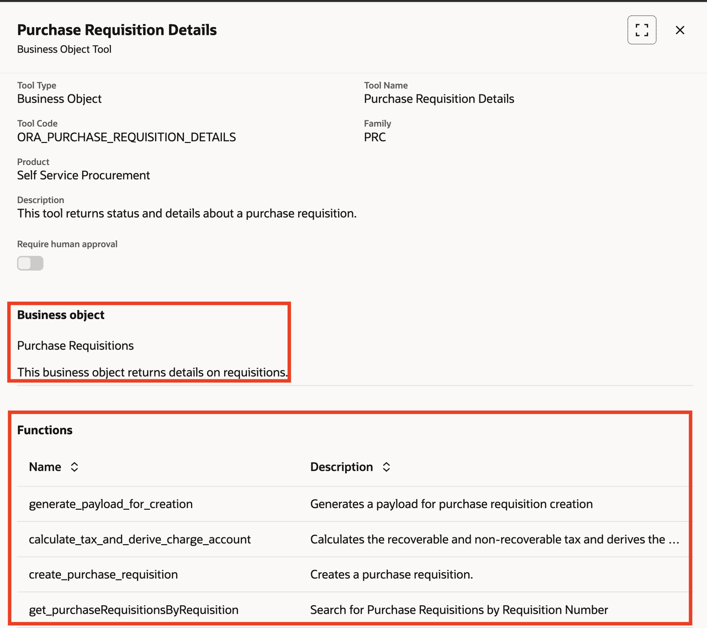

6. Click on the **X** on the upper right to close this tool. <br/ >
7. Hover on the second tool (View Purchase Requisition Details Deep Link), click on the 3 dots in the corner, then select **View Details**:

   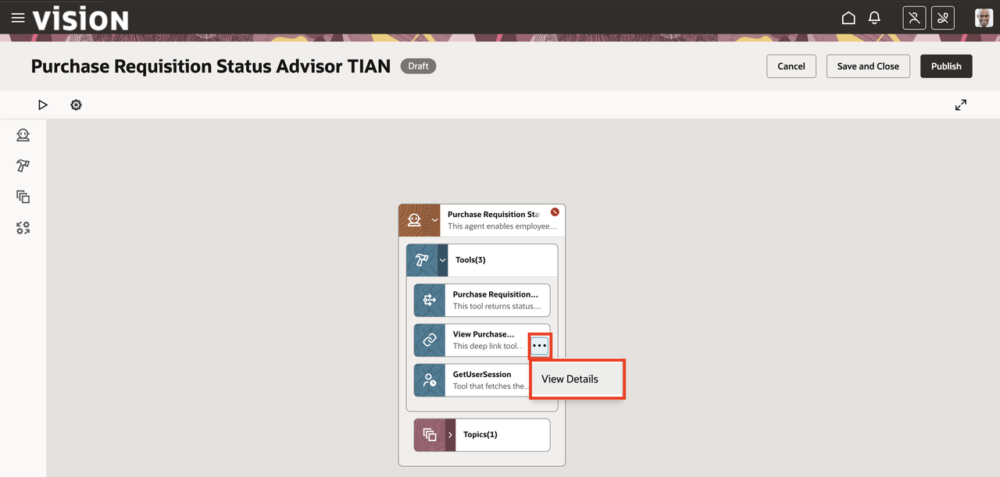

8. Notice that this tool provides a deep link to allow the user to navigate directly to a specific purchase requisition in the application.  
   Click on the **X** in the upper right corner to close this tool.  
9. Expand the Topics box to expose the included topic. 
   Hover on the Purchase Requisition Status topic, click on the 3 dots in the corner, then select **View Details**:

   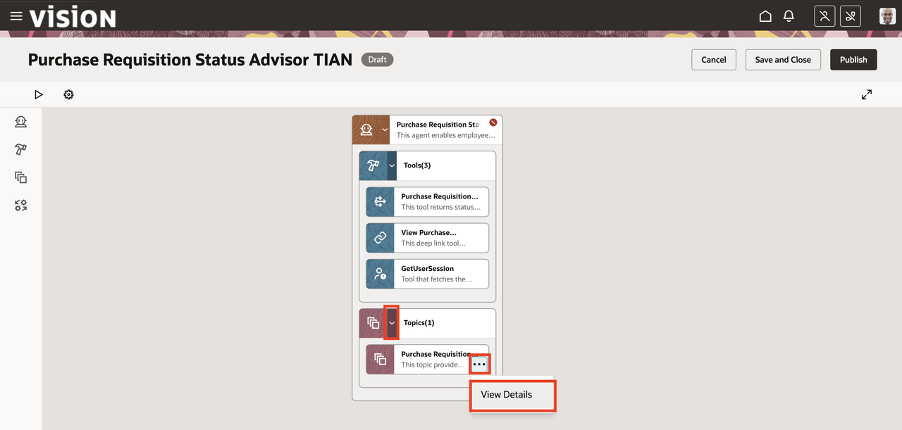

10. Topics provide a reusable prompt – basically a set of instructions to the Large Language Model (LLM).  Pre-built topics provide a best-practices example of an LLM prompt:

   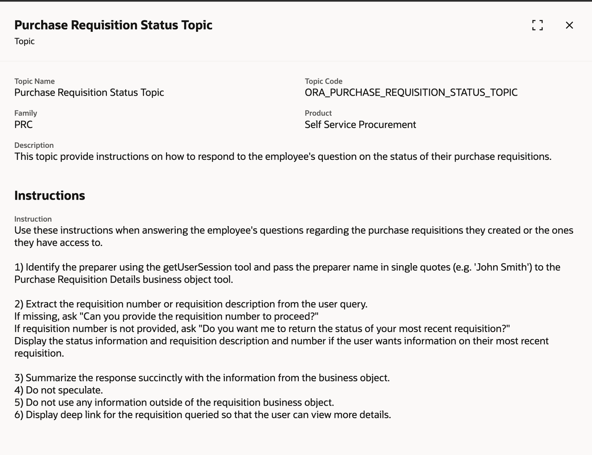

11. Click on the **X** in the upper right corner to close the topic.  
12. Finally, hover on the Agent header, click on the 3 dots in the corner, then select **View Details**:

   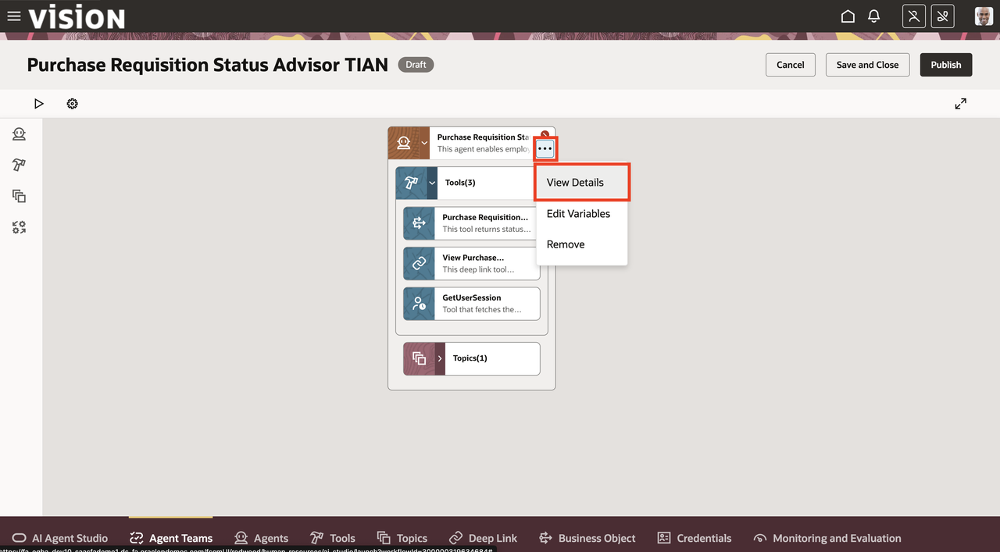

13. Notice the pre-built prompt.  Unlike the prompt provided in the topic, this prompt is specific to this agent.  Agent prompts and topics are combined to provide instructions to the LLM:

   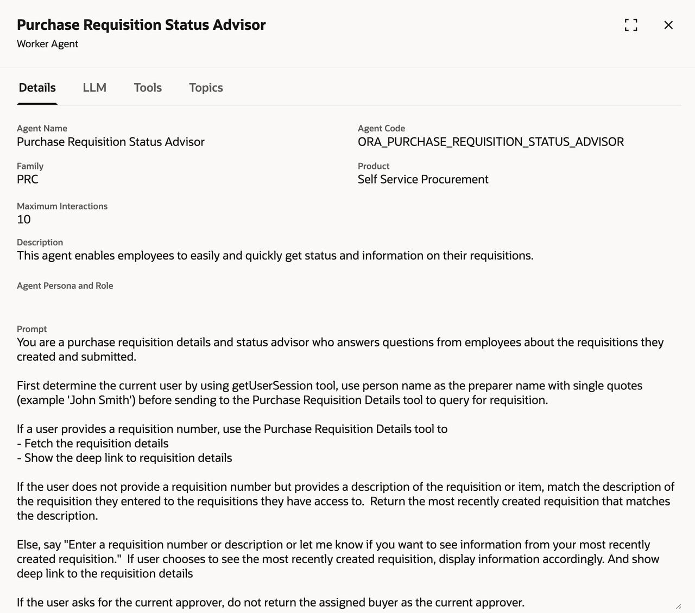

14. Select the **LLM** tab.  Review the Summarization prompt. 
    Worker agents provide a default summarization prompt to provide a simple answer to the user.  This summarization can be modified if specific instructions or output format is desired:

   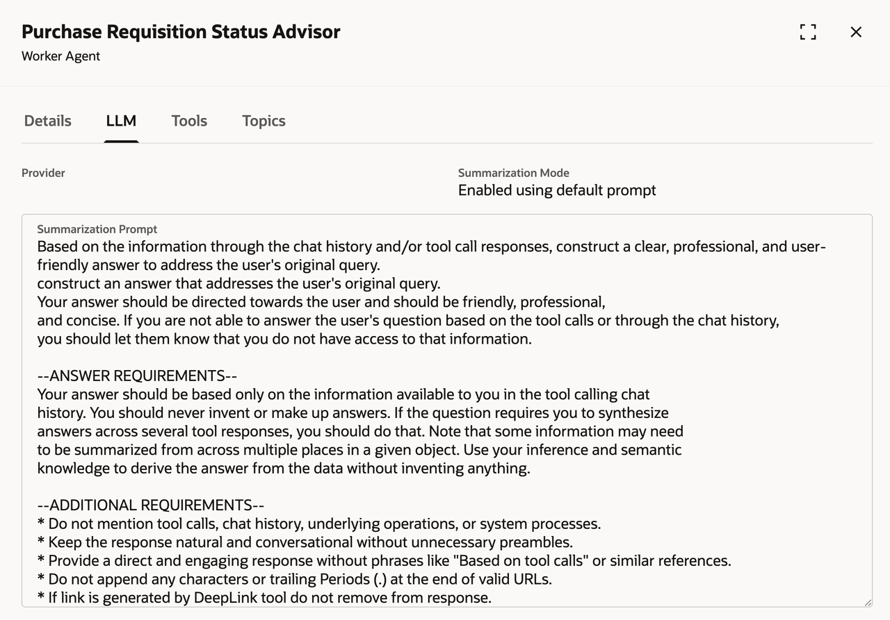

15. Click on the **X** in the upper right corner to close the Worker Agent Summary.  
16. Click on **Save and Close** button saving your copy of the Purchase Requisition Status Advisor agent:

   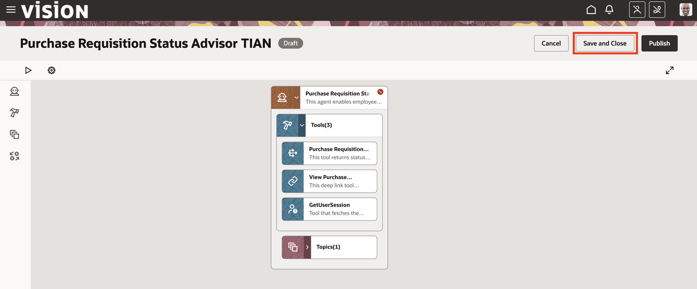

   **You have successfully completed Module 1!**

   
## Summary

You should now have a basic understanding of the tools and prompts provided by the pre-built Purchase Requisition Status Advisor agent template. 
In the next lab we will create a custom agent to expand the capabilities of this agent team.

[Proceed to the next lab](#next)

## Acknowledgements
* **Author** - 
* **Contributors** - 
* **Last Updated By/Date** - 