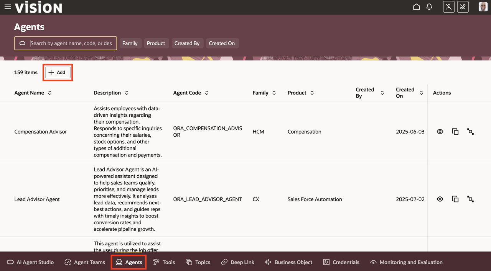
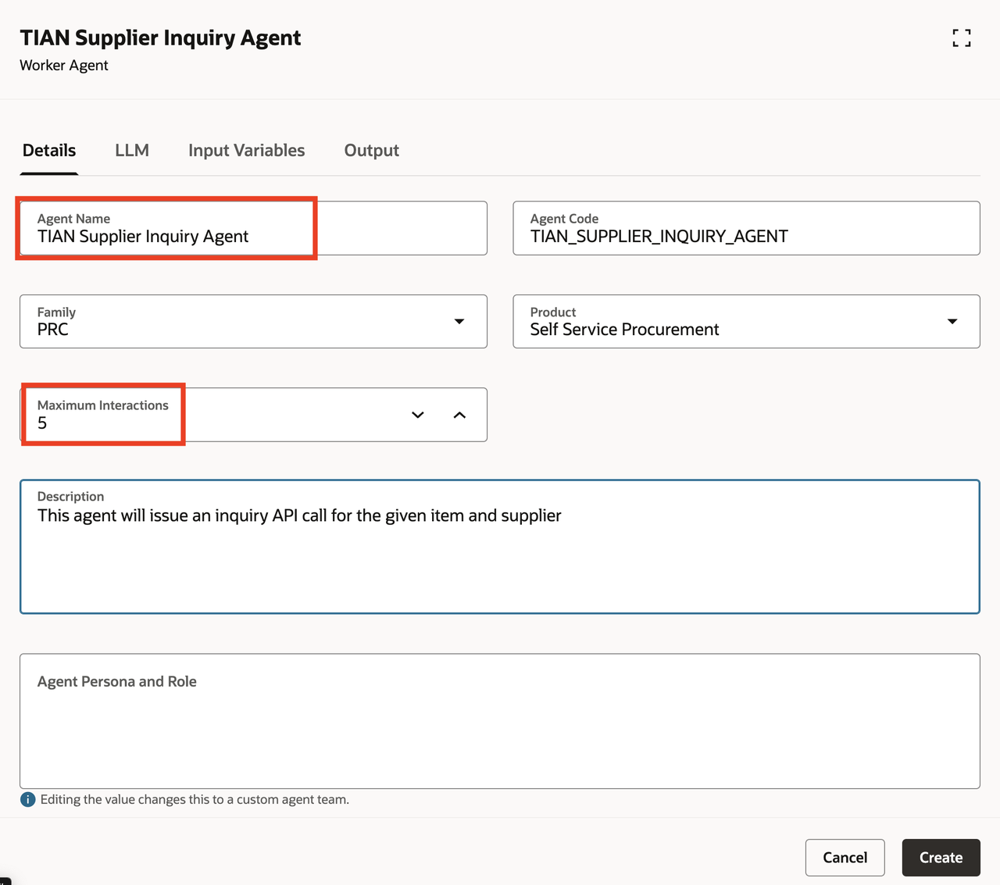
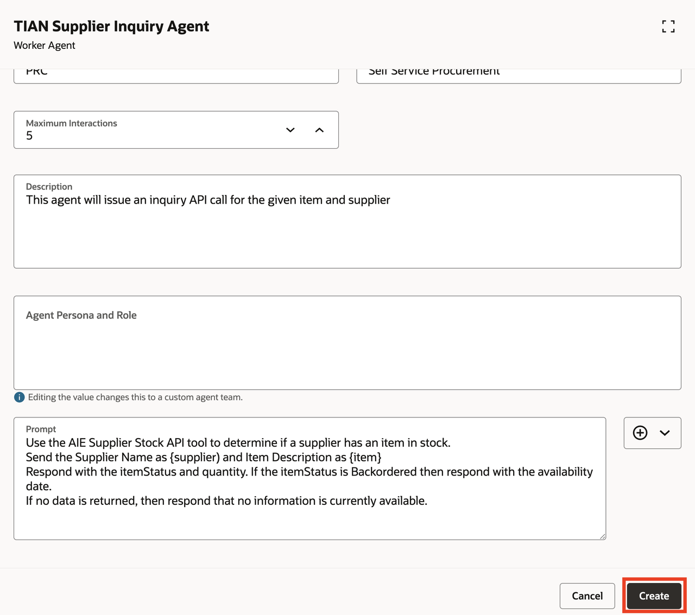
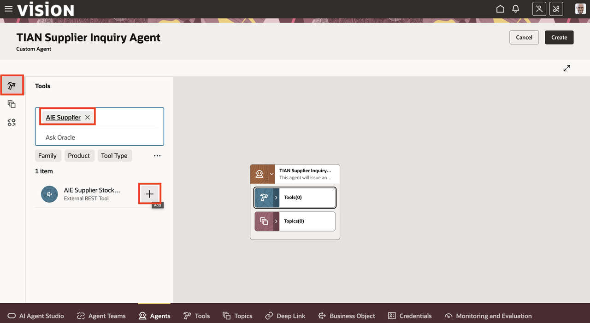
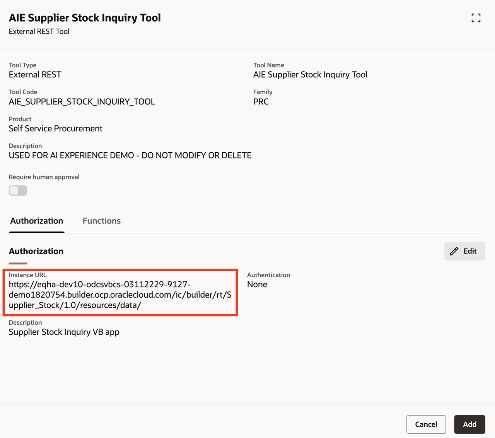
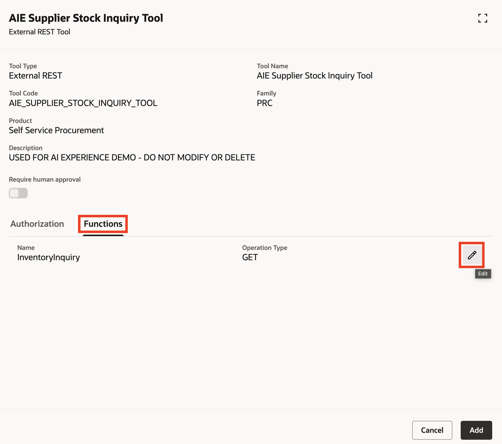
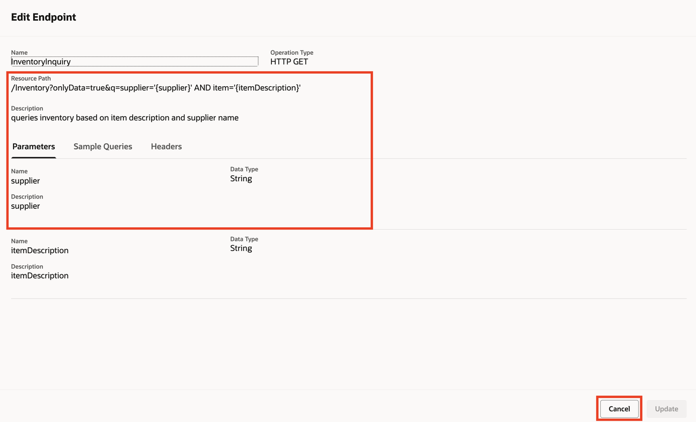
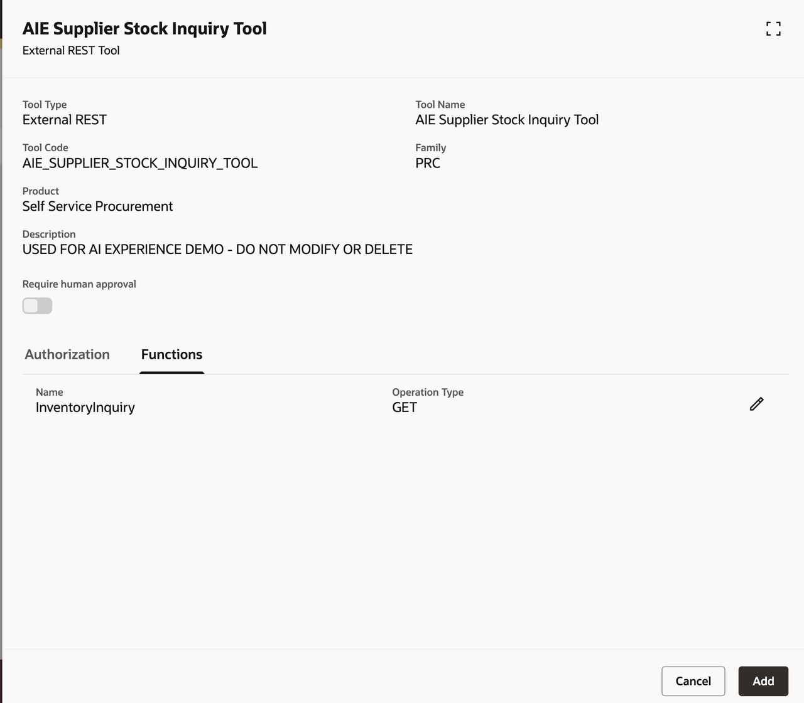
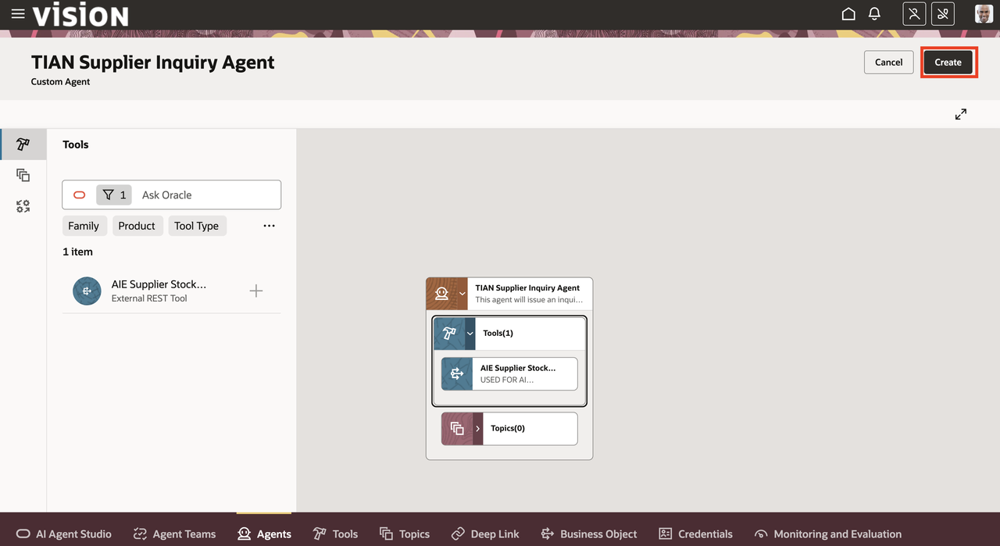
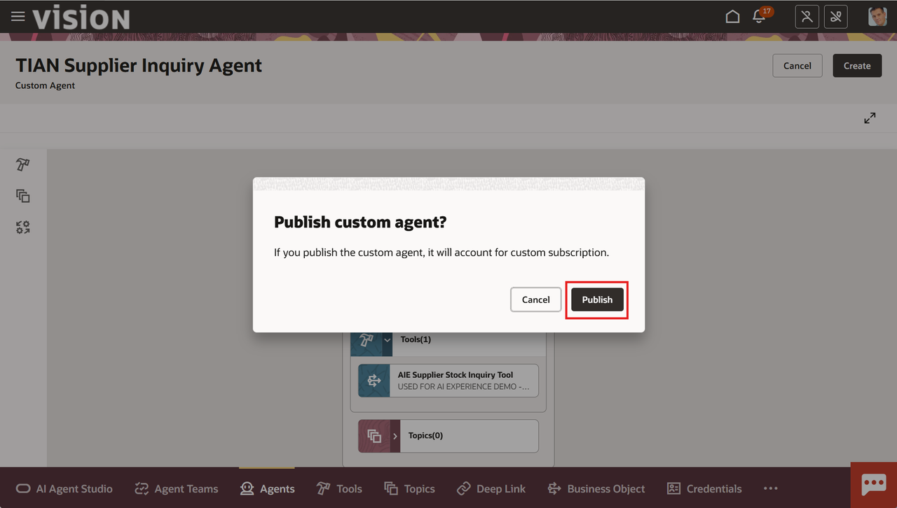

# Building a custom agent

## Introduction

In this lab we will add a new agent that will make an external REST web service call to check supplier inventory levels

Estimated Time: 15 minutes


### Objectives

Understand how to build a new custom agent.
Understand how to build a simple prompt to collect relevant information from an **External REST API tool**

### Usage Notes

   [](include:initial_hints)

## Task 1: Create a new custom agent

1. First lets create a new custom agent.

   Click on the **Agents** tab then click on the **Add** button to create a new Supplier Inquiry Agent:

   

2. Fill in the details as follows with a description of your choice.  Make sure to start the agent name with ***YOUR INITIAL CODE***<br/>
   Make sure you enter **5** in the **Maximum Iterations** field.<br/>
   ***DO NOT HIT CREATE YET***

   

3. Scroll down the to the **Prompt** field, click the **Copy** button below and then paste into the **Prompt** field.<br/><br/>
   This is a very simple prompt for our exercise, but can be expanded to provide additional instructions to the LLM:
    ```txt
    <copy>
    Use the AIE Supplier Stock API tool to determine if a supplier has an item in stock.
    Send the Supplier Name as {supplier} and Item Description as {item}
    Respond with the itemStatus and quantity. If the itemStatus is Backordered then respond with the availability date.
    If no data is returned, then respond that no information is currently available.
    </copy>
    ```
4. Once you've pasted the text into the **Prompt** field, you can hit the **Create** button:

   

   **You have successfully completed Task 1!**

## Task 2: Add an External API tool to the agent

1. Now let's add a tool to our agent.

   Click on the Tools icon  in the left side of the screen.<br/><br/>
2. In the **Ask Oracle** field, enter **AIE Supplier** to filter the available Agent Tools<br/><br/>
3. Click on the plus (**+**) symbol to add the AIE Supplier Stock Inquiry Tool (external REST tool) to your agent:

   

4. Review the Supplier Stock Inquiry Tool (external REST tool) information.  Notice the **Instance URL** listed in the tool:

   

5. Click on the **Functions** tab.<br/>
6. Click on the pencil icon to review the details of the REST function:

   

7. Notice the **Resource Path**.  When this is combined with the Instance URL, it forms the REST Web Service call address or URI (Uniform Resource Identifier).<br/><br/>
   Where business and IT developers collaborate, IT developers can create the tool with the appropriate URI and parameters, and business developers can then use it in their agents.<br/><br/>
8. Click **Cancel** to close the tool detail box:

   

9. Now click on the **Add** button to add this tool to your agent:

   

10. Click on the **Create** button to create your agent.

   

11. Click on the **Publish** button on the Publish Custom Agent popup:

   

   **Congratulations!** You have created your first AI Agent!  In the next module we'll incorporate it into a multi-agent team.

   **You have successfully completed Module 2!**

## Summary

You should now have an understanding of what an **External REST API Tool** does, and how to develop a prompt to successfully pass data back and forth with it.

**You have successfully completed Lab 2!**

[Proceed to the next lab](#next)

## Acknowledgements
* **Author** - [](var:author)
* **Contributors** - [](var:contributors)
* **Last Updated By/Date** - [](var:last_updated)
