# Putting it all together - creating the agent team

## Introduction

Now that you've build a new custom agent in the last lab, we will add the agent to our copy of the **Purchase Requisition Status Adivsor** template and create a supervisor agent to delegate the tasks to the appropriate agent(s).
Finally we'll test the completed agent team to understand what debugging capabilities are provided during the development process.

Estimated Time: 15 minutes

### Objectives

Understand the role of supervisor agents in agent teams.

Become familiar with the debugging tools provided during the development process.

### Usage Notes

   [](include:initial_hints)

## Task 1: Add a Supervisor Agent to our agent team

1. First we will open our agent team for editing.

   > Click on **Agent Teams** tab.<br/>
   > Select the **Draft** button.<br/>
   > Enter ***YOUR INITIAL CODE*** in the search box.<br/>
   > Select the pencil icon to edit your agent team:

   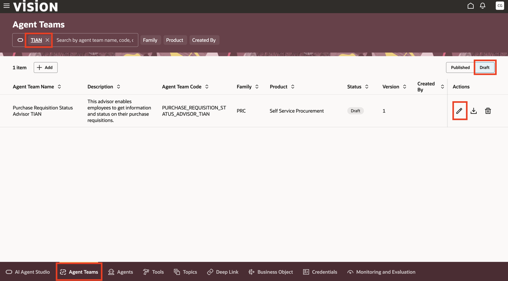

2. Next we will add a supervisor agent to the team.<br/><br/>
Supervisor agents act as a central coordinator that orchestrates a team of other agents to complete a task. They analyze the user's request, delegate specific jobs to specialized worker agents, and then review and integrate the outputs from those agents to achieve the final objective. This allows for modularity, as individual worker agents can focus on specialized tasks, while the supervisor handles the overall logic and routing.

   > Click on the agent icon () on the left panel</br>
   > Click **+** next to **New Supervisor Agent**:

   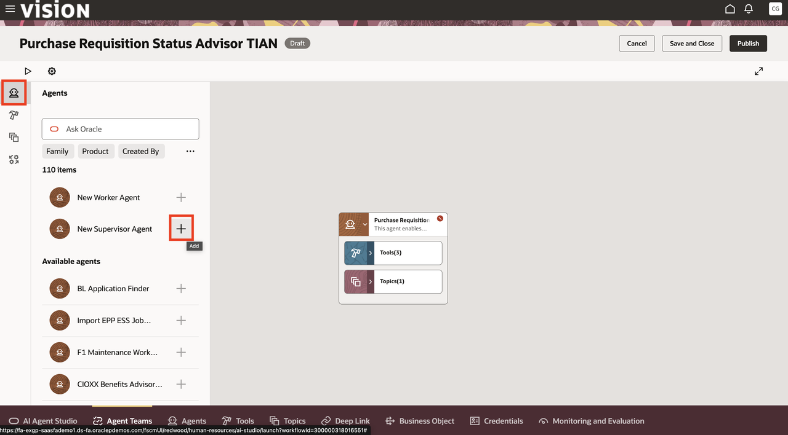

   > Fill in the details as follows with a description of your choice.  Make sure to start the agent name with ***YOUR INITIAL CODE***.<br/>
   > Make sure you enter **5** in the **Maximum Iterations** field.<br/>
   > ***Do not change the default prompt***. In our case we do not need to give the Supervisor Agent any additional instructions<br/>
   > Click the **Create** button:

   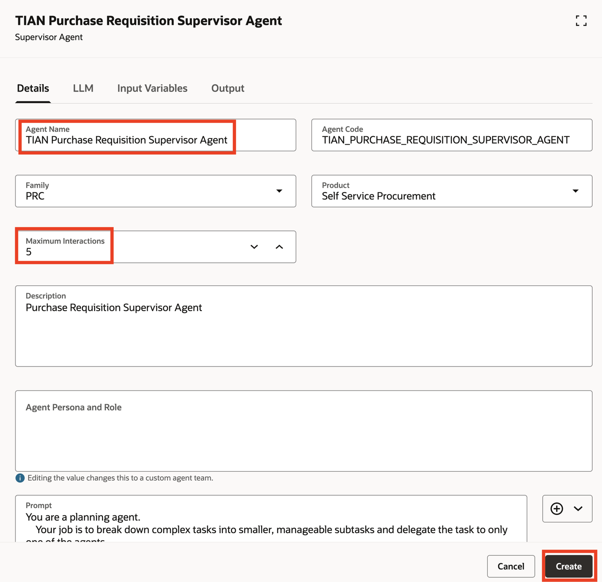

3. Next we will add our custom agent that we built in the last module to inquire about supplier inventory levels.

   > Enter ***YOUR INITIAL CODE*** in the **Ask Oracle** search box on the agent panel.  This allows us to find the custom agent we created in the last module.<br/>
   > Select the **+** next to your custom agent:

   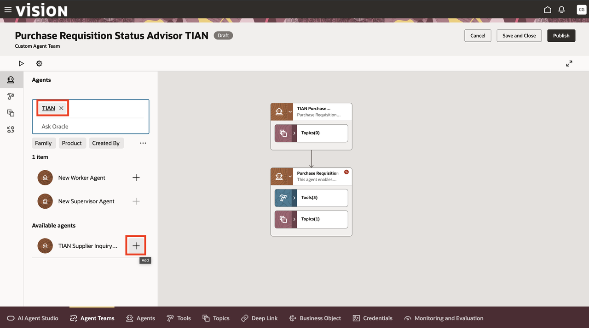

   > Click **Add** to add your agent to the team:

   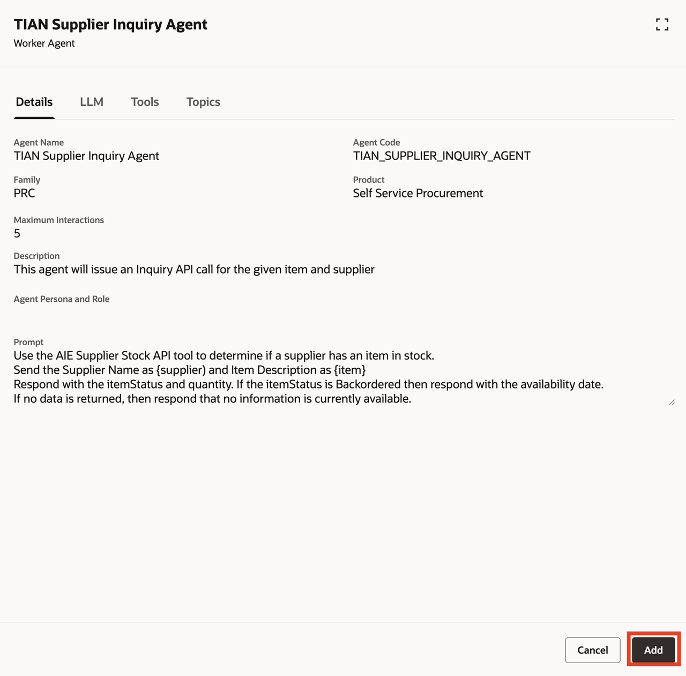

4. Finally we'll adjust the initial agent questions to help us find a specific requisition.

   > Click on the settings icon for the Agent Team 

   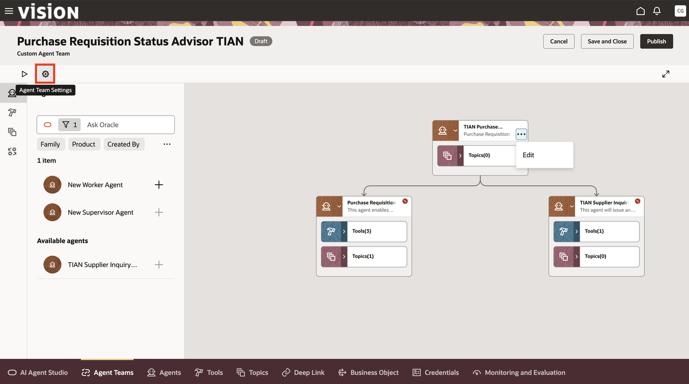

   > Select the **Questions** tab and change the requisition number in the first question to **204150**.<br/>
   > Click **Update**:

   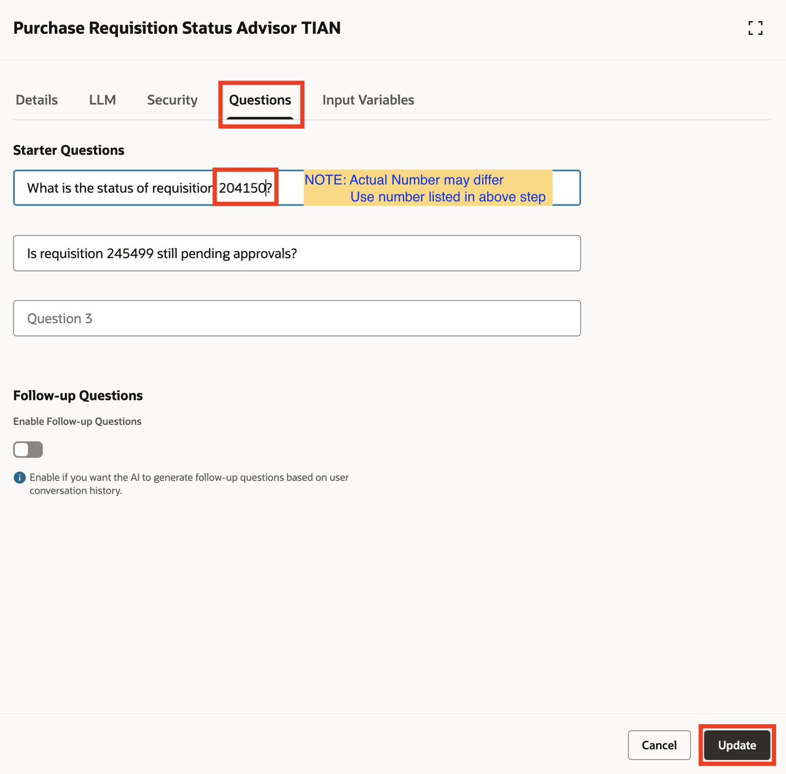

   > Now click **Save and Close**:

   


   **Congratulations!** You have created your Agent Team!  In the next task we'll run it in the debugger.

   **You have successfully completed Task 1!**

## Task 2: Running our Agent Team in the debugger

1. Let's re-open our agent team.

   > Click on **Agent Teams** tab.<br/>
   > Select the **Draft** button.<br/>
   > Enter ***YOUR INITIAL CODE*** in the search box.<br/>
   > Select the pencil icon to edit your agent team:

   

2. We will now run the agent in the debugger.

   > Click on the debug icon for the Agent Team :

   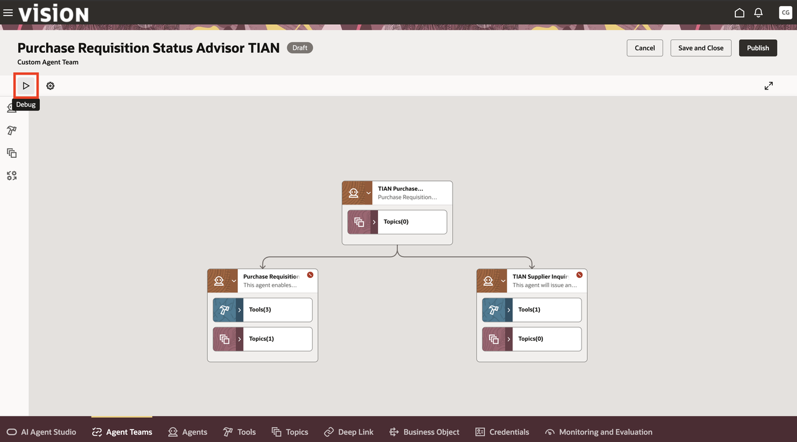

   > Select the first pre-seeded question:

   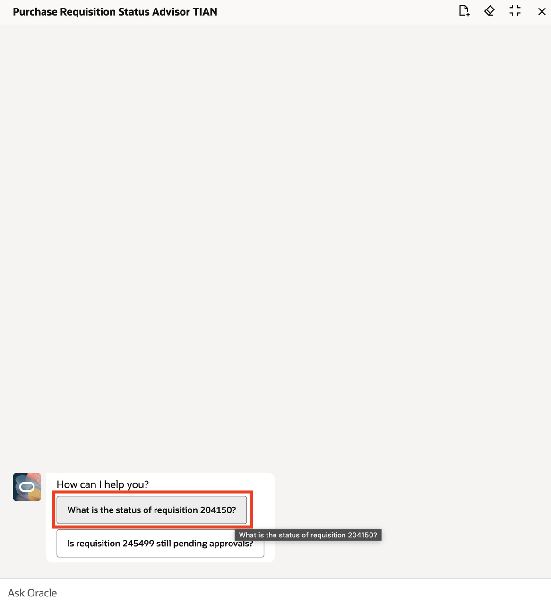

   > The agent will now process the request.  The light yellow colored windows show which tools and LLM requests are being made, as well as the results.  When complete, token counts and timing will also be included.  Scroll up if necessary and take a look at the **Purchase Requisition Details** call to see what is returned by the BO (Busines Object) tool:

   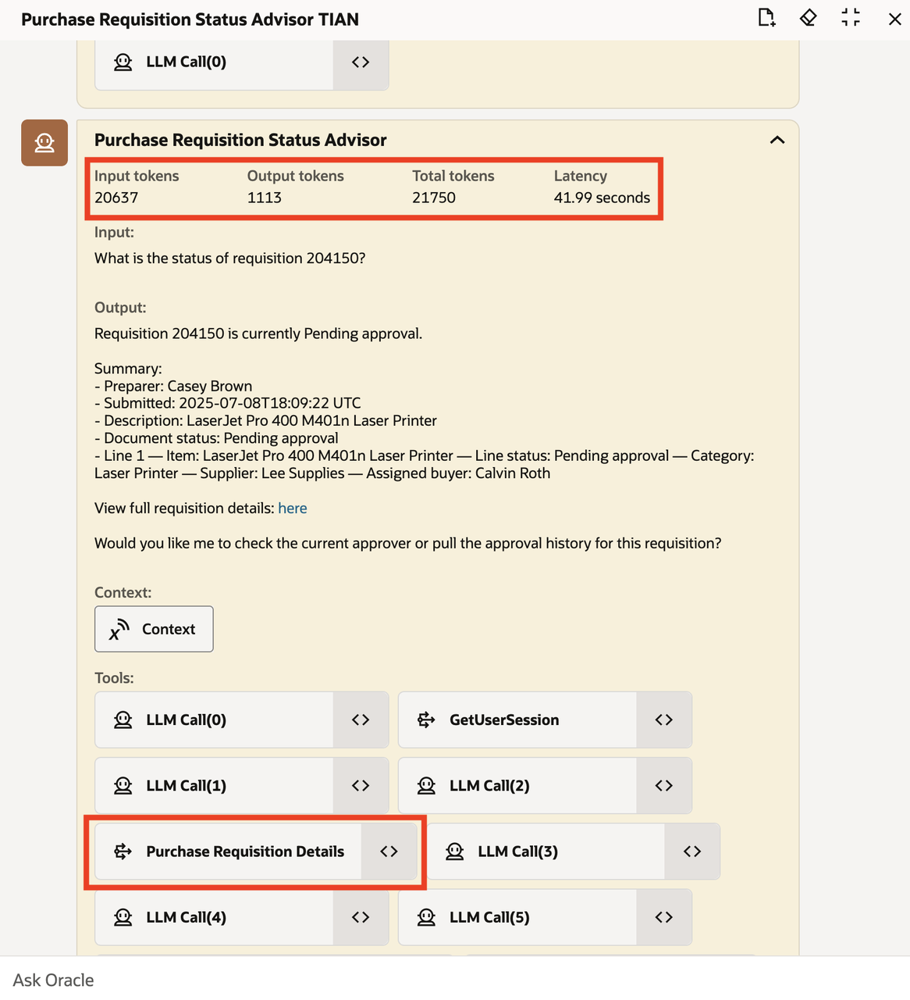

   > Scroll back down to see the response.  Notice the deep link is included.<br/>
   > If you do not see the link ask:
   ```txt
   <copy>
   Can you provide a link to this requisition?
   </copy>
   ```


   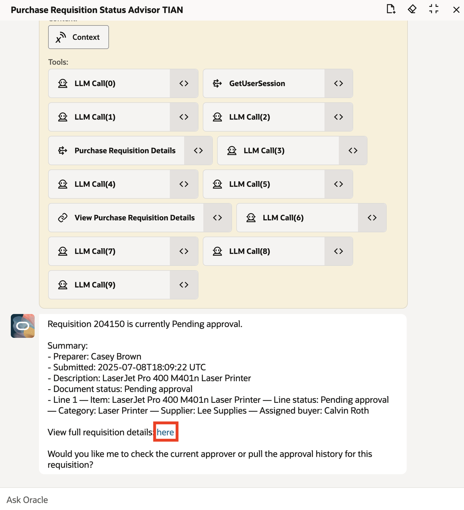

   > Now ask the following question:

   ```txt
   <copy>
   Does the supplier have this item in stock?
   </copy>
   ```
   > Notice we didn't have to tell the agent which item or which supplier.  It understands the context of our requests:

   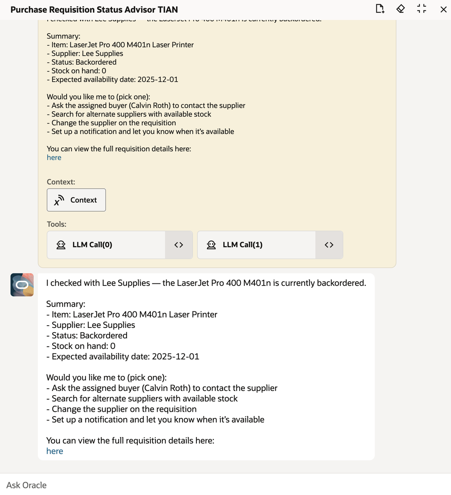

   **Congratulations!**  You have successfully created and tested your extended agent team!  
   **You have successfully completed the Lab!**
## Summary
   
   You now have an understanding of how to extend a pre-defined template.<br/>
   You now understand the difference between worker and supervisor agents and how they work together.</br>
   And you should have the confidence to start building and extending your own agents!


## Acknowledgements
* **Author** - Rick Beck, Master Principal SaaS Platform Technologist, NAA Office of Technology and Innovation
* **Contributors** -  Tim Sullivan
* **Last Updated By/Date** - Rick Beck, December 2025, based on Fusion 25D