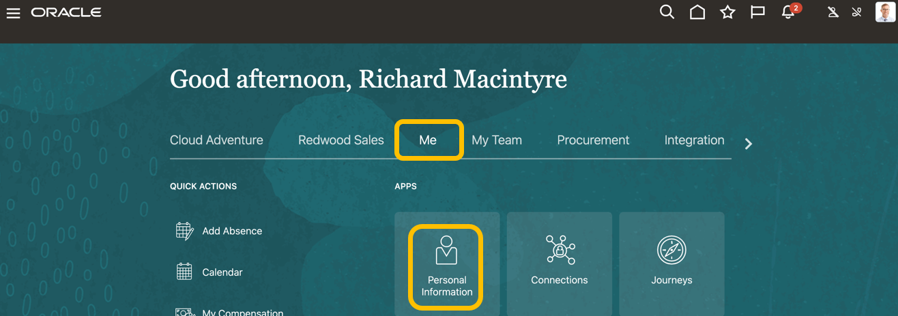

# HCM AI Assist - Goals

## Introduction

Integrating generative AI features to streamline HR processes, automate routine tasks and enhance employee experience has become one of the main priorities for most organizations. In this demo, we will guide you through the process of enabling the embedded Gen AI features in Oracle HCM Cloud.

Estimated Time: 15 minutes

### Objectives

Use the embedded Gen AI features in Oracle HCM Cloud to help create a new goal.

## Task 1: Use the embedded Gen AI features in Oracle HCM Cloud to help create a new goal.

1. First you will look at the personal details for Richard Macintyre.  

   > Navigate to Home Page -> **Me**, then select **Personal Information**.

   

   > Select **Personal Details**.

   

   > Take note that Richard is located in UK. 

   

2. Now you will navigate to the Goals Center.

   > Navigate to Home Page -> **Me**, then select **Career and Performance**.

   

   > Click on **Goals Center**.

   

3. Now you will use AI assist to help create new goals

   > Select Development, then Click on 

   

   > Click on  in the AI Assist banner message (else the AI Assist button will not be active)  

   > Enter **“Obtain Accounting Designation”** in **“What’s your goal”**, then click **AI Assist** button  

    

   

   > See the **AI generated formatted response**, mentioned that remember Richard is located in UK, and the accounting designation ACCA is a UK specific accounting designation.   

   > If you are interested, try entering other texts for What’s your goal   

   

## Summary

By following these steps, you  successfully activated the AI capabilities to enhance efficiency, improve accuracy, and provide a more engaging experience for employees. Embrace the future of human capital management with the power of AI!

**You have successfully completed the Activity!**

## Acknowledgements
* **Author** - Stephen Chung, Principal SaaS Cloud Technologist, Advanced Technology Services
* **Contributors** -  
* **Last Updated By/Date** - Stephen Chung, September 2024
